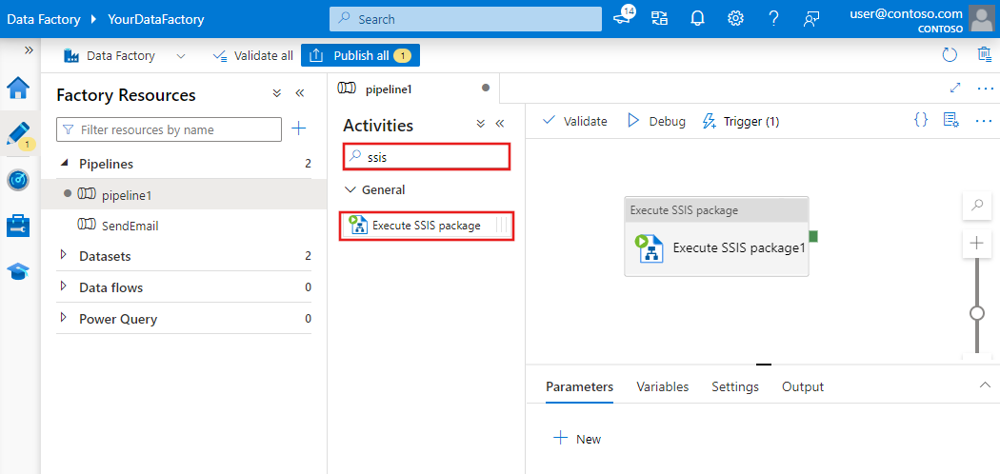
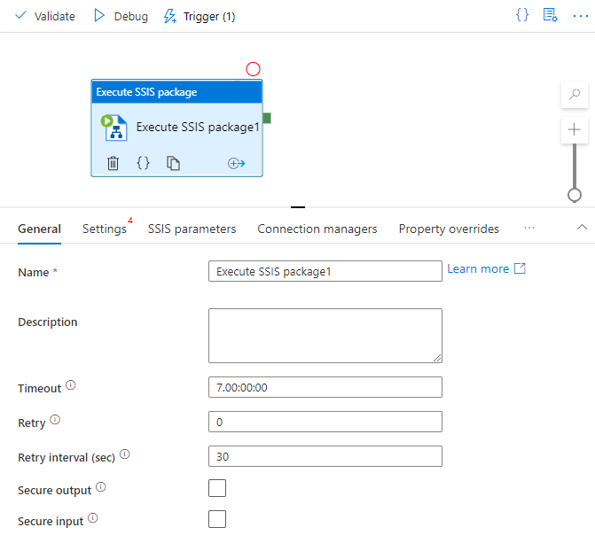
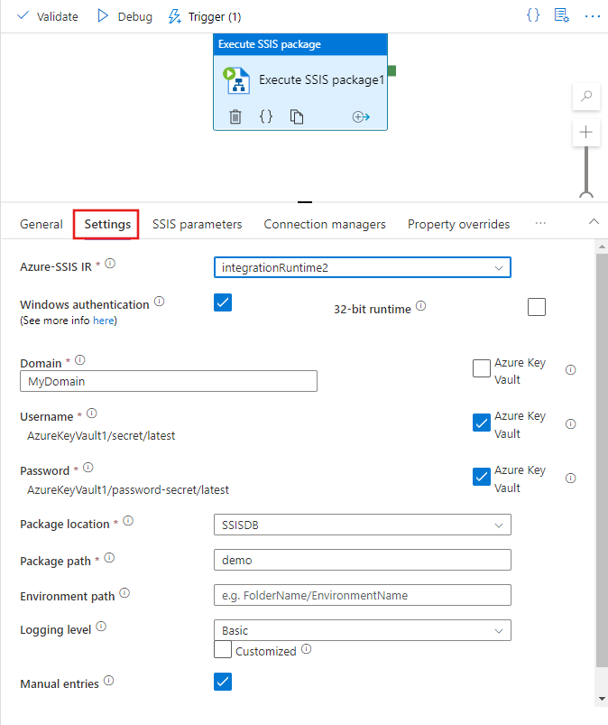
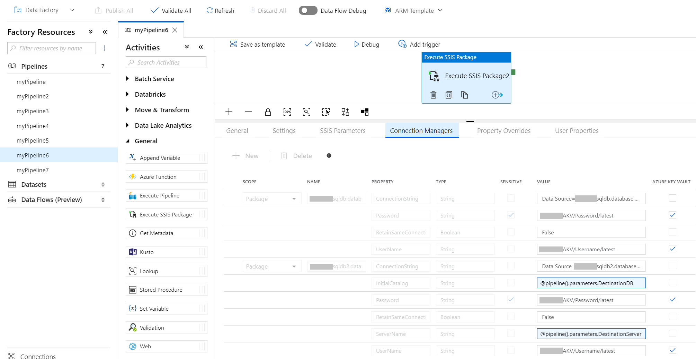
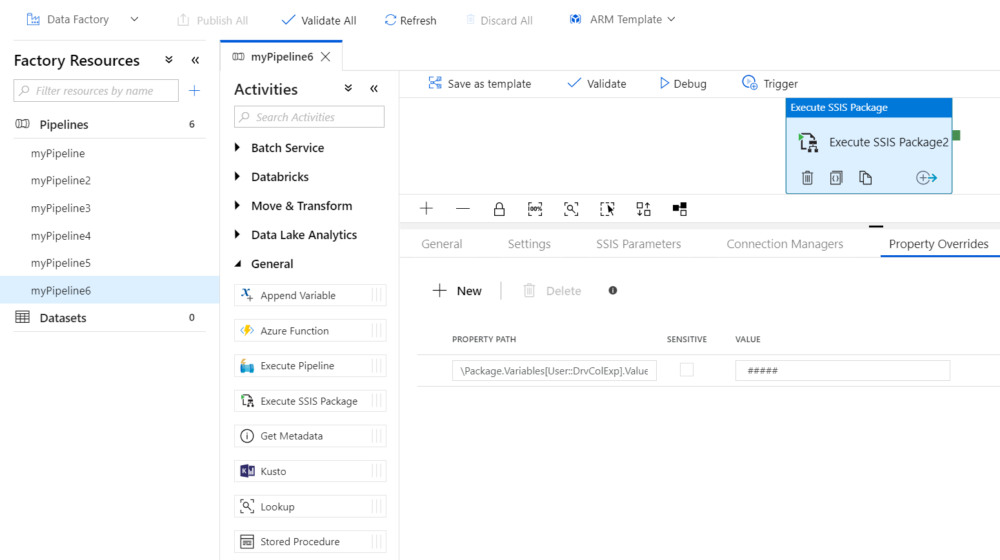

# Run an SSIS package with the Execute SSIS Package activity in Azure Data Factory
This article describes how to run a SQL Server Integration Services (SSIS) package in Azure Data Factory (ADF) pipeline by using the Execute SSIS Package activity. 

## Prerequisites

[!INCLUDE [updated-for-az](../../includes/updated-for-az.md)]

Create an Azure-SSIS Integration Runtime (IR) if you do not have one already by following the step-by-step instructions in the [Tutorial: Provisioning Azure-SSIS IR](tutorial-create-azure-ssis-runtime-portal.md).

## Run a package in the Azure portal
In this section, you use ADF User Interface (UI)/app to create an ADF pipeline with Execute SSIS Package activity that runs your SSIS package.

### Create a pipeline with an Execute SSIS Package activity
In this step, you use ADF UI/app to create a pipeline. You add an Execute SSIS Package activity to the pipeline and configure it to run your SSIS package. 

1. On your ADF overview/home page in Azure portal, click on the **Author & Monitor** tile to launch ADF UI/app in a separate tab. 

   

   On the **Let's get started** page, click **Create pipeline**: 

   

2. In the **Activities** toolbox, expand **General**, then drag & drop an **Execute SSIS Package** activity to the pipeline designer surface. 

    

3. On the **General** tab for Execute SSIS Package activity, provide a name and description for the activity. Set optional timeout and retry values.

   

4. On the **Settings** tab for Execute SSIS Package activity, select an Azure-SSIS IR where you want to run your package. If your package uses Windows authentication to access data stores, e.g. SQL Servers/file shares on premises, Azure Files, etc., check the **Windows authentication** checkbox and enter the values for your package execution credentials (**Domain**/**Username**/**Password**). Alternatively, you can use secrets stored in your Azure Key Vault (AKV) as their values. To do so, click on the **AZURE KEY VAULT** checkbox next to the relevant credential, select/edit your existing AKV linked service or create a new one, and then select the secret name/version for your credential value.  When you create/edit your AKV linked service, you can select/edit your existing AKV or create a new one, but please grant ADF managed identity access to your AKV if you have not done so already. You can also enter your secrets directly in the following format: `<AKV linked service name>/<secret name>/<secret version>`. If your package needs 32-bit runtime to run, check the **32-Bit runtime** checkbox. For **Package location**, select **SSISDB**, **File System (Package)**, or **File System (Project)**. If you select **SSISDB** as your package location, which is automatically selected if your Azure-SSIS IR was provisioned with SSIS catalog (SSISDB) hosted by Azure SQL Database server/Managed Instance, you need to specify your package to run that has been deployed into SSISDB. If your Azure-SSIS IR is running and the **Manual entries** checkbox is unchecked, you can browse and select your existing folders/projects/packages/environments from SSISDB. Click the **Refresh** button to fetch your newly added folders/projects/packages/environments from SSISDB, so they are available for browsing and selection. For **Logging level**, select a predefined scope of logging for your package execution. Check the **Customized** checkbox, if you want to enter your customized logging name instead. 

   

   If your Azure-SSIS IR is not running or the **Manual entries** checkbox is checked, you can enter your package and environment paths from SSISDB directly in the following formats: `<folder name>/<project name>/<package name>.dtsx` and `<folder name>/<environment name>`.

   

   If you select **File System (Package)** as your package location, which is automatically selected if your Azure-SSIS IR was provisioned without SSISDB, you need to specify your package to run by providing a Universal Naming Convention (UNC) path to your package file (`.dtsx`) in the **Package path**. For example, if you store your package in Azure Files, its package path will be `\\<storage account name>.file.core.windows.net\<file share name>\<package name>.dtsx`. If you configure your package in a separate file, you also need to provide a UNC path to your configuration file (`.dtsConfig`) in the **Configuration path**. For example, if you store your configuration in Azure Files, its configuration path will be `\\<storage account name>.file.core.windows.net\<file share name>\<configuration name>.dtsConfig`.

   

   If you select **File System (Project)** as your package location, you need to specify your package to run by providing a UNC path to your project file (`.ispac`) in the **Project path** and a package file (`.dtsx`) from your project in the **Package name**. For example, if you store your project in Azure Files, its project path will be `\\<storage account name>.file.core.windows.net\<file share name>\<project name>.ispac`.

   

   Next, you need to specify the credentials to access your project/package/configuration files. If you have previously entered the values for your package execution credentials (see above), you can reuse them by checking the **Same as package execution credentials** checkbox. Otherwise, you need to enter the values for your package access credentials (**Domain**/**Username**/**Password**). For example, if you store your project/package/configuration in Azure Files, the **Domain** is `Azure`; the **Username** is `<storage account name>`; and the **Password** is `<storage account key>`. Alternatively, you can use secrets stored in your AKV as their values (see above). These credentials will be used to access your package and child packages in Execute Package Task, all from their own path/the same project, as well as configurations, including those specified in your packages. If you have used the **EncryptAllWithPassword**/**EncryptSensitiveWithPassword** protection level when creating your package via SQL Server Data Tools (SSDT), you need to enter the value for your password in the **Encryption password**. Alternatively, you can use a secret stored in your AKV as its value (see above). If you have used the **EncryptSensitiveWithUserKey** protection level, you need to re-enter your sensitive values in configuration files or on the **SSIS Parameters**/**Connection Managers**/**Property Overrides** tabs (see below). If you have used the **EncryptAllWithUserKey** protection level, it is unsupported, so you need to reconfigure your package to use other protection level via SSDT or `dtutil` command line utility. For **Logging level**, select a predefined scope of logging for your package execution. Check the **Customized** checkbox, if you want to enter your customized logging name instead. If you want to log your package executions beyond using the standard log providers that can be specified in your package, you need to specify your log folder by providing its UNC path in the **Logging path**. For example, if you store your logs in Azure Files, your logging path will be `\\<storage account name>.file.core.windows.net\<file share name>\<log folder name>`. A subfolder will be created in this path for each individual package run and named after the Execute SSIS Package activity run ID, in which log files will be generated every five minutes. Finally, you also need to specify the credentials to access your log folder. If you have previously entered the values for your package access credentials (see above), you can reuse them by checking the **Same as package access credentials** checkbox. Otherwise, you need to enter the values for your logging access credentials (**Domain**/**Username**/**Password**). For example, if you store your logs in Azure Files, the **Domain** is `Azure`; the **Username** is `<storage account name>`; and the **Password** is `<storage account key>`. Alternatively, you can use secrets stored in your AKV as their values (see above). These credentials will be used to store your logs. For all UNC paths mentioned above, the fully qualified file name must be less than 260 characters and the directory name must be less than 248 characters.

5. On the **SSIS Parameters** tab for Execute SSIS Package activity, if your Azure-SSIS IR is running, **SSISDB** is selected as your package location, and the **Manual entries** checkbox on **Settings** tab is unchecked, the existing SSIS parameters in your selected project/package from SSISDB will be displayed for you to assign values to them. Otherwise, you can enter them one by one to assign values to them manually – Please ensure that they exist and are correctly entered for your package execution to succeed. If you have used the **EncryptSensitiveWithUserKey** protection level when creating your package via SSDT and **File System (Package)**/**File System (Project)** is selected as your package location, you also need to re-enter your sensitive parameters to assign values to them in configuration files or on this tab. When assigning values to your parameters, you can add dynamic content by using expressions, functions, ADF system variables, and ADF pipeline parameters/variables. Alternatively, you can use secrets stored in your AKV as their values (see above).

   

6. On the **Connection Managers** tab for Execute SSIS Package activity, if your Azure-SSIS IR is running, **SSISDB** is selected as your package location, and the **Manual entries** checkbox on **Settings** tab is unchecked, the existing connection managers in your selected project/package from SSISDB will be displayed for you to assign values to their properties. Otherwise, you can enter them one by one to assign values to their properties manually – Please ensure that they exist and are correctly entered for your package execution to succeed. If you have used the **EncryptSensitiveWithUserKey** protection level when creating your package via SSDT and **File System (Package)**/**File System (Project)** is selected as your package location, you also need to re-enter your sensitive connection manager properties to assign values to them in configuration files or on this tab. When assigning values to your connection manager properties, you can add dynamic content by using expressions, functions, ADF system variables, and ADF pipeline parameters/variables. Alternatively, you can use secrets stored in your AKV as their values (see above).

   

7. On the **Property Overrides** tab for Execute SSIS Package activity, you can enter the paths of existing properties in your selected package one by one to assign values to them manually – Please ensure that they exist and are correctly entered for your package execution to succeed, e.g. to override the value of your user variable, enter its path in the following format: `\Package.Variables[User::<variable name>].Value`. If you have used the **EncryptSensitiveWithUserKey** protection level when creating your package via SSDT and **File System (Package)**/**File System (Project)** is selected as your package location, you also need to re-enter your sensitive properties to assign values to them in configuration files or on this tab. When assigning values to your properties, you can add dynamic content by using expressions, functions, ADF system variables, and ADF pipeline parameters/variables.

   

   The values assigned in configuration files and on the *SSIS Parameters* tab can be overridden using the **Connection Managers**/**Property Overrides** tabs, while those assigned on the **Connection Managers** tab can also be overridden using the **Property Overrides** tab.

8. To validate the pipeline configuration, click **Validate** on the toolbar. To close the **Pipeline Validation Report**, click **>>**.

9. Publish the pipeline to ADF by clicking **Publish All** button. 

### Run the pipeline
In this step, you trigger a pipeline run. 

1. To trigger a pipeline run, click **Trigger** on the toolbar, and click **Trigger now**. 

   

2. In the **Pipeline Run** window, select **Finish**. 

### Monitor the pipeline

1. Switch to the **Monitor** tab on the left. You see the pipeline run and its status along with other information (such as Run Start time). To refresh the view, click **Refresh**.

   

2. Click **View Activity Runs** link in the **Actions** column. You see only one activity run as the pipeline has only one activity (the Execute SSIS Package activity).

   

3. You can run the following **query** against the SSISDB database in your Azure SQL server to verify that the package executed. 

   ```sql
   select * from catalog.executions
   ```

   

4. You can also get the SSISDB execution ID from the output of the pipeline activity run, and use the ID to check more comprehensive execution logs and error messages in SSMS.

   

### Schedule the pipeline with a trigger

You can also create a scheduled trigger for your pipeline so that the pipeline runs on a schedule (hourly, daily, etc.). For an example, see [Create a data factory - Data Factory UI](quickstart-create-data-factory-portal.md#trigger-the-pipeline-on-a-schedule).

## Run a package with PowerShell
In this section, you use Azure PowerShell to create an ADF pipeline with Execute SSIS Package activity that runs your SSIS package. 

Install the latest Azure PowerShell modules by following the step-by-step instructions in [How to install and configure Azure PowerShell](/powershell/azure/install-az-ps).

### Create an ADF with Azure-SSIS IR
You can either use an existing ADF that already has Azure-SSIS IR provisioned or create a new ADF with Azure-SSIS IR following the step-by-step instructions in the [Tutorial: Deploy SSIS packages to Azure via PowerShell](https://docs.microsoft.com/azure/data-factory/tutorial-deploy-ssis-packages-azure-powershell).

### Create a pipeline with an Execute SSIS Package activity 
In this step, you create a pipeline with an Execute SSIS Package activity. The activity runs your SSIS package. 

1. Create a JSON file named **RunSSISPackagePipeline.json** in the **C:\ADF\RunSSISPackage** folder with content similar to the following example:

   > [!IMPORTANT]
   > Replace object names, descriptions, and paths, property and parameter values, passwords, and other variable values before saving the file. 

   ```json
   {
       "name": "RunSSISPackagePipeline",
       "properties": {
           "activities": [{
               "name": "mySSISActivity",
               "description": "My SSIS package/activity description",
               "type": "ExecuteSSISPackage",
               "typeProperties": {
                   "connectVia": {
                       "referenceName": "myAzureSSISIR",
                       "type": "IntegrationRuntimeReference"
                   },
                   "executionCredential": {
                       "domain": "MyDomain",
                       "userName": "MyUsername",
                       "password": {
                           "type": "SecureString",
                           "value": "**********"
                       }
                   },
                   "runtime": "x64",
                   "loggingLevel": "Basic",
                   "packageLocation": {
                       "packagePath": "FolderName/ProjectName/PackageName.dtsx"
                   },
                   "environmentPath": "FolderName/EnvironmentName",
                   "projectParameters": {
                       "project_param_1": {
                           "value": "123"
                       },
                       "project_param_2": {
                           "value": {
                               "value": "@pipeline().parameters.MyPipelineParameter",
                               "type": "Expression"
                           }
                       }
                   },
                   "packageParameters": {
                       "package_param_1": {
                           "value": "345"
                       },
                       "package_param_2": {
                           "value": {
                               "type": "AzureKeyVaultSecret",
                               "store": {
                                   "referenceName": "myAKV",
                                   "type": "LinkedServiceReference"
                               },
                               "secretName": "MySecret"
                           }
                       }
                   },
                   "projectConnectionManagers": {
                       "MyAdonetCM": {
                           "userName": {
                               "value": "sa"
                           },
                           "passWord": {
                               "value": {
                                   "type": "SecureString",
                                   "value": "abc"
                               }
                           }
                       }
                   },
                   "packageConnectionManagers": {
                       "MyOledbCM": {
                           "userName": {
                               "value": {
                                   "value": "@pipeline().parameters.MyUsername",
                                   "type": "Expression"
                               }
                           },
                           "passWord": {
                               "value": {
                                   "type": "AzureKeyVaultSecret",
                                   "store": {
                                       "referenceName": "myAKV",
                                       "type": "LinkedServiceReference"
                                   },
                                   "secretName": "MyPassword",
                                   "secretVersion": "3a1b74e361bf4ef4a00e47053b872149"
                               }
                           }
                       }
                   },
                   "propertyOverrides": {
                       "\\Package.MaxConcurrentExecutables": {
                           "value": 8,
                           "isSensitive": false
                       }
                   }
               },
               "policy": {
                   "timeout": "0.01:00:00",
                   "retry": 0,
                   "retryIntervalInSeconds": 30
               }
           }]
       }
   }
   ```

2. In Azure PowerShell, switch to the `C:\ADF\RunSSISPackage` folder.

3. To create the pipeline **RunSSISPackagePipeline**, run the **Set-AzDataFactoryV2Pipeline** cmdlet.

   ```powershell
   $DFPipeLine = Set-AzDataFactoryV2Pipeline -DataFactoryName $DataFactory.DataFactoryName `
                                                  -ResourceGroupName $ResGrp.ResourceGroupName `
                                                  -Name "RunSSISPackagePipeline"
                                                  -DefinitionFile ".\RunSSISPackagePipeline.json"
   ```

   Here is the sample output:

   ```
   PipelineName      : Adfv2QuickStartPipeline
   ResourceGroupName : <resourceGroupName>
   DataFactoryName   : <dataFactoryName>
   Activities        : {CopyFromBlobToBlob}
   Parameters        : {[inputPath, Microsoft.Azure.Management.DataFactory.Models.ParameterSpecification], [outputPath, Microsoft.Azure.Management.DataFactory.Models.ParameterSpecification]}
   ```

### Run the pipeline
Use the **Invoke-AzDataFactoryV2Pipeline** cmdlet to run the pipeline. The cmdlet returns the pipeline run ID for future monitoring.

```powershell
$RunId = Invoke-AzDataFactoryV2Pipeline -DataFactoryName $DataFactory.DataFactoryName `
                                             -ResourceGroupName $ResGrp.ResourceGroupName `
                                             -PipelineName $DFPipeLine.Name
```

### Monitor the pipeline

Run the following PowerShell script to continuously check the pipeline run status until it finishes copying the data. Copy/paste the following script in the PowerShell window, and press ENTER. 

```powershell
while ($True) {
    $Run = Get-AzDataFactoryV2PipelineRun -ResourceGroupName $ResGrp.ResourceGroupName `
                                               -DataFactoryName $DataFactory.DataFactoryName `
                                               -PipelineRunId $RunId

    if ($Run) {
        if ($run.Status -ne 'InProgress') {
            Write-Output ("Pipeline run finished. The status is: " +  $Run.Status)
            $Run
            break
        }
        Write-Output  "Pipeline is running...status: InProgress"
    }

    Start-Sleep -Seconds 10
}   
```

You can also monitor the pipeline using the Azure portal. For step-by-step instructions, see [Monitor the pipeline](quickstart-create-data-factory-resource-manager-template.md#monitor-the-pipeline).

### Schedule the pipeline with a trigger
In the previous step, you ran the pipeline on-demand. You can also create a schedule trigger to run the pipeline on a schedule (hourly, daily, etc.).

1. Create a JSON file named **MyTrigger.json** in **C:\ADF\RunSSISPackage** folder with the following content: 

   ```json
   {
       "properties": {
           "name": "MyTrigger",
           "type": "ScheduleTrigger",
           "typeProperties": {
               "recurrence": {
                   "frequency": "Hour",
                   "interval": 1,
                   "startTime": "2017-12-07T00:00:00-08:00",
                   "endTime": "2017-12-08T00:00:00-08:00"
               }
           },
           "pipelines": [{
               "pipelineReference": {
                   "type": "PipelineReference",
                   "referenceName": "RunSSISPackagePipeline"
               },
               "parameters": {}
           }]
       }
   }    
   ```
2. In **Azure PowerShell**, switch to the **C:\ADF\RunSSISPackage** folder.
3. Run the **Set-AzDataFactoryV2Trigger** cmdlet, which creates the trigger. 

   ```powershell
   Set-AzDataFactoryV2Trigger -ResourceGroupName $ResGrp.ResourceGroupName `
                                   -DataFactoryName $DataFactory.DataFactoryName `
                                   -Name "MyTrigger" -DefinitionFile ".\MyTrigger.json"
   ```
4. By default, the trigger is in stopped state. Start the trigger by running the **Start-AzDataFactoryV2Trigger** cmdlet. 

   ```powershell
   Start-AzDataFactoryV2Trigger -ResourceGroupName $ResGrp.ResourceGroupName `
                                     -DataFactoryName $DataFactory.DataFactoryName `
                                     -Name "MyTrigger" 
   ```
5. Confirm that the trigger is started by running the **Get-AzDataFactoryV2Trigger** cmdlet. 

   ```powershell
   Get-AzDataFactoryV2Trigger -ResourceGroupName $ResourceGroupName `
                                   -DataFactoryName $DataFactoryName `
                                   -Name "MyTrigger"     
   ```    
6. Run the following command after the next hour. For example, if the current time is 3:25 PM UTC, run the command at 4 PM UTC. 
    
   ```powershell
   Get-AzDataFactoryV2TriggerRun -ResourceGroupName $ResourceGroupName `
                                      -DataFactoryName $DataFactoryName `
                                      -TriggerName "MyTrigger" `
                                      -TriggerRunStartedAfter "2017-12-06" `
                                      -TriggerRunStartedBefore "2017-12-09"
   ```

   You can run the following query against the SSISDB database in your Azure SQL server to verify that the package executed. 

   ```sql
   select * from catalog.executions
   ```

## Next steps
See the following blog post:
-   [Modernize and extend your ETL/ELT workflows with SSIS activities in ADF pipelines](https://blogs.msdn.microsoft.com/ssis/2018/05/23/modernize-and-extend-your-etlelt-workflows-with-ssis-activities-in-adf-pipelines/)