---
title: How to schedule Azure SSIS integration runtime | Microsoft Docs
description: This article describes how to schedule starting and stopping of an Azure SSIS integration runtime by using Azure Automation and Data Factory.
services: data-factory
documentationcenter: ''
author: douglaslMS
manager: craigg
editor: 

ms.service: data-factory
ms.workload: data-services
ms.tgt_pltfrm: 
ms.devlang: powershell
ms.topic: article
ms.date: 05/18/2018
ms.author: douglasl

---
# How to schedule starting and stopping of an Azure SSIS integration runtime 
Running an Azure SSIS (SQL Server Integration Services) integration runtime (IR) has a charge associated with it. Therefore, you want to run the IR only when you need to run SSIS packages in Azure and stop it when you don't need it. You can use the Data Factory UI or Azure PowerShell to [manually start or stop an Azure SSIS IR](manage-azure-ssis-integration-runtime.md)). This article describes how to schedule starting and stopping of an Azure SSIS integration runtime (IR) by using Azure Automation and Azure Data Factory. Here are the high-level steps described in this article:

1. **Create and test an Azure Automation runbook.** In this step, you create a PowerShell runbook with the script that starts or stops an Azure SSIS IR. Then, you test the runbook in both START and STOP scenarios and confirm that IR starts or stops. 
2. **Create two schedules for the runbook.** For the first schedule, you configure the runbook with START as the operation. For the second schedule, configure the runbook with STOP as the operation. For both the schedules, you specify the cadence at which the runbook is run. For example, you may want to schedule the first one to run at 8 AM every day and the second one to run at 11 PM everyday. When the first runbook runs, it starts the Azure SSIS IR. When the second runbook runs, it stops the Azure SSIS IR. 
3. **Create two webhooks for the runbook**, one for the START operation and the other for the STOP operation. You use the URLs of these webhooks when configuring web activities in a Data Factory pipeline. 
4. **Create a Data Factory pipeline**. The pipeline you create consists of three activities. The first **Web** activity invokes the first webhook to start the Azure SSIS IR. The **Stored Procedure** activity runs a SQL script that runs the SSIS package. The second **Web** activity stops the Azure SSIS IR. For more information about invoking an SSIS package from a Data Factory pipeline by using the Stored Procedure activity, see [Invoke an SSIS package](how-to-invoke-ssis-package-stored-procedure-activity.md). Then, you create a schedule trigger to schedule the pipeline to run at the cadence you specify.

> [!NOTE]
> This article applies to version 2 of Data Factory, which is currently in preview. If you are using version 1 of the Data Factory service, which is generally available (GA), see [Invoke SSIS packages using stored procedure activity in version 1](v1/how-to-invoke-ssis-package-stored-procedure-activity.md).

 
## Prerequisites
If you haven't provisioned an Azure SSIS integration runtime already, provision it by following instructions in the [tutorial](tutorial-create-azure-ssis-runtime-portal.md). 

## Create and test an Azure Automation runbook
In this section, you perform the following steps: 

1. Create an Azure Automation account.
2. Create a PowerShell runbook in the Azure Automation account. The PowerShell script associated with the runbook either starts or stops an Azure SSIS IR based on the command you specify for the OPERATION parameter. 
3. Test the runbook in both start and stop scenarios to confirm that it works. 

### Create an Azure Automation account
If you don't have an Azure Automation account, create one by following the instructions in this step. For detailed steps, see [Create an Azure Automation account](../automation/automation-quickstart-create-account.md). As part of this step, you create an **Azure Run As** account (a service principal in your Azure Active Directory), and add it to the **Contributor** role of your Azure subscription. Ensure that it's same as the subscription that contains the data factory that has the Azure SSIS IR. Azure Automation uses this account to authenticate to Azure Resource Manager and operate on your resources. 

1. Launch **Microsoft Edge** or **Google Chrome** web browser. Currently, Data Factory UI is supported only in Microsoft Edge and Google Chrome web browsers.
2. Log in to the [Azure portal](https://portal.azure.com/).    
3. Select **New** on the left menu, select **Monitoring + Management**, and select **Automation**. 

    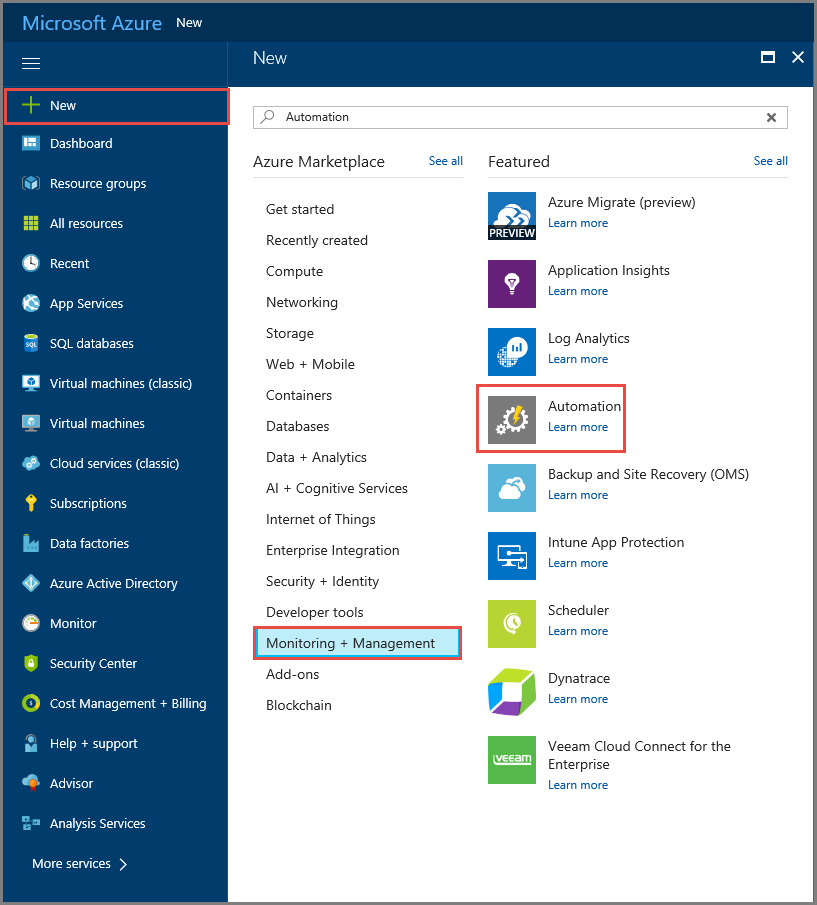
2. In the **Add Automation Account** window, take the following steps: 

    1. Specify a **name** for the automation account. 
    2. Select the **subscription** that has the data factory with Azure SSIS IR. 
    3. For **Resource group**, select **Create new** to create a new resource group, or select **Use existing** to select an existing resource group. 
    4. Select a **location** for the automation account. 
    5. Confirm that **Create Run As account** is set to **Yes**. A service principal is created in your Azure Active Directory. It's added to the **Contributor** role of your Azure subscription
    6. Select **Pin to dashboard** so that you see it on the dashboard of the portal. 
    7. Select **Create**. 

        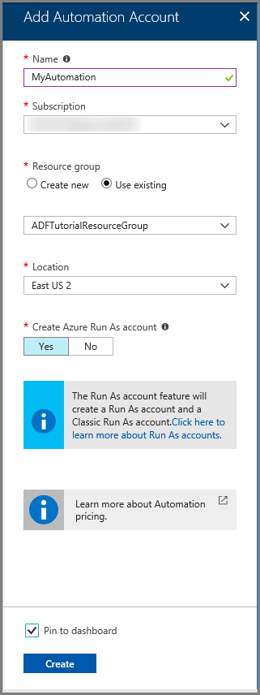
3. You see the **deployment status** on the dashboard and in the notifications. 
    
    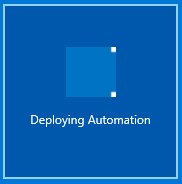 
4. You see the home page for the automation account after it's created successfully. 

    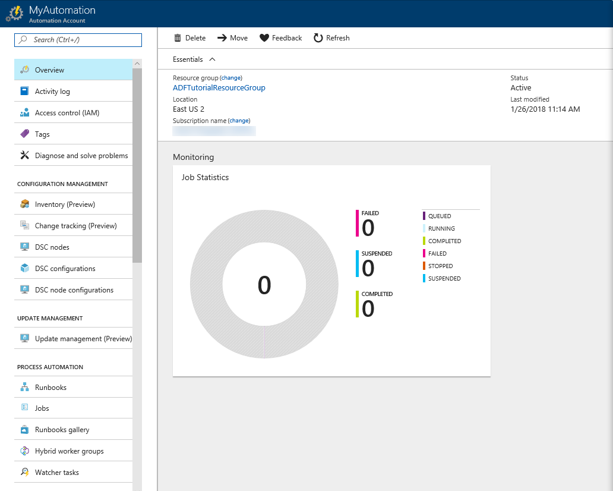

### Import Data Factory modules

1. Select **Modules** in the **SHARED RESOURCES** section on the left menu, and verify whether you have **AzureRM.Profile** and **AzureRM.DataFactoryV2** in the list of modules.

    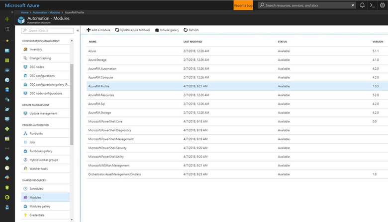

2.  Go to the PowerShell Gallery for the [AzureRM.DataFactoryV2 0.5.2 module](https://www.powershellgallery.com/packages/AzureRM.DataFactoryV2/0.5.2), select **Deploy to Azure Automation**, select your Automation account, and then select **OK**. Go back to view **Modules** in the **SHARED RESOURCES** section on the left menu, and wait until you see the **STATUS** of the **AzureRM.DataFactoryV2 0.5.2** module change to **Available**.

    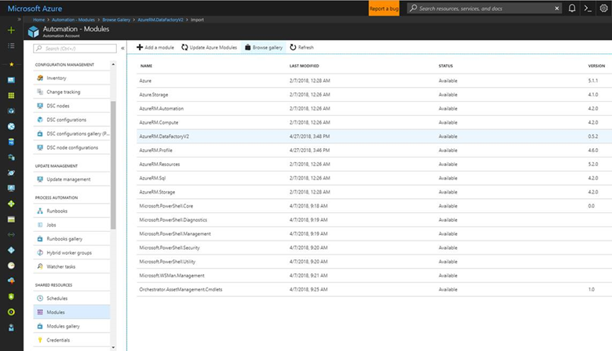

3.  Go to the PowerShell Gallery for the [AzureRM.Profile 4.5.0 module](https://www.powershellgallery.com/packages/AzureRM.profile/4.5.0), click on **Deploy to Azure Automation**, select your Automation account, and then select **OK**. Go back to view **Modules** in the **SHARED RESOURCES** section on the left menu, and wait until you see the **STATUS** of the **AzureRM.Profile 4.5.0** module change to **Available**.

    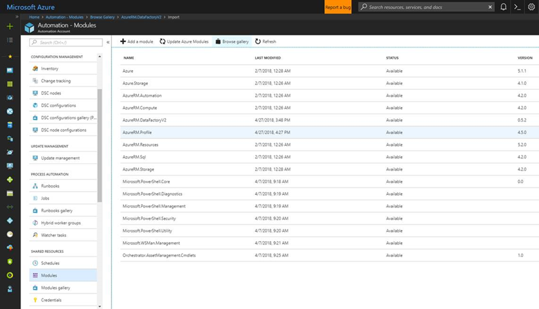

### Create a PowerShell runbook
The following procedure provides steps for creating a PowerShell runbook. The script associated with the runbook either starts/stops an Azure SSIS IR based on the command you specify for the **OPERATION** parameter. This section does not provide all the details for creating a runbook. For more information, see [Create a runbook](../automation/automation-quickstart-create-runbook.md) article.

1. Switch to the **Runbooks** tab, and select **+ Add a runbook** from the toolbar. 

    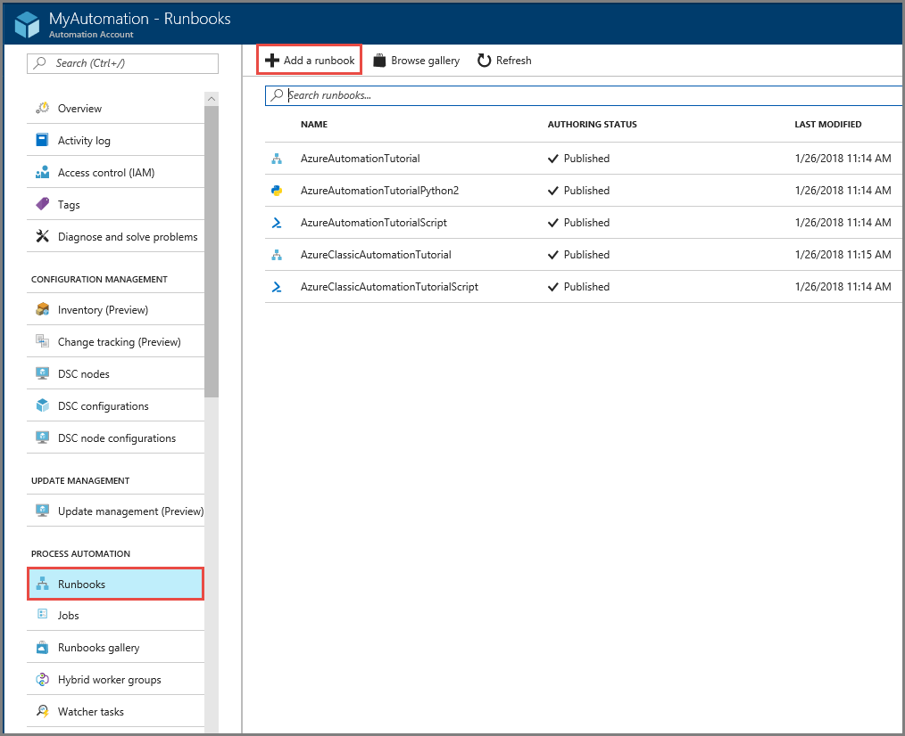
2. Select **Create a new runbook**, and perform the following steps: 

    1. For **Name**, type **StartStopAzureSsisRuntime**.
    2. For **Runbook type**, select **PowerShell**.
    3. Select **Create**.
    
        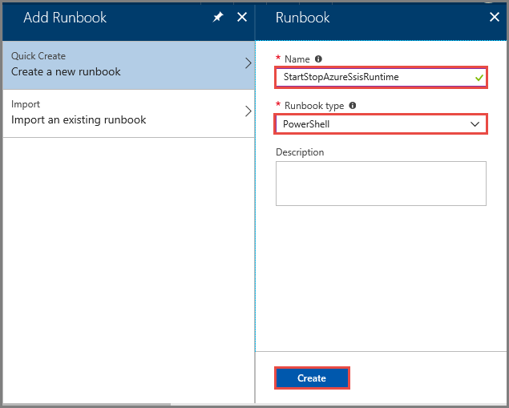
3. Copy/paste the following script to the runbook script window. Save and then publish the runbook by using the **Save** and **Publish** buttons on the toolbar. 

    ```powershell
    Param
    (
          [Parameter (Mandatory= $true)]
          [String] $ResourceGroupName,
    
          [Parameter (Mandatory= $true)]
          [String] $DataFactoryName,
    
          [Parameter (Mandatory= $true)]
          [String] $AzureSSISName,
    
          [Parameter (Mandatory= $true)]
          [String] $Operation
    )
    
    $connectionName = "AzureRunAsConnection"
    try
    {
        # Get the connection "AzureRunAsConnection "
        $servicePrincipalConnection=Get-AutomationConnection -Name $connectionName         
    
        "Logging in to Azure..."
        Connect-AzureRmAccount `
            -ServicePrincipal `
            -TenantId $servicePrincipalConnection.TenantId `
            -ApplicationId $servicePrincipalConnection.ApplicationId `
            -CertificateThumbprint $servicePrincipalConnection.CertificateThumbprint 
    }
    catch {
        if (!$servicePrincipalConnection)
        {
            $ErrorMessage = "Connection $connectionName not found."
            throw $ErrorMessage
        } else{
            Write-Error -Message $_.Exception
            throw $_.Exception
        }
    }
    
    if($Operation -eq "START" -or $operation -eq "start")
    {
        "##### Starting #####"
        Start-AzureRmDataFactoryV2IntegrationRuntime -ResourceGroupName $ResourceGroupName -DataFactoryName $DataFactoryName -Name $AzureSSISName -Force
    }
    elseif($Operation -eq "STOP" -or $operation -eq "stop")
    {
        "##### Stopping #####"
        Stop-AzureRmDataFactoryV2IntegrationRuntime -DataFactoryName $DataFactoryName -Name $AzureSSISName -ResourceGroupName $ResourceGroupName -Force
    }  
    "##### Completed #####"    
    ```

    
5. Test the runbook by selecting **Start** button on the toolbar. 

    
6. In the **Start Runbook** window, perform the following steps: 

    1. For **RESOURCE GROUP NAME**, enter the name of the resource group with the data factory that has the Azure SSIS IR. 
    2. For **DATA FACTORY NAME**, enter the name of the data factory that has the Azure SSIS IR. 
    3. For **AZURESSISNAME**, enter the name of the Azure SSIS IR. 
    4. For **OPERATION**, enter **START**. 
    5. Select **OK**.  

        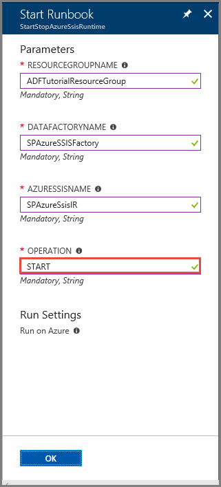
7. In the job window, select **Output** tile. In the output window of the job, wait until you see the message **##### Completed #####** after you see **##### Starting #####**. Starting an Azure SSIS IR takes approximately 20 minutes. Close the **Job** window, and get back to the **Runbook** window.

    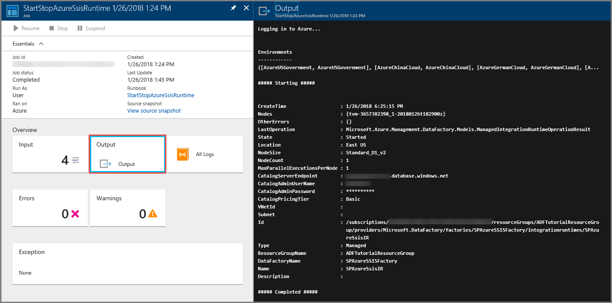
8.  Repeat the previous two steps, but by using **STOP** as the value for the **OPERATION**. Start the runbook again by selecting the **Start** button on the toolbar. Specify the resource group name, data factory name, and Azure SSIS IR name. For **OPERATION**, enter **STOP**. 

    In the output window of the job, wait until you see message **##### Completed #####** after you see **##### Stopping #####**. Stopping an Azure SSIS IR does not take as long as starting the Azure SSIS IR. Close the **Job** window, and get back to the **Runbook** window.

## Create schedules for the runbook to start/stop the Azure SSIS IR
In the previous section, you created an Azure Automation runbook that can either start or stop an Azure SSIS IR. In this section, you create two schedules for the runbook. When configuring the first schedule, you specify START for the OPERATION parameter. Similarly, when configuring the second schedule, you specify STOP for the OPERATION. For detailed steps for creating schedules, see [Create a schedule](../automation/automation-schedules.md#creating-a-schedule).

1. In the **Runbook** window, select **Schedules**, and select **+ Add a schedule** on the toolbar. 

    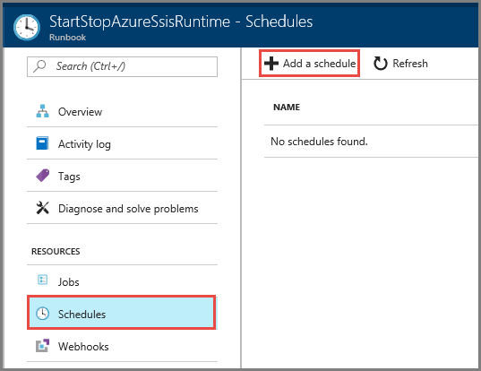
2. In the **Schedule Runbook** window, perform the following steps: 

    1. Select **Link a schedule to your runbook**. 
    2. Select **Create a new schedule**.
    3. In the **New Schedule** window, type **Start IR daily** for **Name**. 
    4. In the **Starts section**, for the time, specify a time a few minutes past the current time. 
    5. For **Recurrence**, select **Recurring**. 
    6. In the **Recur every** section, select **Day**. 
    7. Select **Create**. 

        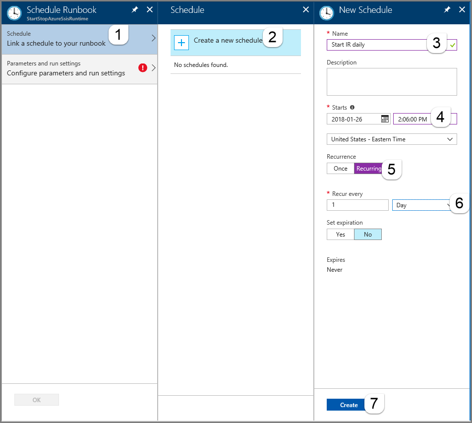
3. Switch to the **Parameters and run settings** tab. Specify the resource group name, data factory name, and Azure SSIS IR name. For **OPERATION**, enter **START**. Select **OK**. Select **OK** again to see the schedule on the **Schedules** page of the runbook. 

    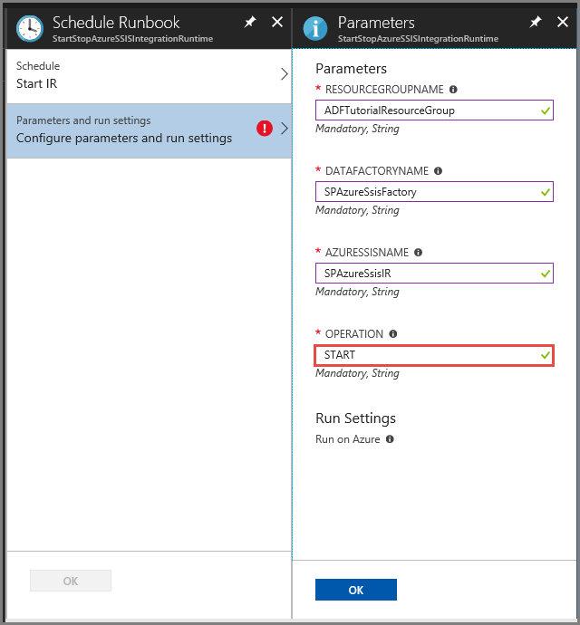
4. Repeat the previous two steps to create a schedule named **Stop IR daily**. This time, specify time at least 30 minutes after the time you specified for the **Start IR daily** schedule. For **OPERATION**, specify **STOP**. 
5. In the **Runbook** window, select **Jobs** on the left menu. You should see the jobs created by the schedules at the specified times and their statuses. You can see details about the job such as its output similar to what you have seen when you tested the runbook. 

    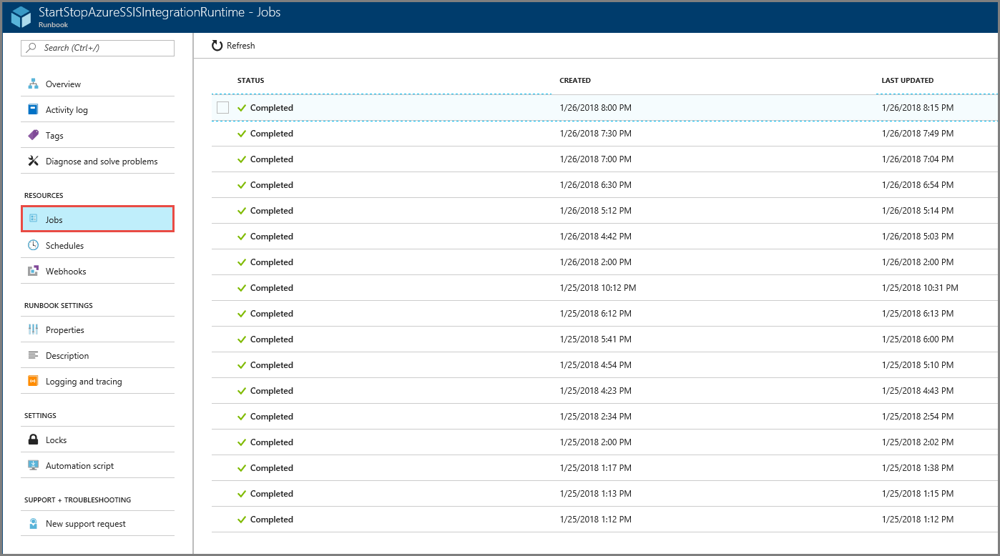
6. After you are done testing, disable the schedules by editing them and selecting **NO** for **Enabled**. Select **Schedules** in the left menu, select the **Start IR daily/Stop IR daily**, and select **No** for **Enabled**. 

## Create webhooks to start and stop the Azure SSIS IR
Follow instructions in [Create a webhook](../automation/automation-webhooks.md#creating-a-webhook) to create two webhooks for the runbook. For the first one, specify START as the OPERATION, and for the second one, specify STOP as the OPERATION. Save the URLs for both the webhooks somewhere (like a text file or a OneNote notebook). You use these URLs when configuring Web activities in the Data Factory pipeline. The following image shown an example of creating a webhook that starts the Azure SSIS IR:

1. In the **Runbook** window, select **Webhooks** from the left menu, and select **+ Add Webhook** on the toolbar. 

    
2. In the **Add Webhook** window, select **Create new webhook**, and do the following actions: 

    1. For **Name**, enter **StartAzureSsisIR**. 
    2. Confirm that **Enabled** is set to **Yes**. 
    3. Copy the **URL** and save it somewhere. This step is important. You do not see the URL later. 
    4. Select **OK**. 

        
3. Switch to the **Parameters and run settings** tab. Specify the resource group name, the data factory name, and the Azure SSIS IR name. For **OPERATION**, enter **START**. Click **OK**. Then, click **Create**. 

    
4. Repeat the previous three steps to create another webhook named **StopAzureSsisIR**. Don't forget to copy the URL. When specifying the parameters and run settings, enter **STOP** for **OPERATION**. 

You should have two URLs, one for the **StartAzureSsisIR** webhook and the other for the **StopAzureSsisIR** webhook. You can send an HTTP POST request to these URLs to start/stop your Azure SSIS IR. 

## Create and schedule a Data Factory pipeline that starts/stops the IR
This section shows how to use a Web activity to invoke the webhooks you created in the previous section.

The pipeline you create consists of three activities. 

1. The first **Web** activity invokes the first webhook to start the Azure SSIS IR. 
2. The **Execute SSIS Package** activity or the **Stored Procedure** activity runs the SSIS package.
3. The second **Web** activity invokes the webhook to stop the Azure SSIS IR. 

After you create and test the pipeline, you create a schedule trigger and associate with the pipeline. The schedule trigger defines a schedule for the pipeline. Suppose, you create a trigger that is scheduled to run daily at 11 PM. The trigger runs the pipeline at 11 PM every day. The pipeline starts the Azure SSIS IR, executes the SSIS package, and then stops the Azure SSIS IR. 

### Create a data factory

1. Log in to the [Azure portal](https://portal.azure.com/).    
2. Click **New** on the left menu, click **Data + Analytics**, and click **Data Factory**. 
   
   
3. In the **New data factory** page, enter **MyAzureSsisDataFactory** for the **name**. 
      
     
 
   The name of the Azure data factory must be **globally unique**. If you receive the following error, change the name of the data factory (for example, yournameMyAzureSsisDataFactory) and try creating again. See [Data Factory - Naming Rules](naming-rules.md) article for naming rules for Data Factory artifacts.
  
       `Data factory name “MyAzureSsisDataFactory” is not available`
3. Select your Azure **subscription** in which you want to create the data factory. 
4. For the **Resource Group**, do one of the following steps:
     
      - Select **Use existing**, and select an existing resource group from the drop-down list. 
      - Select **Create new**, and enter the name of a resource group.   
         
      To learn about resource groups, see [Using resource groups to manage your Azure resources](../azure-resource-manager/resource-group-overview.md).  
4. Select **V2 (Preview)** for the **version**.
5. Select the **location** for the data factory. Only locations that are supported for creation of data factories are shown in the list.
6. Select **Pin to dashboard**.     
7. Click **Create**.
8. On the dashboard, you see the following tile with status: **Deploying data factory**. 

	
9. After the creation is complete, you see the **Data Factory** page as shown in the image.
   
   
10. Click **Author & Monitor** to launch the Data Factory User Interface (UI) in a separate tab.

### Create a pipeline

1. In the **Get started** page, select **Create pipeline**. 

   
2. In the **Activities** toolbox, expand **General**, drag-drop the **Web** activity onto the pipeline designer surface. In the **General** tab of the **Properties** window, change the name of the activity to **StartIR**.

   
3. Switch to the **Settings** tab in the **Properties** window, and do the following actions: 

    1. For **URL**, paste the URL for the webhook that starts the Azure SSIS IR. 
    2. For **Method**, select **POST**. 
    3. For **Body**, enter `{"message":"hello world"}`. 
   
        

4. Drag and drop the Execute SSIS Package activity or the Stored Procedure activity from the **General** section of the **Activities** toolbox. Set the name of the activity to **RunSSISPackage**. 

5. If you select the Execute SSIS Package activity, follow the instructions in [Run an SSIS package using the SSIS activity in Azure Data Factory](how-to-invoke-ssis-package-ssis-activity.md) to complete the activity creation.  Make sure that you specify a sufficient number of retry attempts that are frequent enough to wait for the availability of the Azure-SSIS IR, since it takes up to 30 minutes to start. 

    

6. If you select the Stored Procedure activity, follow the instructions in [Invoke an SSIS package using stored procedure activity in Azure Data Factory](how-to-invoke-ssis-package-stored-procedure-activity.md) to complete the activity creation. Make sure that you insert a Transact-SQL script that waits for the availability of the Azure-SSIS IR, since it takes up to 30 minutes to start.
    ```sql
    DECLARE @return_value int, @exe_id bigint, @err_msg nvarchar(150)

    -- Wait until Azure-SSIS IR is started
    WHILE NOT EXISTS (SELECT * FROM [SSISDB].[catalog].[worker_agents] WHERE IsEnabled = 1 AND LastOnlineTime > DATEADD(MINUTE, -10, SYSDATETIMEOFFSET()))
    BEGIN
        WAITFOR DELAY '00:00:01';
    END

    EXEC @return_value = [SSISDB].[catalog].[create_execution] @folder_name=N'YourFolder',
        @project_name=N'YourProject', @package_name=N'YourPackage',
        @use32bitruntime=0, @runincluster=1, @useanyworker=1,
        @execution_id=@exe_id OUTPUT 

    EXEC [SSISDB].[catalog].[set_execution_parameter_value] @exe_id, @object_type=50, @parameter_name=N'SYNCHRONIZED', @parameter_value=1

    EXEC [SSISDB].[catalog].[start_execution] @execution_id = @exe_id, @retry_count = 0

    -- Raise an error for unsuccessful package execution, check package execution status = created (1)/running (2)/canceled (3)/
    -- failed (4)/pending (5)/ended unexpectedly (6)/succeeded (7)/stopping (8)/completed (9) 
    IF (SELECT [status] FROM [SSISDB].[catalog].[executions] WHERE execution_id = @exe_id) <> 7 
    BEGIN
        SET @err_msg=N'Your package execution did not succeed for execution ID: '+ CAST(@execution_id as nvarchar(20))
        RAISERROR(@err_msg, 15, 1)
    END
    ```

7. Connect the **Web** activity to the **Execute SSIS Package** or the **Stored Procedure** activity. 

    

8. Drag and drop another **Web** activity to the right of the **Execute SSIS Package** activity or the **Stored Procedure** activity. Set the name of the activity to **StopIR**. 
9. Switch to the **Settings** tab in the **Properties** window, and do the following actions: 

    1. For **URL**, paste the URL for the webhook that stops the Azure SSIS IR. 
    2. For **Method**, select **POST**. 
    3. For **Body**, enter `{"message":"hello world"}`.  
10. Connect the **Execute SSIS Package** activity or the **Stored Procedure** activity to the last **Web** activity.

    
11. Validate the pipeline settings by clicking **Validate** on the toolbar. Close the **Pipeline Validation Report** by clicking **>>** button. 

    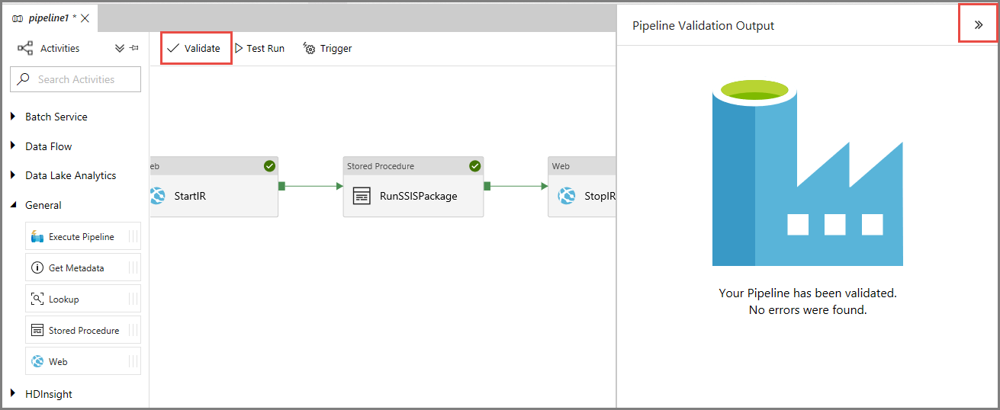

### Test run the pipeline

1. Select **Test Run** on the toolbar for the pipeline. You see the output in the **Output** window in the bottom pane. 

    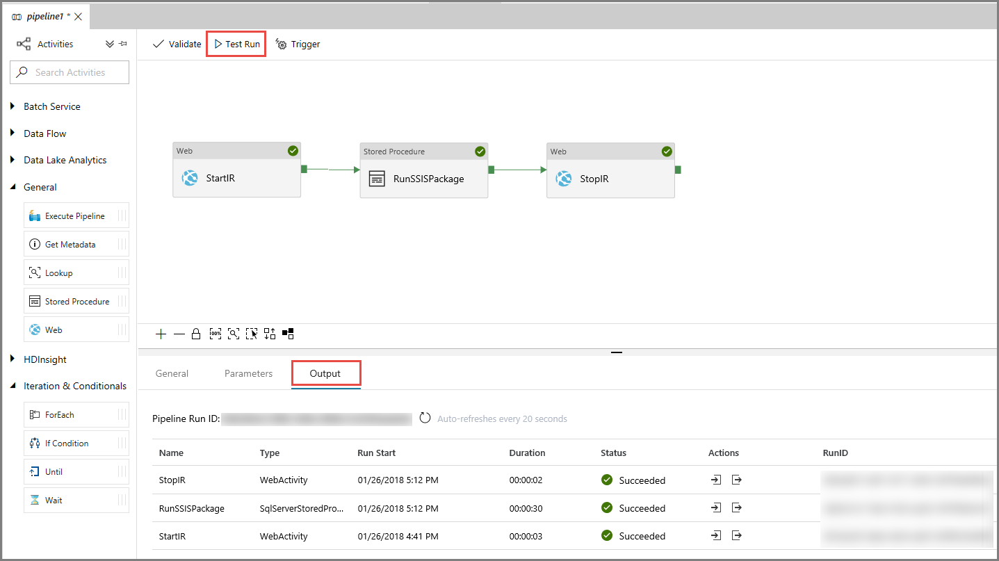
2. In the **Runbook** page of your Azure Automation account, you can verify that the jobs ran to start and stop the Azure SSIS IR. 

    
3. Launch SQL Server Management Studio. In the **Connect to Server** window, do the following actions: 

    1. For **Server name**, specify **&lt;your Azure SQL database&gt;.database.windows.net**.
    2. Select **Options >>**.
    3. For **Connect to database**, select **SSISDB**.
    4. Select **Connect**. 
    5. Expand **Integration Services Catalogs** -> **SSISDB** -> Your folder -> **Projects** -> Your SSIS project -> **Packages**. 
    6. Right-click your SSIS package, and select **Reports** -> **Standard Reports** -> **All Executions**. 
    7. Verify that the SSIS package ran. 

        

### Schedule the pipeline 
Now that the pipeline works as you expected, you can create a trigger to run this pipeline at a specified cadence. For details about associating a schedule trigger with a pipeline, see [Trigger the pipeline on a schedule](quickstart-create-data-factory-portal.md#trigger-the-pipeline-on-a-schedule).

1. On the toolbar for the pipeline, select **Trigger**, and select **New/Edit**. 

    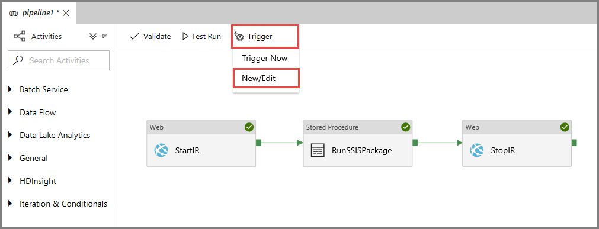
2. In the **Add Triggers** window, select **+ New**.

    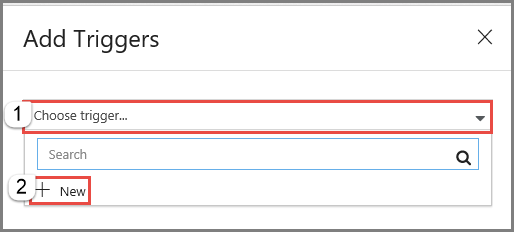
3. In the **New Trigger**, do the following actions: 

    1. For **Name**, specify a name for the trigger. In the following example, **Run daily** is the name of the trigger. 
    2. For **Type**, select **Schedule**. 
    3. For **Start Date**, select a start date and time. 
    4. For **Recurrence**, specify the cadence for the trigger. In the following example, it's daily once. 
    5. For **End**, you can specify the date and time by selecting the **On Date** option. 
    6. Select **Activated**. The trigger is activated immediately after you publish the solution to Data Factory. 
    7. Select **Next**.

        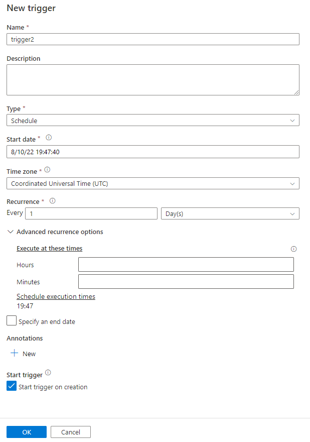
4. In the **Trigger Run Parameters** page, review the warning, and select **Finish**. 
5. Publish the solution to Data Factory by selecting **Publish All** in the left pane. 

    
6. To monitor trigger runs and pipeline runs, use the **Monitor** tab on the left. For detailed steps, see [Monitor the pipeline](quickstart-create-data-factory-portal.md#monitor-the-pipeline).

    
7. To view the activity runs associated with a pipeline run, select the first link (**View Activity Runs**) in the **Actions** column. You see the three activity runs associated with each activity in the pipeline (first Web activity, Stored Procedure activity, and the second Web activity). To switch back to view the pipeline runs, select **Pipelines** link at the top.

    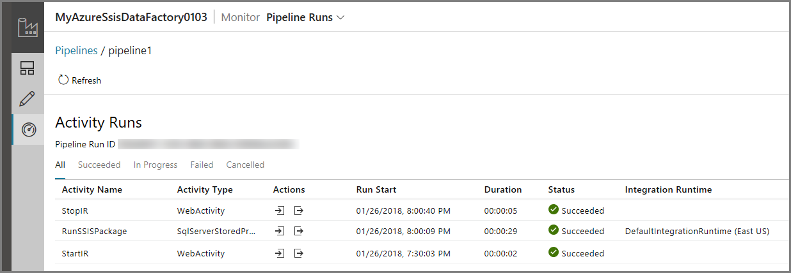
8. You can also view trigger runs by selecting **Trigger runs** from the drop-down list that's next to the **Pipeline Runs** at the top. 

    

## Next steps
See the following articles from SSIS documentation: 

- [Deploy, run, and monitor an SSIS package on Azure](/sql/integration-services/lift-shift/ssis-azure-deploy-run-monitor-tutorial)   
- [Connect to SSIS catalog on Azure](/sql/integration-services/lift-shift/ssis-azure-connect-to-catalog-database)
- [Schedule package execution on Azure](/sql/integration-services/lift-shift/ssis-azure-schedule-packages)
- [Connect to on-premises data sources with Windows authentication](/sql/integration-services/lift-shift/ssis-azure-connect-with-windows-auth)
