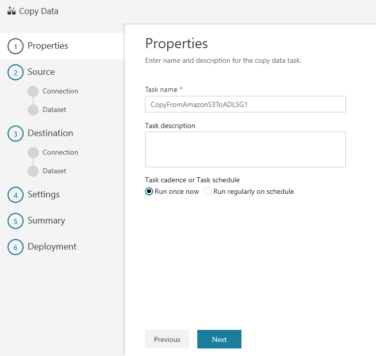
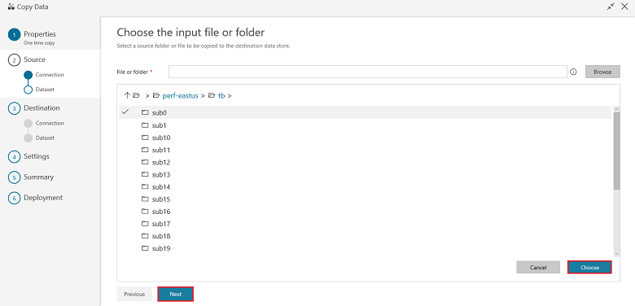
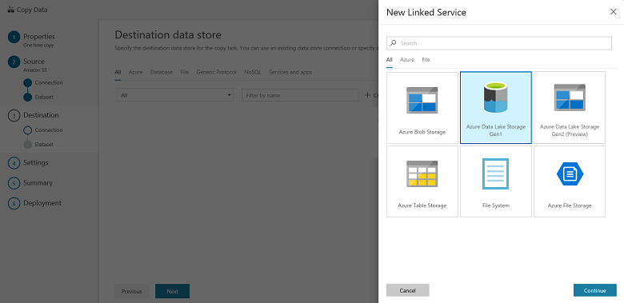
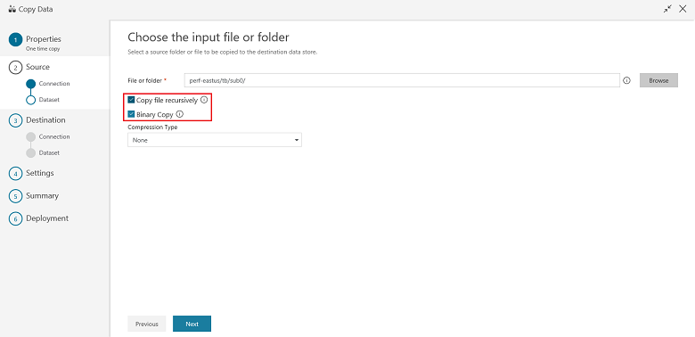
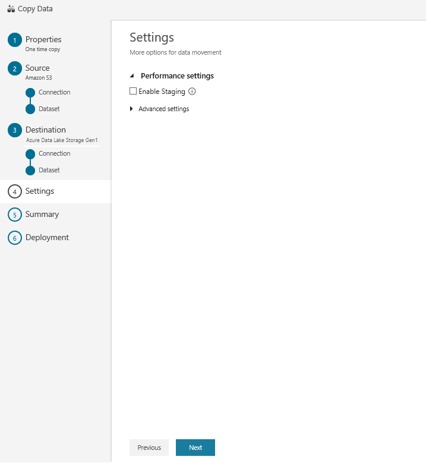
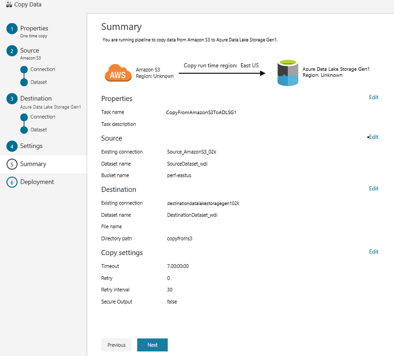

# Load data into Azure Data Lake Store using Azure Data Factory

[Azure Data Lake Store](../data-lake-store/data-lake-store-overview.md) is an enterprise-wide hyper-scale repository for big data analytic workloads. Azure Data Lake enables you to capture data of any size, type, and ingestion speed in one single place for operational and exploratory analytics.

Azure Data Factory is a fully managed cloud-based data integration service, which can be used to populate the lake with the data from your existing system, and saving you valuable time while building your analytics solutions. Here are the key benefits of loading data into Azure Data Lake Store using Azure Data Factory:

* **Easy to set up**: 5-step intuitive wizard with no scripting required.
* **Rich data store support**: built-in support for a rich set of on-premises and cloud-based data stores, see detailed list in [supported data stores](copy-activity-overview.md#supported-data-stores-and-formats) table.
* **Secure and compliant**: data is transferred over HTTPS or ExpressRoute, and global service presence ensures your data never leaves the geographical boundary
* **High performance**: up to 1GBps data loading speed into Azure Data Lake Store. Learn details from [copy activity performance](copy-activity-performance.md).

This article shows you how to use Data Factory Copy Data tool to **load data from Amazon S3 into Azure Data Lake Store**. You can follow the similar steps to copy data from other types of data stores.

> [!NOTE]
>  For general information about capabilities of Data Factory in copying data to/from Azure Data Lake Store, see [Copy data to or from Azure Data Lake Store by using Azure Data Factory](connector-azure-data-lake-store.md) article.
>
> This article applies to version 2 of Data Factory, which is currently in preview. If you are using version 1 of the Data Factory service, which is generally available (GA), see [Copy Activity in V1](v1/data-factory-data-movement-activities.md).

## Prerequisites

* **Azure subscription**. If you don't have an Azure subscription, create a [free](https://azure.microsoft.com/free/) account before you begin.
* **Azure Data Lake Store**. If you don't have a Data Lake Store account, see the [Create a Data Lake Store account](../data-lake-store/data-lake-store-get-started-portal.md#create-an-azure-data-lake-store-account) article for steps to create one.
* **Amazon S3**. This article shows how to copy data from Amazon S3. You can use other data stores by following similar steps.

## Create a data factory

1. Click **NEW** on the left menu, click **Data + Analytics**, and click **Data Factory**. 
   
   
2. In the **New data factory** page, provide the values as shown in the following screenshot: 
      
     
 
   * **Name.** Enter a global unique name for the data factory. If you receive the following error, change the name of the data factory (for example, yournameADFTutorialDataFactory) and try creating again. See [Data Factory - Naming Rules](naming-rules.md) article for naming rules for Data Factory artifacts.
  
            `Data factory name "LoadADLSDemo" is not available`

    * **Subscription.** Select your Azure **subscription** in which you want to create the data factory. 
    * **Resource Group.** Select an existing resource group from the drop-down list, or select **Create new** option and enter the name of a resource group. To learn about resource groups, see [Using resource groups to manage your Azure resources](../azure-resource-manager/resource-group-overview.md).  
    * **Version.** Select **V2 (Preview)**.
    * **Location.** Select the location for the data factory. Only supported locations are displayed in the drop-down list. The data stores (Azure Data Lake Store, Azure Storage, Azure SQL Database, etc.) used by data factory can be in other locations/regions.

3. Click **Create**.
4. After the creation is complete, go to your data factory, and you see the **Data Factory** page as shown in the image. Click **Author & Monitor** tile to launch the Data Integration Application in a separate tab. 
   
   

## Load data into Azure Data Lake Store

1. In the get started page, click **Copy Data** tile to launch the Copy Data tool. 

   
2. In the **Properties** page of the Copy Data tool, specify **CopyFromAmazonS3ToADLS** for the **Task name**, and click **Next**. 

    
3. In the **Source data store** page, select **Amazon S3**, and click **Next**.

    
4. In the **Specify Amazon S3 connection** page, do the following steps: 
    1. Specify the **Access Key ID**.
    2. Specify the **Secret Access Key**.
    3. Click **Next**. 

        
5. In the **Choose the input file or folder** page, navigate to the folder/file you want to copy over, select and click **Choose**, then click **Next**. 

    

6. In the **Destination data store** page, select **Azure Data Lake Store**, and click **Next**. 

    

7. In this page, choose the copy behavior by checking **Copy files recursively** and **Binary copy** (copy files as-is) options. Click **Next**.

    

8. In the **Specify Data Lake Store connection** page, do the following steps: 

    1. Select your Data Lake Store for the **Data Lake Store account name**.
    2. Specify the service principal information including **Tenant**, **Service principal ID**, and **Service principal key**.
    3. Click **Next**. 

    > [!IMPORTANT]
    > In this walkthrough, you use a **Service principal** to authenticate data lake store. Follow the instruction [here](connector-azure-data-lake-store.md#using-service-principal-authentication) and make sure you grant the service principal proper permission in Azure Data Lake Store.

    

9. In the **Choose the output file or folder** page, specify **copyfroms3**, then click **Next**. 

    

10. In the **Settings** page, click **Next**. 

    
11. In the **Summary** page, review the settings, and click **Next**.

    
12. In the **Deployment page**, click **Monitor** to monitor the pipeline (task).

    
13. Notice that the **Monitor** tab on the left is automatically selected. You see the links to view activity run details and to rerun the pipeline in the **Actions** column. 

    
14. To view activity runs associated with the pipeline run, click **View Activity Runs** link in the **Actions** column. There is only one activity (copy activity) in the pipeline, so you see only one entry. To switch back to the pipeline runs view, click **Pipelines** link at the top. Click **Refresh** to refresh the list. 

    

15. You can further monitor each copy activity's execution details, by clicking the **Details** link under **Actions** in activity monitoring view. It shows you information including volume of data copied from source to sink, throughput, steps it goes through with corresponding duration and used configurations.

    

16. Verify that the data is copied into your Azure Data Lake Store. 

    

## Next steps

Advance to the following article to learn about Azure Data Lake Store support: 

> [!div class="nextstepaction"]
>[Azure Data Lake Store connector](connector-azure-data-lake-store.md)