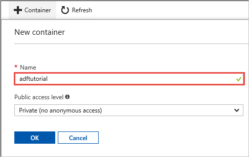
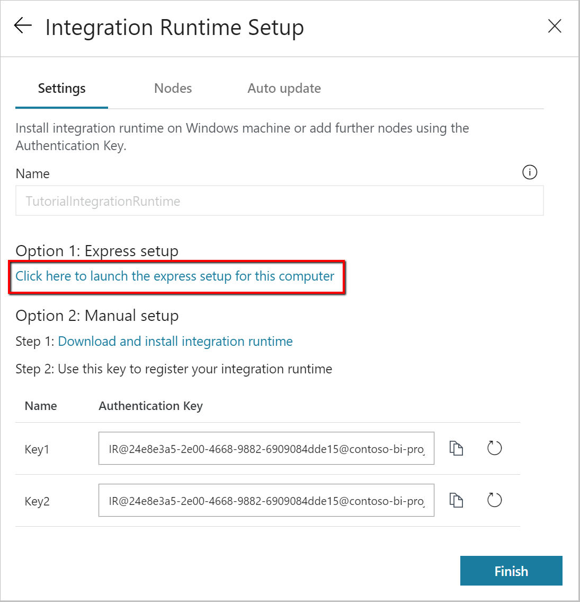
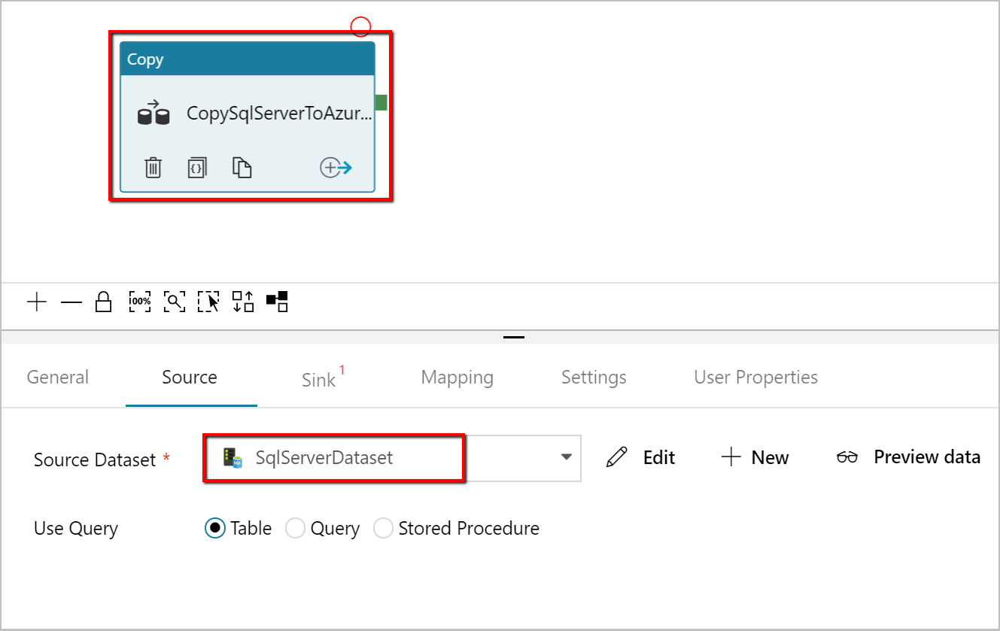
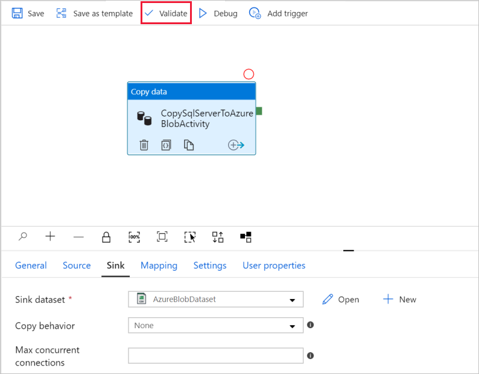

# Tutorial: Copy data from an on-premises SQL Server database to Azure Blob storage
In this tutorial, you use Azure portal to create a data-factory pipeline that copies data from an on-premises SQL Server database to Azure Blob storage. You create and use a self-hosted integration runtime, which moves data between on-premises and cloud data stores. 

> [!NOTE]
> This article applies to version 2 of Azure Data Factory, which is currently in preview. If you are using version 1 of the Data Factory service, which is generally available (GA), see [documentation for Data Factory version 1](v1/data-factory-copy-data-from-azure-blob-storage-to-sql-database.md).
> 
> This article does not provide a detailed introduction to the Data Factory service. For more information, see [Introduction to Azure Data Factory](introduction.md). 

In this tutorial, you perform the following steps:

> [!div class="checklist"]
> * Create a data factory.
> * Create a self-hosted integration runtime.
> * Create SQL Server and Azure Storage linked services. 
> * Create SQL Server and Azure Blob datasets.
> * Create a pipeline with a copy activity to move the data.
> * Start a pipeline run.
> * Monitor the pipeline run.

## Prerequisites
### Azure subscription
Before you begin, if you don't already have an Azure subscription, [create a free account](https://azure.microsoft.com/free/).

### Azure roles
To create data factory instances, the user account you use to log in to Azure must be assigned a *contributor* or *owner* role or must be an *administrator* of the Azure subscription. 

To view the permissions you have in the subscription, go to the Azure portal, select your username at the top-right corner, and then select **Permissions**. If you have access to multiple subscriptions, select the appropriate subscription. For sample instructions on adding a user to a role, see the [Add roles](../billing/billing-add-change-azure-subscription-administrator.md) article.

### SQL Server 2014, 2016, and 2017
In this tutorial, you use an on-premises SQL Server database as a *source* data store. The pipeline in the data factory you create in this tutorial copies data from this on-premises SQL Server database (source) to Azure Blob storage (sink). You then create a table named **emp** in your SQL Server database, and insert a couple of sample entries into the table. 

1. Start SQL Server Management Studio. If it is not already installed on your machine, go to [Download SQL Server Management Studio](https://docs.microsoft.com/sql/ssms/download-sql-server-management-studio-ssms). 

2. Connect to your SQL Server instance by using your credentials. 

3. Create a sample database. In the tree view, right-click **Databases**, and then select **New Database**. 
 
4. In the **New Database** window, enter a name for the database, and then select **OK**. 

5. To create the **emp** table and insert some sample data into it, run the following query script against the database:

   ```
    CREATE TABLE dbo.emp
    (
        ID int IDENTITY(1,1) NOT NULL,
        FirstName varchar(50),
        LastName varchar(50)
    )
    GO
    
    INSERT INTO emp (FirstName, LastName) VALUES ('John', 'Doe')
    INSERT INTO emp (FirstName, LastName) VALUES ('Jane', 'Doe')
    GO
   ```

6. In the tree view, right-click the database that you created, and then select **New Query**.

### Azure Storage account
In this tutorial, you use a general-purpose Azure storage account (specifically, Azure Blob storage) as a destination/sink data store. If you don't have a general-purpose Azure storage account, see [Create a storage account](../storage/common/storage-create-storage-account.md#create-a-storage-account). The pipeline in the data factory you that create in this tutorial copies data from the on-premises SQL Server database (source) to this Azure Blob storage (sink). 

#### Get storage account name and account key
You use the name and key of your Azure storage account in this tutorial. Get the name and key of your storage account by doing the following: 

1. Sign in to the [Azure portal](https://portal.azure.com) with your Azure username and password. 

2. In the left pane, select **More services**, filter by using the **Storage** keyword, and then select **Storage accounts**.

    

3. In the list of storage accounts, filter for your storage account (if needed), and then select your storage account. 

4. In the **Storage account** window, select **Access keys**.

    

5. In the **Storage account name** and **key1** boxes, copy the values, and then paste them into Notepad or another editor for later use in the tutorial. 

#### Create the adftutorial container 
In this section, you create a blob container named **adftutorial** in your Azure Blob storage. 

1. In the **Storage account** window, switch to **Overview**, and then select **Blobs**. 

    

2. In the **Blob service** window, select **Container**. 

    

3. In the **New container** window, in the **Name** box, enter **adftutorial**, and then select **OK**. 

    

4. In the list of containers, select **adftutorial**.  

    

5. Keep the **container** window for **adftutorial** open. You use it verify the output at the end of the tutorial. Data Factory automatically creates the output folder in this container, so you don't need to create one.

    


## Create a data factory
In this step, you create a data factory, and launch the Azure Data Factory UI to create a pipeline in the data factory. 

1. Click **New** on the left menu, click **Data + Analytics**, and click **Data Factory**. 
   
   
2. In the **New data factory** page, enter **ADFTutorialDataFactory** for the **name**. 
      
     
 
   The name of the Azure data factory must be **globally unique**. If you see the following error for the name field, change the name of the data factory (for example, yournameADFTutorialDataFactory). See [Data Factory - Naming Rules](naming-rules.md) article for naming rules for Data Factory artifacts.
  
     
3. Select your Azure **subscription** in which you want to create the data factory. 
4. For the **Resource Group**, do one of the following steps:
     
      - Select **Use existing**, and select an existing resource group from the drop-down list. 
      - Select **Create new**, and enter the name of a resource group.   
         
        To learn about resource groups, see [Using resource groups to manage your Azure resources](../azure-resource-manager/resource-group-overview.md).  
4. Select **V2 (Preview)** for the **version**.
5. Select the **location** for the data factory. Only locations that are supported are displayed in the drop-down list. The data stores (Azure Storage, Azure SQL Database, etc.) and computes (HDInsight, etc.) used by data factory can be in other regions.
6. Select **Pin to dashboard**.     
7. Click **Create**.      
8. On the dashboard, you see the following tile with status: **Deploying data factory**. 

	
9. After the creation is complete, you see the **Data Factory** page as shown in the image.
   
   
10. Click **Author & Monitor** tile to launch the Azure Data Factory UI in a separate tab. 


## Create a pipeline

1. In the **Get started** page, click **Create pipeline**. A pipeline is automatically created for you. You see the pipeline in the tree view and its editor open. 

   
2. In the **General** tab of the **Properties** window at the bottom, and enter **SQLServerToBlobPipeline** for **Name**.

   
2. In the **Activities** toolbox, expand **Data Flow**, and drag-drop **Copy** activity to the pipeline design surface. Set the name of the activity to **CopySqlServerToAzureBlobActivity**.

   
3. In the Properties window, switch to the **Source** tab, and click **+ New**.

   
4. In the **New Dataset** window, search for **SQL Server**, select **SQL Server**, and click **Finish**. You see a new tab titled **SqlServerTable1**. You also see the **SqlServerTable1** dataset in the treeview on the left. 

   
5. In the **General** tab of the Properties window, enter **SqlServerDataset** for **Name**.
    
   
6. Switch to the **Connections** tab, and click **+ New**. You create a connection to the source data store (SQL Server database) in this step. 

   
7. In the **New Linked Service** window, click **New integration runtime**. In this section, you create a self-hosted integration runtime and associate it with an on-premises machine with the SQL Server database. The self-hosted integration runtime is the component that copies data from the SQL Server database on your machine to Azure Blob storage. 

   
8. In the **Integration Runtime Setup** window, select **Private Network**, and click **Next**. 

   
9. Enter a name for the integration runtime, and click **Next**.  
    
   
10. Click **Click here to launch the express setup for this computer** in the **Option 1: Express setup** section. 

   
11. In the **Integration Runtime (Self-hosted) Express Setup** window, click **Close**. 

   
12. In the Web browser, in the **Integration Runtime Setup** window, click **Finish**. You should be back in the **New Linked Service** window.

   
13. In the **New Linked Service** window, do the following steps:

    1. Enter **SqlServerLinkedService** for **Name**.
    2. Confirm that the self-hosted integration runtime you created earlier shows up for **Connect via integration runtime**.
    3. Specify the name of your SQL Server for **Server name**. 
    4. Specify the name of the database with the **emp** table for the **Database name** field. 
    5. Select appropriate **authentication type** that Data Factory should use to connect to your SQL Server database. 
    6. Enter the **user name** and **password**. If you need to use a backslash (\\) in your user account or server name, precede it with the escape character (\\). For example, use *mydomain\\\\myuser*. 
    7. Click **Test connection**. Do this step to confirm that the Data Factory service can connect to your SQL Server database by using the self-hosted integration runtime you created. 
    8. To save the linked service, click **Save**.

       
14. You should be back in the window with the source dataset opened. In the **Connection** of the **Properties** window, do the following steps: 

    1. Confirm that you see **SqlServerLinkedService** for **Linked service**. 
    2. Select **[dbo].[emp]** for **Table**.

        
15. Switch to the tab with the SQLServerToBlobPipeline (or) click **SQLServerToBlobPipeline** in the treeview. 

    
16. Switch to the **Sink** tab in the **Properties** window, and click **+ New**. 

    
17. In the **New Dataset** window, select **Azure Blob Storage**, and click **Finish**. You see a new tab opened for the dataset. You also see the dataset in the tree view. 

    
18. Enter **AzureBlobDataset** for **Name**.

    
19. Switch to the **Connection** tab in the **Properties** window, and click **+ New** for **Linked service**. 

    
20. In the **New Linked Service** window, do the following steps:

    1. Enter **AzureStorageLinkedService** for **Name**.
    2. Select your Azure storage account for **Storage account name**. 
    3. Test the connection to your Azure storage account by clicking **Test connection**.
    4. Click **Save**.

         
21.  You should be back in the window with the sink dataset open. In the **Connection** tab, do the following steps: 

        1. Confirm that **AzureStorageLinkedService** is selected for **Linked service**.
        2. Enter **adftutorial/fromonprem** for the **folder** part of the **File path**. If the output folder does not exist in the adftutorial container, the Data Factory service automatically creates the output folder.
        3. Enter `@CONCAT(pipeline().RunId, '.txt')` for the **file name** part of the **File path**.

            
22. Switch to the tab with pipeline opened (or) click the **pipeline** in the **tree view**. Confirm that **AzureBlobDataset** is selected for **Sink Dataset**. 

    
23. To validate the pipeline settings, click Validate on the toolbar for the pipeline. Close the **Pipe Validation Report** by clicking **X** in the right corner. 

    
1. Publish entities you created to the Azure Data Factory service by clicking **Publish**.

    
24. Wait until you see the **Publishing succeeded** popup. You can also check the status of publishing by clicking **Show Notifications** link on the left. Close the notification window by clicking **X**. 

    
    

## Trigger a pipeline run
Click **Trigger** on the toolbar for the pipeline, and click **Trigger Now**.


## Monitor the pipeline run

1. Switch to the **Monitor** tab. You see the pipeline that you manually trigger in the previous step. 

    
2. To view activity runs associated with the pipeline run, click **View Activity Runs** link in the **Actions** column. You see only activity runs since there is only one activity in the pipeline. To switch back to the pipeline runs view, click **Pipelines** link at the top of the window. 

    

## Verify the output
The pipeline automatically creates the output folder named *fromonprem* in the `adftutorial` blob container. Confirm that you see the *dbo.emp.txt* file in the output folder. 

1. In the Azure portal, in the **adftutorial** container window, select **Refresh** to see the output folder.

    
2. Select `fromonprem` in the list of folders. 
3. Confirm that you see a file named `dbo.emp.txt`.

    


## Next steps
The pipeline in this sample copies data from one location to another in Azure Blob storage. You learned how to:

> [!div class="checklist"]
> * Create a data factory.
> * Create a self-hosted integration runtime.
> * Create SQL Server and Azure Storage linked services. 
> * Create SQL Server and Azure Blob datasets.
> * Create a pipeline with a copy activity to move the data.
> * Start a pipeline run.
> * Monitor the pipeline run.

For a list of data stores that are supported by Data Factory, see [supported data stores](copy-activity-overview.md#supported-data-stores-and-formats).

To learn about copying data in bulk from a source to a destination, advance to the following tutorial:

> [!div class="nextstepaction"]
>[Copy data in bulk](tutorial-bulk-copy-portal.md)
