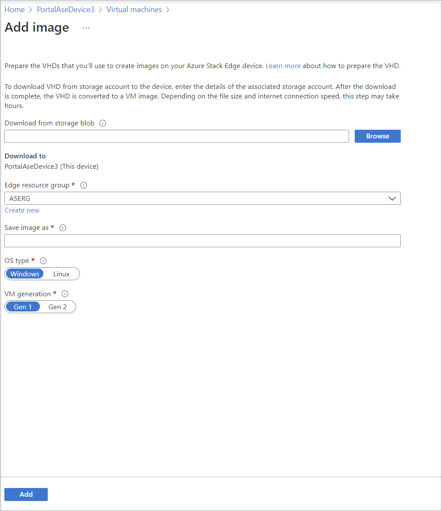
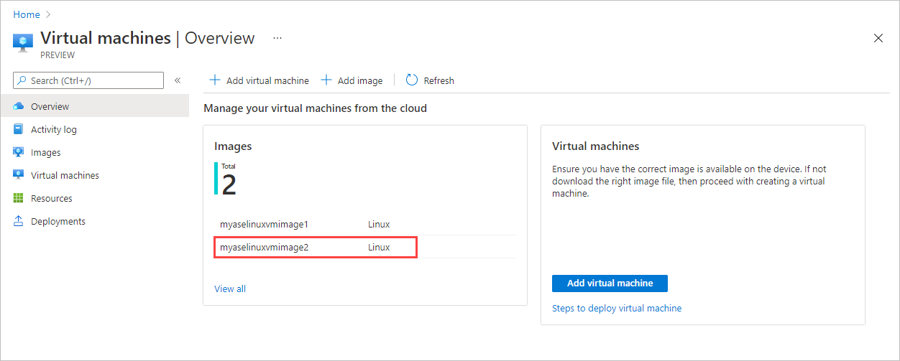
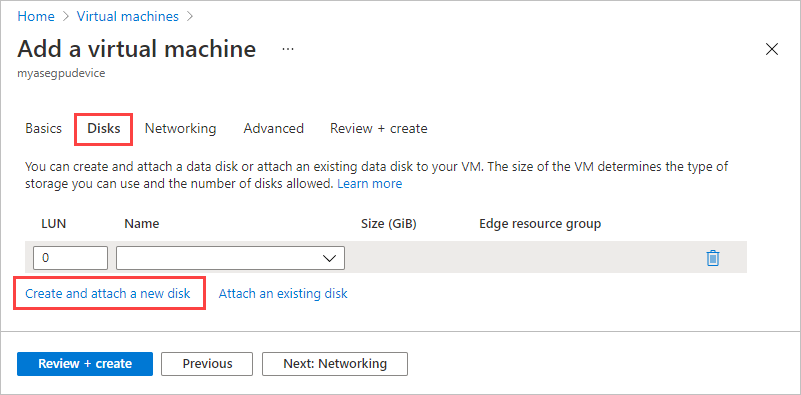
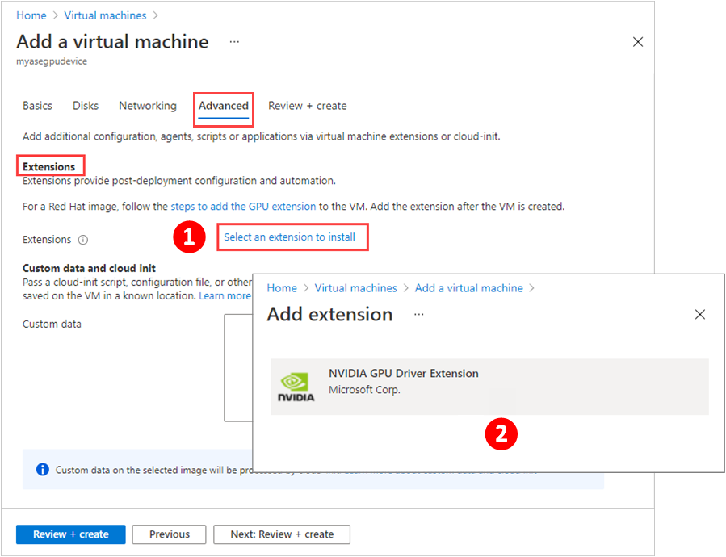
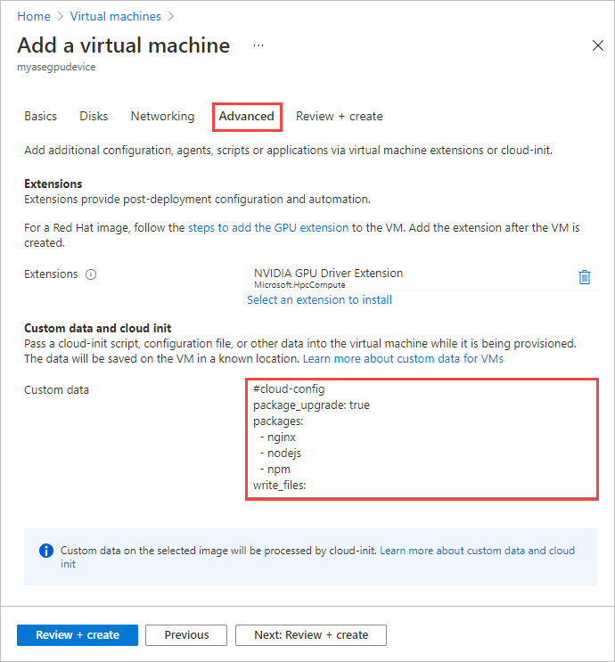
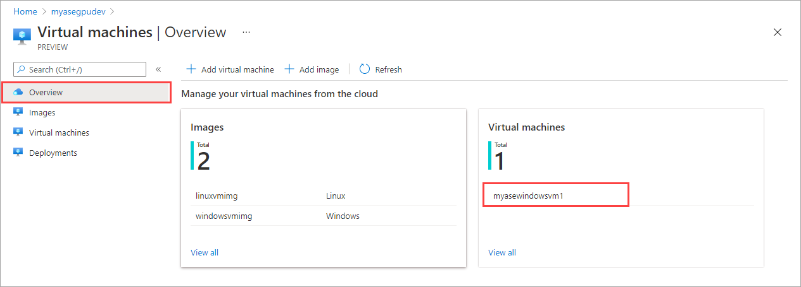

# Deploy VMs on your Azure Stack Edge Pro GPU device via the Azure portal

[!INCLUDE [applies-to-GPU-and-pro-r-and-mini-r-skus](../../includes/azure-stack-edge-applies-to-gpu-pro-r-mini-r-sku.md)]

You can create and manage virtual machines (VMs) on an Azure Stack Edge Pro GPU device by using the Azure portal, templates, and Azure PowerShell cmdlets, and via the Azure CLI or Python scripts. This article describes how to create and manage a VM on your Azure Stack Edge Pro GPU device by using the Azure portal.

> [!IMPORTANT] 
> We recommend that you enable multifactor authentication for the user who manages VMs that are deployed on your device from the cloud.
        
## VM deployment workflow

The high-level summary of the deployment workflow is as follows:

1. Enable a network interface for compute on your Azure Stack Edge device. This step creates a virtual switch on the specified network interface.
1. Enable cloud management of VMs from the Azure portal.
1. Upload a VHD to an Azure Storage account by using Azure Storage Explorer. 
1. Use the uploaded VHD to download the VHD onto the device, and create a VM image from the VHD. 
1. Use the resources created in the previous steps:
    1. VM image that you created.
    1. Virtual switch associated with the network interface on which you enabled compute.
    1. Subnet associated with the virtual switch.

    And create or specify the following resources inline:
    1. VM name, choose a supported VM size, sign-in credentials for the VM. 
    1. Create new data disks or attach existing data disks.
    1. Configure static or dynamic IP for the VM. If you're providing a static IP, choose from a free IP in the subnet range of the network interface enabled for compute.

    Use the preceding resources to create a VM.

## Prerequisites

Before you begin to create and manage VMs on your device via the Azure portal, make sure that:

1. You've completed the network settings on your Azure Stack Edge Pro GPU device as described in [Step 1: Configure an Azure Stack Edge Pro GPU device](./azure-stack-edge-gpu-connect-resource-manager.md#step-1-configure-azure-stack-edge-device).

    1. You've enabled a network interface for compute. This network interface IP is used to create a virtual switch for the VM deployment. In the local UI of your device, go to **Compute**. Select the network interface that you'll use to create a virtual switch.

        > [!IMPORTANT] 
        > You can configure only one port for compute.

    1. Enable compute on the network interface. Azure Stack Edge Pro GPU creates and manages a virtual switch corresponding to that network interface.

1. You have access to a Windows or Linux VHD that you'll use to create the VM image for the VM you intend to create.

## Deploy a VM

Follow these steps to create a VM on your Azure Stack Edge Pro GPU device.

### Add a VM image

1. Upload a VHD to an Azure Storage account. Follow the steps in [Use Storage Explorer for upload](azure-stack-edge-gpu-deploy-virtual-machine-templates.md#use-storage-explorer-for-upload).

   For information about preparing the VHD, see [Prepare a generalized image from a Windows VHD](azure-stack-edge-gpu-prepare-windows-vhd-generalized-image.md).

   [Troubleshoot VM image uploads](azure-stack-edge-gpu-troubleshoot-virtual-machine-image-upload.md).

1. In the Azure portal, go to the Azure Stack Edge resource for your device. Then go to **Edge services** > **Virtual machines**.

    

1. On the **Overview** page. Select **Enable** to enable virtual machine cloud management. 

    

1. The first step is to add a VM image. You've already uploaded a VHD into the storage account in the earlier step. You'll use this VHD to create a VM image.

    Select **+ Add image** to download the VHD from the storage account and add it to the device. The download process takes several minutes depending on the size of the VHD and the internet bandwidth available for the download. 

    

1. On the **Add image** pane, make the following field entries. Then select **Add**.

    |Field  |Description  |
    |---------|---------|
    |Download from storage blob    |Browse to the location of the storage blob in the storage account where you uploaded the VHD.         |
    |Download to    | Automatically set to the current device where you're deploying the VM.        |
    |Edge resource group  |Select the resource group to add the image to. |
    |Save image as      | The name for the VM image that you're creating from the VHD you uploaded to the storage account.        |
    |OS type     |Choose from Windows or Linux as the operating system of the VHD you'll use to create the VM image.         |
   

    

1. The VHD is downloaded, and the VM image is created. Image creation takes several minutes to complete. You'll see a notification for the successful completion of the VM image.<!--There's a fleeting notification that image creation is in progress, but I didn't see any notification that image creation completed successfully.-->

    

1. After the VM image is successfully created, it's added to the list of images on the **Images** pane.

    

    The **Deployments** pane updates to indicate the status of the deployment.

    

    The newly added image is also displayed on the **Overview** page.

    

### Add a VM

Follow these steps to create a VM after you've created a VM image.

1. On the **Overview** page for **Virtual machines**, select **+ Add virtual machine**.

    

1. On the **Basics** tab, input the following parameters.

    |Parameter |Description  |
    |---------|---------|
    |Virtual machine name     | Enter a name for the new virtual machine.        |
    |Edge resource group     | Create a new resource group for all the resources associated with the VM.        |
    |Image     | Select from the VM images available on the device.        |
    |Size     | Choose from the [Supported VM sizes](azure-stack-edge-gpu-virtual-machine-sizes.md). For a GPU VM, select a [VM size from NCasT4-v3-series](azure-stack-edge-gpu-virtual-machine-sizes.md#ncast4_v3-series-preview). |
    |Username     | Use the default username **azureuser** for the admin to sign in to the VM.        |
    |Authentication type    | Choose from an SSH public key or a user-defined password.       |
    |SSH public key | Displayed when you select the **SSH public key** authentication type. Paste in the SSH public key. |
    |Password     | Displayed when you select the **Password** authentication type. Enter a password to sign in to the VM. The password must be at least 12 characters long and meet the defined [complexity requirements](../virtual-machines/windows/faq.yml#what-are-the-password-requirements-when-creating-a-vm-). |
    |Confirm password    | Enter the password again.        |

    

    Select **Next: Disks**.

1. On the **Disks** tab, you'll attach disks to your VM. 
    
    1. You can choose to **Create and attach a new disk** or **Attach an existing disk**.

        

    1. Select **Create and attach a new disk**. On the **Create new disk** pane, provide a name for the disk and the size in GiB.

        

    1. Repeat the preceding process to add more disks. After the disks are created, they show up on the **Disks** tab. Select **Next: Networking**.

1. On the **Networking** tab, you'll configure the network connectivity for your VM.

    |Parameter  |Description |
    |---------|---------|
    |Virtual network    | From the dropdown list, select the virtual switch created on your Azure Stack Edge device when you enabled compute on the network interface.    |
    |Subnet     | This field is automatically populated with the subnet associated with the network interface on which you enabled compute.         |
    |IP address     | Provide a static or a dynamic IP for your VM. The static IP should be an available, free IP from the specified subnet range.        |

    

    Select **Next: Advanced**. On the **Advanced** tab, you can select an extension to install during VM deployment, and you can specify a `cloud-init` script to customize your VM.

1. If you want to install an extension on your VM when you create it, choose **Select an extension to install**. Then select the extension on the **Add extension** screen.

    For detailed steps to install a GPU extension during VM deployment, see [Deploy GPU VMs](azure-stack-edge-gpu-deploy-gpu-virtual-machine.md#create-gpu-vms).

    

1. If you want to use the `cloud-init` utility to customize the new VM on its first boot, on the **Advanced** tab, paste your `cloud-init` script into the **Custom data** box under **Custom data and cloud init**. 

    For more information about using `cloud-init`, see [Cloud-init overview](../virtual-machines/linux/tutorial-automate-vm-deployment.md#cloud-init-overview).

    

    Select **Next: Review + Create**.

1. On the **Review + Create** tab, review the specifications for the VM. Then select **Create**.

    

1. The VM creation starts and can take up to 20 minutes. You can go to **Deployments** to monitor the VM creation.

    

1. After the VM is successfully created, you'll see your new VM on the **Overview** pane.

    

1. Select the newly created VM to go to **Virtual machines**.

    

    Select the VM to see the details.

    

    You'll use the IP address for the network interface to connect to the VM.

## Connect to a VM

Depending on whether you created a Linux or Windows VM, the steps to connect can be different. You can't connect to the VMs deployed on your device via the Azure portal. Follow the steps to connect to your Linux or Windows VM.

### Connect to a Linux VM

Follow these steps to connect to a Linux VM.

[!INCLUDE [azure-stack-edge-gateway-connect-vm](../../includes/azure-stack-edge-gateway-connect-virtual-machine-linux.md)]

### Connect to a Windows VM

Follow these steps to connect to a Windows VM.

[!INCLUDE [azure-stack-edge-gateway-connect-vm](../../includes/azure-stack-edge-gateway-connect-virtual-machine-windows.md)]

## Next steps

- [Deploy a cloud managed VM via a script](https://github.com/Azure-Samples/azure-stack-edge-deploy-vms/blob/master/dotnetSamples/CloudManaged/README.md)
- [Deploy a GPU VM](azure-stack-edge-gpu-deploy-gpu-virtual-machine.md)
- [Troubleshoot VM deployment](azure-stack-edge-gpu-troubleshoot-virtual-machine-provisioning.md)
- [Monitor VM activity on your device](azure-stack-edge-gpu-monitor-virtual-machine-activity.md)
- [Monitor CPU and memory on a VM](azure-stack-edge-gpu-monitor-virtual-machine-metrics.md)

