# Update your Azure Stack Edge Pro GPU 

[!INCLUDE [applies-to-GPU-and-pro-r-and-mini-r-skus](../../includes/azure-stack-edge-applies-to-gpu-pro-r-mini-r-sku.md)]

This article describes the steps required to install update on your Azure Stack Edge Pro with GPU via the local web UI and via the Azure portal. You apply the software updates or hotfixes to keep your Azure Stack Edge Pro device and the associated Kubernetes cluster on the device up-to-date.

The procedure described in this article was performed using a different version of software, but the process remains the same for the current software version. 

## About latest update

The current update is Update 2202. This update installs two updates, the device update followed by Kubernetes updates. The associated versions for this update are:

- Device software version - **2.2.1868.4470**
- Kubernetes server version - **v1.20.9**
- IoT Edge version: **0.1.0-beta15**
- Azure Arc version: **1.5.3**
- GPU driver version: **470.57.02**
- CUDA version: **11.4**

For information on what's new in this update, go to [Release notes](azure-stack-edge-gpu-2202-release-notes.md).

**To apply 2202 update, your device must be running 2106 or later.** 

- If you are not running the minimal supported version, you'll see this error: *Update package cannot be installed as its dependencies are not met*. 
- You can update to 2106 from an older version and then install 2202.

### Updates for a single-node vs two-node

The procedure to update an Azure Stack Edge is the same whether it is a single-node device or a two-node cluster. This applies both to the Azure portal or the local UI procedure. 

- **Single node** - For a single node device, installing an update or hotfix is disruptive and will restart your device. Your device will experience a downtime for the entire duration of the update.

- **Two-node** - For a two-node cluster, this is an optimized update. The two-node cluster may experience short, intermittent disruptions while the update is in progress. We recommend that you shouldn't perform any operations on the device node when update is in progress. 

    The Kubernetes worker VMs will go down when a node goes down. The Kubernetes master VM will fail over to the other node. Workloads will continue to run. For more information, see [Kubernetes failover scenarios for Azure Stack Edge](azure-stack-edge-gpu-kubernetes-failover-scenarios.md).

Provisioning actions such as creating shares or virtual machines are not supported during update. The update takes approximately 60 to 75 minutes per node to complete. 

To install updates on your device, you need to follow these steps:

1. Configure the location of the update server. 
1. Apply the updates via the Azure portal UI or the local web UI.

Each of these steps is described in the following sections.

## Configure update server

1. In the local web UI, go to **Configuration** > **Update server**.
   
    <!--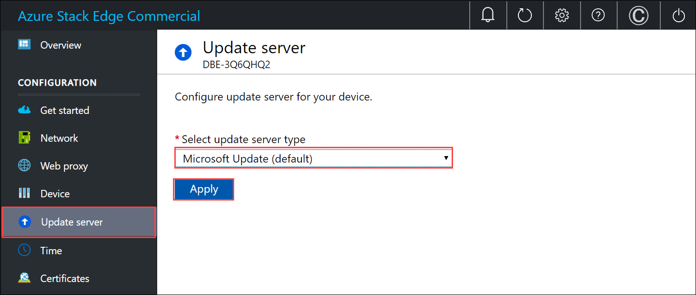-->

2. In **Select update server type**, from the dropdown list, choose from Microsoft Update server (default) or Windows Server Update Services.  
   
    If updating from the Windows Server Update Services, specify the server URI. The server at that URI will deploy the updates on all the devices connected to this server.

    <!--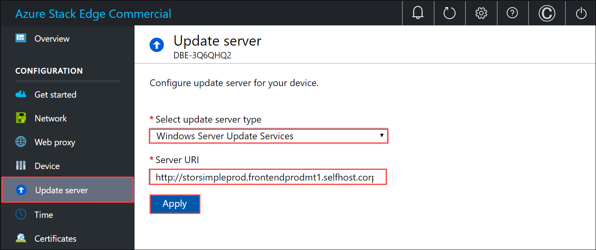-->
    
    The WSUS server is used to manage and distribute updates through a management console. A WSUS server can also be the update source for other WSUS servers within the organization. The WSUS server that acts as an update source is called an upstream server. In a WSUS implementation, at least one WSUS server on your network must be able to connect to Microsoft Update to get available update information. As an administrator, you can determine - based on network security and configuration - how many other WSUS servers connect directly to Microsoft Update.
    
    For more information, go to [Windows Server Update Services (WSUS)](/windows-server/administration/windows-server-update-services/get-started/windows-server-update-services-wsus)

## Use the Azure portal

We recommend that you install updates through the Azure portal. The device automatically scans for updates once a day. Once the updates are available, you see a notification in the portal. You can then download and install the updates.

> [!NOTE]
> - Make sure that the device is healthy and status shows as **Your device is running fine!** before you proceed to install the updates.

Depending on the software version that you are running, install process may differ slightly. 

- If you are updating from 2106 to 2110 or later, you will have a one-click install. See the **version 2106 and later** tab for instructions.
- If you are updating to versions prior to 2110, you will have a two-click install. See **version 2105 and earlier** tab for instructions.

### [version 2106 and later](#tab/version-2106-and-later)

[!INCLUDE [azure-stack-edge-install-2110-updates](../../includes/azure-stack-edge-install-2110-updates.md)]

### [version 2105 and earlier](#tab/version-2105-and-earlier)

1. When the updates are available for your device, you see a notification in the **Overview** page of your Azure Stack Edge resource. Select the notification or from the top command bar, **Update device**. This will allow you to apply device software updates.

    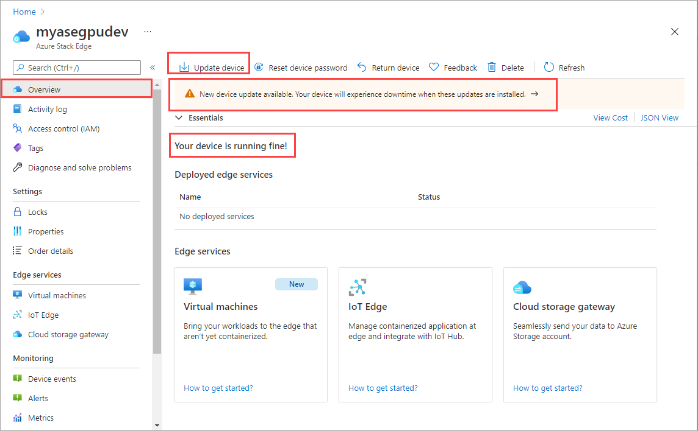

2. In the **Device updates** blade, check that you have reviewed the license terms associated with new features in the release notes.

    You can choose to **Download and install** the updates or just **Download** the updates. You can then choose to install these updates later.

    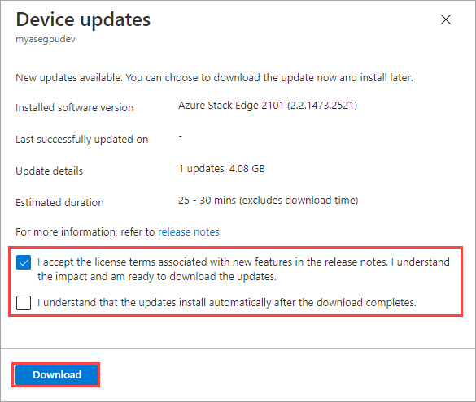    

    If you want to download and install the updates, check the option that updates install automatically after the download completes.

    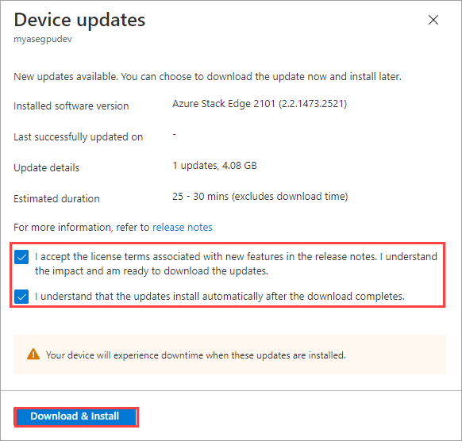

3. The download of updates starts. You see a notification that the download is in progress.

    

    A notification banner is also displayed in the Azure portal. This indicates the download progress.

    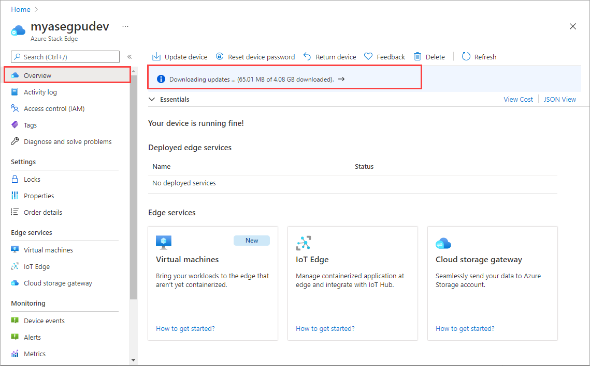

    You can select this notification or select **Update device** to see the detailed status of the update.

    

4. After the download is complete, the notification banner updates to indicate the completion. If you chose to download and install the updates, the installation will begin automatically.

    If you chose to download updates only, then select the notification to open the **Device updates** blade. Select **Install**.
  
5. You see a notification that the install is in progress. The portal also displays an informational alert to indicate that the install is in progress. The device goes offline and is in maintenance mode.
   
    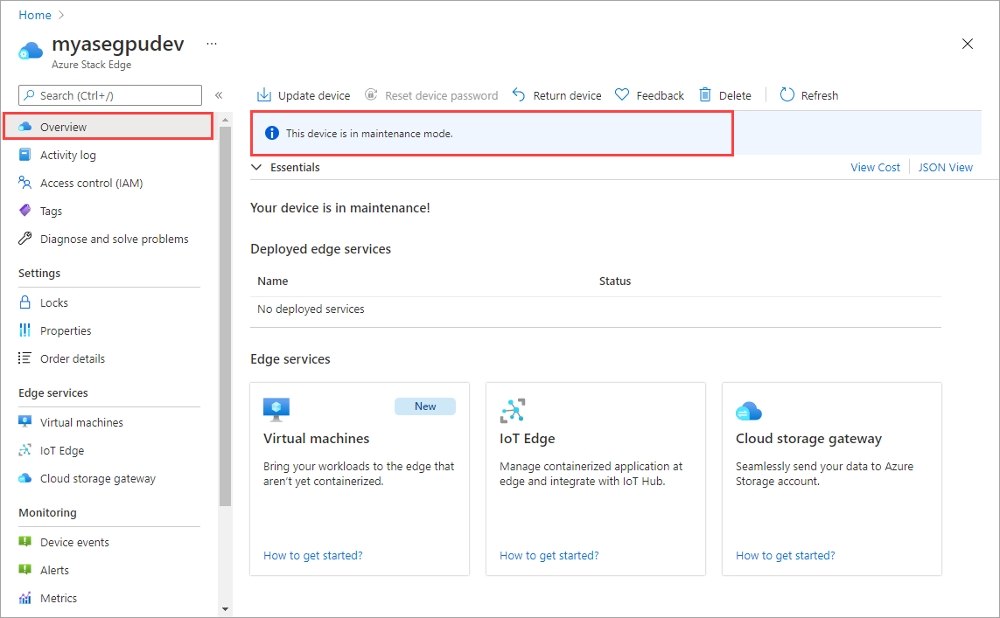

6. As this is a 1-node device, the device restarts after the updates are installed. The critical alert during the restart indicates that the device heartbeat is lost.

    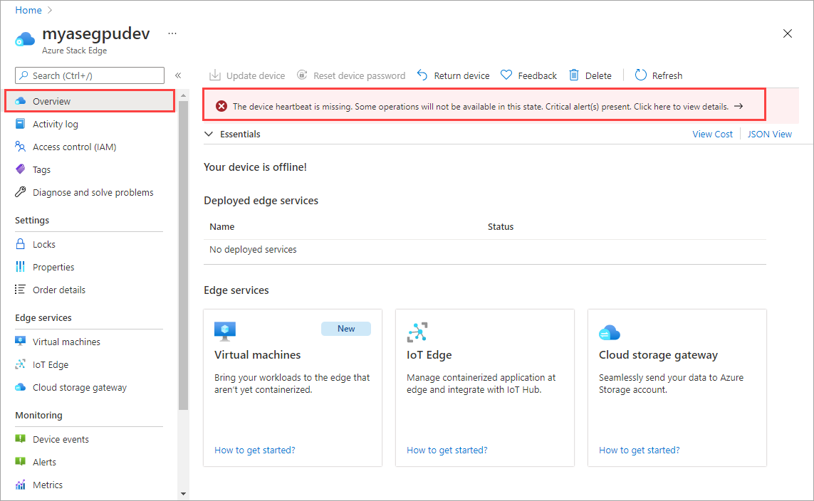

    Select the alert to see the corresponding device event.
    
    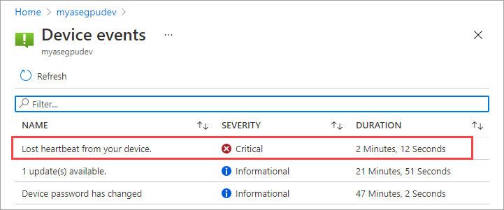

7. After the restart, the device software will finish updating. After the update is complete, you can verify from the local web UI that the device software is updated. The Kubernetes software version has not been updated.

    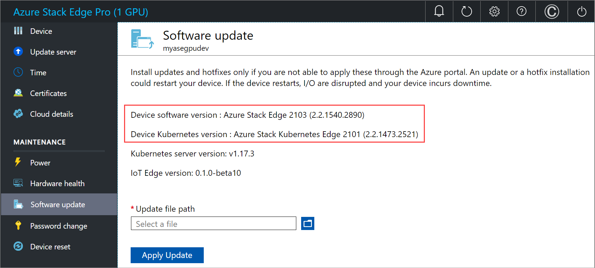

8. You will see a notification banner indicating that device updates are available. Select this banner to start updating the Kubernetes software on your device. 

    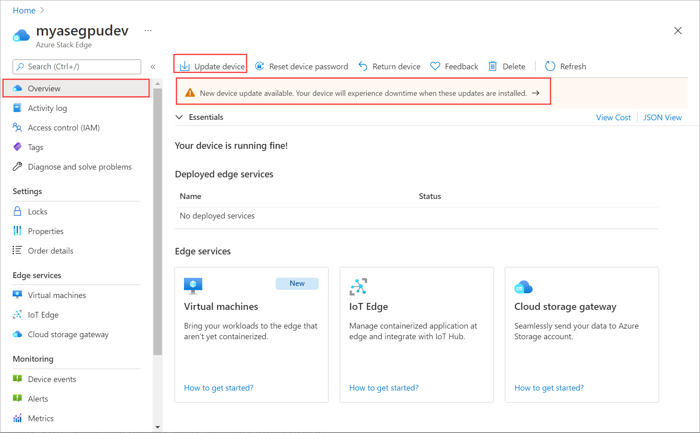 

    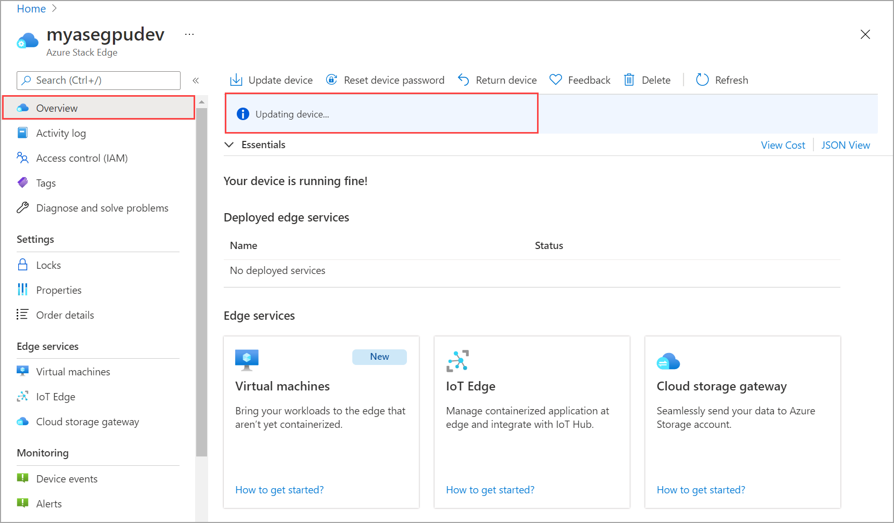 

    If you select the **Update device** from the top command bar, you can see the progress of the updates.  

    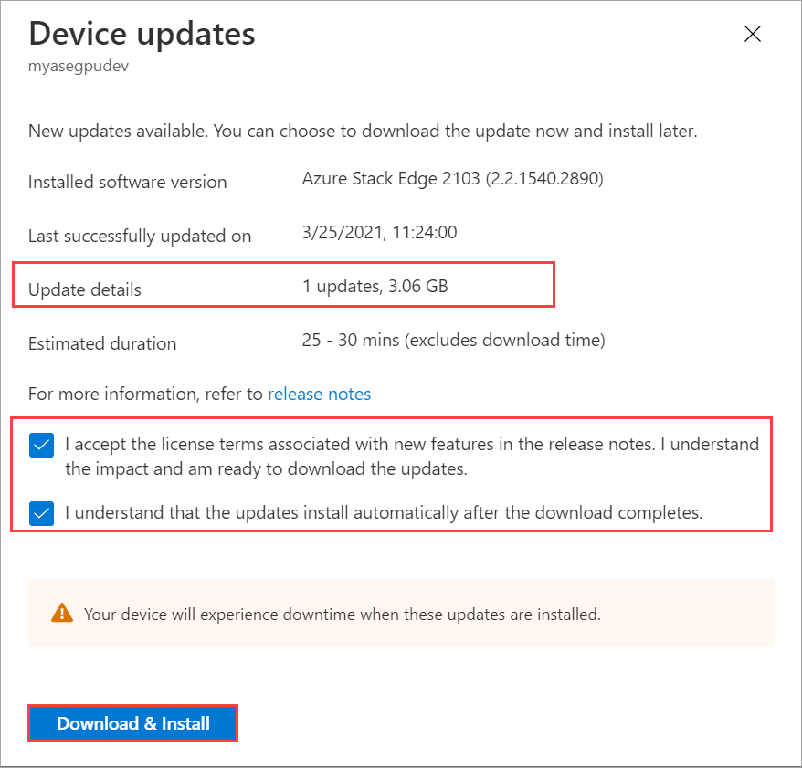 

8. The device status updates to **Your device is running fine** after the updates are installed. 

    

    Go to the local web UI and then go to **Software update** page. Verify that the Kubernetes update has successfully installed and the software version reflects that.

    

Once the device software and Kubernetes updates are successfully installed, the banner notification disappears. 

---

Your device now has the latest version of device software and Kubernetes.

## Use the local web UI

There are two steps when using the local web UI:

* Download the update or the hotfix
* Install the update or the hotfix

Each of these steps is described in detail in the following sections.

### Download the update or the hotfix

Perform the following steps to download the update. You can download the update from the Microsoft-supplied location or from the Microsoft Update Catalog.

Do the following steps to download the update from the Microsoft Update Catalog.

1. Start the browser and navigate to [https://catalog.update.microsoft.com](https://catalog.update.microsoft.com).

    

2. In the search box of the Microsoft Update Catalog, enter the Knowledge Base (KB) number of the hotfix or terms for the update you want to download. For example, enter **Azure Stack Edge**, and then click **Search**.
   
    The update listing appears as **Azure Stack Edge Update 2202**.
   
    <!---->

4. Select **Download**. There are two packages to download for the update. The first package will have two files for the device software updates (*SoftwareUpdatePackage.0.exe*, *SoftwareUpdatePackage.1.exe*) and the second package has two files for the Kubernetes updates (*Kubernetes_Package.0.exe*, *Kubernetes_Package.1.exe*), respectively. Download the packages to a folder on the local system. You can also copy the folder to a network share that is reachable from the device. 

### Install the update or the hotfix

Prior to the update or hotfix installation, make sure that:

 - You have the update or the hotfix downloaded either locally on your host or accessible via a network share.
 - Your device status is healthy as shown in the **Overview** page of the local web UI.

   

This procedure takes around 20 minutes to complete. Perform the following steps to install the update or hotfix.

1. In the local web UI, go to **Maintenance** > **Software update**. Make a note of the software version that you are running. 
   
   

2. Provide the path to the update file. You can also browse to the update installation file if placed on a network share. Select the two software files (with *SoftwareUpdatePackage.0.exe* and *SoftwareUpdatePackage.1.exe* suffix) together.

   

3. Select **Apply update**.

   <!---->

4. When prompted for confirmation, select **Yes** to proceed. Given the device is a single node device, after the update is applied, the device restarts and there is downtime. 
   
   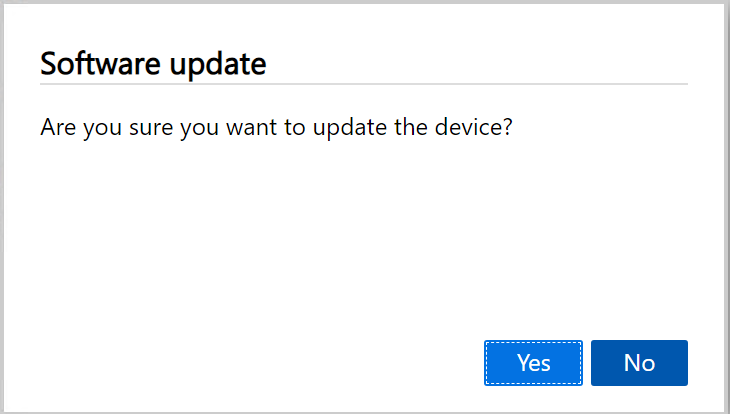

5. The update starts. After the device is successfully updated, it restarts. The local UI is not accessible in this duration.
   
6. After the restart is complete, you are taken to the **Sign in** page. To verify that the device software has been updated, in the local web UI, go to **Maintenance** > **Software update**. For the current release, the displayed software version should be **Azure Stack Edge 2202**. 

7. You will now update the Kubernetes software version. Select the remaining two Kubernetes files together (file with the *Kubernetes_Package.0.exe* and *Kubernetes_Package.1.exe* suffix) and repeat the above steps to apply update.   

   

8. Select **Apply Update**.

   <!--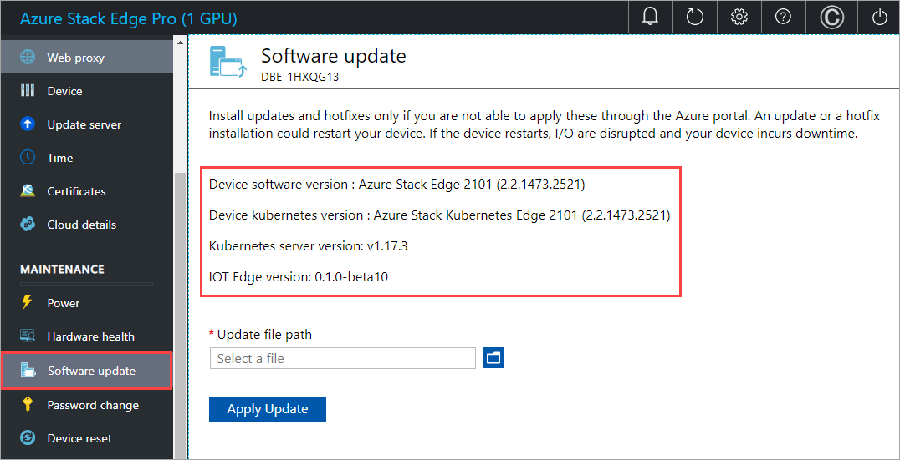-->

9. When prompted for confirmation, select **Yes** to proceed.

10. After the Kubernetes update is successfully installed, there is no change to the displayed software in **Maintenance** > **Software update**.

    

## Next steps

Learn more about [administering your Azure Stack Edge Pro](azure-stack-edge-manage-access-power-connectivity-mode.md).
