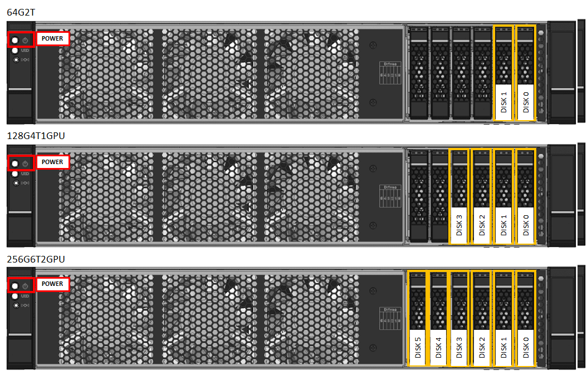
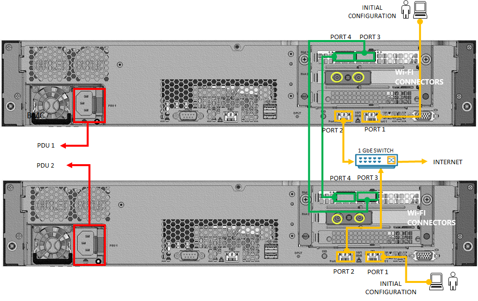
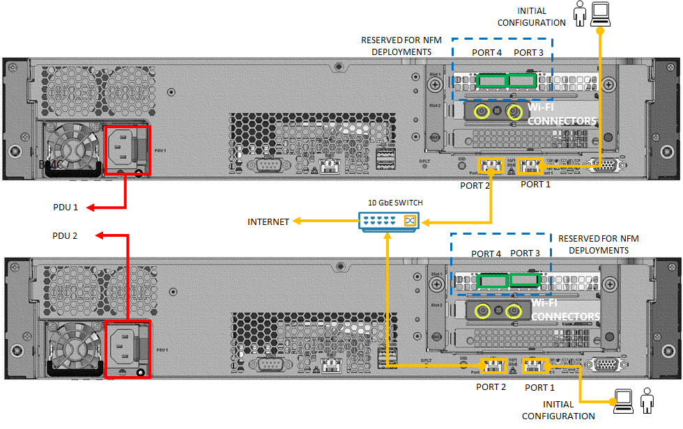

# Tutorial: Install Azure Stack Edge Pro 2

::: zone pivot="single-node"

This tutorial describes how to install an Azure Stack Edge Pro 2 physical device. The installation procedure involves unpacking, rack mounting, and cabling the device. 

The installation can take around two hours to complete.

::: zone-end

::: zone pivot="two-node"

This tutorial describes how to install a two-node Azure Stack Edge Pro 2 device cluster. The installation procedure involves unpacking, rack mounting, and cabling the device. 

The installation can take around 2.5 to 3 hours to complete.

::: zone-end

In this tutorial, you learn how to:

> [!div class="checklist"]
> * Unpack the device
> * Rack mount the device
> * Cable the device

## Prerequisites

The prerequisites for installing a physical device as follows:

### For the Azure Stack Edge resource

Before you begin, make sure that:

* You've completed all the steps in [Prepare to deploy Azure Stack Edge Pro 2](azure-stack-edge-pro-2-deploy-prep.md).
    * You've created an Azure Stack Edge resource to deploy your device.
    * You've generated the activation key to activate your device with the Azure Stack Edge resource.

 
### For the Azure Stack Edge Pro 2 physical device

Before you deploy a device:

- Make sure that the device rests safely on a flat, stable, and level work surface.
- Verify that the site where you intend to set up has:
    - Standard AC power from an independent source.

        -OR-
    - A power distribution unit (PDU) with an uninterruptible power supply (UPS).
    - An available 2U slot on the rack on which you intend to mount the device. If you wish to wall mount your device, you should have a space identified on the wall or a desk where you intend to mount the device.

### For the network in the datacenter

Before you begin:

- Review the networking requirements for deploying Azure Stack Edge Pro 2, and configure the datacenter network per the requirements. For more information, see [Azure Stack Edge Pro 2 networking requirements](azure-stack-edge-system-requirements.md#networking-port-requirements).

- Make sure that the minimum Internet bandwidth is 20 Mbps for optimal functioning of the device.

## Unpack the device

::: zone pivot="single-node"

This device is shipped in a single box. Complete the following steps to unpack your device. 

1. Place the box on a flat, level surface.
2. Inspect the box and the packaging foam for crushes, cuts, water damage, or any other obvious damage. If the box or packaging is severely damaged, don't open it. Contact Microsoft Support to help you assess whether the device is in good working order.
3. Unpack the box. After unpacking the box, make sure that you have:
    - One single enclosure Azure Stack Edge Pro 2 device.
    - One power cord.
    - One packaged bezel.
    - A pair of packaged Wi-Fi antennas in the accessory box.
    - One packaged mounting accessory which could be:
        - A 4-post rack slide rail, or
        - A 2-post rack slide, or 
        - A wall mount (may be packaged separately).
    - A safety, environmental, and regulatory information booklet.

::: zone-end

::: zone pivot="two-node"

This device is shipped in two boxes. Complete the following steps to unpack your device. 

1. Place the box on a flat, level surface.
2. Inspect the box and the packaging foam for crushes, cuts, water damage, or any other obvious damage. If the box or packaging is severely damaged, don't open it. Contact Microsoft Support to help you assess whether the device is in good working order.
3. Unpack the box. After unpacking the box, make sure that you have the following in each box:
    - One single enclosure Azure Stack Edge Pro 2 device.
    - One power cord.
    - One packaged bezel.
    - A pair of packaged Wi-Fi antennas in the accessory box.
    - One packaged mounting accessory which could be:
        - A 4-post rack slide rail, or
        - A 2-post rack slide, or 
        - A wall mount (may be packaged separately).
    - A safety, environmental, and regulatory information booklet.

::: zone-end
    
If you didn't receive all of the items listed here, [Contact Microsoft Support](azure-stack-edge-contact-microsoft-support.md). The next step is to mount your device on a rack or wall. 

## Rack mount the device

The device can be mounted using one of the following mounting accessory: 

- A 4-post rackmount.
- A 2-post rackmount. 
- A wallmount.

If you have received  4-post rackmount, use the following procedure to rack mount your device. For other mounting accessories, see [Racking using a 2-post rackmount](azure-stack-edge-pro-2-two-post-rack-mounting.md) or [Mounting the device on the wall](azure-stack-edge-pro-2-wall-mount.md).

If you decide not to mount your device, you can also place it on a desk or a shelf.

### Prerequisites

- Before you begin, make sure to read the [Safety instructions](azure-stack-edge-pro-2-safety.md) for your device.
- Begin installing the rails in the allotted space that is closest to the bottom of the rack enclosure.
- For the rail mounting configuration:
    -  You need to use 10L M5 screws. Make sure that these are included in your rail kit.
    -  You need a Phillips head screwdriver.

### Identify the rail kit contents

Locate the components for installing the rail kit assembly:
- Inner rails.
- Chassis of your device.
- 10L M5 screws.

### Install rails 

1. Remove the inner rail. 

    :::image type="content" source="media/azure-stack-edge-pro-2-deploy-install/4-post-remove-inner-rail.png" alt-text="Diagram showing how to remove inner rail.":::

1. Push and slide the middle rail back. 

    :::image type="content" source="media/azure-stack-edge-pro-2-deploy-install/4-post-push-middle-rail.png" alt-text="Diagram showing how to push and slide the middle rail.":::

1. Install the inner rail onto the chassis. **Make sure to fasten the inner rail screw.**

    :::image type="content" source="media/azure-stack-edge-pro-2-deploy-install/4-post-install-inner-rail-onto-chassis.png" alt-text="Diagram showing how to install inner rail onto the device chassis using a 4-post rackmount accessory.":::

3. Fix the outer rail and the bracket assembly to the frame. Ensure the latch is fully engaged with the rack post.

    :::image type="content" source="media/azure-stack-edge-pro-2-deploy-install/4-post-detach-bracket-1.png" alt-text="Diagram showing how to fix the outer rail.":::

    :::image type="content" source="media/azure-stack-edge-pro-2-deploy-install/4-post-front-rear-bracket.png" alt-text="Diagram showing the front and rear bracket.":::

4. Insert the chassis to complete the installation. 

    1. Pull the middle rail so that it is fully extended in lock position. Ensure the ball bearing retainer is located at the front of the middle rail (reference diagrams 1 and 2).
    1. Insert the chassis into the middle rail (reference diagram 3).
    1. Once you hit a stop, pull and push the blue release tab on the inner rails (reference diagram 4).
    1. Tighten the M5 screws of the chassis to the rail once the server is seated (reference diagram 5). 

    :::image type="content" source="media/azure-stack-edge-pro-2-deploy-install/4-post-insert-chassis-new.png" alt-text="Diagram showing how to insert the chassis.":::

::: zone pivot="two-node"

If deploying a two-node device cluster, make sure to mount both the devices on the rack or the wall.

::: zone-end

### Install the bezel

After the device is mounted on a rack, install the bezel on the device. Bezel serves as the protective face plate for the device.

1. Locate two fixed pins on the right side of the bezel, and two spring-loaded pins on the left side of the bezel. 
2. Insert the bezel in at an angle with fixed pins going into holes in right rack ear.
3. Push `[>` shaped latch to the right, move left side of bezel into place, then release the latch until the spring pins engage with holes in left rack ear. 

    

4. Lock the bezel in place using the provided security key. 

    

 
## Cable the device

The following procedures explain how to cable your Azure Stack Edge Pro 2 device for power and network.

### Cabling checklist

::: zone pivot="single-node"

Before you start cabling your device, you need the following things:

- Your Azure Stack Edge Pro 2 physical device, unpacked, and rack mounted.
- One power cable (included in the device package).
- At least one 1-GbE RJ-45 network cable to connect to the Port 1. Port 1 and Port 2 the two 10/1-GbE network interfaces on your device.
- One 100-GbE QSFP28 passive direct attached cable (tested in-house) for each data network interface Port 3 and Port 4 to be configured. Here is an example of the QSFP28 DAC connector: 

    

    For a full list of supported cables, modules, and switches, see [Connect-X6 DX adapter card compatible firmware](https://docs.nvidia.com/networking/display/ConnectX6DxFirmwarev22271016/Firmware+Compatible+Products). 
- Access to one power distribution unit.
- At least one 100-GbE network switch to connect a 10/1-GbE or a 100-GbE network interface to the internet for data. At least one data network interface from among Port 2, Port 3, and Port 4 needs to be connected to the Internet (with connectivity to Azure).
- A pair of Wi-Fi antennas (included in the accessory box).

::: zone-end

::: zone pivot="two-node"

Before you start cabling your device, you need the following things:

- Your two Azure Stack Edge Pro 2 physical devices, unpacked, and rack mounted.
- One power cable for each device node (included in the device package).
- Access to one power distribution unit for each device node.
- At least two 1-GbE RJ-45 network cable per device to connect to Port 1 and Port2. These are the two 10/1-GbE network interfaces on your device. 
- A 100-GbE QSFP28 passive direct attached cable (tested in-house) for each data network interface Port 3 and Port 4 to be configured on each device. The total number needed would depend on the network topology you will deploy. Here is an example QSFP28 DAC connector: 

    

    For a full list of supported cables, modules, and switches, see [Connect-X6 DX adapter card compatible firmware](https://docs.nvidia.com/networking/display/ConnectX6DxFirmwarev22271016/Firmware+Compatible+Products). 
- At least one 100-GbE network switch to connect a 1-GbE or a 100-GbE network interface to the internet for data for each device.
- A pair of Wi-Fi antennas (included in the accessory box).
 
::: zone-end

> [!NOTE]
> The Azure Stack Edge Pro 2 device should be connected to the datacenter network so that it can ingest data from data source servers.

### Device front panel

The front panel on Azure Stack Edge Pro 2 device:

- The front panel has disk drives and a power button.

    - Has six disk slots in the front of your device.
    - Slots 0 to Slot 3 contain data disks. Slots 4 and 5 are empty.

    

### Device back plane

- The back plane of Azure Stack Edge Pro 2 device has:

    

    -  Four network interfaces:

        - Two 10/1-Gbps interfaces, Port 1 and Port 2.
        - Two 100-Gbps interfaces, PORT 3 and PORT 4.
    
    - A baseboard management controller (BMC).      

    - One network card corresponding to two high-speed ports and two built-in 10/1-GbE ports:

        - **Intel Ethernet X722 network adapter** - Port 1, Port 2.
        - **Mellanox dual port 100 GbE ConnectX-6 Dx network adapter** - Port 3, Port 4. See a full list of [Supported cables, switches, and transceivers for ConnectX-6 Dx network adapters](https://docs.nvidia.com/networking/display/ConnectX6DxFirmwarev22271016/Firmware+Compatible+Products).
        
    - Two Wi-Fi Sub miniature version A (SMA) connectors located on the faceplate of PCIe card slot located below Port 3 and Port 4. The Wi-Fi antennas are installed on these connectors.
    
    

### Power cabling

::: zone pivot="single-node"

Follow these steps to cable your device for power:
 
1. Identify the various ports on the back plane of your device. 
1. Locate the disk slots and the power button on the front of the device.
1. Connect the power cord to the PSU in the enclosure. 
1. Attach the power cord to the power distribution unit (PDU). 
1. Press the power button to turn on the device.

::: zone-end

::: zone pivot="two-node"

Follow these steps to cable your device for power:

1. Identify the various ports on the back plane of each device. 
1. Locate the disk slots and the power button on the front of each device.
1. Connect the power cord to the PSU in each device enclosure. 
1. Attach the power cords from the two devices to two different power distribution units (PDU). 
1. Press the power buttons on the front panels to turn on both the devices.

::: zone-end

### Wi-Fi antenna installation

Follow these steps to install Wi-Fi antennas on your device: 

1. Locate the two Wi-Fi SMA RF threaded connectors on the back plane of the device. These gold-colored connectors are located on the faceplate of PCIe card slot, right below Port 3 and Port 4.

1. Use a clockwise motion to thread the antennas onto the SMA connectors. Secure them using only your fingers. Do not use a tool or wrench.

    >[!NOTE]
    > Tighten the connectors sufficiently so that the antenna's rotary joints can turn without causing the threaded connectors to become loose.

1. To position the antennas as desired, articulate the hinge and turn the rotary joint.

### Network cabling

::: zone pivot="single-node"

Follow these steps to cable your device for network:

1. Connect the 10/1-GbE network interface Port 1 to the computer that's used to configure the physical device. Port 1 is used for the initial configuration of the device.
    
    > [!NOTE]
    > If connecting the computer directly to your device (without going through a switch), use a crossover cable or a USB Ethernet adapter.

1. Connect one or more of Port 2, Port 3, Port 4 to the datacenter network/internet.

    - If connecting Port 2, use the 1-GbE RJ-45 network cable.
    - For the 100-GbE network interfaces, use the QSFP28 passive direct attached cable (tested in-house).
    
    The back plane of a cabled device would be as follows: 

    

::: zone-end

::: zone pivot="two-node"

The two-node device can be configured in the following different ways:

- Without switches
- Using external switches

Each of these configurations is described in the following sections. For more information on when to use these configurations, see [Supported network topologies](azure-stack-edge-gpu-clustering-overview.md).

#### Switchless

This configuration is used when high speed switches are not available.

Cable your device as shown in the following diagram:

1. Connect Port 1 on each node to a computer using a crossover cable or a USB Ethernet adapter for the initial configuration of the device.
1. Connect Port 2 on each node to a 1-GbE switch via a 1-GbE RJ-45 network cable. If available, a 10-GbE switch can also be used. 
1. Connect Port 3 on one device directly (without a switch) to the Port 3 on the other device node. Use a QSFP28 passive direct attached cable (tested in-house) for the connection.
1. Connect Port 4 on one device directly (without a switch) to the Port 4 on the other device node. Use a QSFP28 passive direct attached cable (tested in-house) for the connection. 

#### Using external switches

This configuration is used for Network Function Manager (NFM) workload deployments and requires 10-GbE high speed switches.

Cable your device as shown in the following diagram:

1. Connect Port 1 on each node to a computer using a crossover cable or a USB Ethernet adapter for the initial configuration of the device.
1. Connect Port 2 on each node to a 10-GbE high-speed switch via a 10-GbE RJ-45 network cable. A high speed switch must be used.
1. Port 3 and Port 4 are reserved for NFM workload deployments and must be connected accordingly.

::: zone-end

## Next steps

In this tutorial, you learned how to:

> [!div class="checklist"]
> * Unpack the device
> * Rack the device
> * Cable the device

Advance to the next tutorial to learn how to connect to your device.

> [!div class="nextstepaction"]
> [Connect Azure Stack Edge Pro 2](./azure-stack-edge-pro-2-deploy-connect.md)

