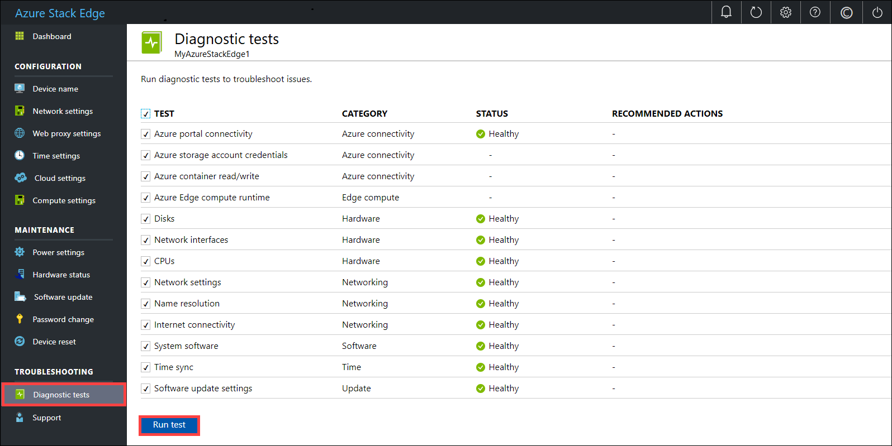
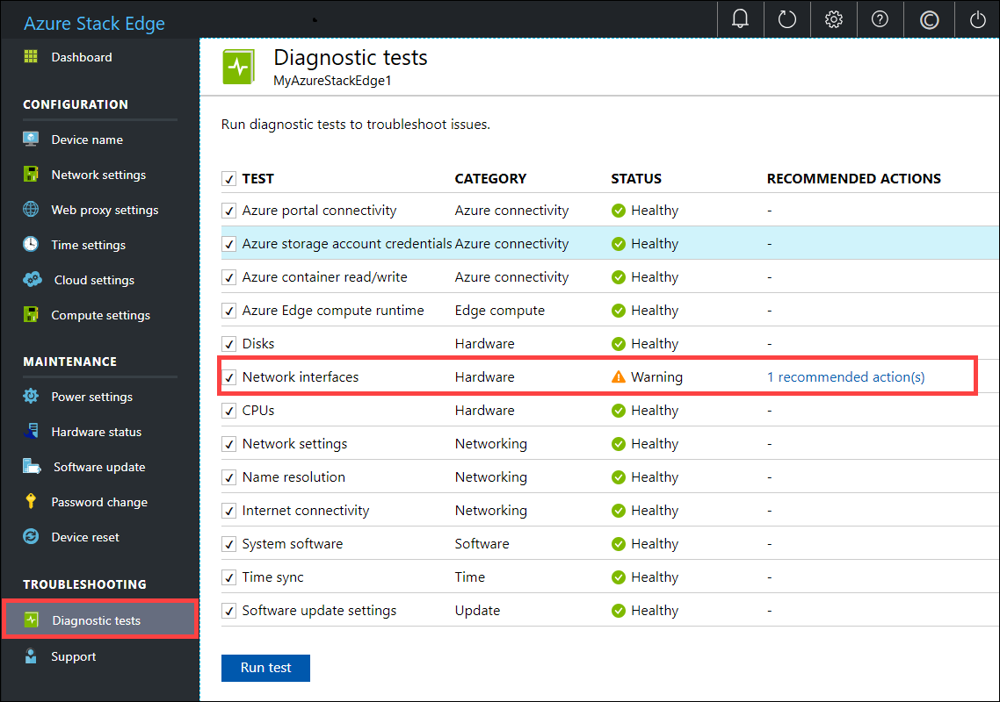
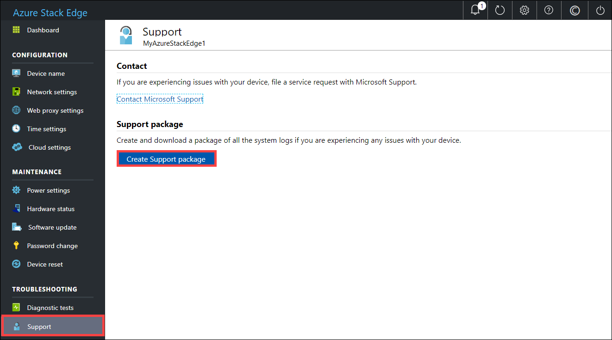
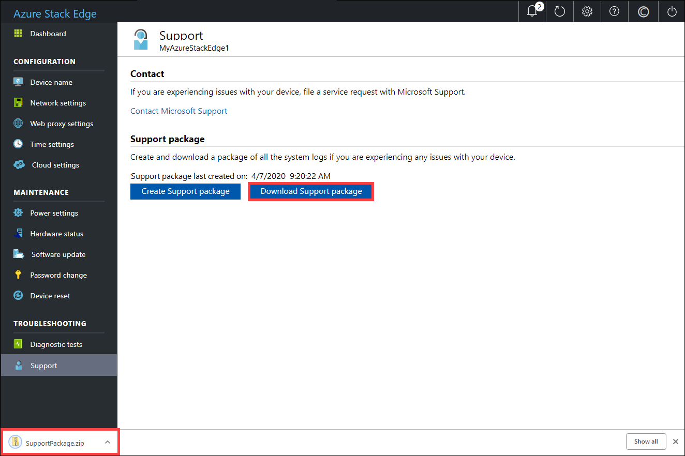
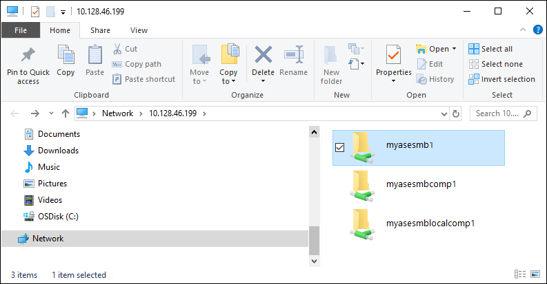

# Troubleshoot your Azure Stack Edge Pro FPGA issues

This article describes how to troubleshoot issues on your Azure Stack Edge Pro FPGA. 

In this article, you learn how to:

> [!div class="checklist"]
>
> * Run diagnostics
> * Collect Support package
> * Use logs to troubleshoot
> * Troubleshoot IoT Edge errors

## Run diagnostics

To diagnose and troubleshoot any device errors, you can run the diagnostics tests. Do the following steps in the local web UI of your device to run diagnostic tests.

1. In the local web UI, go to **Troubleshooting > Diagnostic tests**. Select the test you want to run and select **Run test**. This runs the tests to diagnose any possible issues with your network, device, web proxy, time, or cloud settings. You're notified that the device is running tests.

    

2. After the tests have completed, the results are displayed.

    

    If a test fails, then a URL for recommended action is presented. Select the URL to view the recommended action.

    

## Collect Support package

A log package is composed of all the relevant logs that can help Microsoft Support troubleshoot any device issues. You can generate a log package via the local web UI.

Do the following steps to collect a Support package.

1. In the local web UI, go to **Troubleshooting > Support**. Select **Create support package**. The system starts collecting support package. The package collection may take several minutes.

    

2. After the Support package is created, select **Download Support package**. A zipped package is downloaded on the path you chose. You can unzip the package and the view the system log files.

    

## Use logs to troubleshoot

Any errors experienced during the upload and refresh processes are included in the respective error files.

1. To view the error files, go to your share and select it to view the contents. 

      

2. Select the _Microsoft Azure Stack Edge folder_. This folder has two subfolders:

    * Upload folder that has log files for upload errors.
    * Refresh folder for errors during refresh.

    Here is a sample log file for refresh.

    ```xml
    <root container="test1" machine="VM15BS020663" timestamp="03/18/2019 00:11:10" />
    <file item="test.txt" local="False" remote="True" error="16001" />
    <summary runtime="00:00:00.0945320" errors="1" creates="2" deletes="0" insync="3" replaces="0" pending="9" />
    ```

3. When you see an error in this file (highlighted in the sample), note down the error code, in this case it's 16001. Look up the description of this error code against the following error reference.

    [!INCLUDE [data-box-edge-edge-upload-error-reference](../../includes/data-box-edge-gateway-upload-error-reference.md)]

## Troubleshoot IoT Edge errors

[!INCLUDE [Troubleshoot IoT Edge runtime](../../includes/azure-stack-edge-iot-troubleshoot-compute.md)]

## Next steps

* Learn more about the [known issues in this release](../databox-gateway/data-box-gateway-release-notes.md).