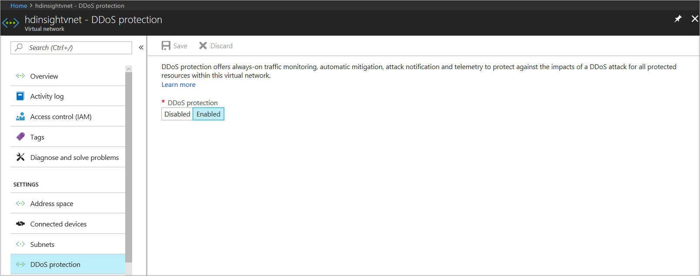

# DDoS Protection reference architectures

DDoS Protection Standard is designed [for services that are deployed in a virtual network](../virtual-network/virtual-network-for-azure-services.md). For other services, the default DDoS Protection Basic service applies. The following reference architectures are arranged by scenarios, with architecture patterns grouped together.

> [!NOTE]
> Protected resources include public IPs attached to an IaaS VM, Load Balancer (Classic & Standard Load Balancers), Application Gateway (including WAF) cluster, Firewall, Bastion, VPN Gateway, Service Fabric or an IaaS based Network Virtual Appliance (NVA). PaaS services (multitenant) are not supported at present. This includes Azure App Service Environment for PowerApps or API management in a virtual network with a public IP.

## Virtual machine (Windows/Linux) workloads

### Application running on load-balanced VMs

This reference architecture shows a set of proven practices for running multiple Windows VMs in a scale set behind a load balancer, to improve availability and scalability. This architecture can be used for any stateless workload, such as a web server.

In this architecture, a workload is distributed across multiple VM instances. There is a single public IP address, and internet traffic is distributed to the VMs through a load balancer. DDoS Protection Standard is enabled on the virtual network of the Azure (internet) load balancer that has the public IP associated with it.

The load balancer distributes incoming internet requests to the VM instances. Virtual machine scale sets allow the number of VMs to be scaled in or out manually, or automatically based on predefined rules. This is important if the resource is under DDoS attack. For more information on this reference architecture, see
[this article](/azure/architecture/reference-architectures/virtual-machines-windows/multi-vm).

### Application running on Windows N-tier

There are many ways to implement an N-tier architecture. The following diagram shows a typical three-tier web application. This architecture builds on the article [Run load-balanced VMs for scalability and availability](/azure/architecture/reference-architectures/virtual-machines-windows/multi-vm). The web and business tiers use load-balanced VMs.

In this architecture, DDoS Protection Standard is enabled on the virtual network. All public IPs in the virtual network get DDoS protection for Layer 3 and 4. For Layer 7 protection, deploy Application Gateway in the WAF SKU. For more information on this reference architecture, see 
[this article](/azure/architecture/reference-architectures/virtual-machines-windows/n-tier).

> [!NOTE]
> Scenarios in which a single VM is running behind a public IP are not supported.

### PaaS web application

This reference architecture shows running an Azure App Service application in a single region. This architecture shows a set of proven practices for a web application that uses [Azure App Service](https://azure.microsoft.com/documentation/services/app-service/) and [Azure SQL Database](https://azure.microsoft.com/documentation/services/sql-database/).
A standby region is set up for failover scenarios.

Azure Traffic Manager routes incoming requests to Application Gateway in one of the regions. During normal operations, it routes requests to Application Gateway in the active region. If that region becomes unavailable, Traffic Manager fails over to Application Gateway in the standby region.

All traffic from the internet destined to the web application is routed to the [Application Gateway public IP address](../application-gateway/application-gateway-web-app-overview.md) via Traffic Manager. In this scenario, the app service (web app) itself is not directly externally facing and is protected by Application Gateway. 

We recommend that you configure the Application Gateway WAF SKU (prevent mode) to help protect against Layer 7 (HTTP/HTTPS/WebSocket) attacks. Additionally, web apps are configured to [accept only traffic from the Application Gateway](https://azure.microsoft.com/blog/ip-and-domain-restrictions-for-windows-azure-web-sites/) IP address.

For more information about this reference architecture, see [this article](/azure/architecture/reference-architectures/app-service-web-app/multi-region).

## Mitigation for non-web PaaS services

### HDInsight on Azure

This reference architecture shows configuring DDoS Protection Standard for an [Azure HDInsight cluster](../hdinsight/index.yml). Make sure that the HDInsight cluster is linked to a virtual network and that DDoS Protection is enabled on the virtual network.

In this architecture, traffic destined to the HDInsight cluster from the internet is routed to the public IP associated with the HDInsight gateway load balancer. The gateway load balancer then sends the traffic to the head nodes or the worker nodes directly. Because DDoS Protection Standard is enabled on the HDInsight virtual network, all public IPs in the virtual network get DDoS protection for Layer 3 and 4. This reference architecture can be combined with the N-Tier and multi-region reference architectures.

For more information on this reference architecture, see the [Extend Azure HDInsight using an Azure Virtual Network](../hdinsight/hdinsight-plan-virtual-network-deployment.md?toc=%2fazure%2fvirtual-network%2ftoc.json)
documentation.

## Next steps

- Learn how to [create a DDoS protection plan](manage-ddos-protection.md).
