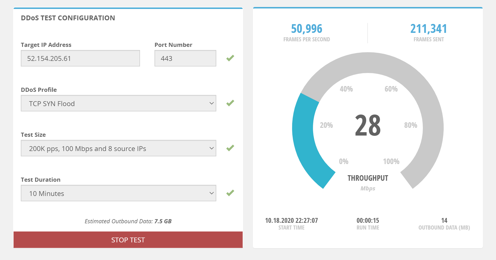

# Test through simulations

It’s a good practice to test your assumptions about how your services will respond to an attack by conducting periodic simulations. During testing, validate that your services or applications continue to function as expected and there’s no disruption to the user experience. Identify gaps from both a technology and process standpoint and incorporate them in the DDoS response strategy. We recommend that you perform such tests in staging environments or during non-peak hours to minimize the impact to the production environment.

We have partnered with [BreakingPoint Cloud](https://www.ixiacom.com/products/breakingpoint-cloud), a self-service traffic generator, to build an interface where Azure customers can generate traffic against DDoS Protection-enabled public endpoints for simulations. You can use the simulation to:

- Validate how Azure DDoS Protection helps protect your Azure resources from DDoS attacks.
- Optimize your incident response process while under DDoS attack.
- Document DDoS compliance.
- Train your network security teams.

## Prerequisites

- Before you can complete the steps in this tutorial, you must first create a [Azure DDoS Standard protection plan](manage-ddos-protection.md) with protected public IP addresses.
- You must first create an account with [BreakingPoint Cloud](http://breakingpoint.cloud/). 

## Configure a DDoS test attack

1. Enter or select the following values, then select **Start test**:

    |Setting        |Value                                              |
    |---------      |---------                                          |
    |Target IP address           | Enter one of your public IP address you want to test.                     |
    |Port Number   | Enter _443_.                       |
    |DDoS Profile | Select **TCP SYN Flood**.|
    |Test Size       | Select **200K pps, 100 Mbps and 8 source IPs.**                                  |
    |Test Duration | Select **10 Minutes**.|

It should now appear like this:

## Monitor and validate

1. Log in to https://portal.azure.com and go to your subscription.
1. Select the Public IP address you tested the attack on.
1. Under **Monitoring**, select **Metrics**.
1. For **Metric**, select _Under DDoS attack or not_.

Once the resource is under attack, you should see that the value changes from **0** to **1**, like the following picture:

## Next steps

- Learn how to [view and configure DDoS protection telemetry](telemetry-monitoring-alerting.md).
- Learn how to [view and configure DDoS diagnostic logging](diagnostic-logging.md).
- Learn how to [engage DDoS rapid response](ddos-rapid-response.md).