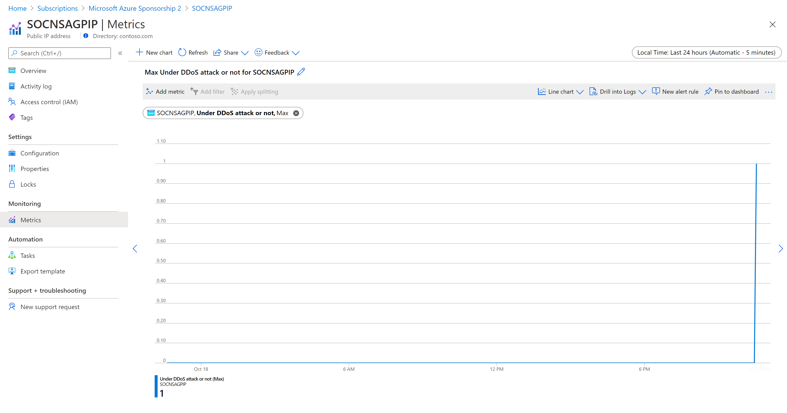
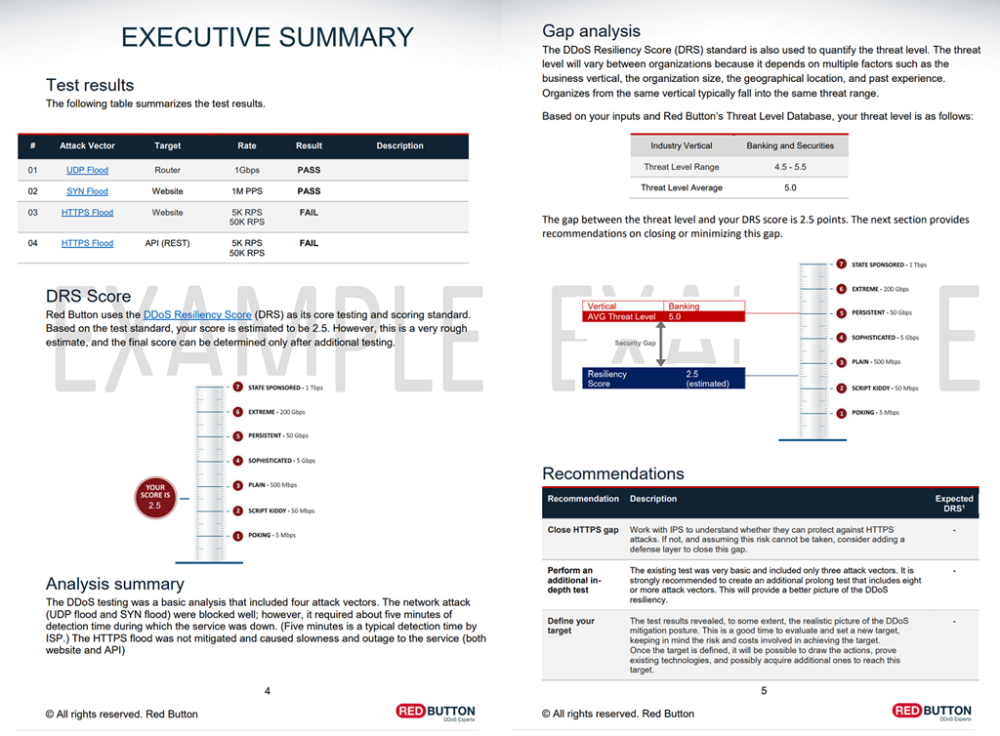

# Test with simulation partners

It’s a good practice to test your assumptions about how your services will respond to an attack by conducting periodic simulations. During testing, validate that your services or applications continue to function as expected and there’s no disruption to the user experience. Identify gaps from both a technology and process standpoint and incorporate them in the DDoS response strategy. We recommend that you perform such tests in staging environments or during non-peak hours to minimize the impact to the production environment.

Simulations help you:
- Validate how Azure DDoS Protection helps protect your Azure resources from DDoS attacks.
- Optimize your incident response process while under DDoS attack.
- Document DDoS compliance.
- Train your network security teams.

## Azure DDoS simulation testing policy

You may only simulate attacks using our approved testing partners:
- [BreakingPoint Cloud](https://www.ixiacom.com/products/breakingpoint-cloud): a self-service traffic generator where your customers can generate traffic against DDoS Protection-enabled public endpoints for simulations. 
- [Red Button](https://www.red-button.net/): work with a dedicated team of experts to simulate real-world DDoS attack scenarios in a controlled environment.
- [RedWolf](https://www.redwolfsecurity.com/services/#cloud-ddos) a self-service or guided DDoS testing provider with real-time control.

Our testing partners' simulation environments are built within Azure. You can only simulate against Azure-hosted public IP addresses that belong to an Azure subscription of your own, which will be validated by our partners before testing. Additionally, these target public IP addresses must be protected under Azure DDoS Protection. Simulation testing allows you to assess your current state of readiness, identify gaps in your incident response procedures, and guide you in developing a proper [DDoS response strategy](ddos-response-strategy.md). 

> [!NOTE]
> BreakingPoint Cloud and Red Button are only available for the Public cloud.

## Prerequisites

- Before you can complete the steps in this tutorial, you must first create a [Azure DDoS Protection plan](manage-ddos-protection.md) with protected public IP addresses.
- For BreakingPoint Cloud, you must first [create an account](https://www.ixiacom.com/products/breakingpoint-cloud). 

## BreakingPoint Cloud
### Configure a DDoS test attack

1. Enter or select the following values, then select **Start test**:

    |Setting        |Value                                              |
    |---------      |---------                                          |
    |Target IP address           | Enter one of your public IP address you want to test.                     |
    |Port Number   | Enter _443_.                       |
    |DDoS Profile | Possible values include `DNS Flood`, `NTPv2 Flood`, `SSDP Flood`, `TCP SYN Flood`, `UDP 64B Flood`, `UDP 128B Flood`, `UDP 256B Flood`, `UDP 512B Flood`, `UDP 1024B Flood`, `UDP 1514B Flood`, `UDP Fragmentation`, `UDP Memcached`.|
    |Test Size       | Possible values include `100K pps, 50 Mbps and 4 source IPs`, `200K pps, 100 Mbps and 8 source IPs`, `400K pps, 200Mbps and 16 source IPs`, `800K pps, 400 Mbps and 32 source IPs`.                                  |
    |Test Duration | Possible values include `10 Minutes`, `15 Minutes`, `20 Minutes`, `25 Minutes`, `30 Minutes`.|

It should now appear like this:

### Monitor and validate

1. Log in to https://portal.azure.com and go to your subscription.
1. Select the Public IP address you tested the attack on.
1. Under **Monitoring**, select **Metrics**.
1. For **Metric**, select _Under DDoS attack or not_.

Once the resource is under attack, you should see that the value changes from **0** to **1**, like the following picture:

### BreakingPoint Cloud API Script

This [API script](https://aka.ms/ddosbreakingpoint) can be used to automate DDoS testing by running once or using cron to schedule regular tests. This is useful to validate that your logging is configured properly and that detection and response procedures are effective. The scripts require a Linux OS (tested with Ubuntu 18.04 LTS) and Python 3. Install prerequisites and API client using the included script or by using the documentation on the [BreakingPoint Cloud](https://www.ixiacom.com/products/breakingpoint-cloud) website.

## Red Button

Red Button’s [DDoS Testing](https://www.red-button.net/ddos-testing/) service suite includes three stages:

1. **Planning session**: Red Button experts meet with your team to understand your network architecture, assemble technical details, and define clear goals and testing schedules. This includes planning the DDoS test scope and targets, attack vectors, and attack rates. The joint planning effort is detailed in a test plan document.
1. **Controlled DDoS attack**: Based on the defined goals, the Red Button team launches a combination of multi-vector DDoS attacks. The test typically lasts between three to six hours. Attacks are securely executed using dedicated servers and are controlled and monitored using Red Button’s management console.
1. **Summary and recommendations**: The Red Button team provides you with a written DDoS Test Report outlining the effectiveness of DDoS mitigation. The report includes an executive summary of the test results, a complete log of the simulation, a list of vulnerabilities within your infrastructure, and recommendations on how to correct them.

Here's an example of a [DDoS Test Report](https://www.red-button.net/wp-content/uploads/2021/06/DDoS-Test-Report-Example-with-Analysis.pdf) from Red Button:

In addition, Red Button offers two other service suites, [DDoS 360](https://www.red-button.net/prevent-ddos-attacks-with-ddos360/) and [DDoS Incident Response](https://www.red-button.net/ddos-incident-response/), that can complement the DDoS Testing service suite.

## RedWolf

RedWolf offers an easy-to-use testing system that is either self-serve or guided by RedWolf experts. RedWolf testing system allows customers to set up attack vectors. Customers can specify attack sizes with real-time control on settings to simulate real-world DDoS attack scenarios in a controlled environment.

RedWolf's [DDoS Testing](https://www.redwolfsecurity.com/services/) service suite includes:

   - **Attack Vectors**: Unique cloud attacks designed by RedWolf.
   - **Guided and self service**: Leverage RedWolf's team or run tests yourself.

## Next steps

- Learn how to [view and configure DDoS protection telemetry](telemetry.md).
- Learn how to [view and configure DDoS diagnostic logging](diagnostic-logging.md).
- Learn how to [engage DDoS rapid response](ddos-rapid-response.md).
