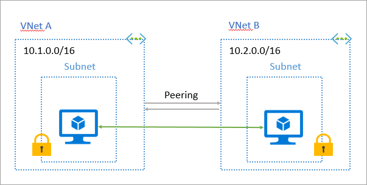
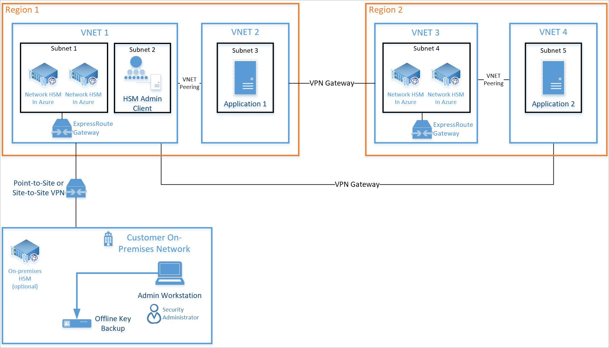
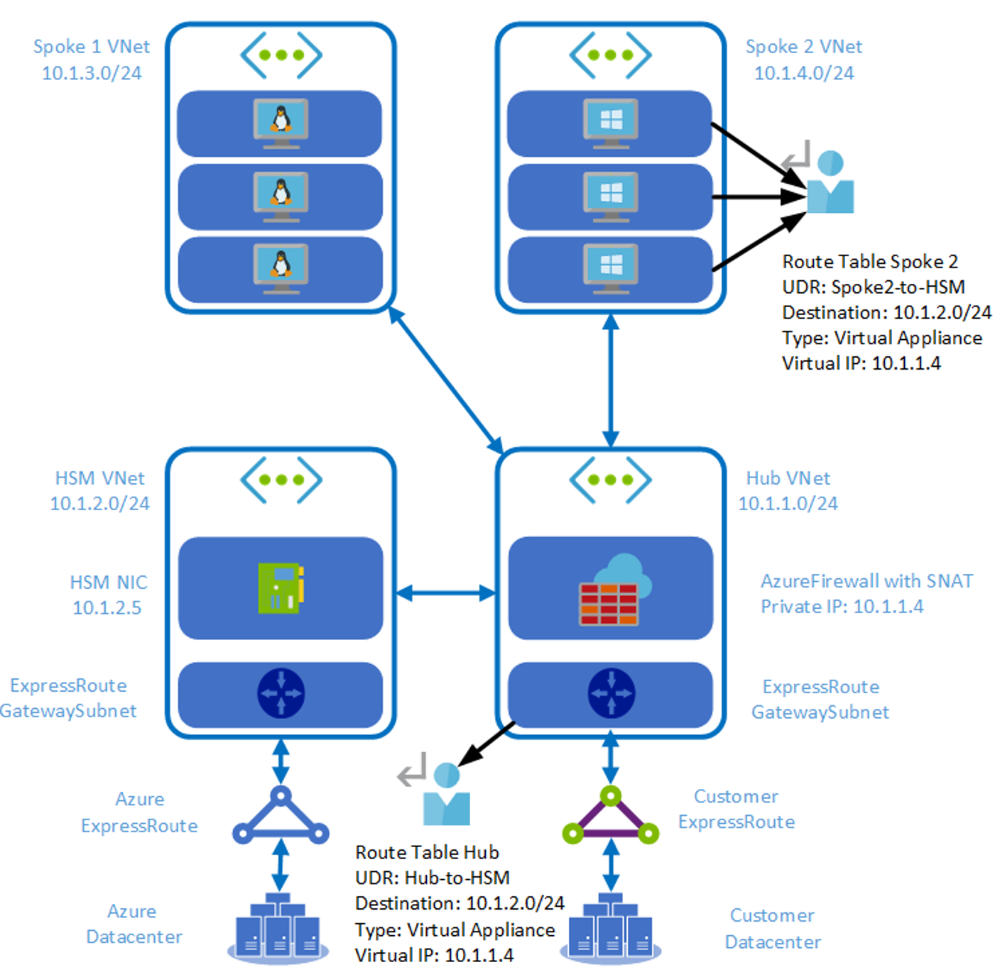
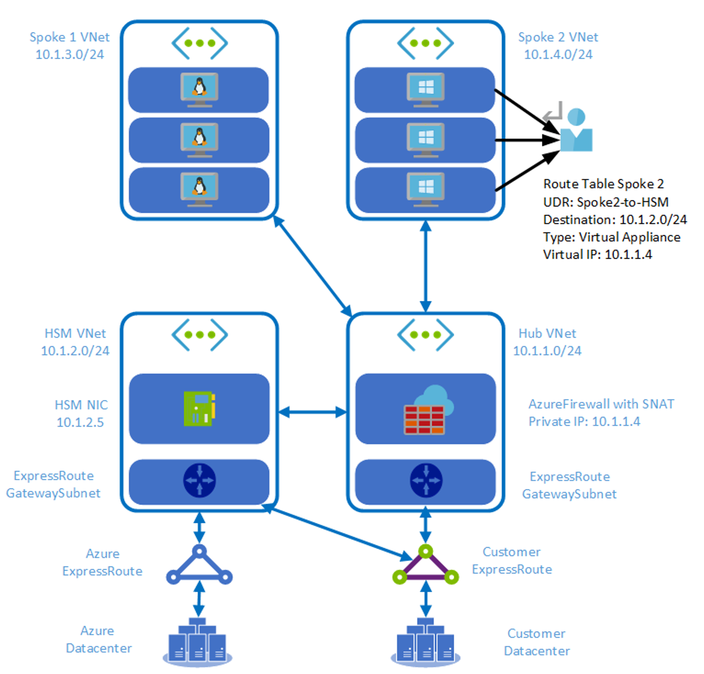

---
title: Networking considerations - Azure Dedicated HSM | Microsoft Docs
description: Overview of networking considerations applicable to Azure Dedicated HSM deployments
services: dedicated-hsm
author: msmbaldwin
manager: rkarlin
ms.custom: "mvc, seodec18"
ms.service: key-vault
ms.workload: identity
ms.tgt_pltfrm: na
ms.devlang: na
ms.topic: conceptual
ms.date: 03/25/2021
ms.author: keithp

---

# Azure Dedicated HSM networking

Azure Dedicated HSM requires a highly secure networking environment. This is true whether it is from the Azure cloud back to the customer’s IT environment (on-premises), using distributed applications or for high availability scenarios. Azure Networking provides this and there are four distinct areas that must be addressed.

- Creating HSM devices inside your Virtual Network (VNet) in Azure
- Connecting on-premises to cloud-based resources for the configuration and management of HSM devices
- Creating and connecting virtual networks for inter-connecting application resources and HSM devices
- Connecting virtual networks across regions for inter-communication and also to enable high availability scenarios

## Virtual network for your Dedicated HSMs

Dedicated HSMs are integrated into a Virtual Network and placed in the customers own private network in Azure. This enables access to the devices from virtual machines or compute resources in the virtual network.  
For more information on integrating Azure services into the virtual network and the capabilities it provides, see [Virtual network for Azure services](../virtual-network/virtual-network-for-azure-services.md) documentation.

### Virtual networks

Before provisioning a Dedicated HSM device, customers will first need to create a Virtual Network in Azure or use one that already exists in the customers subscription. The virtual network defines the security perimeter for the Dedicated HSM device. For more information on creating virtual networks, see [virtual network documentation](../virtual-network/virtual-networks-overview.md).

### Subnets

Subnets segment the virtual network into separate address spaces usable by the Azure resources you place in them. Dedicated HSMs are deployed into a subnet in the virtual network. Each Dedicated HSM device that is deployed in the customer’s subnet will receive a private IP address from this subnet. 
The subnet in which the HSM device is deployed needs to be explicitly delegated to the service: Microsoft.HardwareSecurityModules/dedicatedHSMs. This grants certain permissions to the HSM service for deployment into the subnet. Delegation to Dedicated HSMs imposes certain policy restrictions on the subnet. Network Security Groups (NSGs) and User-Defined Routes (UDRs) are currently not supported on delegated subnets. As a result, once a subnet is delegated to dedicated HSMs, it can only be used to deploy HSM resources. Deployment of any other customer resources into the subnet will fail.

### ExpressRoute gateway

A requirement of the current architecture is configuration of an [ExpressRoute gateway](https://docs.microsoft.com/azure/expressroute/expressroute-howto-add-gateway-portal-resource-manager) in the customers subnet where an HSM device needs to be placed to enable integration of the HSM device into Azure. This [ExpressRoute gateway](https://docs.microsoft.com/azure/expressroute/expressroute-howto-add-gateway-portal-resource-manager) cannot be utilized for connecting on-premises locations to the customers HSM devices in Azure.

## Connecting your on-premises IT to Azure

When creating cloud-based resources, it is a typical requirement for a private connection back to on-premises IT resources. In the case of Dedicated HSM, this will predominantly be for the HSM client software to configure the HSM devices and also for activities such as backups and pulling logs from HSMs for analysis. 
A key decision point here is the nature of the connection as there are options.  The most flexible option is Site-to-Site VPN as there will likely be multiple on-premises resources that require secure communication with resources (including HSMs) in the Azure cloud. This will require a customer organization to have a VPN device to facilitate the connection. A Point-to-Site VPN connection can be used if there is only a single end-point on-premises such as a single administration workstation.
For more information on connectivity options, see [VPN Gateway planning options](../vpn-gateway/vpn-gateway-about-vpngateways.md?toc=%2fazure%2fvirtual-network%2ftoc.json#planningtable).

> [!NOTE]
> At this time, ExpressRoute is not an option for connection to on-premises resources. It should also be noted that the ExpressRoute Gateway used as described above, is not for connections to on-premises infrastructure.

### Point-to-Site VPN

A point-to-site Virtual Private Network is the simplest form of secure connection to a single endpoint on-premises. This may be relevant if you intend to only have a single administration workstation for Azure-based dedicated HSMs.

### Site-to-Site VPN

A site-to-site Virtual Private Network allows for secure communication between Azure-based Dedicated HSMs and your on-premises IT. A reason to do this is having a backup facility for the HSM’s on-premises and needing a connection between the two for running the backup.

## Connecting virtual networks

A typical deployment architecture for Dedicated HSM will start with a single virtual network and corresponding subnet in which the HSM devices are created and provisioned. Within that same region, there could well be additional virtual networks and subnets for application components that would make use of the Dedicated HSM. To enable communication across these networks, we use Virtual Network Peering.

### Virtual network peering

When there are multiple virtual networks within a region that need to access each other’s resources, Virtual Network Peering can be used to create secure communication channels between them.  Virtual network peering provides not only secure communications but also ensures a low-latency and high-bandwidth connections between the resources in Azure.



## Connecting across Azure Regions

The HSM devices have the ability, via software libraries, to redirect traffic to an alternate HSM. Traffic redirection is helpful if devices fail or access to a device is lost. Regional level failure scenarios can be mitigated by deploying HSMs in other regions and enabling communication between virtual networks across regions.

### Cross region HA using VPN gateway

For globally distributed applications or for high availability regional failover scenarios, it is required to connect virtual networks across regions. With Azure Dedicated HSM, high-availability can be achieved by using a VPN Gateway that provides a secure tunnel between the two virtual networks. For more information on Vnet-to-Vnet connections using VPN Gateway, see the article titled [What is VPN Gateway?](../vpn-gateway/design.md#V2V)

> [!NOTE]
> Global Vnet peering is not available in cross-region connectivity scenarios with Dedicated HSMs at this time and VPN gateway should be used instead. 



## Networking Restrictions
> [!NOTE]
> A constraint of the Dedicated HSM service using subnet delegation is imposed restrictions that should be considered when designing the target network architecture for an HSM deployment. Use of subnet delegation means NSGs, UDRs and Global VNet Peering are not supported for Dedicated HSM. The sections below give help with alternative techniques to achieve the same or a similar outcome for these capabilities. 

The HSM NIC which resides in the Dedicated HSM VNet cannot use Network Security Groups, or User Defined Routes. This means that it is not possible to set default-deny policies from standpoint of the Dedicated HSM VNet, and that other network segments must be allowlisted to gain access to the Dedicated HSM service. 

Adding the Network Virtual Appliances (NVA) Proxy solution also allows for an NVA firewall in the transit/DMZ hub to be logically placed in front of the HSM NIC, thus providing the needed alternative to NSGs and UDRs.

### Solution Architecture
This networking design requires the following elements:
1.	A transit or DMZ hub VNet with an NVA proxy tier. Ideally two or more NVAs are present. 
2.	An ExpressRoute circuit with a private peering enabled and a connection to the transit hub VNet.
3.	A VNet peering between the transit hub VNet and the Dedicated HSM VNet.
4.	An NVA firewall or Azure Firewall can be deployed offer DMZ services in the hub as an option. 
5.	Additional workload spoke VNets can be peered to the hub VNet. The Gemalto client can access the dedicated HSM service through the hub VNet.



Since adding the NVA proxy solution also allows for an NVA firewall in the transit/DMZ hub to be logically placed in front of the HSM NIC, thus providing the needed default-deny policies. In our example, we will use the Azure Firewall for this purpose and will need the following elements in place:
1. An Azure Firewall deployed into subnet “AzureFirewallSubnet” in the DMZ hub VNet
2. A Routing Table with a UDR that directs traffic headed to the Azure ILB private endpoint into the Azure Firewall. This Routing Table will be applied to the GatewaySubnet where the customer [ExpressRoute Virtual Gateway](https://docs.microsoft.com/azure/expressroute/expressroute-howto-add-gateway-portal-resource-manager) resides
3. Network security rules within the AzureFirewall to allow forwarding between a trusted source range and the Azure IBL private endpoint listening on TCP port 1792. This security logic will add the necessary “default deny” policy against the Dedicated HSM service. Meaning, only trusted source IP ranges will be allowed into the Dedicated HSM service. All other ranges will be dropped.  
4. A Routing Table with a UDR that directs traffic headed to on-prem into the Azure Firewall. This Routing Table will be applied to the NVA proxy subnet. 
5. An NSG applied to the Proxy NVA subnet to trust only the subnet range of the Azure Firewall as a source, and to only allow forwarding to the HSM NIC IP address over TCP port 1792. 

> [!NOTE]
> Because the NVA proxy tier will SNAT the client IP address as it forwards to the HSM NIC, no UDRs are required between the HSM VNet and the DMZ hub VNet.  

### Alternative to UDRs
The NVA tier solution mentioned above works as an alternative to UDRs. There are some important points to note.
1.	Network Address Translation should be configured on NVA to allow for return traffic to be routed correctly.
2. Customers should disable the client ip-check in Luna HSM configuration to use VNA for NAT. The following commands servce as an example.
```
Disable:
[hsm01] lunash:>ntls ipcheck disable
NTLS client source IP validation disabled
Command Result : 0 (Success)

Show:
[hsm01] lunash:>ntls ipcheck show
NTLS client source IP validation : Disable
Command Result : 0 (Success)
```
3.	Deploy UDRs for ingress traffic into the NVA tier. 
4. As per design, HSM subnets will not initiate an outbound connection request to the platform tier.

### Alternative to using Global VNET Peering
There are a couple of architectures you can use as an alternative to Global VNet peering.
1.	Use [Vnet-to-Vnet VPN Gateway Connection](../vpn-gateway/vpn-gateway-howto-vnet-vnet-resource-manager-portal.md) 
2.	Connect HSM VNET with another VNET with an ER circuit. This works best when a direct on-premises path is required or VPN VNET. 

#### HSM with direct Express Route connectivity


## Next steps

- [Frequently asked questions](faq.md)
- [Supportability](supportability.md)
- [High availability](high-availability.md)
- [Physical Security](physical-security.md)
- [Monitoring](monitoring.md)
- [Deployment architecture](deployment-architecture.md)