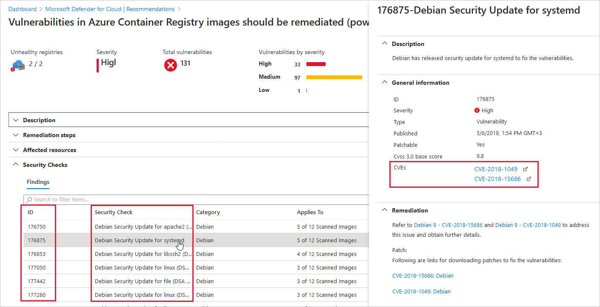
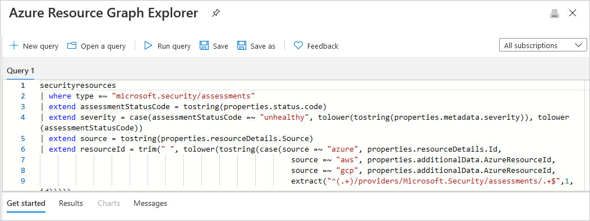

# Use asset inventory to manage your resources' security posture

The asset inventory page of Microsoft Defender for Cloud provides a single page for viewing the security posture of the resources you've connected to Microsoft Defender for Cloud.

Defender for Cloud periodically analyzes the security state of resources connected to your subscriptions to identify potential security vulnerabilities. It then provides you with recommendations on how to remediate those vulnerabilities.

When any resource has outstanding recommendations, they'll appear in the inventory.

Use this view and its filters to address such questions as:

- Which of my subscriptions with enhanced security features enabled have outstanding recommendations?
- Which of my machines with the tag 'Production' are missing the Log Analytics agent?
- How many of my machines tagged with a specific tag have outstanding recommendations?
- Which machines in a specific resource group have a known vulnerability (using a CVE number)?

The asset management possibilities for this tool are substantial and continue to grow.

> [!TIP]
> The security recommendations on the asset inventory page are the same as those on the **Recommendations** page, but here they're shown according to the affected resource. For information about how to resolve recommendations, see [Implementing security recommendations in Microsoft Defender for Cloud](review-security-recommendations.md).

## Availability

|Aspect|Details|
|----|:----|
|Release state:|General availability (GA)|
|Pricing:|Free<br> Some features of the inventory page, such as the [software inventory](#access-a-software-inventory) require paid solutions to be in-place|
|Required roles and permissions:|All users|
|Clouds:|:::image type="icon" source="./media/icons/yes-icon.png"::: Commercial clouds<br>:::image type="icon" source="./media/icons/yes-icon.png"::: National (Azure Government, Azure China 21Vianet) <br> <br> Software inventory is not currently supported in national clouds.|


## What are the key features of asset inventory?

The inventory page provides the following tools:

:::image type="content" source="media/asset-inventory/highlights-of-inventory.png" alt-text="Main features of the asset inventory page in Microsoft Defender for Cloud." lightbox="media/asset-inventory/highlights-of-inventory.png":::

### 1 - Summaries

Before you define any filters, a prominent strip of values at the top of the inventory view shows:

- **Total resources**: The total number of resources connected to Defender for Cloud.
- **Unhealthy resources**: Resources with active security recommendations. [Learn more about security recommendations](review-security-recommendations.md).
- **Unmonitored resources**: Resources with agent monitoring issues - they have the Log Analytics agent deployed, but the agent isn't sending data or has other health issues.
- **Unregistered subscriptions**: Any subscription in the selected scope that haven't yet been connected to Microsoft Defender for Cloud.

### 2 - Filters

The multiple filters at the top of the page provide a way to quickly refine the list of resources according to the question you're trying to answer. For example, if you wanted to answer the question *Which of my machines with the tag 'Production' are missing the Log Analytics agent?* you could combine the **Agent monitoring** filter with the **Tags** filter.

As soon as you've applied filters, the summary values are updated to relate to the query results.

### 3 - Export and asset management tools

**Export options** - Inventory includes an option to export the results of your selected filter options to a CSV file. You can also export the query itself to Azure Resource Graph Explorer to further refine, save, or modify the Kusto Query Language (KQL) query.

> [!TIP]
> The KQL documentation provides a database with some sample data together with some simple queries to get the "feel" for the language. [Learn more in this KQL tutorial](/azure/data-explorer/kusto/query/tutorial?pivots=azuredataexplorer).

**Asset management options** - When you've found the resources that match your queries, inventory provides shortcuts for operations such as:

- Assign tags to the filtered resources - select the checkboxes alongside the resources you want to tag.
- Onboard new servers to Defender for Cloud - use the **Add non-Azure servers** toolbar button.
- Automate workloads with Azure Logic Apps - use the **Trigger Logic App** button to run a logic app on one or more resources. Your logic apps have to be prepared in advance, and accept the relevant trigger type (HTTP request). [Learn more about logic apps](../logic-apps/logic-apps-overview.md).

## How does asset inventory work?

Asset inventory utilizes [Azure Resource Graph (ARG)](../governance/resource-graph/index.yml), an Azure service that provides the ability to query Defender for Cloud's security posture data across multiple subscriptions.

ARG is designed to provide efficient resource exploration with the ability to query at scale.

Using the [Kusto Query Language (KQL)](/azure/data-explorer/kusto/query/), asset inventory can quickly produce deep insights by cross-referencing Defender for Cloud data with other resource properties.

## How to use asset inventory

1. From Defender for Cloud's sidebar, select **Inventory**.

1. Use the **Filter by name** box to display a specific resource, or use the filters as described below.

1. Select the relevant options in the filters to create the specific query you want to perform.

    By default, the resources are sorted by the number of active security recommendations.

    > [!IMPORTANT]
    > The options in each filter are specific to the resources in the currently selected subscriptions **and** your selections in the other filters.
    >
    > For example, if you've selected only one subscription, and the subscription has no resources with outstanding security recommendations to remediate (0 unhealthy resources), the **Recommendations** filter will have no options.

    :::image type="content" source="./media/asset-inventory/filtering-to-prod-unmonitored.gif" alt-text="Using the filter options in Microsoft Defender for Cloud's asset inventory to filter resources to production resources that aren't monitored":::

1. To use the **Security findings contain** filter, enter free text from the ID, security check, or CVE name of a vulnerability finding to filter to the affected resources:

    

    > [!TIP]
    > The **Security findings contain** and **Tags** filters only accept a single value. To filter by more than one, use **Add filters**.

1. <a id="onoffpartial"></a>To use the **Defender for Cloud** filter, select one or more options (Off, On, or Partial):

    - **Off** - Resources that aren't protected by a Microsoft Defender plan. You can right-click on any of these and upgrade them:

        :::image type="content" source="./media/asset-inventory/upgrade-resource-inventory.png" alt-text="Upgrade a resource to be protected by the relevant Microsoft Defender plan via right-click." lightbox="./media/asset-inventory/upgrade-resource-inventory.png":::

    - **On** - Resources that are protected by a Microsoft Defender plan
    - **Partial** - This applies to **subscriptions** that have some but not all of the Microsoft Defender plans disabled. For example, the following subscription has seven Microsoft Defender plans disabled.

        :::image type="content" source="./media/asset-inventory/pricing-tier-partial.png" alt-text="Subscription partially protected by Microsoft Defender plans.":::

1. To further examine the results of your query, select the resources that interest you.

1. To view the current selected filter options as a query in Resource Graph Explorer, select **Open query**.

    

1. If you've defined some filters and left the page open, Defender for Cloud won't update the results automatically. Any changes to resources won't impact the displayed results unless you manually reload the page or select **Refresh**.

## Access a software inventory

To access the software inventory, you'll need one of the following **paid** solutions:

- [Agentless machine scanning](concept-agentless-data-collection.md) from [Defender Cloud Security Posture Management (CSPM)](concept-cloud-security-posture-management.md).
- [Agentless machine scanning](concept-agentless-data-collection.md) from [Defender for Servers P2](defender-for-servers-introduction.md#defender-for-servers-plans).
- [Microsoft Defender for Endpoint integration](integration-defender-for-endpoint.md) from [Defender for Servers](defender-for-servers-introduction.md).

If you've already enabled the integration with Microsoft Defender for Endpoint and enabled Microsoft Defender for Servers, you'll have access to the software inventory.

:::image type="content" source="media/asset-inventory/software-inventory-filters.gif" alt-text="If you've enabled the threat and vulnerability solution, Defender for Cloud's asset inventory offers a filter to select resources by their installed software.":::

> [!NOTE]
> The "Blank" option shows machines without Microsoft Defender for Endpoint (or without Microsoft Defender for Servers).

As well as the filters in the asset inventory page, you can explore the software inventory data from Azure Resource Graph Explorer.

Examples of using Azure Resource Graph Explorer to access and explore software inventory data:

1. Open **Azure Resource Graph Explorer**.

    :::image type="content" source="./media/multi-factor-authentication-enforcement/opening-resource-graph-explorer.png" alt-text="Launching Azure Resource Graph Explorer** recommendation page" :::

1. Select the following subscription scope: securityresources/softwareinventories

1. Enter any of the following queries (or customize them or write your own!) and select **Run query**.

    - To generate a basic list of installed software:

        ```kusto
        securityresources
        | where type == "microsoft.security/softwareinventories"
        | project id, Vendor=properties.vendor, Software=properties.softwareName, Version=properties.version
        ```

    - To filter by version numbers:

        ```kusto
        securityresources
        | where type == "microsoft.security/softwareinventories"
        | project id, Vendor=properties.vendor, Software=properties.softwareName, Version=tostring(properties.    version)
        | where Software=="windows_server_2019" and parse_version(Version)<=parse_version("10.0.17763.1999")
        ```

    - To find machines with a combination of software products:

        ```kusto
        securityresources
        | where type == "microsoft.security/softwareinventories"
        | extend vmId = properties.azureVmId
        | where properties.softwareName == "apache_http_server" or properties.softwareName == "mysql"
        | summarize count() by tostring(vmId)
        | where count_ > 1
        ```

    - Combination of a software product with another security recommendation:

        (In this example – machines having MySQL installed and exposed management ports)

        ```kusto
        securityresources
        | where type == "microsoft.security/softwareinventories"
        | extend vmId = tolower(properties.azureVmId)
        | where properties.softwareName == "mysql"
        | join (
        securityresources
        | where type == "microsoft.security/assessments"
        | where properties.displayName == "Management ports should be closed on your virtual machines" and properties.status.code == "Unhealthy"
        | extend vmId = tolower(properties.resourceDetails.Id)
        ) on vmId
        ```

## FAQ - Inventory

### Why aren't all of my subscriptions, machines, storage accounts, etc. shown?

The inventory view lists your Defender for Cloud connected resources from a Cloud Security Posture Management (CSPM) perspective. The filters don't return every resource in your environment; only the ones with outstanding (or 'active') recommendations.

For example, the following screenshot shows a user with access to 8 subscriptions but only 7 currently have recommendations. So when they filter by **Resource type = Subscriptions**, only those 7 subscriptions with active recommendations appear in the inventory:

:::image type="content" source="./media/asset-inventory/filtered-subscriptions-some.png" alt-text="Not all subs returned when there are no active recommendations." lightbox="./media/asset-inventory/filtered-subscriptions-some.png":::

### Why do some of my resources show blank values in the Defender for Cloud or monitoring agent columns?

Not all Defender for Cloud monitored resources have agents. For example, Azure Storage accounts or PaaS resources such as disks, Logic Apps, Data Lake Analysis, and Event Hub don't need agents to be monitored by Defender for Cloud.

When pricing or agent monitoring isn't relevant for a resource, nothing will be shown in those columns of inventory.

:::image type="content" source="./media/asset-inventory/agent-pricing-blanks.png" alt-text="Some resources show blank info in the monitoring agent  or Defender for Cloud columns." lightbox="./media/asset-inventory/agent-pricing-blanks.png":::

## Next steps

This article described the asset inventory page of Microsoft Defender for Cloud.

For more information on related tools, see the following pages:

- [Azure Resource Graph (ARG)](../governance/resource-graph/index.yml)
- [Kusto Query Language (KQL)](/azure/data-explorer/kusto/query/)
