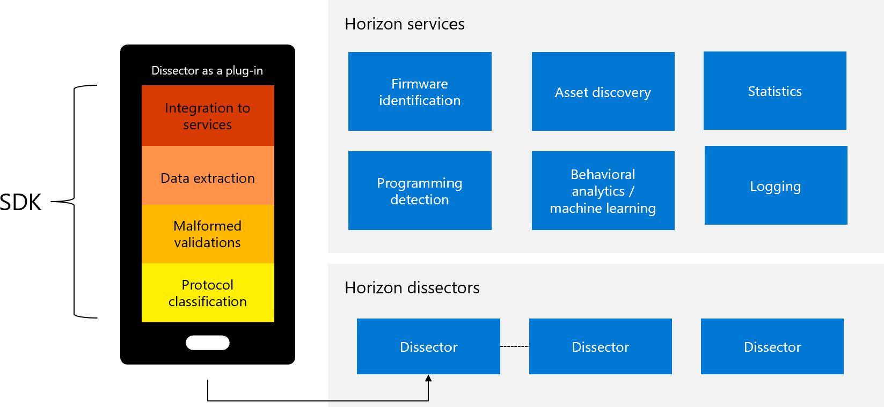

# Support for IoT, OT, ICS, and SCADA protocols

Microsoft Defender for IoT provides an open and interoperable Operation Technology (OT) cybersecurity platform. Defender for IoT reduces IoT, IT, and ICS risk with deployments in demanding and complex OT environments across all industry verticals and geographies.

## Supported protocols

Defender for IoT supports a broad range of protocols across a diverse enterprise. Supported protocols include industrial automation equipment across all industrial sectors, enterprise networks, and building management system (BMS) environments.

For custom or proprietary protocols, Microsoft offers an SDK that makes it easy to develop, test, and deploy custom protocol dissectors as plugins. The SDK does all this without divulging proprietary information, such as how the protocols are designed, or by sharing PCAPs that may contain sensitive information. Supported protocols are listed below.

### Supported protocols (passive monitoring)

This section lists protocols that are detected using passive monitoring.

**ABB:** IEC61850 MMS (including ABB extension)

**ASHRAE:** BACnet, BACnet BACapp, BACnet BVLC

**Beckhoff:** AMS (ADS), Twincat 

**Cisco:** CAPWAP Control, CAPWAP Data, CDP,  LWAPP

**DNP. org :**  DNP3

**Emerson:** DeltaV, Emerson OpenBSI/BSAP, Ovation DCS ADMD,Ovation DCS DPUSTAT, Ovation DCS SSRPC

**Emerson Fischer:**  ROC

**Eurocontrol:** ASTERIX

**GE:**  Bentley Nevada (System 1),  EGD,  GSM (GE MarkVI and MarkVIe),  SRTP (GE)

**Honeywell:** ENAP, Experion DCS CDA, Experion DCS FDA

**IEC:** Codesys V3, ICCP TASE.2/IEC-60870, IEC60870-5 (IEC104/101), IEC60870-5-103 (encapsulated serial), IEC61850 GOOSE, IEC61850 MMS, IEC61850 SMV (SAMPLED-VALUES), LonTalk (LonWorks)

**IEEE**: LLC, STP, VLAN

**IETF:** ARP, DCE RPC, DNS, FTP (FTP_ADAT, FTP_DATA), GSSAPI (RFC2743), HTTP, ICMP, IPv4, IPv6, LLDP, MDNS, NBNS, NTLM (NTLMSSP Auth Protocol), RPC, SMB / Browse / NBDGM, SMB / CIFS, SNMP, SPNEGO (RFC4178), SSH, Syslog, Telnet, TFTP, TPKT, UDP

**ISO:** CLNP (ISO 8473), COTP (ISO 8073), ISO Industrial Protocol,  MQTT (IEC 20922)

**Medical:** ASTM, HL7

**Microsoft:** Horizon community dissectors, Horizon proprietary dissectors (developed by customers). 

**Mitsubishi:** Melsoft / Melsec (Mitsubishi Electric)

**Omron:** FINS

**Oracle:** TDS, TNS

**Rockwell Automation:** ENIP, EtherNet/IP CIP (including Rockwell extension), EtherNet/IP CIP FW version 27 and above

**Schneider Electric:** Modbus/TCP, Modbus TCP–Schneider Unity Extensions, OASYS (Schneider Electric Telvant) 

**Schneider Electric / Invensys:** Foxboro Evo, Foxboro I/A, Trident, TriGP, TriStation

**Schneider Electric / Modicon:** Modbus RTU

**Schneider Electric / Wonderware:** Wonderware Suitelink

**Siemens:** CAMP, PCS7, PCS7 WinCC – Historian, Profinet DCP, Profinet Realtime, Siemens PHD, Siemens S7, Siemens S7-Plus, Siemens S7-Plus, Siemens SICAM, Siemens WinCC

**Toshiba:** Toshiba Computer Link

**Yokogawa:** Centum ODEQ (Centum / ProSafe DCS), HIS Equalize, Vnet/IP

### Supported protocols (active monitoring)

This section lists protocols that are detected using active probing, for example ping sweeps and queries.

**IETF:** Ping Sweep, SNMP Network Layout Query, SNMP Query

**Microsoft:**  Windows WMI Query (req. WMI/WinRM): hardware, BIOS, version, software, patches

**Rockwell Automation:**  ENIP Query, ENIP Scan,  EtherNet/IP CIP (CIP Query)

**Siemens:** Siemens S7

## Quickly add support for proprietary, restricted protocols

Digitization is driving deployment of billions of IoT devices followed by a significant increase in connectivity between IT and OT networks. This means attack surfaces are growing, including a greater risk of dangerous cyber attacks on industrial control systems.

To help reduce the attack surface, the Horizon Protocol SDK allows quick, secure support of any protocol used in IoT and ICS environments.

Horizon provides the following solutions for customers and technology partners:

- Unlimited, full support for common, proprietary, custom protocols or protocols that deviate from any standard.

- A new level of flexibility and scope for DPI development.

- A tool that exponentially expands OT visibility and control, without the need to upgrade Defender for IoT platform versions.

- The security of allowing proprietary development without divulging sensitive information.

The Horizon SDK lets you write plugins that enable Deep Packet Inspection (DPI) on the traffic and detect threats in real time. The Horizon SDK makes extra customizations possible as well. For example, the Horizon SDK enables asset vendors, partners, or platform owners to localize and customize the text for alerts, events, and protocol parameters.

## Collaborate with the Horizon community

Be part of a community that is leading the way toward digital transformation and industry-wide collaboration for protocol support. The Horizon ICS community allows knowledge sharing for domain experts in critical infrastructures, building management, production lines, transportation systems, and other industrial leaders.

The community provides tutorials, discussion forums, instructor-led training, educational white papers, webinars, and more.

We invite you to join our community here: <horizon-community@microsoft.com>

## Next steps

[Customize alert rules](how-to-accelerate-alert-incident-response.md#customize-alert-rules)
[About forwarded alert information](how-to-forward-alert-information-to-partners.md#about-forwarded-alert-information)
