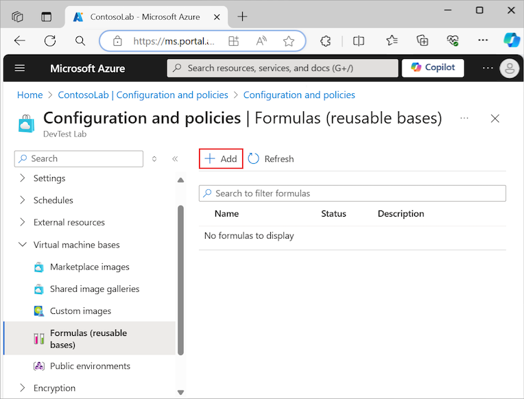
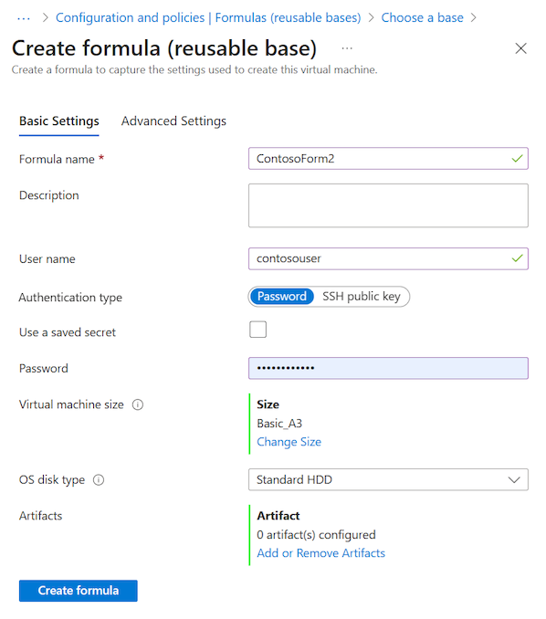

# Manage Azure DevTest Labs formulas

[!INCLUDE [devtest-lab-formula-definition](../../includes/devtest-lab-formula-definition.md)]

This article illustrates how to create a formula from either a base (custom image, Marketplace image, or another formula) or an existing VM. This article also guides you through managing existing formulas.

## Create a formula
Anyone with DevTest Labs *Users* permissions is able to create VMs using a formula as a base. 
There are two ways to create formulas: 

* From a base - Use when you want to define all the characteristics of the formula.
* From an existing lab VM - Use when you want to create a formula based on the settings of an existing VM.

For more information about adding users and permissions, see [Add owners and users in Azure DevTest Labs](./devtest-lab-add-devtest-user.md).

### Create a formula from a base
The following steps guide you through the process of creating a formula from a custom image, Marketplace image, or another formula.

1. Sign in to the [Azure portal](https://portal.azure.com).

2. Select **All Services**, and then select **DevTest Labs** from the list.

3. From the list of labs, select the desired lab.  

4. On the lab's page, select **Formulas (reusable bases)** on the left menu.
5. On the **Formulas** page, select **+ Add**.
   
    
6. On the **Choose a base** page, select the base (custom image, Marketplace image, or a Shared Image Gallery image) from which you want to create the formula.

    :::image type="content" source="./media/devtest-lab-create-formulas/select-base.png" alt-text="Select the base image":::
1. On the **Basic Settings** tab of the **Create formula** page, specify the following values:
   
	* **Formula name** - Enter a name for your formula. This value is displayed in the list of base images when you create a VM. The name is validated as you type it, and if not valid, a message indicates the requirements for a valid name.
    - Enter an optional **description** for the formula. 
	* **User name** - Enter a user name that is granted administrator privileges.
	* **Password** - Enter - or select from the dropdown - a value that is associated with the secret (password) that you want to use for the specified user. To learn about saving secrets in a key vault and using them when creating lab resources, see [Store secrets in Azure Key Vault](devtest-lab-store-secrets-in-key-vault.md).

        Select **Use a saved secret** if you want to use a secret from Azure Key Vault instead of using a password. 
	* **Virtual machine size** - Select **Change Size** to change the size of the VM. 
    - **OS disk type** - select the type of disk you want to use (Standard HDD, Standard SSD, or Premium SSD).
	* **Artifacts** - Select **Add or Remove artifacts** page, in which you select and configure the artifacts that you want to add to the base image. For more information about artifacts, see [Create custom artifacts for your Azure DevTest Labs virtual machine](devtest-lab-artifact-author.md).

        
8. Switch to the **Advanced settings** tab, and specify the following values:
    - **Virtual network** - To change the virtual network, select **Change Vnet**. 
    - **Subnet** - To change the subnet, select **Change Subnet**. 
    - **IP address configuration** - Specify if you want the Public, Private, or Shared IP addresses. For more information about shared IP addresses, see [Understand shared IP addresses in Azure DevTest Labs](./devtest-lab-shared-ip.md).
    - **Expiration date and time** - You can't edit this field. 
    - **Make this machine claimable** - Making a machine "claimable" means that it will not be assigned ownership at the time of creation. Instead lab users will be able to take ownership ("claim") the machine in the lab's page.  

        
    - If you selected a Shared Image Gallery image as the base, you also see the **image version** field that allows you to select the version of the image from the gallery that you want to use as the base. 

        
8. Select **Submit** to create the formula.

9. When the formula has been created, it displays in the list on the **Formulas** page.

### Create a formula from a VM
The following steps guide you through the process of creating a formula based on an existing VM. 

> [!NOTE]
> To create a formula from a VM, the VM must have been created after March 30, 2016. 
> 
> 

1. Sign in to the [Azure portal](https://go.microsoft.com/fwlink/p/?LinkID=525040).
2. Select **All Services**, and then select **DevTest Labs** from the list.
3. From the list of labs, select the desired lab.  
4. On the lab's **Overview** page, select the VM from which you wish to create the formula.
   
    
5. On the VM's page, select **Create formula (reusable base)**.
   
    
6. On the **Create formula** page, enter a **Name** and **Description** for your new formula.
   
    
7. Select **OK** to create the formula.

## Modify a formula
To modify a formula, follow these steps:

1. Sign in to the [Azure portal](https://go.microsoft.com/fwlink/p/?LinkID=525040).
2. Select **All Services**, and then select **DevTest Labs** from the list.
3. From the list of labs, select the desired lab.  
4. On the lab's page, select **Formulas (reusable bases)**.
   
    
5. On the **Lab formulas** page, select the formula you wish to modify.
6. On the **Update formula** page, make the desired edits, and select **Update**.

## Delete a formula
To delete a formula, follow these steps:

1. Sign in to the [Azure portal](https://go.microsoft.com/fwlink/p/?LinkID=525040).
2. Select **All Services**, and then select **DevTest Labs** from the list.
3. From the list of labs, select the desired lab.  
4. On the lab **Settings** page, select **Formulas**.
   
    
5. On the **Lab formulas** page, select the ellipsis to the right of the formula you wish to delete.
   
    
6. On the formula's context menu, select **Delete**.
   
    
7. Select **Yes** to the deletion confirmation dialog.

[!INCLUDE [devtest-lab-try-it-out](../../includes/devtest-lab-try-it-out.md)]

## Related blog posts
* [Custom images or formulas?](./devtest-lab-comparing-vm-base-image-types.md)

## Next steps
Once you have created a formula for use when creating a VM, the next step is to [add a VM to your lab](devtest-lab-add-vm.md).
