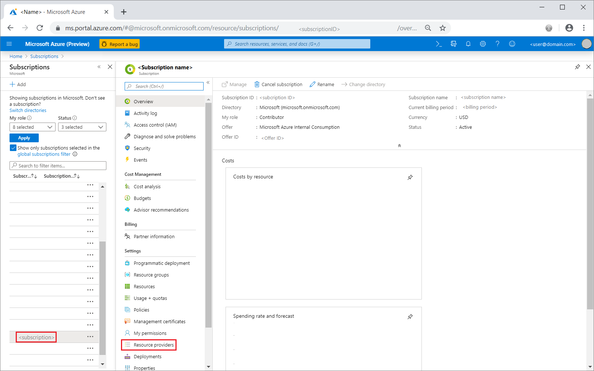
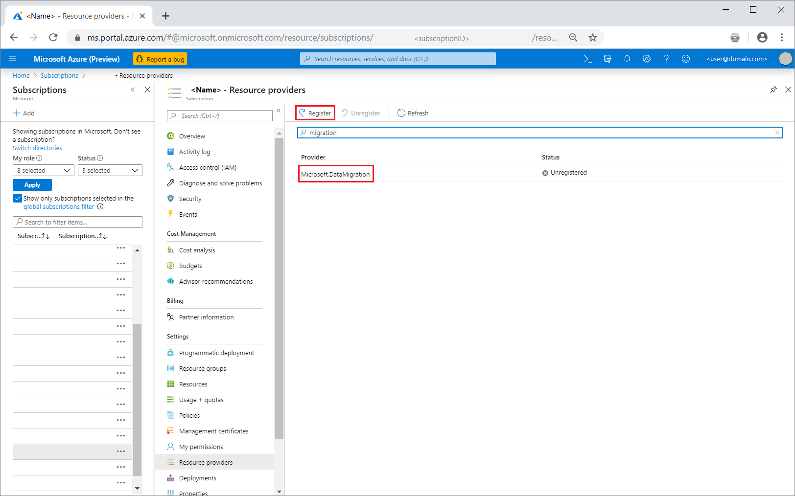
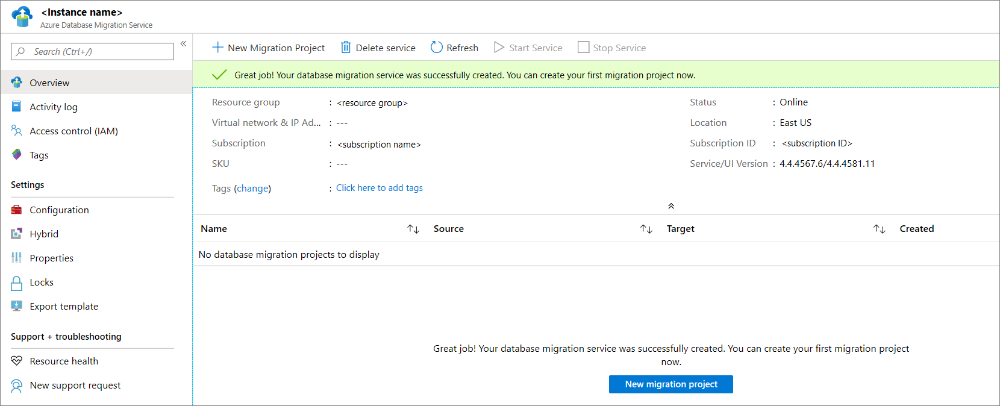
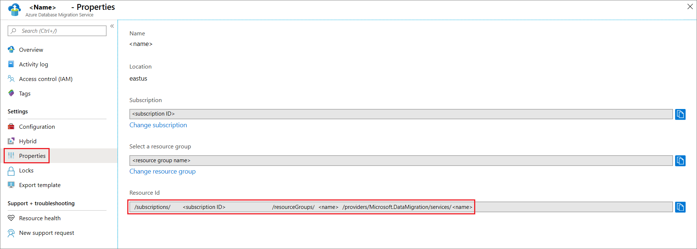
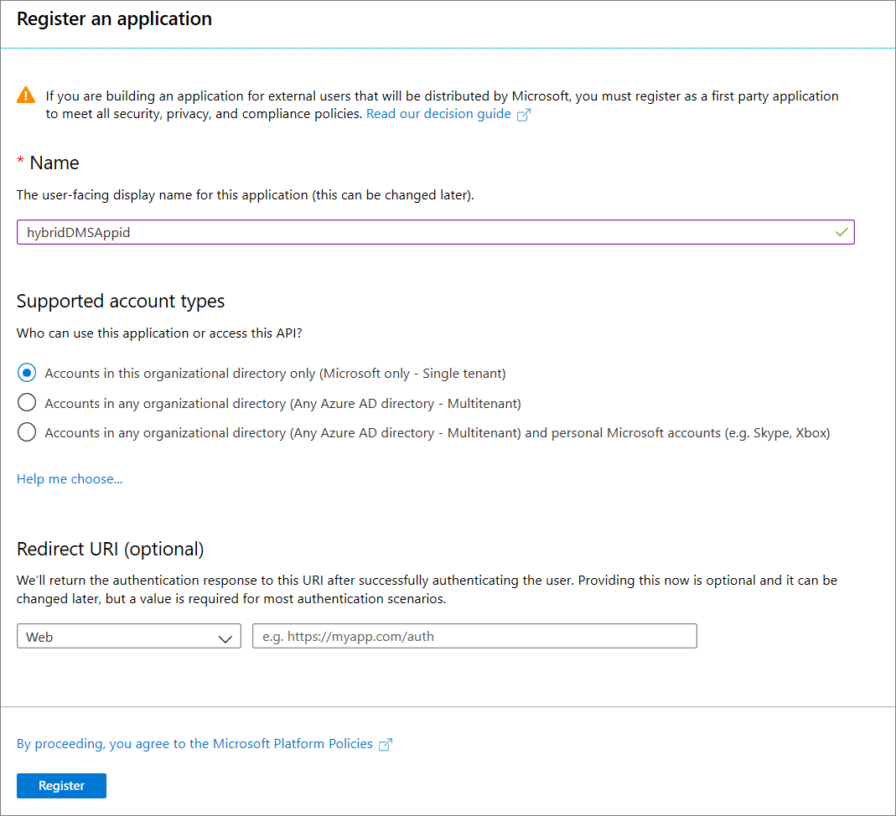
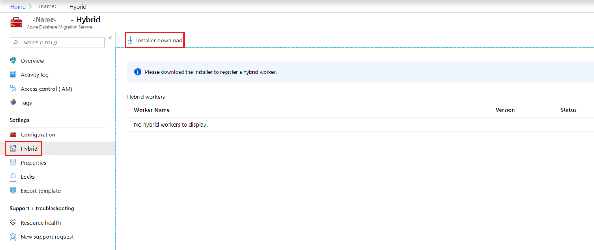
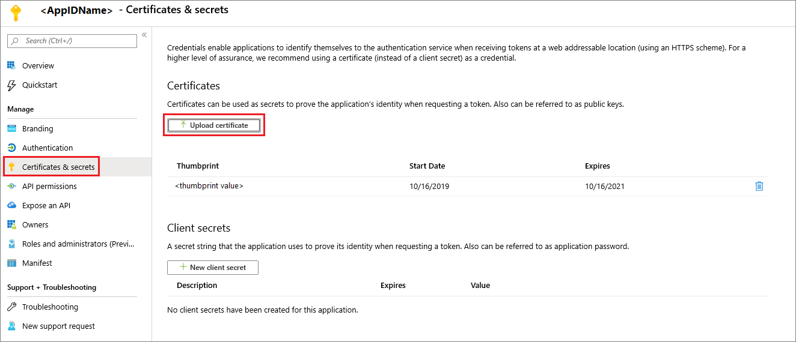

# Quickstart: Create a hybrid mode instance with Azure portal & Azure Database Migration Service

Azure Database Migration Service hybrid mode manages database migrations by using a migration worker that's hosted on-premises together with an instance of Azure Database Migration Service running in the cloud. Hybrid mode is especially useful for scenarios in which there's a lack of site-to-site connectivity between the on-premises network and Azure or if there's limited site-to-site connectivity bandwidth.

>[!NOTE]
>Currently, Azure Database Migration Service running in hybrid mode supports SQL Server migrations to:
>
>- Azure SQL Managed Instance with near zero downtime (online).
>- Azure SQL Database single database with some downtime (offline).
>- MongoDb to Azure CosmosDB with near zero downtime (online).
>- MongoDb to Azure CosmosDB with some downtime (offline).

In this Quickstart, you use the Azure portal to create an instance of Azure Database Migration Service in hybrid mode. Afterwards, you download, install, and set up the hybrid worker in your on-premises network. During preview, you can use Azure Database Migration Service hybrid mode to migrate data from an on-premises instance of SQL Server to Azure SQL Database.

> [!NOTE]
> The Azure Database Migration Service hybrid installer runs on Microsoft Windows Server 2012 R2, Window Server 2016, Windows Server 2019, and Windows 10.

> [!IMPORTANT]
> The Azure Database Migration Service hybrid installer requires .NET 4.7.2 or later. To find the latest versions of .NET, see the [Download .NET Framework](https://dotnet.microsoft.com/download/dotnet-framework) page.

If you don't have an Azure subscription, create a [free](https://azure.microsoft.com/free/) account before you begin.

## Sign in to the Azure portal

From a browser, sign in to the [Azure portal](https://portal.azure.com).

The default view is your service dashboard.

## Register the resource provider

Register the Microsoft.DataMigration resource provider before you create your first instance of Azure Database Migration Service.

1. In the Azure portal, select **Subscriptions**, select the subscription in which you want to create the instance of Azure Database Migration Service, and then select **Resource providers**.

    

2. Search for migration, and then to the right of **Microsoft.DataMigration**, select **Register**.

    

## Create an instance of the service

1. Select +**Create a resource** to create an instance of Azure Database Migration Service.

2. Search the Marketplace for "migration", select **Azure Database Migration Service**, and then on the **Azure Database Migration Service** screen, select **Create**.

3. On the **Create Migration Service** screen:

    - Choose a **Service Name** that is memorable and unique to identify your instance of Azure Database Migration Service.
    - Select the Azure **Subscription** in which you want to create the instance.
    - Select an existing **Resource Group** or create a new one.
    - Choose the **Location** that is closest to your source or target server.
    - For **Service mode**, select **Hybrid (Preview)**.

         

4. Select **Review + create**.

5. On the **Review + create** tab, review the Terms, verify the other information provided, and then select **Create**.

    

    After a few moments, your instance of Azure Database Migration Service in hybrid mode is created and ready to set up. The Azure Database Migration Service instance displays as shown in the following image:

    

6. After the service created, select **Properties**, and then copy the value displayed in the **Resource Id** box, which you'll use to install the Azure Database Migration Service hybrid worker.

    

## Create Azure App registration ID

You need to create an Azure App registration ID that the on-premises hybrid worker can use to communicate with Azure Database Migration Service in the cloud.

1. In the Azure portal, select **Azure Active Directory**, select **App registrations**, and then select **New registration**.
2. Specify a name for the application, and then, under **Supported account types**, select the type of accounts to support to specify who can use the application.

    

3. Use the default values for the **Redirect URI (optional)** fields, and then select **Register**.

4. After App ID registration is completed, make a note of the **Application (client) ID**, which you'll use while installing the hybrid worker.

5. In the Azure portal, navigate to Azure Database Migration Service.

6. In the navigation menu, select **Access control (IAM)**.

7. Select **Add** > **Add role assignment**.

    :::image type="content" source="../../includes/role-based-access-control/media/add-role-assignment-menu-generic.png" alt-text="Screenshot showing Access control (IAM) page with Add role assignment menu open.":::

8. On the **Role** tab, select the **Contributor** role.

    :::image type="content" source="../../includes/role-based-access-control/media/add-role-assignment-role-generic.png" alt-text="Screenshot showing Add role assignment page with Role tab selected.":::

9. On the **Members** tab, select **User, group, or service principal**, and then select the App ID name.

10. On the **Review + assign** tab, select **Review + assign** to assign the role.

    For detailed steps, see [Assign Azure roles using the Azure portal](../role-based-access-control/role-assignments-portal.md).

## Download and install the hybrid worker

1. In the Azure portal, navigate to your instance of Azure Database Migration Service.

2. Under **Settings**, select **Hybrid**, and then select **Installer download** to download the hybrid worker.

    

3. Extract the ZIP file on the server that will be hosting the Azure Database Migration Service hybrid worker.

    > [!IMPORTANT]
    > The Azure Database Migration Service hybrid installer requires .NET 4.7.2 or later. To find the latest versions of .NET, see the [Download .NET Framework](https://dotnet.microsoft.com/download/dotnet-framework) page.

4. In the install folder, locate and open the **dmsSettings.json** file, specify the **ApplicationId** and **resourceId**, and then save the file.

    

5. Generate a certificate that Azure Database Migration Service can use to authenticate the communication from the hybrid worker by using the following command.

    ```
    <drive>:\<folder>\Install>DMSWorkerBootstrap.exe -a GenerateCert
    ```

    A certificate is generated in the Install folder.

    

6. In the Azure portal, navigate to the App ID, under **Manage**, select **Certificated & secrets**, and then select **Upload certificate** to select the public certificate you generated.

    

7. Install the Azure Database Migration Service hybrid worker on your on-premises server by running the following command:

    ```
    <drive>:\<folder>\Install>DMSWorkerBootstrap.exe -a Install -IAcceptDMSLicenseTerms -d
    ```

    > [!NOTE]
    > When running the install command, you can also use the following parameters:
    >
    > - **-TelemetryOptOut** - Stops the worker from sending telemetry but continues to log locally minimally.  The installer still sends telemetry.
    > - **-p {InstallLocation}**. Enables changing the installation path, which by default is “C:\Program Files\DatabaseMigrationServiceHybrid”.

8. If the installer runs without error, then the service will show an online status in Azure Database Migration Service and you're ready to migrate your databases.

    

## Uninstall Azure Database Migration Service hybrid mode

Currently, uninstalling Azure Database Migration Service hybrid mode is supported only via the Azure Database Migration Service hybrid worker installer on your on-premises server, by using the following command:

```
<drive>:\<folder>\Install>DMSWorkerBootstrap.exe -a uninstall
```

> [!NOTE]
> When running the uninstall command, you can also use the “-ReuseCert” parameter, which keeps the AdApp cert generated by the generateCert workflow.  This enables using the same cert that was previously generated and uploaded.

## Set up the Azure Database Migration Service hybrid worker using PowerShell

In addition to installing the Azure Database Migration Service hybrid worker via the Azure portal, we provide a [PowerShell script](https://techcommunity.microsoft.com/gxcuf89792/attachments/gxcuf89792/MicrosoftDataMigration/119/1/DMS_Hybrid_Script.zip) that you can use to automate the worker installation steps after you create a new instance of Azure Database Migration Service in hybrid mode. The script:

1. Creates a new AdApp.
2. Downloads the installer.
3. Runs the generateCert workflow.
4. Uploads the certificate.
5. Adds the AdApp as contributor to your Azure Database Migration Service instance.
6. Runs the install workflow.

This script is intended for quick prototyping when the user already has all the necessary permissions in the environment. Note that in your production environment, the AdApp and Cert may have different requirements, so the script could fail.

> [!IMPORTANT]
> This script assumes that there is an existing instance of Azure Database Migration Service in hybrid mode and that the Azure account used has permissions to create AdApps in the tenant and to modify Azure RBAC on the subscription.

Fill in the parameters at the top of the script, and then run the script from an Administrator PowerShell instance.

## Next steps

> [!div class="nextstepaction"]
> [Migrate SQL Server to an Azure SQL Managed Instance online](tutorial-sql-server-managed-instance-online.md)
> [Migrate SQL Server to Azure SQL Database offline](tutorial-sql-server-to-azure-sql.md)
