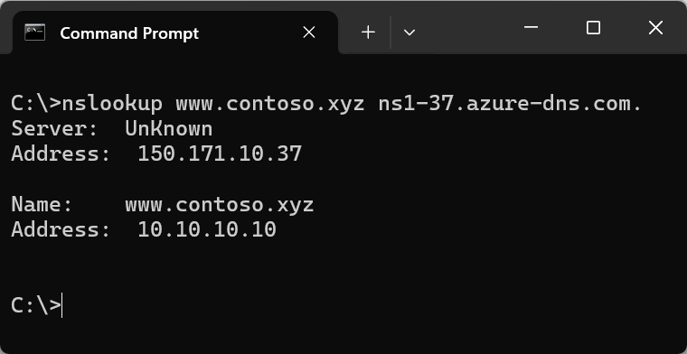

# Quickstart: Create an Azure DNS zone and record using Azure CLI

This article walks you through the steps to create your first DNS zone and record using Azure CLI, which is available for Windows, Mac and Linux. You can also perform these steps using the [Azure portal](dns-getstarted-portal.md) or [Azure PowerShell](dns-getstarted-powershell.md).

A DNS zone is used to host the DNS records for a particular domain. To start hosting your domain in Azure DNS, you need to create a DNS zone for that domain name. Each DNS record for your domain is then created inside this DNS zone. Finally, to publish your DNS zone to the Internet, you need to configure the name servers for the domain. Each of these steps is described below.

Azure DNS now also supports private DNS zones (currently in public preview). To learn more about private DNS zones, see [Using Azure DNS for private domains](private-dns-overview.md). For an example on how to create a private DNS zone, see [Get started with Azure DNS private zones using CLI](./private-dns-getstarted-cli.md).

[!INCLUDE [cloud-shell-try-it.md](../../includes/cloud-shell-try-it.md)]

If you don't have an Azure subscription, create a [free account](https://azure.microsoft.com/free/?WT.mc_id=A261C142F) before you begin.

## Create the resource group

Before you create the DNS zone, create a resource group to contain the DNS zone:

```azurecli
az group create --name MyResourceGroup --location "East US"
```

## Create a DNS zone

A DNS zone is created using the `az network dns zone create` command. To see help for this command, type `az network dns zone create -h`.

The following example creates a DNS zone called *contoso.xyz* in the resource group *MyResourceGroup*. Use the example to create a DNS zone, substituting the values for your own.

```azurecli
az network dns zone create -g MyResourceGroup -n contoso.xyz
```

## Create a DNS record

To create a DNS record, use the `az network dns record-set [record type] add-record` command. For help on A records, see `azure network dns record-set A add-record -h`.

The following example creates a record with the relative name "www" in the DNS Zone "contoso.xyz" in the resource group "MyResourceGroup". The fully-qualified name of the record set is "www.contoso.xyz". The record type is "A", with IP address "10.10.10.10", and a default TTL of 3600 seconds (1 hour).

```azurecli
az network dns record-set a add-record -g MyResourceGroup -z contoso.xyz -n www -a 10.10.10.10
```

## View records

To list the DNS records in your zone, run:

```azurecli
az network dns record-set list -g MyResourceGroup -z contoso.xyz
```

## Test the name resolution

Now that you have a test DNS zone with a test 'A' record, you can test the name resolution with a tool called *nslookup*. 

**To test DNS name resolution:**

1. Run the following cmdlet to get the list of name servers for your zone:

   ```azurecli
   az network dns record-set ns show --resource-group MyResourceGroup --zone-name contoso.xyz --name @
   ```

1. Copy one of the name server names from the output of the previous step.

1. Open a command prompt, and run the following command:

   ```
   nslookup www.contoso.xyz <name server name>
   ```

   For example:

   ```
   nslookup www.contoso.xyz ns1-08.azure-dns.com.
   ```

   You should see something like the following screen:

   

The host name **www.contoso.xyz** resolves to **10.10.10.10**, just as you configured it. This result verifies that name resolution is working correctly.

## Delete all resources

When no longer needed, you can delete all resources created in this quickstart by deleting the resource group:

```azurecli
az group delete --name MyResourceGroup
```

## Next steps

Now that you've created your first DNS zone and record using Azure CLI, you can create records for a web app in a custom domain.

> [!div class="nextstepaction"]
> [Create DNS records for a web app in a custom domain](./dns-web-sites-custom-domain.md)
