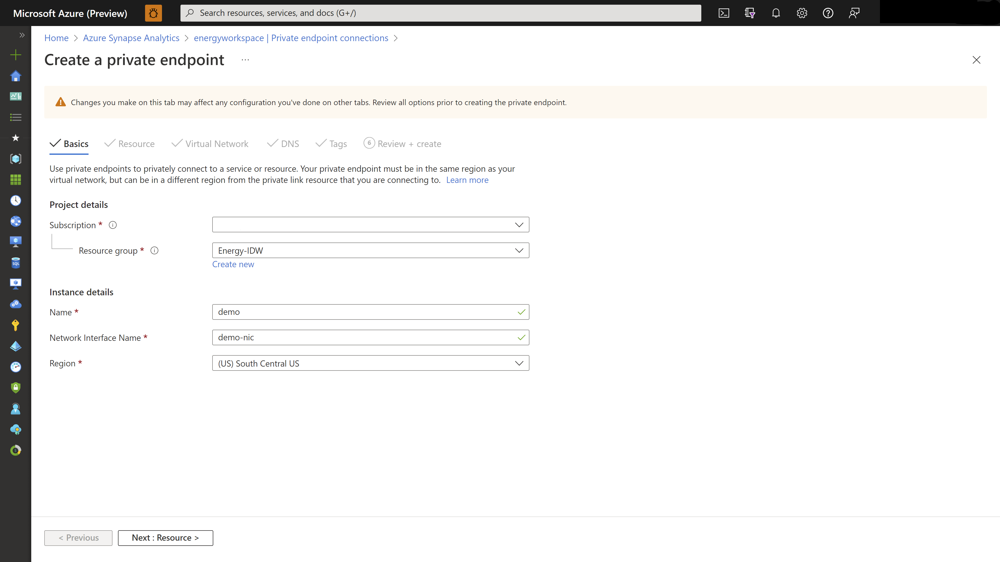
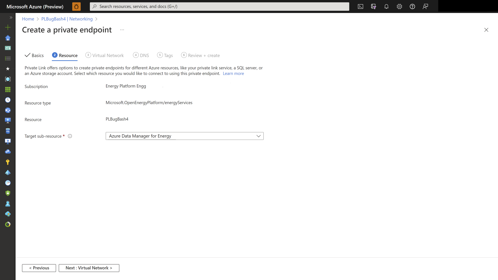
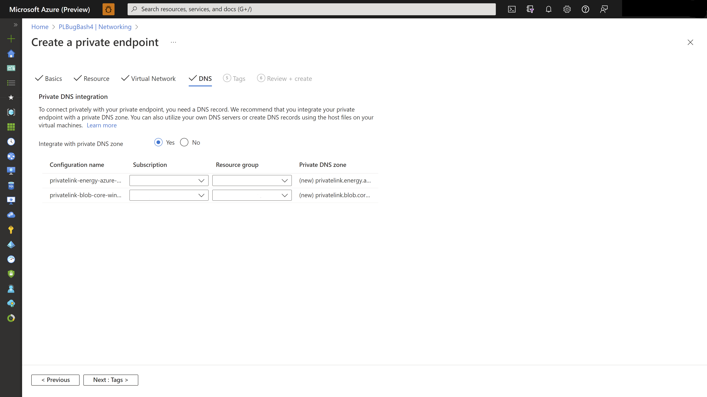
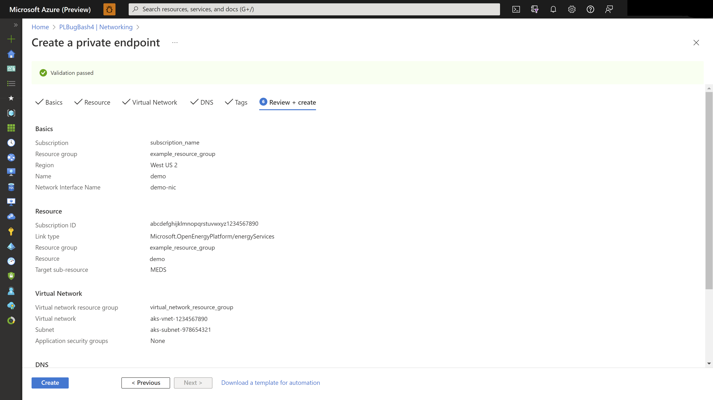
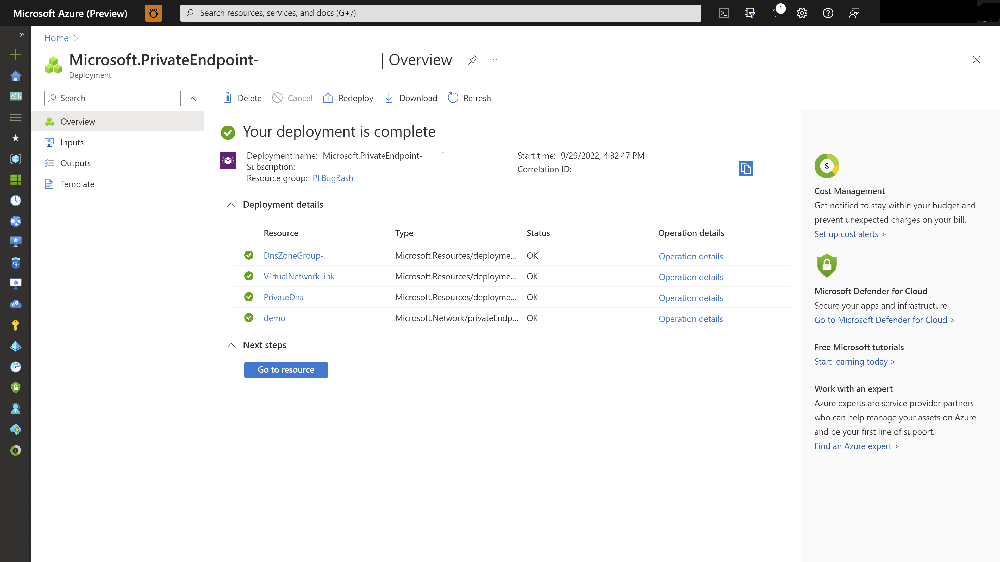
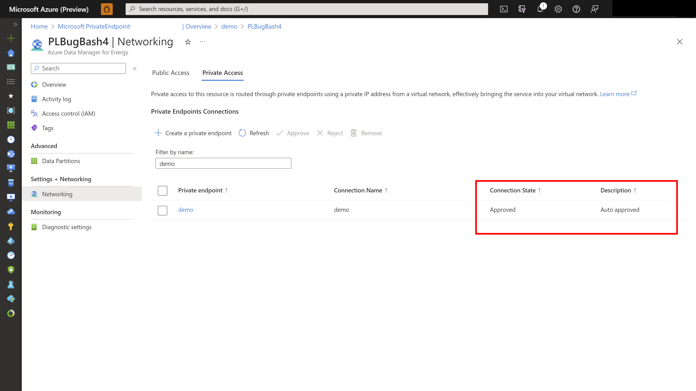
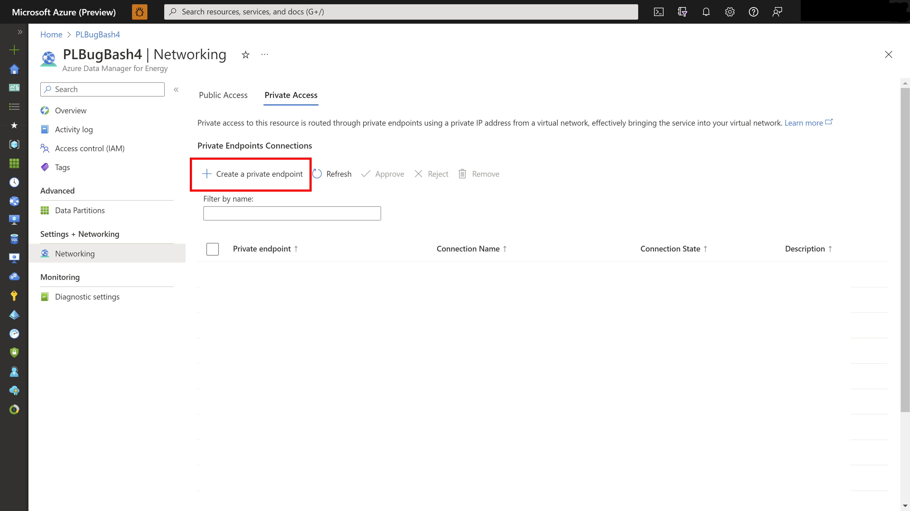

# Create a private endpoint for Microsoft Energy Data Services
[Azure Private Link](../private-link/private-link-overview.md) provides private connectivity from a virtual network to Azure platform as a service (PaaS). It simplifies the network architecture and secures the connection between endpoints in Azure by eliminating data exposure to the public internet.

By using Azure Private Link, you can connect to a Microsoft Energy Data Services Preview instance from your virtual network via a private endpoint, which is a set of private IP addresses in a subnet within the virtual network. You can then limit access to your Microsoft Energy Data Services instance over these private IP addresses. 

You can connect to a Microsoft Energy Data Services instance that's configured with Private Link by using an automatic or manual approval method. To learn more, see the [Private Link documentation](../private-link/private-endpoint-overview.md#access-to-a-private-link-resource-using-approval-workflow).

This article describes how to set up a private endpoint for Microsoft Energy Data Services. 

[!INCLUDE [preview features callout](./includes/preview/preview-callout.md)]

## Prerequisites

[Create a virtual network](../virtual-network/quick-create-portal.md) in the same subscription as the Microsoft Energy Data Services instance. This virtual network will allow automatic approval of the Private Link endpoint.

## Create a private endpoint by using the Azure portal

Use the following steps to create a private endpoint for an existing Microsoft Energy Data Services Preview instance by using the Azure portal:

1. From the **All resources** pane, choose a Microsoft Energy Data Services Preview instance.
1. Select **Networking** from the list of settings.       
1. On the **Public Access** tab, select **Enabled from all networks** to allow traffic from all networks.

    
	
    If you want to block traffic from all networks, select **Disabled**.

1. Select the **Private Access** tab, and then select **Create a private endpoint**.
 
    
 
1. In the **Create a private endpoint** wizard, on the **Basics** page, enter or select the following details:

    |Setting| Value|
    |--------|-----|
    |**Subscription**| Select your subscription for the project.|
    |**Resource group**| Select a resource group for the project.|
    |**Name**| Enter a name for your private endpoint. The name must be unique.|
    |**Region**| Select the region where you want to deploy Private Link. |

    
	
    > [!NOTE]
    > Automatic approval happens only when the Microsoft Energy Data Services instance and the virtual network for the private endpoint are in the same subscription.

1. Select **Next: Resource**. On the **Resource** page, confirm the following information:

    |Setting| Value|
    |--------|--------|
    |**Subscription**| Your subscription|
    |**Resource type**|	**Microsoft.OpenEnergyPlatform/energyServices**|
    |**Resource**| Your Microsoft Energy Data Services instance|
    |**Target sub-resource**| **MEDS** (for Microsoft Energy Data Services) by default|
	
    
 
1. Select **Next: Virtual Network**. On the **Virtual Network** page, you can:

    * Configure network and private IP settings. [Learn more](../private-link/create-private-endpoint-portal.md#create-a-private-endpoint).

    * Configure a private endpoint with an application security group. [Learn more](../private-link/configure-asg-private-endpoint.md#create-private-endpoint-with-an-asg).

    

1. Select **Next: DNS**. On the **DNS** page, you can leave the default settings or configure private DNS integration. [Learn more](../private-link/private-endpoint-overview.md#dns-configuration).

    

1. Select **Next: Tags**. On the **Tags** page, you can add tags to categorize resources.
1. Select **Review + create**. On the **Review + create** page, Azure validates your configuration.

    When you see **Validation passed**, select **Create**.

    
 
1. After the deployment is complete, select **Go to resource**. 

    
  
1. Confirm that the private endpoint that you created was automatically approved.

    
 
1. Select the **Microsoft Energy Data Services** instance, select **Networking**, and then select the **Private Access** tab. Confirm that your newly created private endpoint connection appears in the list.

    

> [!NOTE]
> When the Microsoft Energy Data Services instance and the virtual network are in different tenants or subscriptions, you have to manually approve the request to create a private endpoint. The **Approve** and **Reject** buttons appear on the **Private Access** tab. 
>
> 

## Next steps
<!-- Add a context sentence for the following links -->
To learn more about using customer Lockbox as an interface to review and approve or reject access requests.
> [!div class="nextstepaction"]
> [Use Lockbox for Microsoft Energy Data Services](how-to-create-lockbox.md)
