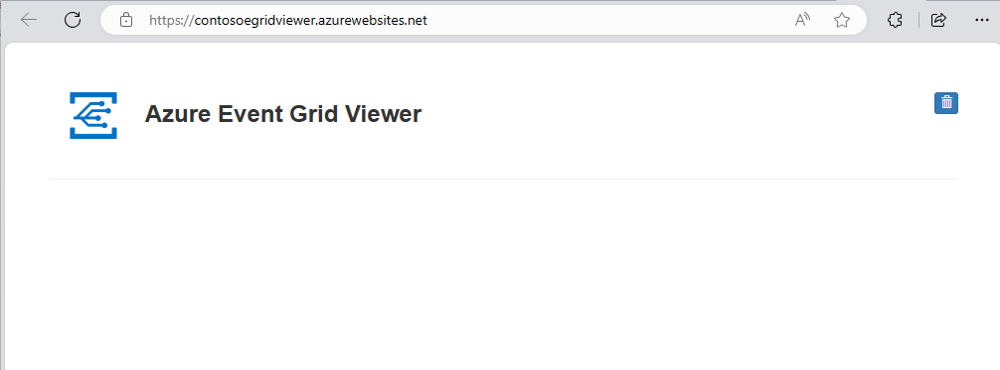
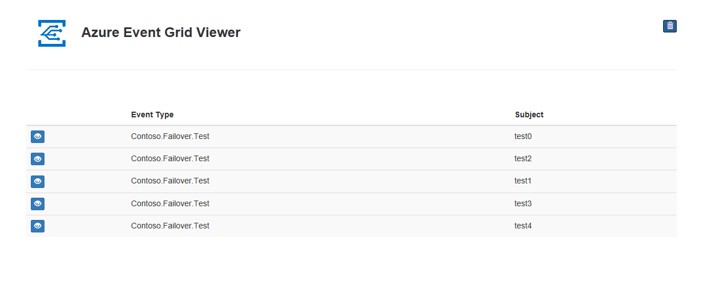

# Build your own disaster recovery for Custom Topics in Event Grid

Disaster recovery focuses on recovering from a severe loss of application functionality. This tutorial will walk you through how to set up your eventing architecture to recover if the Event Grid service becomes unhealthy in a particular region.

In this tutorial, you'll learn how to create an active-passive failover architecture for custom topics in Event Grid. You'll accomplish failover by mirroring your topics and subscriptions across two regions and then managing a failover when a topic becomes unhealthy. The architecture in this tutorial fails over all new traffic. it's important to be aware, with this setup, events already in flight won't be recovered until the compromised region is healthy again.

## Create a message endpoint

To test your failover configuration, you'll need an endpoint to receive your events at. The endpoint isn't part of your failover infrastructure, but will act as our event handler to make it easier to test.

To simplify testing, deploy a [pre-built web app](https://github.com/Azure-Samples/azure-event-grid-viewer) that displays the event messages. The deployed solution includes an App Service plan, an App Service web app, and source code from GitHub.

1. Select **Deploy to Azure** to deploy the solution to your subscription. In the Azure portal, provide values for the parameters.

   <a href="https://portal.azure.com/#create/Microsoft.Template/uri/https%3A%2F%2Fraw.githubusercontent.com%2FAzure-Samples%2Fazure-event-grid-viewer%2Fmaster%2Fazuredeploy.json" target="_blank"></a>

1. The deployment may take a few minutes to complete. After the deployment has succeeded, view your web app to make sure it's running. In a web browser, navigate to: 
`https://<your-site-name>.azurewebsites.net`
Make sure to note this URL as you'll need it later.

1. You see the site but no events have been posted to it yet.

   

[!INCLUDE [event-grid-register-provider-portal.md](../../includes/event-grid-register-provider-portal.md)]


## Create your primary and secondary topics

First, create two Event Grid topics. These topics will act as your primary and secondary. By default, your events will flow through your primary topic. If there is a service outage in the primary region, your secondary will take over.

1. Sign in to the [Azure portal](https://portal.azure.com). 

1. From the upper left corner of the main Azure menu, 
choose **All services** > search for **Event Grid** > select **Event Grid Topics**.

   

    Select the star next to Event Grid Topics to add it to resource menu for easier access in the future.

1. In the Event Grid Topics Menu, select **+ADD** to create your primary topic.

    * Give the topic a logical name and add "-primary" as a suffix to make it easy to track.
    * This topic's region will be your primary region.

    

1. Once the Topic has been created, navigate to it and copy the **Topic Endpoint**. you'll need the URI later.

    

1. Get the access key for the topic, which you'll also need later. Click on **Access keys** in the resource menu and copy Key 1.

    

1. In the Topic blade, click **+Event Subscription** to create a subscription connecting your subscribing the event receiver website you made in the pre-requisites to the tutorial.

    * Give the event subscription a logical name and add "-primary" as a suffix to make it easy to track.
    * Select Endpoint Type Web Hook.
    * Set the endpoint to your event receiver's event URL, which should look something like: `https://<your-event-reciever>.azurewebsites.net/api/updates`

    

1. Repeat the same flow to create your secondary topic and subscription. This time, replace the "-primary" suffix with "-secondary" for easier tracking. Finally, make sure you put it in a different Azure Region. While you can put it anywhere you want, it's recommended that you use the [Azure Paired Regions](../best-practices-availability-paired-regions.md). Putting the secondary topic and subscription in a different region ensures that your new events will flow even if the primary region goes down.

You should now have:

   * An event receiver website for testing.
   * A primary topic in your primary region.
   * A primary event subscription connecting your primary topic to the event receiver website.
   * A secondary topic in your secondary region.
   * A secondary event subscription connecting your primary topic to the event receiver website.

## Implement client-side failover

Now that you have a regionally redundant pair of topics and subscriptions setup, you're ready to implement client-side failover. There are several ways to accomplish it, but all failover implementations will have a common feature: if one topic is no longer healthy, traffic will redirect to the other topic.

### Basic client-side implementation

The following sample code is a simple .Net publisher that will always attempt to publish to your primary topic first. If it doesn't succeed, it will then failover the secondary topic. In either case, it also checks the health api of the other topic by doing a GET on `https://<topic-name>.<topic-region>.eventgrid.azure.net/api/health`. A healthy topic should always respond with **200 OK** when a GET is made on the **/api/health** endpoint.

```csharp
using System;
using System.Net.Http;
using System.Collections.Generic;
using Microsoft.Azure.EventGrid;
using Microsoft.Azure.EventGrid.Models;
using Newtonsoft.Json;

namespace EventGridFailoverPublisher
{
    // This captures the "Data" portion of an EventGridEvent on a custom topic
    class FailoverEventData
    {
        [JsonProperty(PropertyName = "teststatus")]
        public string TestStatus { get; set; }
    }

    class Program
    {
        static void Main(string[] args)
        {
            // TODO: Enter the endpoint each topic. You can find this topic endpoint value
            // in the "Overview" section in the "Event Grid Topics" blade in Azure Portal..
            string primaryTopic = "https://<primary-topic-name>.<primary-topic-region>.eventgrid.azure.net/api/events";
            string secondaryTopic = "https://<secondary-topic-name>.<secondary-topic-region>.eventgrid.azure.net/api/events";

            // TODO: Enter topic key for each topic. You can find this in the "Access Keys" section in the
            // "Event Grid Topics" blade in Azure Portal.
            string primaryTopicKey = "<your-primary-topic-key>";
            string secondaryTopicKey = "<your-secondary-topic-key>";

            string primaryTopicHostname = new Uri( primaryTopic).Host;
            string secondaryTopicHostname = new Uri(secondaryTopic).Host;

            Uri primaryTopicHealthProbe = new Uri("https://" + primaryTopicHostname + "/api/health");
            Uri secondaryTopicHealthProbe = new Uri("https://" + secondaryTopicHostname + "/api/health");

            var httpClient = new HttpClient();

            try
            {
                TopicCredentials topicCredentials = new TopicCredentials(primaryTopicKey);
                EventGridClient client = new EventGridClient(topicCredentials);

                client.PublishEventsAsync(primaryTopicHostname, GetEventsList()).GetAwaiter().GetResult();
                Console.Write("Published events to primary Event Grid topic.");

                HttpResponseMessage health = httpClient.GetAsync(secondaryTopicHealthProbe).Result;
                Console.Write("\n\nSecondary Topic health " + health);
            }
            catch (Microsoft.Rest.Azure.CloudException e)
            {
                TopicCredentials topicCredentials = new TopicCredentials(secondaryTopicKey);
                EventGridClient client = new EventGridClient(topicCredentials);

                client.PublishEventsAsync(secondaryTopicHostname, GetEventsList()).GetAwaiter().GetResult();
                Console.Write("Published events to secondary Event Grid topic. Reason for primary topic failure:\n\n" + e);

                HttpResponseMessage health = httpClient.GetAsync(primaryTopicHealthProbe).Result;
                Console.Write("\n\nPrimary Topic health " + health);
            }

            Console.ReadLine();
        }

        static IList<EventGridEvent> GetEventsList()
        {
            List<EventGridEvent> eventsList = new List<EventGridEvent>();

            for (int i = 0; i < 5; i++)
            {
                eventsList.Add(new EventGridEvent()
                {
                    Id = Guid.NewGuid().ToString(),
                    EventType = "Contoso.Failover.Test",
                    Data = new FailoverEventData()
                    {
                        TestStatus = "success"
                    },
                    EventTime = DateTime.Now,
                    Subject = "test" + i,
                    DataVersion = "2.0"
                });
            }

            return eventsList;
        }
    }
}
```

### Try it out

Now that you have all of your components in place, you can test out your failover implementation. Run the above sample in Visual Studio code, or your favorite environment. Replace the following four values with the endpoints and keys from your topics:

   * primaryTopic - the endpoint for your primary topic.
   * secondaryTopic - the endpoint for your secondary topic.
   * primaryTopicKey - the key for your primary topic.
   * secondaryTopicKey - the key for your secondary topic.

Try running the event publisher. You should see your test events land in your Event Grid viewer like below.



To make sure your failover is working, you can change a few characters in your primary topic key to make it no longer valid. Try running the publisher again. You should still see new events appear in your Event Grid viewer, however when you look at your console, you'll see that they are now being published via the secondary topic.

### Possible extensions

There are many ways to extend this sample based on your needs. For high-volume scenarios, you may want to regularly check the topic's health api independently. That way, if a topic were to go down, you don't need to check it with every single publish. Once you know a topic isn't healthy, you can default to publishing to the secondary topic.

Similarly, you may want to implement failback logic based on your specific needs. If publishing to the closest data center is critical for you to reduce latency, you can periodically probe the health api of a topic that has failed over. Once it's healthy again, you'll know it's safe to failback to the closer data center.

## Next steps

- Learn how to [receive events at an http endpoint](./receive-events.md)
- Discover how to [route events to Hybrid Connections](./custom-event-to-hybrid-connection.md)
- Learn about [disaster recovery using Azure DNS and Traffic Manager](https://docs.microsoft.com/azure/networking/disaster-recovery-dns-traffic-manager)