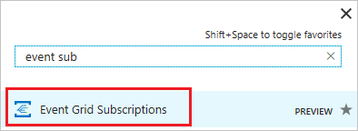
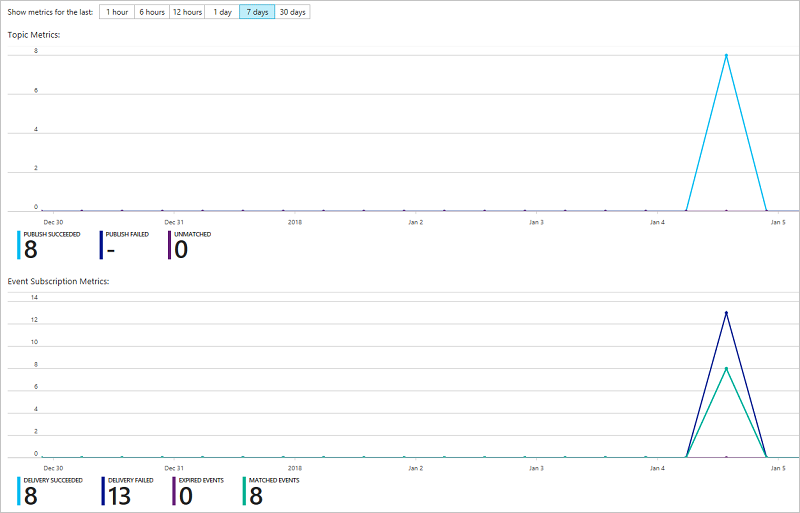
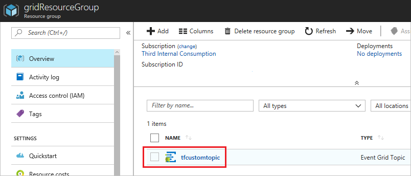
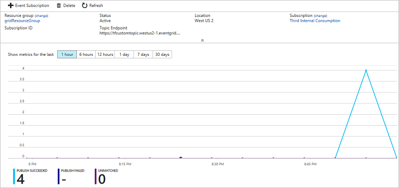

# Event Grid message delivery and retry 

This article describes how Azure Event Grid handles events when delivery is not acknowledged.

Event Grid provides durable delivery. It delivers each message at least once for each subscription. Events are sent to the registered webhook of each subscription immediately. If a webhook does not acknowledge receipt of an event within 60 seconds of the first delivery attempt, Event Grid retries delivery of the event.

## Message delivery status

Event Grid uses HTTP response codes to acknowledge receipt of events. 

### Success codes

The following HTTP response codes indicate that an event has been delivered successfully to your webhook. Event Grid considers delivery complete.

- 200 OK
- 202 Accepted

### Failure codes

The following HTTP response codes indicate that an event delivery attempt failed. Event Grid tries again to send the event. 

- 400 Bad Request
- 401 Unauthorized
- 404 Not Found
- 408 Request timeout
- 414 URI Too Long
- 500 Internal Server Error
- 503 Service Unavailable
- 504 Gateway Timeout

Any other response code or a lack of a response indicates a failure. Event Grid retries delivery. 

## Retry intervals

Event Grid uses an exponential backoff retry policy for event delivery. If your webhook does not respond or returns a failure code, Event Grid retries delivery on the following schedule:

1. 10 seconds
2. 30 seconds
3. 1 minute
4. 5 minutes
5. 10 minutes
6. 30 minutes
7. 1 hour

Event Grid adds a small randomization to all retry intervals.

## Retry duration

During the preview, Azure Event Grid expires all events that are not delivered within two hours.

## Monitoring

You can use the portal to see the status of event deliveries.

To see metrics for an event subscription, search for **Event Subscriptions** in the available services, and select it.

Filter by the type of event, the subscription, and location. Select **Metrics** for the subscription to view.

View the metrics for the event topic and subscription.

If you have published a custom topic, you can view the metrics for it. Select the resource group containing the topic, and select the topic.

View the metrics for the custom event topic.

## Next steps

* For an introduction to Event Grid, see [About Event Grid](overview.md).
* To quickly get started using Event Grid, see [Create and route custom events with Azure Event Grid](custom-event-quickstart.md).