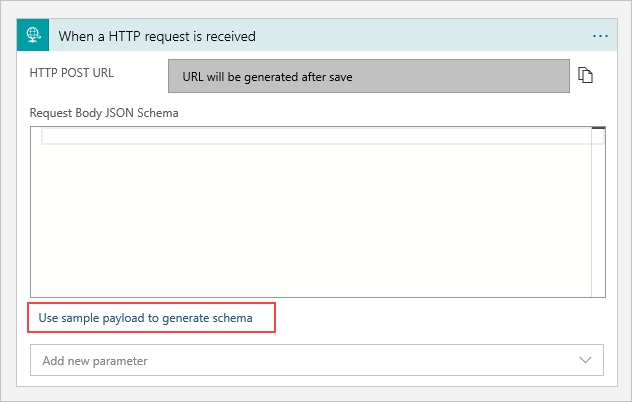
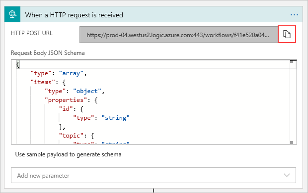
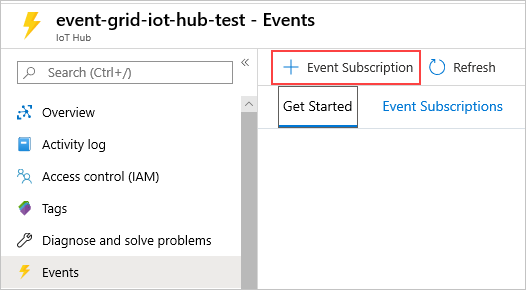
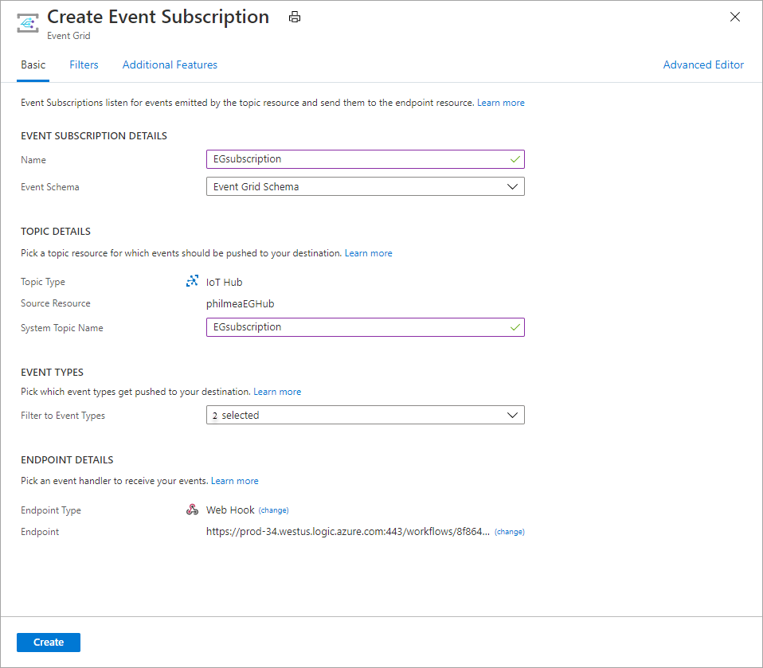

# Send email notifications about Azure IoT Hub events using Logic Apps

Azure Event Grid enables you to react to events in IoT Hub by triggering actions in your downstream business applications.

This article walks through a sample configuration that uses IoT Hub and Event grid. By the end, you will have an Azure logic app set up to send a notification email every time a device is added to your IoT hub. 

## Prerequisites

* An email account from any email provider that is supported by Azure Logic Apps, like Office 365 Outlook, Outlook.com, or Gmail. This email account is used to send the event notifications. For a complete list of supported Logic App connectors, see the [Connectors overview](https://docs.microsoft.com/connectors/)
* An active Azure account. If you don't have one, you can [create a free account](http://azure.microsoft.com/pricing/free-trial/).
* An IoT Hub in Azure. If you haven't created one yet, see [Get started with IoT Hub](../iot-hub/iot-hub-csharp-csharp-getstarted.md) for a walkthrough. 

## Create a logic app

First, create a logic app and add an Event grid trigger that monitors the resource group for your virtual machine. 

### Create a logic app resource

1. In the [Azure portal](https://portal.azure.com), select **New** > **Integration** > **Logic App**.

   

2. Give your logic app a name that's unique in your subscription, then select the same subscription, resource group, and location as your IoT hub. 
3. When you're ready, select **Pin to dashboard**, and choose **Create**.

   You've now created an Azure resource for your logic app. After Azure deploys your logic app, the Logic Apps Designer shows you templates for common patterns so you can get started faster.

   > [!NOTE] 
   > When you select **Pin to dashboard**, 
   > your logic app automatically opens in Logic Apps Designer. 
   > Otherwise, you can manually find and open your logic app.

4. In the Logic App Designer under **Templates**, choose **Blank Logic App** so that you can build your logic app from scratch.

### Select a trigger

A trigger is a specific event that starts your logic app. For this tutorial, the trigger that sets off the workflow is receiving a request over HTTP.  

1. In the connectors and triggers search bar, type **HTTP**.
2. Select **Request - When an HTTP request is received** as the trigger. 

   

3. Select **Use sample payload to generate schema**. 

   

4. Paste the following sample JSON code into the text box, then select **Done**:

```json
[{
  "id": "56afc886-767b-d359-d59e-0da7877166b2",
  "topic": "/SUBSCRIPTIONS/<subscription ID>/RESOURCEGROUPS/<resource group name>/PROVIDERS/MICROSOFT.DEVICES/IOTHUBS/<hub name>",
  "subject": "devices/LogicAppTestDevice",
  "eventType": "Microsoft.Devices.DeviceCreated",
  "eventTime": "2018-01-02T19:17:44.4383997Z",
  "data": {
    "twin": {
      "deviceId": "LogicAppTestDevice",
      "etag": "AAAAAAAAAAE=",
      "deviceEtag": "null",
      "status": "enabled",
      "statusUpdateTime": "0001-01-01T00:00:00",
      "connectionState": "Disconnected",
      "lastActivityTime": "0001-01-01T00:00:00",
      "cloudToDeviceMessageCount": 0,
      "authenticationType": "sas",
      "x509Thumbprint": {
        "primaryThumbprint": null,
        "secondaryThumbprint": null
      },
      "version": 2,
      "properties": {
        "desired": {
          "$metadata": {
            "$lastUpdated": "2018-01-02T19:17:44.4383997Z"
          },
          "$version": 1
        },
        "reported": {
          "$metadata": {
            "$lastUpdated": "2018-01-02T19:17:44.4383997Z"
          },
          "$version": 1
        }
      }
    },
    "hubName": "egtesthub1",
    "deviceId": "LogicAppTestDevice"
  },
  "dataVersion": "1",
  "metadataVersion": "1"
}]
```

5. You may receive a pop-up notification that says, **Remember to include a Content-Type header set to application/json in your request.** You can safely ignore this suggestion, and move on to the next section. 

### Create an action

Actions are any steps that occur after the trigger starts the logic app workflow. For this tutorial, the action is to send an email notification from your email provider. 

1. Select **New step**. This will open a window to **Choose an action**.
2. Search for **Email**.
3. Based on your email provider, find and select the matching connector. This tutorial uses **Office 365 Outlook**. The steps for other email providers are similar. 

   

4. Select the **Send an email** action. 
5. If prompted, sign in to your email account. 
6. Build your email template. 
   * **To**: Enter the email address to receive the notification emails. For this tutorial, use an email account that you can access for testing. 
   * **Subject** and **Body**: Write the text for your email. Select JSON properties from the selector tool to include dynamic content based on event data.  

   Your email template may look like this example:

   

7. Save your logic app. 

### Copy the HTTP URL

Before you leave the Logic Apps Designer, copy the URL that your logic apps is listening to for a trigger. You use this URL to configure Event Grid. 

1. Expand the **When a HTTP request is received** trigger configuration box by clicking on it. 
2. Copy the value of **HTTP POST URL** by selecting the copy button next to it. 

   

3. Save this URL so that you can refer to it in the next section. 

## Configure subscription for IoT Hub events

In this section, you configure your IoT Hub to publish events as they occur. 

1. In the Azure portal, navigate to your IoT hub. 
2. Select **Events**.

   

3. Select **Event subscription**. 

   

4. Create the event subscription with the following values: 
    * **Event Type**: Uncheck Subscribe to all event types and select **Device Created** from the menu.
    * **Endpoint Details**: Select Endpoint Type as **Web Hook** and click on select endpoint and paste the URL that you copied from your logic app and confirm selection.

    

    * **Event Subscription Details**: Provide a descriptive name and select **Event Grid Schema**

  You could save the event subscription here, and receive notifications for every device that is created in your IoT hub. For this tutorial, though, let's use the optional fields to filter for specific devices: 

  * **Subject Begins With**: Enter `devices/Building1_` to filter for device events in building 1.
  * **Subject Ends With**: Enter `_Temperature` to filter for device events related to temperature.

  When you're done, the form should look like the following example: 

    
    
5. Select **Create** to save the event subscription.

## Create a new device

Test your logic app by creating a new device to trigger an event notification email. 

1. From your IoT hub, select **IoT Devices**. 
2. Select **Add**.
3. For **Device ID**, enter `Building1_Floor1_Room1_Temperature`.
4. Select **Save**. 
5. You can add multiple devices with different device IDs to test the event subscription filters. Try these examples: 
   * Building1_Floor1_Room1_Light
   * Building1_Floor2_Room2_Temperature
   * Building2_Floor1_Room1_Temperature
   * Building2_Floor1_Room1_Light

Once you've added a few devices to your IoT hub, check your email to see which ones triggered the logic app. 

## Use the Azure CLI

Instead of using the Azure portal, you can accomplish the IoT Hub steps using the Azure CLI. For details, see the Azure CLI pages for [creating an event subscription](https://docs.microsoft.com/cli/azure/eventgrid/event-subscription) and [creating an IoT device](https://docs.microsoft.com/cli/azure/iot/device)

## Clean up resources

This tutorial used resources that incur charges on your Azure subscription. When you're done trying out the tutorial and testing your results, disable or delete resources that you don't want to keep. 

If you don't want to lose the work on your logic app, disable it instead of deleting it. 

1. Navigate to your logic app.
2. On the **Overview** blade select **Delete** or **Disable**. 

Each subscription can have one free IoT hub. If you created a free hub for this tutorial, then you don't need to delete it to prevent charges.

1. Navigate to your IoT hub. 
2. On the **Overview** blade select **Delete**. 

Even if you keep your IoT hub, you may want to delete the event subscription that you created. 

1. In your IoT hub, select **Event Grid**.
2. Select the event subscription that you want to remove. 
3. Select **Delete**. 

## Next steps

* Learn more about [Reacting to IoT Hub events by using Event Grid to trigger actions](../iot-hub/iot-hub-event-grid.md).
* [Learn how to order device connected and disconnected events](../iot-hub/iot-hub-how-to-order-connection-state-events.md)
* Learn about what else you can do with [Event Grid](overview.md).


