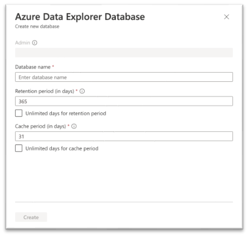
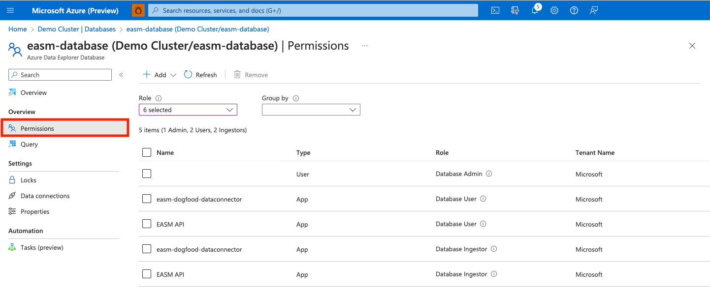
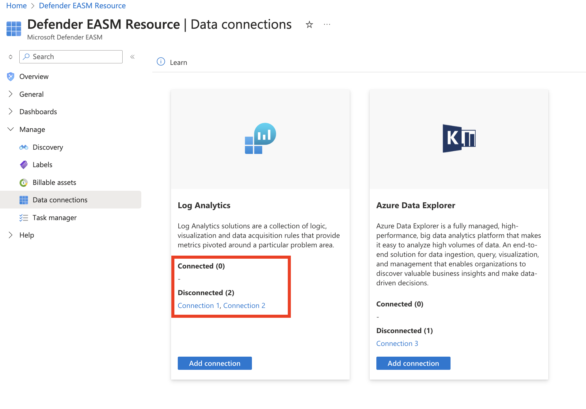

# Leveraging data connections

Microsoft Defender External Attack Surface Management (Defender EASM) now offers data connections to help users seamlessly integrate their attack surface data into other Microsoft solutions to supplement existing workflows with new insights.  Users must get data from Defender EASM into the other security tools they use for remediation purposes to best operationalize their attack surface data. 

The data connector sends Defender EASM asset data to two different platforms: Microsoft Log Analytics and Azure Data Explorer. Users need to be active customers to export Defender EASM data to either tool, and data connections are subject to the pricing model for each respective platform. 

[Microsoft Log Analytics](/azure/sentinel/overview) provides SIEM (security information and event management) and SOAR (security orchestration, automation and response) capabilities. Defender EASM asset or insights information can be used in Log Analytics to enrich existing workflows in conjunction with other security data. This information can supplement firewall and configuration information, threat intelligence, compliance data and more to provide visibility into your external-facing infrastructure on the open internet. Users can create or enrich security incidents, build investigation playbooks, train machine learning algorithms, or trigger remediation actions. 

[Azure Data Explorer](/azure/data-explorer/data-explorer-overview) is a big data analytics platform that helps users analyze high volumes of data from various sources with flexible customization capabilities. Defender EASM asset and insights data can be integrated to leverage visualization, query, ingestion and management capabilities within the platform. Whether building custom reports with Power BI or hunting for assets that match precise KQL queries, exporting Defender EASM data to Azure Data Explorer enables users to leverage their attack surface data with endless customization potential.

## Data content options

 Defender EASM data connections offers users the ability to integrate two different kinds of attack surface data into the tool of their choice. Users can elect to migrate asset data, attack surface insights or both data types. Asset data provides granular details about your entire inventory, whereas attack surface insights provide immediately actionable insights based on Defender EASM dashboards. 

To accurately present the infrastructure that matters most to your organization, please note that both content options will only include assets in the “Approved Inventory” state.

**Asset data**
 The Asset Data option will send data about all your inventory assets to the tool of your choice. This option is best for use cases where the granular underlying metadata is key to the operationalization of your Defender EASM integration (e.g. Sentinel, customized reporting in Data Explorer).  Users can export high-level context on every asset in inventory as well as granular details specific to the particular asset type. This option does not provide any pre-determined insights about the assets; instead, it offers an expansive amount of data so users can surface the customized insights they care about most.  

**Attack surface insights**
 Attack Surface Insights provide an actionable set of results based on the key insights delivered through dashboards in Defender EASM. This option provides less granular metadata on each asset; instead, it categorizes assets based on the corresponding insight(s) and provides the high-level context required to investigate further. This option is ideal for those who want to integrate these pre-determined insights into custom reporting workflows in conjunction with data from other tools.

## **Configuration overviews**

**Accessing data connections**
 Users can access Data Connections from the **Manage** section of the left-hand navigation pane within their Defender EASM resource blade. This page displays the data connectors for both Log Analytics and Azure Data Explorer, listing any current connections and providing the option to add, edit or remove connections. 

**Connection prerequisites**
 To successfully create a data connection, users must first ensure that they have completed the required steps to grant Defender EASM permission to the tool of their choice. This process enables the application to ingest our exported data and provides the authentication credentials needed to configure the connection. 

## Configuring Log Analytics permissions

1. Open the Log Analytics workspace that will ingest your Defender EASM data, or [create a new workspace](/azure/azure-monitor/logs/quick-create-workspace?tabs=azure-portal). 
2. Select **Access control (IAM)** from the left-hand navigation pane. For more information on access control, see [identity documentation](/azure/cloud-adoption-framework/decision-guides/identity/).
   

3. On this page, select **+Add** to create a new role assignment. 
4. From the **Role** tab, select **Contributor**. Click **Next**. 
5. Open the **Members** tab. Click **+ Select members** to open a configuration pane. Search for **“EASM API”** and click on the value in the members list. Once done, click **Select**, then **Review + assign.** 
6. Once the role assignment has been created, select **Agents** from the **Settings** section of the left-hand navigation menu.
   

7. Expand the **Log Analytics agent instructions** section to view your Workspace ID and Primary key. These values will be used to set up your data connection. Save the values in the following format: *WorkspaceId=XXX;ApiKey=YYY*
 
Please note that use of this data connection is subject to the pricing structure of Log Analytics. See [Azure monitor pricing](https://azure.microsoft.com/pricing/details/monitor/) for more information.  
   
   
   
## Configuring Data Explorer permissions

1. First, ensure that the Defender "EASM API" service principal has access to the correct roles in the database where you wish to export your attack surface data. For this reason, first ensure that your Defender EASM resource has been created in the appropriate tenant as this action provisions the EASM API principal.  
5. Open the Data Explorer cluster that will ingest your Defender EASM data or [create a new cluster](/azure/data-explorer/create-cluster-database-portal). 
6. Select **Databases** in the Data section of the left-hand navigation menu.
7. Select **+ Add Database** to create a database to house your Defender EASM data.
   

1. Name your database, configure retention and cache periods, then select **Create**.
   

1. Once your Defender EASM database has been created, click on the database name to open the details page. Select **Permissions** from the Overview section of the left-hand navigation menu.
   To successfully export Defender EASM data to Data Explorer, users must create two new permissions for the EASM API: **user** and **ingestor**.
   

1. First, select **+ Add** and create a user.  Search for “**EASM API**”, select the value then click **Select**. 
1. Select **+ Add** to create an ingestor.  Follow the same steps outlined above to add the **"EASM API"** as an ingestor. 
   
8.	Your database is now ready to connect to Defender EASM. You will need the cluster name, database name and region in the following format when configuring your Data Connection: *ClusterName=XXX;Region=YYY;DatabaseName=ZZZ*

## Add a data connection
 Users can connect their Defender EASM data to either Log Analytics or Azure Data Explorer. To do so, simply select **“Add connection”** for the appropriate tool from the Data Connections page.
A configuration pane will open on the right-hand side of the Data Connections screen. The following four fields are required:

- **Name**: enter a name for this data connection.
- **Connection String**: enter the details required to connect your Defender EASM resource to another tool.  For Log Analytics, users enter the workspaceID and coinciding API key associated to their account. For Azure Data Explorer, users enter the cluster name, region and database name associated to their account. Both values must be entered in the format shown when the field is blank.
- **Content**: users can select to integrate asset data, attack surface insights or both datasets. 
- **Frequency**: select the frequency that the Defender EASM connection sends updated data to the tool of your choice. Available options are daily, weekly and monthly.
   
   

   
   
   Once all four fields are configured, select **Add** to create the data connection. At this point, the Data Connections page will display a banner that indicates the resource has been successfully created and data will begin populating within 30 minutes. Once connections are created, they will be listed under the applicable tool on the main Data Connections page. 
   
## Edit or delete a data connection
 Users can edit or delete a data connection. For example, you may notice that a connection is listed as “Disconnected” and would therefore need to re-enter the configuration details to fix the issue.
To edit or delete a data connection: 

1. Select the appropriate connection from the list on the main Data Connections page.
   

1. This action will open a page that provides additional data about the connection. This page displays the configurations you elected when creating the connection, as well as any error messages. Users will also see the following additional data:
   •	**Recurring on**: the day of the week or month that Defender EASM sends updated data to the connected tool.
   •	**Created**: the date and time that the data connection was created.
   •	**Updated**: the date and time that the data connection was last updated.
   

1. From this page, users can elect to reconnect, edit or delete their data connection.

  - **Reconnect**: this option attempts to validate the data connection without any changes to the configuration. This option is best for those who have validated the authentication credentials used for the data connection.
  - **Edit**: this option allows users to change the configuration for the data connection.
  - **Delete**: this option deletes the data connection. 
   

