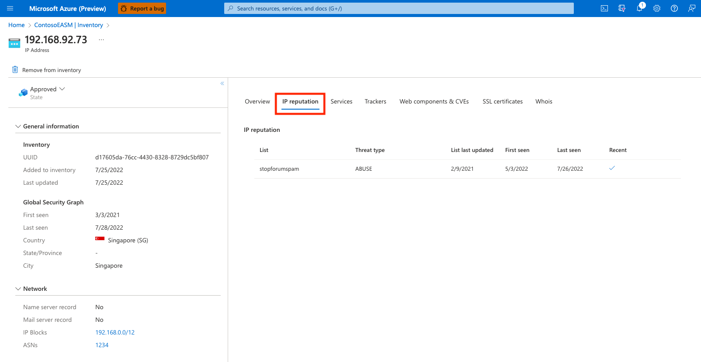
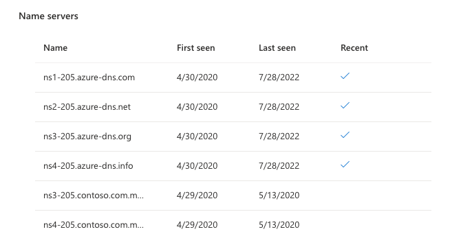
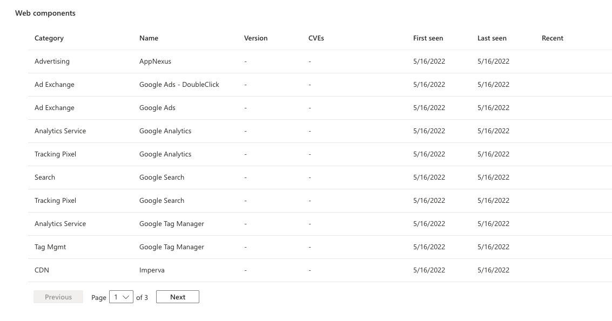

# Understanding asset details

## Overview

Defender EASM frequently scans all inventory assets, collecting robust contextual metadata that powers Attack Surface Insights and can also be viewed more granularly on the Asset Details page. The provided data changes depending on the asset type. For instance, the platform provides unique WHOIS data for domains, hosts and IP addresses and signature algorithm data for SSL certificates.

This article provides guidance on how to view and interpret the expansive data collected by Microsoft for each of your inventory assets. It defines this metadata for each asset type and explains how the insights derived from it can help you manage the security posture of your online infrastructure.

*For more information, see [understanding inventory assets](understanding-inventory-assets.md) to familiarize yourself with the key concepts mentioned in this article.*

## Asset details summary view

You can view the Asset Details page for any asset by clicking on its name from your inventory list. On the left pane of this page, you can view an asset summary that provides key information about that particular asset. This section is primarily comprised of data that applies to all asset types, although additional fields will be available in some cases. The chart below for more information on the metadata provided for each asset type in the summary section.

### General information

This section is comprised of high-level information that is key to understanding your assets at a glance. Most of these fields are applicable to all assets, although this section can also include information that is specific to one or more asset types.

| Name | Definition | Asset Types |
|--|--|--|
| Asset Name | The name of an asset. | All |
| UUID | This 128-bit label represents the universally unique identifier (UUID) for the | All |
| Added to inventory | The date than an asset was added to inventory, whether automatically to the “Approved Inventory” state or in another state (e.g. “Candidate”).  | All |
| Status | The status of the asset within the RiskIQ system. Options include Approved Inventory, Candidate, Dependencies, or Requires Investigation. | All |
| First seen (Global Security Graph) | The date that Microsoft first scanned the asset and added it to our comprehensive Global Security Graph.  | All |
| Last seen (Global Security Graph) | The date that Microsoft most recently scanned the asset. | All |
| Discovered on | Indicates the creation date of the Discovery Group that detected the asset.  | All |
| Last updated | The date that the asset was last updated, whether by new data discovered in a scan or manual user actions (e.g. a state change).  | All |
| Country | The country of origin detected for this asset. | All |
| State/Province | The state or province of origin detected for this asset. | All |
| City | The city of origin detected for this asset. | All |
| WhoIs name | The name associated with a Whois record. | Host |
| WhoIs email | The primary contact email in a Whois record. | Host |
| WhoIS organization | The listed organization in a Whois record. | Host |
| WhoIs registrar | The listed registrar in a Whois record. | Host |
| WhoIs name servers | The listed name servers in a Whois record. | Host |
| Certificate issued | The date when a certificate was issued. | SSL certificate |
| Certificate expires | The date when a certificate will expire. | SSL certificate |
| Serial number | The serial number associated with an SSL certificate. | SSL certificate |
| SSL version | The version of SSL that the certificate was registered | SSL certificate |
| Certificate key algorithm | The key algorithm used to encrypt the SSL certificate. | SSL certificate |
| Certificate key size | The number of bits within a SSL certificate key. | SSL certificate |
| Signature algorithm oid | The OID identifying the hash algorithm used to sign the certificate request. | SSL certificate |
| Self-signed | Indicates whether the SSL certificate was self-signed.| SSL certificate |

### Network

IP address information that provides additional context about the usage of the IP.

| Name | Definition | Asset Types |
|--|--|--|
| Name server record | Any name servers detected on the asset. | IP address |
| Mail server record | Any mail servers detected on the asset. | IP address |
| IP Blocks | The IP block that contains the IP address asset. | IP address |
| ASNs | The ASN associated with an asset. | IP address |

### Block info

Data specific to IP blocks that provides contextual information about its use.

| Name | Definition | Asset Types |
|--|--|--|
| CIDR | The Classless Inter-Domain Routing (CIDR) for an IP Block. | IP block |
| Network name | The network name associated to the IP block. | IP block |
| Organization name | The organization name found in the registration information for the IP block. | IP block |
| Org ID | The organization ID found in the registration information for the IP block. | IP block |
| ASNs | The ASN associated with the IP block. | IP block |
| Country | The country of origin as detected in the WhoIs registration information for the IP block. | IP block |

### Subject

Data specific to the subject (i.e. protected entity) associated with a SSL Certificate.

| Name | Definition | Asset Types |
|--|--|--|
| Common name | The Issuer Common Name of the subject of the SSL certificate. | SSL certificate |
| Alternate names | Any alternative common names for the subject of the SSL certificate.| SSL certificate |
| Organization name | The organization linked to the subject of the SSL certificate. | SSL certificate |
| Organization unit | Optional metadata that indicates the department within an organization that is responsible for the certificate. | SSL certificate |
| Locality | Denotes the city where the organization is located. | SSL certificate |
| Country | Denotes the country where the organization is located. | SSL certificate |
| State/Province | Denotes the state or province where the organization is located. | SSL certificate |

### Issuer

Data specific to the issuer of an SSL Certificate.

| Name | Definition | Asset Types |
|--|--|--|
| Common name | The common name of the issuer of the certificate. | SSL certificate |
| Alternate names | Any additional names of the issuer. | SSL certificate |
| Organization name | The name of the organization that orchestrated the issue of a certificate. | SSL certificate |
| Organization unit | Additional information about the organization issuing the certificate. | SSL certificate |

## Data tabs

In the right-hand pane of the Asset Details page, users can access more expansive data related to the selected asset. This data is organized in a series of categorized tabs. The available metadata tabs will change depending on the type of asset you’re viewing.

### Overview

The Overview tab provides key additional context to ensure that significant insights are quickly identifiable when viewing the details of an asset. This section will include key discovery data for all asset types, providing insight about how Microsoft maps the asset to your known infrastructure. This section can also include dashboard widgets that visualize insights that are particularly relevant to the asset type in question.

### Discovery chain

The discovery chain outlines the observed connections between a discovery seed and the asset. This information helps users visualize these connections and better understand why an asset was determined to belong to their organization. 

In the example below, we see that the seed domain is tied to this asset through the contact email in its WhoIs record. That same contact email was used to register the IP block that includes this particular IP address asset.

### Discovery information

This section provides information about the process used to detect the asset. It includes information about the discovery seed that connects to the asset, as well as the approval process. Options include “Approved Inventory” which indicates the relationship between the seed and discovered asset was strong enough to warrant an automatic approval by the Defender EASM system. Otherwise, the process will be listed as “Candidate”, indicating that the asset required manual approval to be incorporated into your inventory. This section also provides the "Last discovery run" date that indicates when the Discovery Group that initially detected the asset was last utilized for a discovery scan. 

### IP reputation

The IP reputation tab displays a list of potential threats related to a given IP address. This section outlines any detected malicious or suspicious activity that relates to the IP address. This is key to understanding the trustworthiness of your own attack surface; these threats can help organizations uncover past or present vulnerabilities in their infrastructure.

Defender EASM’s IP reputation data displays instances when the IP address was detected on a threat list. For instance, the recent detection in the example below shows that the IP address relates to a host known to be running a cryptocurrency miner. This data was derived from a suspicious host list supplied by CoinBlockers. Results are organized by the “last seen” date, surfacing the most relevant detections first. In this example, the IP address is present on an abnormally high number of threat feeds, indicating that the asset should be thoroughly investigated to prevent malicious activity in the future.

### Services

The “Services” tab is available for IP address, domain and host assets. This section provides information on services observed to be running on the asset, and includes IP addresses, name and mail servers, and open ports that correspond with additional types of infrastructure (e.g. remote access services). Defender EASM’s Services data is key to understanding the infrastructure powering your asset. It can also alert you of resources that are exposed on the open internet that should be protected.

### IP Addresses

This section provides insight on any IP addresses that are running on the asset’s infrastructure. On the Services tab, Defender EASM provides the name of the IP address, the first and last seen dates, and a recency column which indicates whether the IP address was observed during our most recent scan of the asset. If there is no checkbox in this column, the IP address has been seen in prior scans but is not currently running on the asset.

### Mail Servers

This section provides a list of any mail servers running on the asset, indicating that the asset is capable of sending emails. In this section, Defender EASM provides the name of the mail server, the first and last seen dates, and a recency column that indicates whether the mail server was detected during our most recent scan of the asset.

### Name Servers

This section displays any name servers running on the asset, providing resolution for a host. In this section, we provide the name of the mail server, the first and last seen dates, and a recency column that indicates whether the name server was detected during our most recent scan of the asset.

### Open Ports

This section lists any open ports detected on the asset. Microsoft scans around 230 distinct ports on a regular basis. This data is useful to identify any unsecured services that shouldn’t be accessible from the open internet, including databases, IoT devices, and network services like routers and switches. It’s also helpful in identifying shadow IT infrastructure or insecure remote access services.

In this section, Defender EASM provides the open port number, a description of the port, the last state it was observed in, the first and last seen dates, and a recency column that indicates whether the port was observed as open during Microsoft’s most recent scan.

### Trackers

Trackers are unique codes or values found within web pages and often are used to track user interaction. These codes can be used to correlate a disparate group of websites to a central entity. Microsoft's tracker dataset includes IDs from providers like Google, Yandex, Mixpanel, New Relic, Clicky and continues to grow on a regular basis.

In this section, Defender EASM provides the tracker type (e.g. GoogleAnalyticsID), the unique identifier value, and the first and last seen dates.

### Web components & CVEs

Web components are details describing the infrastructure of an asset as observed through a Microsoft scan. These components provide a high-level understanding of the technologies leveraged on the asset. Microsoft categorizes the specific components and includes version numbers when possible.

The Web components section provides the category, name and version of the component, as well as a list of any applicable CVEs that should be remediated. Defender EASM also provides a first and last seen date as well as a recency indicator; a checked box indicates that this infrastructure was observed during our most recent scan of the asset.

Web components are categorized based on their function. Options include:

| Web Component | Examples |
|--|--|
| Hosting Provider | hostingprovider.com |
| Server | Apache |
| DNS Server | ISC BIND |
| Data stores | MySQL, ElasticSearch, MongoDB |
| Remote access | OpenSSH, Microsoft Admin Center, Netscaler Gateway |
| Data Exchange | Pure-FTPd, |
| Internet of things (IoT) | HP Deskjet, Linksys Camera, Sonos |
| Email server | ArmorX, Lotus Domino, Symantec Messaging Gateway |
| Network device | Cisco Router, Motorola WAP, ZyXEL Modem |
| Building control | Linear eMerge, ASI Controls Weblink, Optergy |

Below the Web components section, users can view a list of all CVEs applicable to the list of web components. This provides a more granular view of the CVEs themselves, and the CVSS score indicating the level of risk it poses to your organization.

### Resources

The Resources tab provides insight on any JavaScript resources running on any page or host assets. When applicable to a host, these resources are aggregated to represent the JavaScript running on all pages on that host. This section provides an inventory of the JavaScript detected on each asset so that your organization has full visibility into these resources and can detect any changes. Defender EASM provides the resource URL and host, MD5 value, and first and last seen dates to help organizations effectively monitor the use of JavaScript resources across their inventory.

### SSL certificates

Certificates are used to secure communications between a browser and a web server via Secure Sockets Layer (SSL). This ensures that sensitive data in transit cannot be read, tampered with, or forged. This section of Defender EASM lists any SSL certificates detected on the asset, including key data like the issue and expiry dates.

### WhoIs

WhoIs is a protocol that is leveraged to query and respond to the databases that store data related to the registration and ownership of Internet resources. WhoIs contains key registration data that can apply to domains, hosts, IP addresses and IP blocks in Defender EASM. In the WhoIs data tab, Microsoft provides a robust amount of information associated with the registry of the asset.

Fields include:

| Field | Description |
|--|--|
| WhoIs server | A server set up by an ICANN-accredited registrar to acquire up-to-date information about entities that are registered with it. |
| Registrar | The company whose service was used to register an asset. Popular registrars include GoDaddy, Namecheap, and HostGator. |
| Domain status | Any status for a domain as set by the registry. These statuses can indicate that a domain is pending delete or transfer by the registrar or is simply active on the internet. This field can also denote the limitations of an asset; in the below example, “client delete prohibited” indicates that the registrar is unable to delete the asset. |
| Email | Any contact email addresses provided by the registrant. WhoIs allows registrants to specify the contact type; options include administrative, technical, registrant and registrar contacts. |
| Name | The name of a registrant, if provided. |
| Organization | The organization responsible for the registered entity. |
| Street | The street address for the registrant if provided|
| City | The city listed in the street address for the registrant if provided. |
| State | The state listed in the street address for the registrant if provided. |
| Postal Code | The postal code listed in the street address for the registrant if provided. |
| Country | The country listed in the street address for the registrant if provided. |
| Phone | The phone number associated with a registrant contact if provided. |
| Name Servers | Any name servers associated with the registered entity. |

It’s important to note that many organizations opt to obfuscate their registry information. In the example above, you can see that some of the contact email addresses end in “@anonymised.email” which is a placeholder in lieu of the real contact address. Furthermore, many of these fields are optional when configurating a registration, so any field with an empty value was not included by the registrant.

## Next steps

- [Understanding dashboards](understanding-dashboards.md)
- [Using and managing discovery](using-and-managing-discovery.md)
