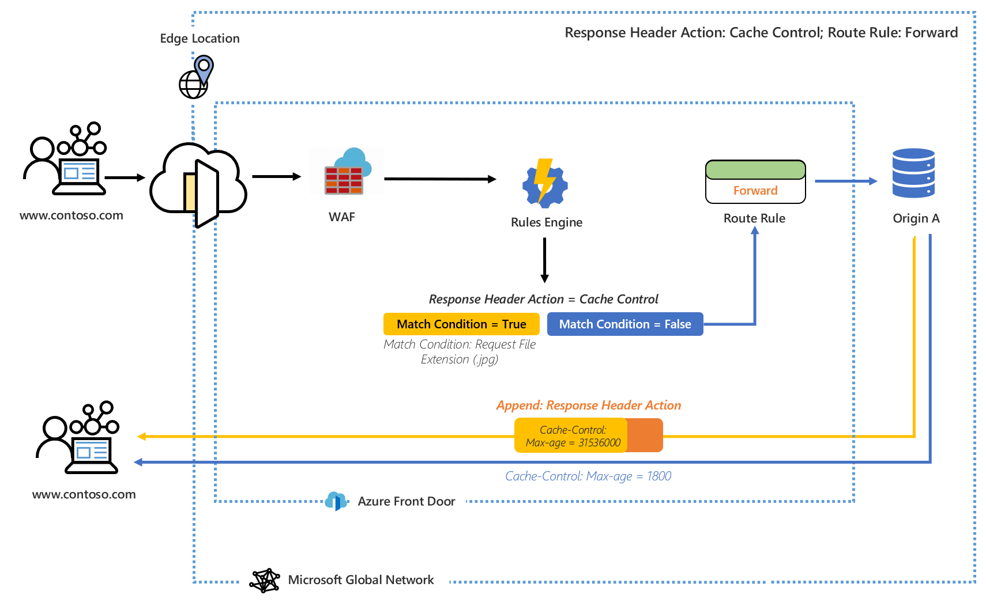
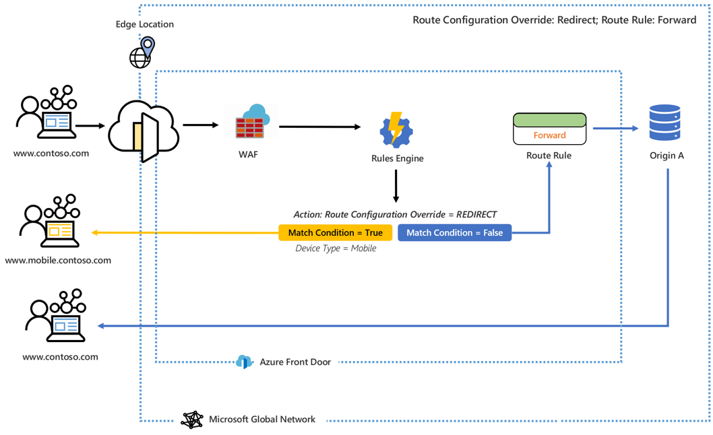

# What is Rules Engine for Azure Front Door? 

::: zone pivot="front-door-standard-premium"

A Rule set is a customized rules engine that groups a combination of rules into a single set. You can associate a Rule Set with multiple routes. The Rule set allows you to customize how requests get processed at the edge, and how Azure Front Door handles those requests.

## Common supported scenarios

* Implementing security headers to prevent browser-based vulnerabilities like HTTP Strict-Transport-Security (HSTS), X-XSS-Protection, Content-Security-Policy, X-Frame-Options, and Access-Control-Allow-Origin headers for Cross-Origin Resource Sharing (CORS) scenarios. Security-based attributes can also be defined with cookies.

* Route requests to mobile or desktop versions of your application based on the client device type.

* Using redirect capabilities to return 301, 302, 307, and 308 redirects to the client to direct them to new hostnames, paths, query strings, or protocols.

* Dynamically modify the caching configuration of your route based on the incoming requests.

* Rewrite the request URL path and forwards the request to the appropriate origin in your configured origin group.

* Add, modify, or remove request/response header to hide sensitive information or capture important information through headers.

* Support server variables to dynamically change the request/response headers or URL rewrite paths/query strings, for example, when a new page load or when a form is posted. Server variable is currently supported on **[Rule set actions](front-door-rules-engine-actions.md)** only.

## Architecture

Rule Set handles requests at the edge. When a request arrives at your Azure Front Door Standard/Premium endpoint, WAF is executed first, followed by the settings configured in Route. Those settings include the Rule Set associated to the Route. Rule Sets are processed from top to bottom in the Route. The same applies to rules within a Rule Set. In order for all the actions in each rule to get executed, all the match conditions within a rule has to be satisfied. If a request doesn't match any of the conditions in your Rule Set configuration, then only configurations in Route will be executed.

If **Stop evaluating remaining rules** gets checked, then all of the remaining Rule Sets associated with the Route aren't executed.  

### Example

In the following diagram, WAF policies get executed first. A Rule Set gets configured to append a response header. Then the header changes the max-age of the cache control if the match condition gets met.

:::image type="content" source="./media/front-door-rules-engine/front-door-rule-set-architecture-1.png" alt-text="Diagram that shows architecture of Rule Set." lightbox="./media/front-door-rules-engine/front-door-rule-set-architecture-1-expanded.png":::

## Terminology

With Azure Front Door Rule set, you can create a combination of Rules Set configuration, each composed of a set of rules. The following out lines some helpful terminologies you'll come across when configuring your Rule Set.

For more quota limit, refer to [Azure subscription and service limits, quotas and constraints](../azure-resource-manager/management/azure-subscription-service-limits.md).

* *Rule set*: A set of rules that gets associated to one or multiple [routes](front-door-route-matching.md).

* *Rule set rule*: A rule composed of up to 10 match conditions and 5 actions. Rules are local to a Rule Set and cannot be exported to use across Rule Sets. Users can create the same rule in multiple Rule Sets.

* *Match condition*: There are many match conditions that you can configure to parse your incoming requests. A rule can contain up to 10 match conditions. Match conditions are evaluated with an **AND** operator. *Regular expression is supported in conditions*. A full list of match conditions can be found in [Rule set match conditions](rules-match-conditions.md).

* *Action*: An action dictate how Azure Front Door handles the incoming requests based on the matching conditions. You can modify the caching behaviors, modify request headers, response headers, set URL rewrite and URL redirection. *Server variables are supported on Action*. A rule can contain up to 10 match conditions. A full list of actions can be found in [Rule set actions](front-door-rules-engine-actions.md).

## ARM template support

Rule sets can be configured using Azure Resource Manager templates. [See an example template](https://github.com/Azure/azure-quickstart-templates/tree/master/quickstarts/microsoft.cdn/front-door-standard-premium-rule-set). You can customize the behavior by using the JSON or Bicep snippets included in the documentation examples for [match conditions](rules-match-conditions.md) and [actions](front-door-rules-engine-actions.md).

## Next steps

* Learn how to [create an Azure Front Door profile](standard-premium/create-front-door-portal.md).
* Learn how to configure your first [Rule set](standard-premium/how-to-configure-rule-set.md).

::: zone-end

::: zone pivot="front-door-classic"

Rules Engine allows you to customize how HTTP requests gets handled at the edge and provides a more controlled behavior to your web application. Rules Engine for Azure Front Door (classic) has several key features, including:

* Enforces HTTPS to ensure all your end users interact with your content over a secure connection.
* Implements security headers to prevent browser-based vulnerabilities like HTTP Strict-Transport-Security (HSTS), X-XSS-Protection, Content-Security-Policy, X-Frame-Options, and Access-Control-Allow-Origin headers for Cross-Origin Resource Sharing (CORS) scenarios. Security-based attributes can also be defined with cookies.
* Route requests to mobile or desktop versions of your application based on the patterns of request headers contents, cookies, or query strings.
* Use redirect capabilities to return 301, 302, 307, and 308 redirects to the client to direct to new hostnames, paths, or protocols.
- Dynamically modify the caching configuration of your route based on the incoming requests.
- Rewrite the request URL path and forward the request to the appropriate backend in your configured backend pool.

## Architecture 

Rules engine handles requests at the edge. When a request hits your Azure Front Door (classic) endpoint, WAF is executed first, followed by the Rules Engine configuration associated with your Frontend/Domain. If a Rules Engine configuration is executed, the means the parent routing rule is already a match. In order for all the actions in each rule to get executed, all the match conditions within a rule has to be satisfied. If a request doesn't match any of the conditions in your Rule Engine configuration, then the default Routing Rule is executed. 

For example, in the following diagram, a Rules Engine gets configured to append a response header. The header changes the max-age of the cache control if the match condition gets met. 

In another example, we see that Rules Engine is configured to send a user to a mobile version of the site if the match condition, device type, is true. 

In both of these examples, when none of the match conditions are met, the specified Route Rule is what gets executed. 

## Terminology 

With Azure Front Door (classic) Rules Engine, you can create a combination of Rules Engine configurations, each composed of a set of rules. The following outlines some helpful terminology you will come across when configuring your Rules Engine. 

- *Rules Engine Configuration*: A set of rules that are applied to single Route Rule. Each configuration is limited to 25 rules. You can create up to 10 configurations. 
- *Rules Engine Rule*: A rule composed of up to 10 match conditions and 5 actions.
- *Match Condition*: There are many match conditions that can be utilized to parse your incoming requests. A rule can contain up to 10 match conditions. Match conditions are evaluated with an **AND** operator. A full list of match conditions can  be found [here](front-door-rules-engine-match-conditions.md). 
- *Action*: Actions dictate what happens to your incoming requests - request/response header actions, forwarding, redirects, and rewrites are all available today. A rule can contain up to five actions; however, a rule may only contain one route configuration override.  A full list of actions can be found [here](front-door-rules-engine-actions.md).

## Next steps

- Learn how to configure your first [Rules Engine configuration](front-door-tutorial-rules-engine.md). 
- Learn how to [create an Azure Front Door (classic) profile](quickstart-create-front-door.md).
- Learn [how Front Door works](front-door-routing-architecture.md).

::: zone-end
