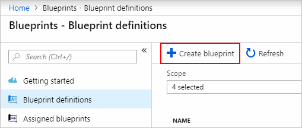
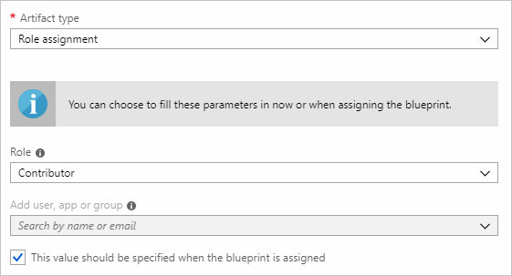
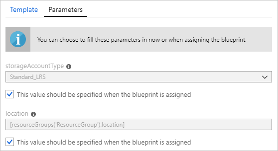
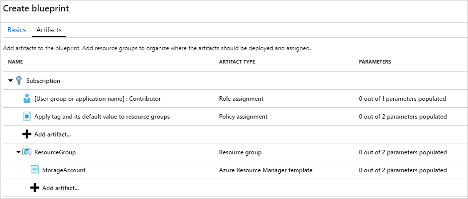
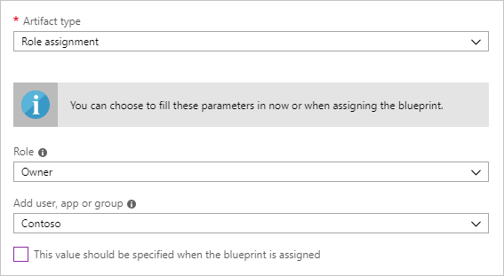
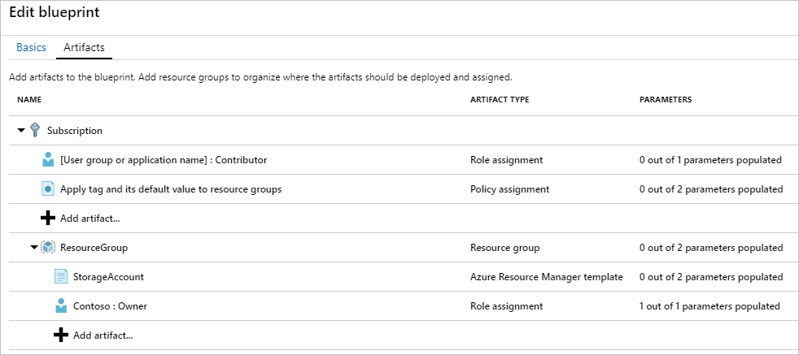
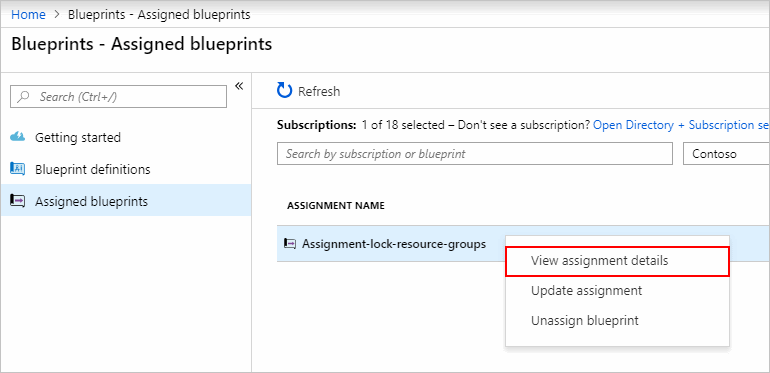

# Define and assign an Azure Blueprint in the portal

Learning how to create and assign blueprints enables the definition of common patterns to develop
reusable and rapidly deployable configurations based on Resource Manager templates, policy,
security, and more. In this tutorial, you learn to use Azure Blueprints to do some of the common
tasks related to creating, publishing, and assigning a blueprint within your organization, such as:

> [!div class="checklist"]
> - Create a new blueprint and add various supported artifacts
> - Make changes to an existing blueprint still in **Draft**
> - Mark a blueprint as ready to assign with **Published**
> - Assign a blueprint to an existing subscription
> - Check the status and progress of an assigned blueprint
> - Remove a blueprint that has been assigned to a subscription

If you don't have an Azure subscription, create a [free account](https://azure.microsoft.com/free) before you begin.

## Create a blueprint

The first step in defining a standard pattern for compliance is to compose a blueprint from the
available resources. In this example, create a new blueprint named 'MyBlueprint' to configure role
and policy assignments for the subscription, add a new resource group, and create a Resource
Manager template and role assignment on the new resource group.

1. Click on **All services** and searching for and selecting **Policy** in the left pane. On the **Policy** page, click on **Blueprints**.

1. Select **Blueprint Definitions** from the page on the left and click the **+ Create Blueprint** button at the top of the page.

   - Alternately, click on **Create** from the **Getting started** page to go straight to creating a blueprint.

   

1. Provide a **Blueprint Name** such as 'MyBlueprint' (letters and numbers -- up to 48 characters, but no spaces or special characters) for the blueprint, but leave **Blueprint Description** blank for now.  In the **Definition Location** box, click the ellipsis on the right, select the [management group](../management-groups/overview.md) or subscription where you want to save the blueprint and click **Select**.

1. Verify the information is correct (the **Blueprint Name** and **Definition Location** fields can't be changed later) and click **Next : Artifacts** at the bottom of the page or the **Artifacts** tab at the top of the page.

1. Add role assignment at subscription: Left-click on the **+ Add artifact...** row under **Subscription** and the 'Add artifact' window opens on the right side of the browser. Select 'Role Assignment' for _Artifact type_. Under _Role_, select 'Contributor' and leave the _Add User, App or Group_ field with the checkbox indicating a **dynamic parameter**. Click **Add** to add this artifact to the blueprint.

   

   > [!NOTE]
   > Most _artifacts_ support parameters. A parameter assigned a value during blueprint creation is
   > a **static parameter**. If the parameter is assigned during blueprint assignment, it is a
   > **dynamic parameter**. For more information, see [Blueprint parameters](./concepts/parameters.md).

1. Add policy assignment at subscription: Left-click on the **+ Add artifact...** row directly under the **Subscription**. Select 'Policy Assignment' for _Artifact type_. Change _Type_ to 'Built-in' and in _Search_ enter 'tag'. Click out of _Search_ for the filtering to occur. Select 'Apply tag and its default value to resource groups' by clicking on it. Click **Add** to add this artifact to the blueprint.

1. Click on the row of policy assignment 'Apply tag and its default value to resource groups'. The window to provide parameters to the artifact as part of the blueprint definition opens and allows setting the parameters for all assignments (**static parameters**) based on this blueprint instead of during assignment (**dynamic parameters**). This example uses **dynamic parameters** during blueprint assignment, so leave the defaults and click **Cancel**.

1. Add resource group at subscription: Left-click on the **+ Add artifact...** row under **Subscription**. Select 'Resource Group' for _Artifact type_. Leave the _Resource Group Name_ and _Location_ fields blank, but make sure that the checkbox is checked on each property to make them **dynamic parameters**. Click **Add** to add this artifact to the blueprint.

1. Add template under resource group: Left-click on the **+ Add artifact..** row directly under the **ResourceGroup** entry. Select 'Azure Resource Manager template' for _Artifact type_, set _Artifact display name_ to 'StorageAccount', and leave _Description_ blank. On the **Template** tab in the editor box, paste the following Resource Manager template. After pasting the template, click on the **Parameters** tab and note that the template parameter **storageAccountType** and default value **Standard_LRS** was automatically detected and populated, but configured as a **dynamic parameter**. Remove the check from the checkbox and note that the drop-down only contains values included in the Resource Manager template under **allowedValues**. Check the box to set it back to a **dynamic parameter**. Click **Add** to add this artifact to the blueprint.

   > [!IMPORTANT]
   > If importing the template, ensure that the file is only JSON and does not include HTML. When pointing to a URL on GitHub, ensure that you have clicked **RAW** to get the pure JSON file and not the one wrapped with HTML for display on GitHub. An error occurs if the imported template is not purely JSON.

   ```json
   {
       "$schema": "https://schema.management.azure.com/schemas/2015-01-01/deploymentTemplate.json#",
       "contentVersion": "1.0.0.0",
       "parameters": {
           "storageAccountType": {
               "type": "string",
               "defaultValue": "Standard_LRS",
               "allowedValues": [
                   "Standard_LRS",
                   "Standard_GRS",
                   "Standard_ZRS",
                   "Premium_LRS"
               ],
               "metadata": {
                   "description": "Storage Account type"
               }
           }
       },
       "variables": {
           "storageAccountName": "[concat(uniquestring(resourceGroup().id), 'standardsa')]"
       },
       "resources": [{
           "type": "Microsoft.Storage/storageAccounts",
           "name": "[variables('storageAccountName')]",
           "apiVersion": "2016-01-01",
           "location": "[resourceGroup().location]",
           "sku": {
               "name": "[parameters('storageAccountType')]"
           },
           "kind": "Storage",
           "properties": {}
       }],
       "outputs": {
           "storageAccountName": {
               "type": "string",
               "value": "[variables('storageAccountName')]"
           }
       }
   }
   ```

   

1. Your completed blueprint should look similar to the following. Notice that each artifact has '_x_ out of _y_ parameters populated' under the _Parameters_ column. The **dynamic parameters** are set during each assignment of the blueprint.

   

1. Now that all planned artifacts have been added, click **Save Draft** at the bottom of the page.

## Edit a blueprint

In [Create a blueprint](#create-a-blueprint), a Description wasn't provided nor the role assignment
added to the new resource group. Both can be fixed by following these steps:

1. Select **Blueprint Definitions** from the page on the left.

1. In the list of blueprints, right-click on the one you previously created and select **Edit Blueprint**.

1. In the **Blueprint Description**, provide some information about the blueprint and the artifacts that compose it.  In this case, enter something like: "This blueprint sets tag policy and role assignment on the subscription, creates a ResourceGroup, and deploys a resource template and role assignment to that ResourceGroup."

1. Click **Next : Artifacts** at the bottom of the page or the **Artifacts** tab at the top of the page.

1. Add role assignment under resource group: Left-click on the **+ Add artifact...** row directly under the **ResourceGroup** entry. Select 'Role Assignment' for _Artifact type_. Under _Role_, select 'Owner' and remove the check for the _Add User, App or Group_ field and search for and select a user, app, or group to add. This artifact uses a **static parameter** set the same in every assignment of this blueprint. Click **Add** to add this artifact to the blueprint.

   

1. Your completed blueprint should look similar to the following. Notice that the newly added role assignment shows **1 out of 1 parameters populated** meaning that it's a **static parameter**.

   

1. Click **Save Draft** now that it has been updated.

## Publish a blueprint

Now that all the planned artifacts have been added to the blueprint, it's time to publish it.
Publishing makes it available to be assigned to a subscription.

1. Select **Blueprint Definitions** from the page on the left.

1. In the list of blueprints, right-click on the one you previously created and select **Publish Blueprint**.

1. On the dialog that opens, provide a **Version** (letters, numbers, and hyphens with a max length of 20 characters) such as 'v1' and **Change notes** (optional) such as 'First publish'.

1. Click **Publish** at the bottom of the page.

## Assign a blueprint

Once a blueprint has been published, it can be assigned to a subscription. Assign the
blueprint you created to one of the subscriptions under your management group hierarchy. If the
blueprint is saved to a subscription, it can only be assigned to that subscription.

1. Select **Blueprint Definitions** from the page on the left.

1. In the list of blueprints, right-click on the one you previously created (or left-click on the ellipsis) and select **Assign Blueprint**.

1. On the **Assign Blueprint** page, select the subscription(s) you want to deploy this blueprint to from the **Subscription** drop-down.

   > [!NOTE]
   > An assignment is created for each subscription that is selected allowing changes to a
   > single subscription assignment at a later time without forcing changes on the remainder of the
   > selected subscriptions.

1. For **Assigned Name**, provide a unique name for this assignment.

1. In **Location**, select a region for the managed identity to be created in. Azure Blueprint uses this managed identity to deploy all artifacts in the assigned blueprint. To learn more, see [managed identities for Azure resources](../../active-directory/managed-identities-azure-resources/overview.md).

1. Leave the **Blueprint definition version** drop-down of **Published** versions on the 'v1' entry (default as the most recently **Published** version).

1. For **Lock Assignment**, leave the default of **Don't Lock**. For more information, see [blueprints resource locking](./concepts/resource-locking.md).

1. For the subscription level role assignment **[User group or application name] : Contributor**, search for and select a user, app, or group.

1. For the subscription level policy assignment, set the **Tag Name** to 'CostCenter' and the **Tag Value** to 'ContosoIT'.

1. For the 'ResourceGroup', provide a **Name** of 'StorageAccount' and a **Location** of 'East US 2' from the drop-down.

   > [!NOTE]
   > For each artifact that was added under the resource group during blueprint definition, that artifact is indented to align with the resource group or object it's to be deployed with. Artifacts that either do not take parameters or have no parameters to be defined at assignment are only listed for contextual information.

1. On the Azure Resource Manager template 'StorageAccount', select 'Standard_GRS' for the **storageAccountType** parameter.

1. Read the information box at the bottom of the page and then click **Assign**.

## Track deployment of a blueprint

When a blueprint has been assigned to one or more subscriptions, two things happen:

- The blueprint is added to the **Assigned Blueprints** page per subscription assigned to
- The process of deploying all the artifacts defined by the blueprint begins

Now that the blueprint has been assigned to a subscription, verify progress of the deployment.

1. Select **Assigned Blueprints** from the page on the left.

1. In the list of blueprints, right-click on the one you previously assigned and select **View Assignment Details**.

   

1. On the **Deployment Details** page, validate that all artifacts have been successfully deployed and that there have been no errors during the deployment. If errors occurred, see [troubleshooting blueprint](./troubleshoot/general.md) for steps to determine what went wrong.

## Unassign a blueprint

If no longer needed, remove a blueprint assignment from a subscription. The blueprint may have been
replaced by a newer blueprint with updated patterns, policies, and designs. When a blueprint is
removed, the artifacts assigned as part of that blueprint are left behind. To remove a blueprint
assignment, follow these steps:

1. Select **Assigned Blueprints** from the page on the left.

1. In the list of blueprints, select the blueprint that is to be unassigned and then click the **Unassign Blueprint** button at the top of the page.

1. Read the confirmation message and then click **OK**.

## Delete a blueprint

1. Select **Blueprint Definitions** from the page on the left.

1. Right-click on the blueprint you want to delete and select **Delete Blueprint**, then click **Yes** on the confirmation dialog.

> [!NOTE]
> Deleting a blueprint in this method also deletes all **Published versions** of the selected blueprint. To delete a single version, open the blueprint, click on **Published versions** tab, select and click on the version you wish to delete, then click **Delete This Version**. Also, a blueprint with assignments can't be deleted until all that blueprints assignments have been deleted.

## Next steps

- Learn about the [blueprint life-cycle](./concepts/lifecycle.md)
- Understand how to use [static and dynamic parameters](./concepts/parameters.md)
- Learn to customize the [blueprint sequencing order](./concepts/sequencing-order.md)
- Find out how to make use of [blueprint resource locking](./concepts/resource-locking.md)
- Learn how to [update existing assignments](./how-to/update-existing-assignments.md)
- Resolve issues during the assignment of a blueprint with [general troubleshooting](./troubleshoot/general.md)
