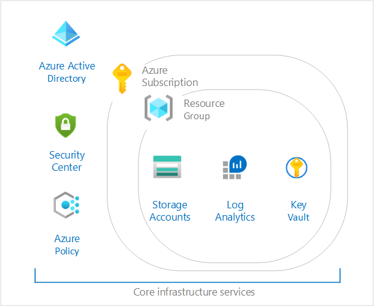

# Overview of the Microsoft Cloud Adoption Framework for Azure Foundation blueprint sample

The Microsoft Cloud Adoption Framework for Azure (CAF) Foundation blueprint deploys a set of core
infrastructure resources and policy controls required for your first production grade Azure
application. This foundation blueprint is based on the recommended pattern found in CAF.

## Architecture

The CAF Foundation blueprint sample deploys recommended infrastructure resources in Azure that can
be used by organizations to put in place the foundation controls necessary to manage their cloud
estate. This sample will deploy and enforce resources, policies, and templates that will allow an
organization to confidently get started with Azure.

This implementation incorporates several Azure services used to provide a secure, fully monitored,
enterprise-ready foundation. This environment is composed of:

- An [Azure Key Vault](../../../../key-vault/key-vault-whatis.md) instance used to host secrets used
  for the VMs deployed in the shared services environment
- Deploy [Log Analytics](../../../../azure-monitor/overview.md) is deployed to ensure all actions
  and services log to a central location from the moment you start your secure deployment in to [Storage Accounts](../../../../storage/common/storage-introduction.md)
  for diagnostic logging
- Deploy [Azure Security Center](../../../../security-center/security-center-intro.md) (standard
  version) provides threat protection for your migrated workloads
- The blueprint also defines and deploys [Azure Policies](../../../policy/overview.md), for 
  - Tagging (CostCenter) applied to resources groups
  - Append resources in resource group with the CostCenter Tag
  - Allowed Azure Region for Resources and Resource Groups
  - Allowed Storage Account SKUs (choose while deploying)
  - Allowed Azure VM SKUs	(choose while deploying)
  - Require Network Watch to be deployed 
  - Require Azure Storage Account Secure transfer Encryption
  - Deny resource types (choose while deploying)  
- Initiatives
  - Enable Monitoring in Azure Security Center (89 Policies)

All these elements abide to the proven practices published in the [Azure Architecture Center - Reference Architectures](/azure/architecture/reference-architectures/).

> [!NOTE]
> The CAF Foundation lays out a foundational architecture for workloads.
> You still need to deploy workloads behind this foundational architecture.

For more information, see the
[Microsoft Cloud Adoption Framework for Azure - Ready](/azure/architecture/cloud-adoption/ready/azure-readiness-guide/govern-org-compliance?tabs=AzurePolicy).

## Next steps

You've reviewed the overview and architecture of the CAF Foundation blueprint sample.

> [!div class="nextstepaction"]
>  [CAF Foundation blueprint - Deploy steps](./deploy.md)

Addition articles about blueprints and how to use them:

- Learn about the [blueprint life-cycle](../../concepts/lifecycle.md).
- Understand how to use [static and dynamic parameters](../../concepts/parameters.md).
- Learn to customize the [blueprint sequencing order](../../concepts/sequencing-order.md).
- Find out how to make use of [blueprint resource locking](../../concepts/resource-locking.md).
- Learn how to [update existing assignments](../../how-to/update-existing-assignments.md).