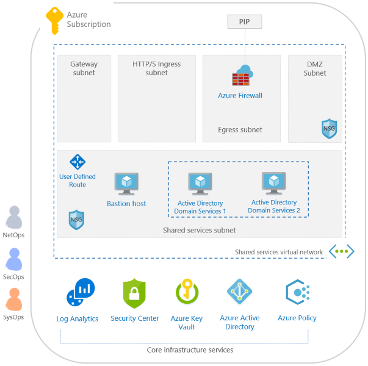

# Overview of the ISO 27001 Shared Services blueprint sample

The ISO 27001 Shared Services blueprint sample provides a set of compliant infrastructure patterns
and policy guard-rails that help towards ISO 27001 attestation. This blueprint helps customers
deploy cloud-based architectures that offer solutions to scenarios that have accreditation or
compliance requirements.

The [ISO 27001 App Service Environment/SQL Database workload](../iso27001-ase-sql-workload/index.md)
blueprint sample extends this sample.

## Architecture

The ISO 27001 Shared Services blueprint sample deploys a foundation infrastructure in Azure that can
be used by organizations to host multiple workloads based on the Virtual Datacenter (VDC) approach.
VDC is a proven set of reference architectures, automation tooling, and engagement model used by
Microsoft with its largest enterprise customers. The Shared Services blueprint sample is based on a
fully native Azure VDC environment shown below.

This environment is composed of several Azure services used to provide a secure, fully monitored,
enterprise-ready shared services infrastructure based on ISO 27001 standards. This environment is
composed of:

- [Role-based access control](../../../../role-based-access-control/overview.md) (RBAC) roles used
  for segregation of duties from a control plane perspective. Three roles are defined before
  deployment of any infrastructure:
  - NetOps role has the rights to manage the network environment, including firewall settings, NSG
    settings, routing, and other networking functionality
  - SecOps role has the necessary rights to deploy and manage [Azure Security Center](../../../../security-center/security-center-intro.md),
    define [Azure Policies](../../../policy/overview.md), and other security-related rights
  - SysOps role has the necessary rights to define [Azure Policies](../../../policy/overview.md)
    within the subscription, manage [Log Analytics](../../../../azure-monitor/overview.md) for the
    entire environment, among other operational rights
- [Log Analytics](../../../../azure-monitor/overview.md) is deployed as the first Azure service to
  ensure all actions and services log to a central location from the moment you start your secure
  deployment
- A virtual network supporting subnets for connectivity back to an on-premises datacenter, an
  ingress and egress stack for Internet connectivity, and a shared service subnet using NSGs and
  ASGs for full micro-segmentation containing:
  - A jumpbox or bastion host used for management purposes, which can only be accessed over an [Azure Firewall](../../../../firewall/overview.md)
    deployed in the ingress stack subnet
  - Two virtual machines running Active Directory Domain Services (ADDS) and DNS only accessible
    through the jumpbox, and can be configured only to replicate AD over a VPN or [ExpressRoute](../../../../expressroute/expressroute-introduction.md)
    connection (not deployed by the blueprint)
  - Use of [Azure Net Watcher](../../../../network-watcher/network-watcher-monitoring-overview.md)
    and standard DDoS protection
- An [Azure Key Vault](../../../../key-vault/key-vault-overview.md) instance used to host secrets used
  for the VMs deployed in the shared services environment

All these elements abide to the proven practices published in the [Azure Architecture Center - Reference Architectures](/azure/architecture/reference-architectures/).

> [!NOTE]
> The ISO 27001 Shared Services infrastructure lays out a foundational architecture for workloads.
> You still need to deploy workloads behind this foundational architecture.

For more information, see the [Virtual Datacenter documentation](/azure/architecture/vdc/).

## Next steps

You've reviewed the overview and architecture of the ISO 27001 Shared Services blueprint sample.
Next, visit the following articles to learn about the control mapping and how to deploy this
sample:

> [!div class="nextstepaction"]
> [ISO 27001 Shared Services blueprint - Control mapping](./control-mapping.md)
> [ISO 27001 Shared Services blueprint - Deploy steps](./deploy.md)

Additional articles about blueprints and how to use them:

- Learn about the [blueprint lifecycle](../../concepts/lifecycle.md).
- Understand how to use [static and dynamic parameters](../../concepts/parameters.md).
- Learn to customize the [blueprint sequencing order](../../concepts/sequencing-order.md).
- Find out how to make use of [blueprint resource locking](../../concepts/resource-locking.md).
- Learn how to [update existing assignments](../../how-to/update-existing-assignments.md).