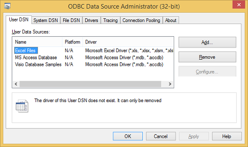
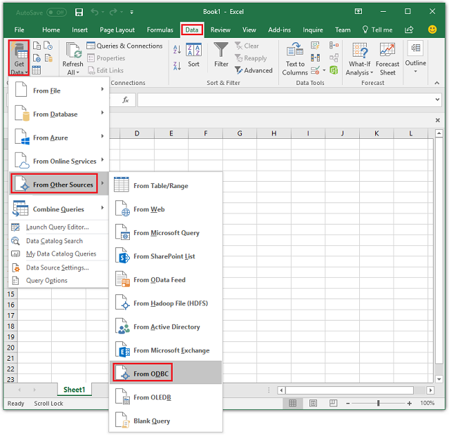
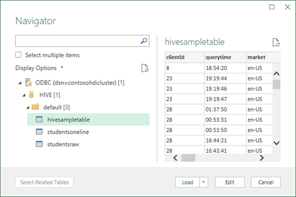

# Connect Excel to Hadoop in Azure HDInsight with the Microsoft Hive ODBC driver

[!INCLUDE [ODBC-JDBC-selector](../../includes/hdinsight-selector-odbc-jdbc.md)]

Microsoft's Big Data solution integrates Microsoft Business Intelligence (BI) components with Apache Hadoop clusters that have been deployed by the Azure HDInsight. An example of this integration is the ability to connect Excel to the Hive data warehouse of a Hadoop cluster in HDInsight using the Microsoft Hive Open Database Connectivity (ODBC) Driver.

It is also possible to connect the data associated with an HDInsight cluster and other data sources, including other (non-HDInsight) Hadoop clusters, from Excel using the Microsoft Power Query add-in for Excel. For information on installing and using Power Query, see [Connect Excel to HDInsight with Power Query][hdinsight-power-query].

> [!NOTE]
> While the steps in this article can be used with either a Linux or Windows-based HDInsight cluster, Windows is required for the client workstation.
> 
> 

**Prerequisites**:

Before you begin this article, you must have the following items:

* **An HDInsight cluster**. To create one, see [Get started with Azure HDInsight][hdinsight-get-started].
* **A workstation** with Office 2013 Professional Plus, Office 365 Pro Plus, Excel 2013 Standalone, or Office 2010 Professional Plus.

## Install Microsoft Hive ODBC driver
Download and install Microsoft Hive ODBC Driver from the [Download Center][hive-odbc-driver-download].

This driver can be installed on 32-bit or 64-bit versions of Windows 7, Windows 8, Windows 10, Windows Server 2008 R2, and Windows Server 2012. The driver allows connection to Azure HDInsight (version 1.6 and later) and Azure HDInsight Emulator (v.1.0.0.0 and later). You shall install the version that matches the version of the application where you use the ODBC driver. For this tutorial, the driver is used from Office Excel.

## Create Hive ODBC data source
The following steps show you how to create a Hive ODBC Data Source.

1. From Windows 8 or Windows 10, press the Windows key to open the Start screen, and then type **data sources**.
2. Click **Set up ODBC Data sources (32-bit)** or **Set up ODBC Data Sources (64-bit)** depending on your Office version. If you are using Windows 7, choose **ODBC Data Sources (32 bit)** or **ODBC Data Sources (64 bit)** from **Administrative Tools**. You shall see the **ODBC Data Source Administrator** dialog.
   
    

3. From User DNS, click **Add** to open the **Create New Data Source** wizard.
4. Select **Microsoft Hive ODBC Driver**, and then click **Finish**. You shall see the **Microsoft Hive ODBC Driver DNS Setup** dialog.
5. Type or select the following values:
   
   | Property | Description |
   | --- | --- |
   |  Data Source Name |Give a name to your data source |
   |  Host |Enter &lt;HDInsightClusterName>.azurehdinsight.net. For example, myHDICluster.azurehdinsight.net |
   |  Port |Use <strong>443</strong>. (This port has been changed from 563 to 443.) |
   |  Database |Use <strong>Default</strong>. |
   |  Mechanism |Select <strong>Azure HDInsight Service</strong> |
   |  User Name |Enter HDInsight cluster HTTP user username. The default username is <strong>admin</strong>. |
   |  Password |Enter HDInsight cluster user password. |
   
    </table>
   
    There are some important parameters to be aware of when you click **Advanced Options**:
   
   | Parameter | Description |
   | --- | --- |
   |  Use Native Query |When it is selected, the ODBC driver does NOT try to convert TSQL into HiveQL. You shall use it only if you are 100% sure you are submitting pure HiveQL statements. When connecting to SQL Server or Azure SQL Database, you should leave it unchecked. |
   |  Rows fetched per block |When fetching a large number of records, tuning this parameter may be required to ensure optimal performances. |
   |  Default string column length, Binary column length, Decimal column scale |The data type lengths and precisions may affect how data is returned. They cause incorrect information to be returned due to loss of precision and/or truncation. |

    

1. Click **Test** to test the data source. When the data source is configured correctly, it shows *TESTS COMPLETED SUCCESSFULLY!*.
2. Click **OK** to close the Test dialog. The new data source shall be listed on the **ODBC Data Source Administrator**.
3. Click **OK** to exit the wizard.

## Import data into Excel from HDInsight
The following steps describe the way to import data from a Hive table into an Excel workbook using the ODBC data source that you created in the previous section.

1. Open a new or existing workbook in Excel.
2. From the **Data** tab, click **Get Data**, click **From Other Sources**, and then click **From ODBC** to launch the **Data Connection Wizard**.
   
    
4. Select the data source name that you created in the last section, and then click **OK**.
5. Enter Hadoop user name (the default name is admin) and the password, and then click **Connect**.
6. On Navigator, expand **HIVE**, expand **default**, click **hivesampletable**, and then click **Load**. It takes a few seconds before data gets imported to Excel.

    

## Next steps
In this article, you learned how to use the Microsoft Hive ODBC driver to retrieve data from the HDInsight Service into Excel. Similarly, you can retrieve data from the HDInsight Service into SQL Database. It is also possible to upload data into an HDInsight Service. To learn more, see:

* [Visualize Hive data with Microsoft Power BI in Azure HDInsight](./hdinsight-connect-hive-power-bi.md).
* [Use Zeppelin to run Hive queries in Azure HDInsight ](./hdinsight-connect-hive-zeppelin.md).
* [Connect Excel to Hadoop by using Power Query](./hdinsight-connect-excel-power-query.md).
* [Connect to Azure HDInsight and run Hive queries using Data Lake Tools for Visual Studio](./hdinsight-hadoop-visual-studio-tools-get-started.md).
* [Use Visual Studio Code for Hive, LLAP or pySpark](hdinsight-for-vscode.md).
* [Upload data to HDInsight](./hdinsight-upload-data.md).

[hdinsight-use-sqoop]: hdinsight-use-sqoop.md
[hdinsight-analyze-flight-data]: hdinsight-analyze-flight-delay-data.md
[hdinsight-use-hive]: hdinsight-use-hive.md
[hdinsight-upload-data]: hdinsight-upload-data.md
[hdinsight-power-query]: hdinsight-connect-excel-power-query.md
[hdinsight-get-started]: hdinsight-hadoop-tutorial-get-started-windows.md

[hive-odbc-driver-download]: http://go.microsoft.com/fwlink/?LinkID=286698

