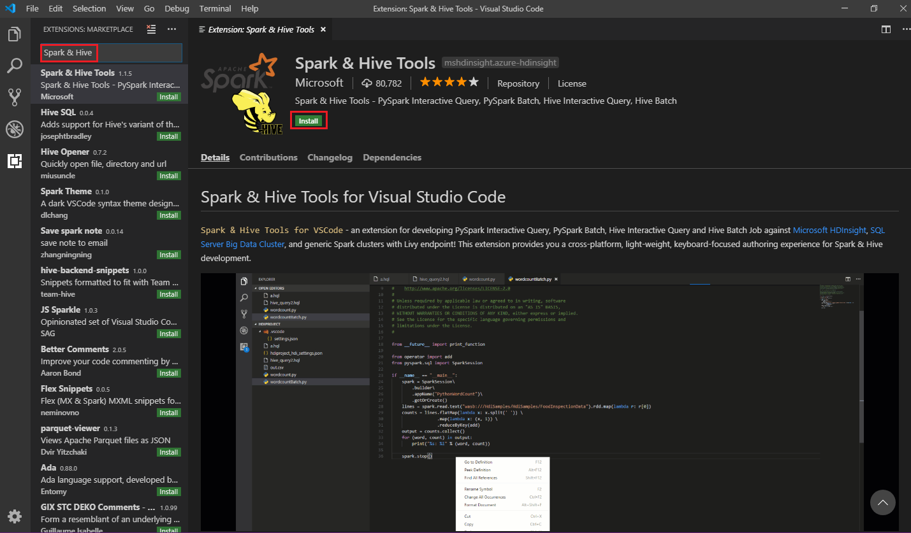
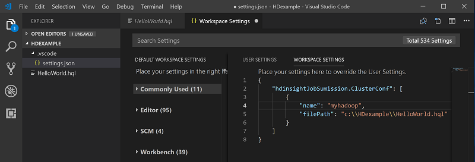
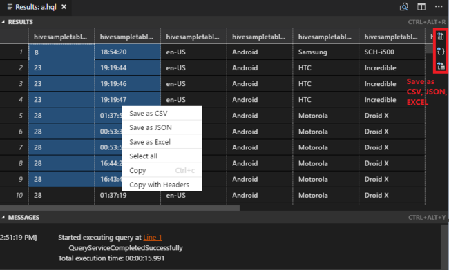

# Use Azure HDInsight Tools for Visual Studio Code

Learn how to use the Azure HDInsight Tools for Visual Studio Code (VS Code) to create and submit Hive batch jobs, interactive Hive queries, and pySpark scripts. The Azure HDInsight Tools can be installed on the platforms that are supported by VS Code. These include Windows, Linux, and macOS. You can find the prerequisites for different platforms.


## Prerequisites

The following items are required for completing the steps in this article:

- A HDInsight cluster.  To create a cluster, see [Get started with HDInsight]( hdinsight-hadoop-linux-tutorial-get-started.md).
- [Visual Studio Code](https://www.visualstudio.com/products/code-vs.aspx).
- [Mono](http://www.mono-project.com/docs/getting-started/install/). Mono is only required for Linux and macOS.

## Install the HDInsight Tools
   
After you have installed the prerequisites, you can install the Azure HDInsight Tools for VS Code. 

**To Install Azure HDInsight tools**

1. Open Visual Studio Code.

2. In the left pane, select **Extensions**. In the search box, enter **HDInsight**.

3. Next to **Azure HDInsight tools**, select **Install**. After a few seconds, the **Install** button changes to **Reload**.

4. Select **Reload** to activate the **Azure HDInsight tools** extension.

5. Select **Reload Window** to confirm. You can see **Azure HDInsight tools** in the **Extensions** pane.

   

## Open HDInsight workspace

Create a workspace in VS Code before you can connect to Azure.

**To open a workspace**

1. On the **File** menu, select **Open Folder**. Then designate an existing folder as your work folder or create a new one. The folder appears in the left pane.

2. On the left pane, select the **New File** icon next to the work folder.

   

3. Name the new file with either the .hql (Hive queries) or the .py (Spark script) file extension. Notice that an **XXXX_hdi_settings.json** configuration file is automatically added to the work folder.

4. Open **XXXX_hdi_settings.json** from **EXPLORER**, or right-click the script editor to select **Set Configuration**. You can configure login entry, default cluster, and job submission parameters as shown in the sample in the file. You also can leave the remaining parameters empty.

## Connect to Azure

Before you can submit scripts to HDInsight clusters from VS Code, you need connect to your Azure account.

**To connect to Azure**

1. Create a new work folder and a new script file if you don't already have them.

2. Right-click the script editor, and then, on the context menu, select **HDInsight: Login**. You can also enter **Ctrl+Shift+P**, and then enter **HDInsight: Login**.

    

3. To sign in, follow the sign-in instructions in the **OUTPUT** pane.

    **Azure:**
    

    After you're connected, your Azure account name is shown on the status bar at the bottom left of the VS Code window. 

    > [!NOTE]
    > Because of a known Azure authentication issue, you need to open a browser in private mode or incognito mode. 
    > If your Azure account has two factors enabled, we recommended using phone authentication instead of PIN authentication.
  

4. Right-click the script editor to open the context menu. From the context menu, you can perform the following tasks:

    - Log out
    - List clusters
    - Set default clusters
    - Submit interactive Hive queries
    - Submit Hive batch scripts
    - Submit interactive PySpark queries
    - Submit PySpark batch scripts
    - Set configurations

**To link a cluster**

You can link a normal cluster by using Ambari managed username, also link a security hadoop cluster by using domain username (such as: user1@contoso.com).
1. Open the command palette by selecting **CTRL+SHIFT+P**, and then enter **HDInsight: Link a cluster**.

   

2. Enter HDInsight cluster URL -> input Username -> input Password -> select cluster type -> it shows success info if verification passed.
   
   

   > [!NOTE]
   > We use the linked username and password if the cluster both logged in Azure subscription and Linked a cluster. 
   
3. You can see a Linked cluster by using command **List cluster**. Now you can submit a script to this linked cluster.

   

4. You also can unlink a cluster by inputting **HDInsight: Unlink a cluster** from command palette.

## List HDInsight clusters

To test the connection, you can list your HDInsight clusters:

**To list HDInsight clusters under your Azure subscription**
1. Open a workspace, and then connect to Azure. For more information, see [Open HDInsight workspace](#open-hdinsight-workspace) and [Connect to Azure](#connect-to-azure).

2. Right-click the script editor, and then select **HDInsight: List Cluster** from the context menu. 

3. The Hive and Spark clusters appear in the **Output** pane.

    

## Set a default cluster
1. Open a workspace and connect to Azure. See [Open HDInsight workspace](#open-hdinsight-workspace) and [Connect to Azure](#connect-to-azure).

2. Right-click the script editor, and then select **HDInsight: Set Default Cluster**. 

3. Select a cluster as the default cluster for the current script file. The tools automatically update the configuration file **XXXX_hdi_settings.json**. 

   

## Set the Azure environment 
1. Open the command palette by selecting **CTRL+SHIFT+P**.

2. Enter **HDInsight: Set Azure Environment**.

3. Select one way from Azure and AzureChina as your default login entry.

4. Meanwhile, the tool has already saved your default login entry in **XXXX_hdi_settings.json**. You also directly update it in this configuration file. 

   

## Submit interactive Hive queries

With HDInsight Tools for VS Code, you can submit interactive Hive queries to HDInsight interactive query clusters.

1. Create a new work folder and a new Hive script file if you don't already have them.

2. Connect to your Azure account, and then configure the default cluster if you haven't already done so.

3. Copy and paste the following code into your Hive file, and then save it.

    ```hiveql
    SELECT * FROM hivesampletable;
    ```
3. Right-click the script editor, and then select **HDInsight: Hive Interactive** to submit the query. The tools also allow you to submit a block of code instead of the whole script file using the context menu. Soon after, the query results appear in a new tab.

   

    - **RESULTS** panel: You can save the whole result as CSV, JSON, or Excel file to local path, or just select multiple lines.

    - **MESSAGES** panel: When you select **Line** number, it jumps to the first line of the running script.

Running the interactive query takes much less time than [running a Hive batch job](#submit-hive-batch-scripts).

## Submit Hive batch scripts

1. Create a new work folder and a new Hive script file if you don't already have them.

2. Connect to your Azure account, and then configure the default cluster if you haven't already done so.

3. Copy and paste the following code into your Hive file, and then save it.

    ```hiveql
    SELECT * FROM hivesampletable;
    ```
3. Right-click the script editor, and then select **HDInsight: Hive Batch** to submit a Hive job. 

4. Select the cluster to which you want to submit.  

    After you submit a Hive job, the submission success info and jobid appears in the **OUTPUT** panel. The Hive job also opens **WEB BROWSER**, which shows the real-time job  logs and status.

   

[Submitting interactive Hive queries](#submit-interactive-hive-queries) takes much less time than submitting a batch job.

## Submit interactive PySpark queries
HDInsight Tools for VS Code also enables you to submit interactive PySpark queries to Spark clusters.
1. Create a new work folder and a new script file with the .py extension if you don't already have them.

2. Connect to your Azure account if you haven't yet done so.

3. Copy and paste the following code into the script file:
   ```python
   from operator import add
   lines = spark.read.text("/HdiSamples/HdiSamples/FoodInspectionData/README").rdd.map(lambda r: r[0])
   counters = lines.flatMap(lambda x: x.split(' ')) \
                .map(lambda x: (x, 1)) \
                .reduceByKey(add)

   coll = counters.collect()
   sortedCollection = sorted(coll, key = lambda r: r[1], reverse = True)

   for i in range(0, 5):
        print(sortedCollection[i])
   ```
4. Highlight these scripts. Then right-click the script editor and select **HDInsight: PySpark Interactive**.

5. If you haven't already installed the **Python** extension in VS Code, select the **Install** button as shown in the following illustration:

    

6. Install the Python environment in your system if you haven't already. 
   - For Windows, download and install [Python](https://www.python.org/downloads/). Then make sure `Python` and `pip` are in your system PATH.

   - For instructions for macOS and Linux, see [Set up PySpark interactive environment for Visual Studio Code](set-up-pyspark-interactive-environment.md).

7. Select a cluster to which to submit your PySpark query. Soon after, the query result is shown in the new right tab:

    
8. The tool also supports the **SQL Clause**  query.

   
   The submission status appears on the left of the bottom status bar when you're running queries. Don't submit other queries when the status is **PySpark Kernel (busy)**. 

>[!NOTE]
>The clusters can maintain session information. The defined variable, function and corresponding values are kept in the session, so they can be referenced across multiple service calls for the same cluster. 
 

## Submit PySpark batch job

1. Create a new work folder and a new script file with the .py extension if you don't already have them.

2. Connect to your Azure account, if you haven't already done so.

3. Copy and paste the following code into the script file:

    ```python
    from __future__ import print_function
    import sys
    from operator import add
    from pyspark.sql import SparkSession
    if __name__ == "__main__":
        spark = SparkSession\
            .builder\
            .appName("PythonWordCount")\
            .getOrCreate()
    
        lines = spark.read.text('/HdiSamples/HdiSamples/SensorSampleData/hvac/HVAC.csv').rdd.map(lambda r: r[0])
        counts = lines.flatMap(lambda x: x.split(' '))\
                    .map(lambda x: (x, 1))\
                    .reduceByKey(add)
        output = counts.collect()
        for (word, count) in output:
            print("%s: %i" % (word, count))
        spark.stop()
    ```
4. Right-click the script editor, and then select **HDInsight: PySpark Batch**. 

5. Select a cluster to which to submit your PySpark job. 

    

After you submit a Python job, submission logs appear in the **OUTPUT** window in VS Code. The **Spark UI URL** and **Yarn UI URL** are shown as well. You can open the URL in a web browser to track the job status.


   


## Additional features

HDInsight for VS Code supports the following features:

- **IntelliSense auto-complete**. Suggestions pop up for keyword, methods, variables, and so on. Different icons represent different types of objects.

    
- **IntelliSense error marker**. The language service underlines the editing errors for the Hive script.     
- **Syntax highlights**. The language service uses different colors to differentiate variables, keywords, data type, functions, and so on. 

    

## Next steps

### Demo
* HDInsight for VS Code: [Video](https://go.microsoft.com/fwlink/?linkid=858706)

### Tools and extensions

* [Use Azure Toolkit for IntelliJ to debug Spark applications remotely through VPN](spark/apache-spark-intellij-tool-plugin-debug-jobs-remotely.md)
* [Use Azure Toolkit for IntelliJ to debug Spark applications remotely through SSH](spark/apache-spark-intellij-tool-debug-remotely-through-ssh.md)
* [Use HDInsight Tools for IntelliJ with Hortonworks Sandbox](hadoop/hdinsight-tools-for-intellij-with-hortonworks-sandbox.md)
* [Use HDInsight Tools in Azure Toolkit for Eclipse to create Spark applications](spark/apache-spark-eclipse-tool-plugin.md)
* [Use Zeppelin notebooks with a Spark cluster on HDInsight](spark/apache-spark-zeppelin-notebook.md)
* [Kernels available for Jupyter notebook in Spark cluster for HDInsight](spark/apache-spark-jupyter-notebook-kernels.md)
* [Use external packages with Jupyter notebooks](spark/apache-spark-jupyter-notebook-use-external-packages.md)
* [Install Jupyter on your computer and connect to an HDInsight Spark cluster](spark/apache-spark-jupyter-notebook-install-locally.md)
* [Visualize Hive data with Microsoft Power BI in Azure HDInsight](hadoop/apache-hadoop-connect-hive-power-bi.md)
* [Visualize Interactive Query Hive data with Power BI in Azure HDInsight](./interactive-query/apache-hadoop-connect-hive-power-bi-directquery.md).
* [Set Up PySpark Interactive Environment for Visual Studio Code](set-up-pyspark-interactive-environment.md)
* [Use Zeppelin to run Hive queries in Azure HDInsight ](./hdinsight-connect-hive-zeppelin.md)

### Scenarios
* [Spark with BI: Perform interactive data analysis using Spark in HDInsight with BI tools](spark/apache-spark-use-bi-tools.md)
* [Spark with Machine Learning: Use Spark in HDInsight for analyzing building temperature using HVAC data](spark/apache-spark-ipython-notebook-machine-learning.md)
* [Spark with Machine Learning: Use Spark in HDInsight to predict food inspection results](spark/apache-spark-machine-learning-mllib-ipython.md)
* [Website log analysis using Spark in HDInsight](spark/apache-spark-custom-library-website-log-analysis.md)

### Create and running applications
* [Create a standalone application using Scala](spark/apache-spark-create-standalone-application.md)
* [Run jobs remotely on a Spark cluster using Livy](spark/apache-spark-livy-rest-interface.md)

### Manage resources
* [Manage resources for the Apache Spark cluster in Azure HDInsight](spark/apache-spark-resource-manager.md)
* [Track and debug jobs running on an Apache Spark cluster in HDInsight](spark/apache-spark-job-debugging.md)


