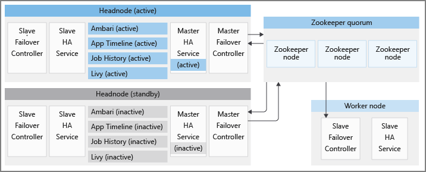
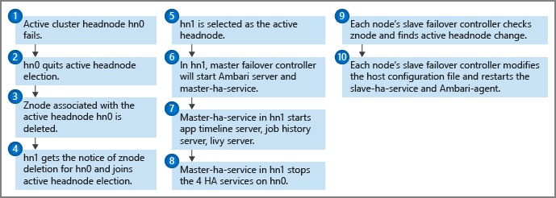

# High availability services supported by Azure HDInsight

 In order to provide you with optimal levels of availability for your analytics components, HDInsight was developed with a unique architecture for ensuring high availability (HA) of critical services. Some components of this architecture were developed by Microsoft to provide automatic failover. Other components are standard Apache components that are deployed to support specific services. This article explains the architecture of the HA service model in HDInsight, how HDInsight supports failover for HA services, and best practices to recover from other service interruptions.

## High availability infrastructure

HDInsight provides customized infrastructure to ensure that four primary services are high availability with automatic failover capabilities:

- Apache Ambari server
- Application Timeline Server for Apache YARN
- Job History Server for Hadoop MapReduce
- Apache Livy

This infrastructure consists of a number of services and software components, some of which are designed by Microsoft. The following components are unique to the HDInsight platform:

- Slave failover controller
- Master failover controller
- Slave high availability service
- Master high availability service

There are also other high availability services, which are supported by open source Apache reliability components. These components are also present on HDInsight clusters:

- Hadoop File System (HDFS) NameNode
- YARN ResourceManager
- HBase Master

The following sections will provide more detail about how these services work together.

## HDInsight high availability services

Microsoft provides support for the four Apache services in the following table in HDInsight clusters. To distinguish them from high availability services supported by components from Apache, they are called *HDInsight HA services*.

| Service | Cluster nodes | Cluster types | Purpose |
|---|---|---|---|
| Apache Ambari server| Active headnode | All | Monitors and manages the cluster.|
| Application Timeline Server for Apache YARN | Active headnode | All except Kafka | Maintains debugging info about YARN jobs running on the cluster.|
| Job History Server for Hadoop MapReduce | Active headnode | All except Kafka | Maintains debugging data for MapReduce jobs.|
| Apache Livy | Active headnode | Spark | Enables easy interaction with a Spark cluster over a REST interface |

>[!Note]
> HDInsight Enterprise Security Package (ESP) clusters currently only provide the Ambari server high availability.

### Architecture

Each HDInsight cluster has two headnodes in active and standby modes, respectively. The HDInsight HA services run on headnodes only. These services should always be running on the active headnode, and stopped and put in maintenance mode on the standby headnode.

To maintain the correct states of HA services and provide a fast failover, HDInsight utilizes Apache ZooKeeper, which is a coordination service for distributed applications, to conduct active headnode election. HDInsight also provisions a few background Java processes, which coordinate the failover procedure for HDInsight HA services. These services are the following: the master failover controller, the slave failover controller, the *master-ha-service*, and the *slave-ha-service*.

### Apache ZooKeeper

Apache ZooKeeper is a high-performance coordination service for distributed applications. In production, ZooKeeper usually runs in replicated mode where a replicated group of ZooKeeper servers form a quorum. Each HDInsight cluster has three ZooKeeper nodes that allow three ZooKeeper servers to form a quorum. HDInsight has two ZooKeeper quorums running in parallel with each other. One quorum decides the active headnode in a cluster on which HDInsight HA services should run. Another quorum is used to coordinate HA services provided by Apache, as detailed in later sections.

### Slave failover controller

The slave failover controller runs on every node in an HDInsight cluster. This controller is responsible for starting the Ambari agent and *slave-ha-service* on each node. It periodically queries the first ZooKeeper quorum about the active headnode. When the active and standby headnodes change, the slave failover controller performs the following:

1. Updates the host configuration file.
1. Restarts Ambari agent.

The *slave-ha-service* is responsible for stopping the HDInsight HA services (except Ambari server) on the standby headnode.

### Master failover controller

A master failover controller runs on both headnodes. Both master failover controllers communicate with the first ZooKeeper quorum to nominate the headnode that they're running on as the active headnode.

For example, if the master failover controller on headnode 0 wins the election, the following changes take place:

1. Headnode 0 becomes active.
1. The master failover controller starts Ambari server and the *master-ha-service* on headnode 0.
1. The other master failover controller stops Ambari server and the *master-ha-service* on headnode 1.

The master-ha-service only runs on the active headnode, it stops the HDInsight HA services (except Ambari server) on standby headnode and starts them on active headnode.

### The failover process

A health monitor runs on each headnode along with the master failover controller to send hearbeat notifications to the Zookeeper quorum. The headnode is regarded as an HA service in this scenario. The health monitor checks to see if each high availability service is healthy and if it's ready to join in the leadership election. If yes, this headnode will compete in the election. If not, it will quit the election until it becomes ready again.

If the standby headnode ever achieves leadership and becomes active (such as in the case of a failure with the previous active node), its master failover controller will start all HDInsight HA services on it. The master failover controller will also stop these services on the other headnode.

For HDInsight HA service failures, such as a service being down or unhealthy, the master failover controller should automatically restart or stop the services according to the headnode status. Users shouldn't manually start HDInsight HA services on both head nodes. Instead, allow automatic or manual failover to help the service recover.

### Inadvertent manual intervention

HDInsight HA services should only run on the active headnode, and will be automatically restarted when necessary. Since individual HA services don't have their own health monitor, failover can't be triggered at the level of the individual service. Failover is ensured at the node level and not at the service level.

### Some known issues

- When manually starting an HA service on the standby headnode, it won't stop until next failover happens. When HA services are running on both headnodes, some potential problems include: Ambari UI is inaccessible, Ambari throws errors, YARN, Spark, and Oozie jobs may get stuck.

- When an HA service on the active headnode stops, it won't restart until next failover happens or the master failover controller/master-ha-service restarts. When one or more HA services stop on the active headnode, especially when Ambari server stops, Ambari UI is inaccessible, other potential problems include YARN, Spark, and Oozie jobs failures.

## Apache high availability services

Apache provides high availability for HDFS NameNode, YARN ResourceManager, and HBase Master, which are also available in HDInsight clusters. Unlike HDInsight HA services, they are supported in ESP clusters. Apache HA services communicate with the second ZooKeeper quorum (described in the above section) to elect active/standby states and conduct automatic failover. The following sections detail how these services work.

### Hadoop Distributed File System (HDFS) NameNode

HDInsight clusters based on Apache Hadoop 2.0 or higher provide NameNode high availability. There are two NameNodes running on the headnodes, which are configured for automatic failover. The NameNodes use the *ZKFailoverController* to communicate with Zookeeper to elect for active/standby status. The *ZKFailoverController* runs on both headnodes, and works in the same way as the master failover controller above.

The second Zookeeper quorum is independent of the first quorum, so the active NameNode may not run on the active headnode. When the active NameNode is dead or unhealthy, the standby NameNode wins the election and becomes active.

### YARN ResourceManager

HDInsight clusters based on Apache Hadoop 2.4 or higher, support YARN ResourceManager high availability. There are two ResourceManagers, rm1 and rm2, running on headnode 0 and headnode 1, respectively. Like NameNode, YARN ResourceManager is also configured for automatic failover. Another ResourceManager is automatically elected to be active when the current active ResourceManager goes down or unresponsive.

YARN ResourceManager uses its embedded *ActiveStandbyElector* as a failure detector and leader elector. Unlike HDFS NodeManager, YARN ResourceManager doesn't need a separate ZKFC daemon. The active ResourceManager writes its states into Apache Zookeeper.

The high availability of the YARN ResourceManager is independent from NameNode and other HDInsight HA services. The active ResourceManager may not run on the active headnode or the headnode where the active NameNode is running. For more information about YARN ResourceManager high availability, see [ResourceManager High Availability](https://hadoop.apache.org/docs/current/hadoop-yarn/hadoop-yarn-site/ResourceManagerHA.html).

### HBase Master

HDInsight HBase clusters support HBase Master high availability. Unlike other HA services, which run on headnodes, HBase Masters run on the three Zookeeper nodes, where one of them is the active master and the other two are standby. Like NameNode, HBase Master coordinates with Apache Zookeeper for leader election and does automatic failover when the current active master has problems. There is only one active HBase Master at any time.

## Next steps

- [Availability and reliability of Apache Hadoop clusters in HDInsight](hdinsight-high-availability-linux.md)
- [Azure HDInsight virtual network architecture](hdinsight-virtual-network-architecture.md)
