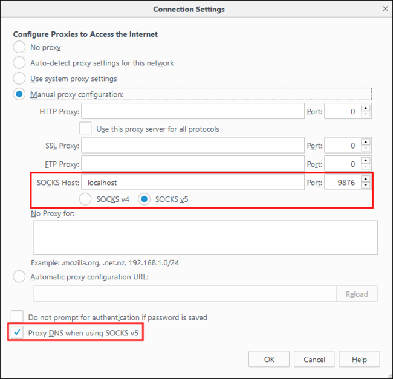
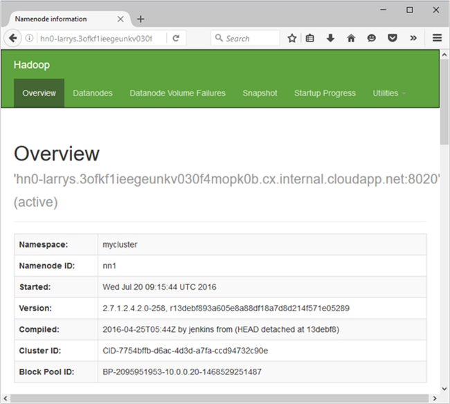

# Use SSH Tunneling to access Ambari web UI, JobHistory, NameNode, Oozie, and other web UIs

Linux-based HDInsight clusters provide access to Ambari web UI over the Internet, but some features of the UI are not. For example, the web UI for other services that are surfaced through Ambari. For full functionality of the Ambari web UI, you must use an SSH tunnel to the cluster head.

## Why use an SSH tunnel

Several of the menus in Ambari only work through an SSH tunnel. These menus rely on web sites and services running on other node types, such as worker nodes. Often, these web sites are not secured, so it is not safe to directly expose them on the internet.

The following Web UIs require an SSH tunnel:

* JobHistory
* NameNode
* Thread Stacks
* Oozie web UI
* HBase Master and Logs UI

If you use Script Actions to customize your cluster, any services or utilities that you install that expose a web UI require an SSH tunnel. For example, if you install Hue using a Script Action, you must use an SSH tunnel to access the Hue web UI.

> [!IMPORTANT]
> If you have direct access to HDInsight through a virtual network, you do not need to use SSH tunnels. For an example of directly accessing HDInsight through a virtual network, see the [Connect HDInsight to your on-premises network](connect-on-premises-network.md) document.

## What is an SSH tunnel

[Secure Shell (SSH) tunneling](https://en.wikipedia.org/wiki/Tunneling_protocol#Secure_Shell_tunneling) routes traffic sent to a port on your local workstation. The traffic is routed through an SSH connection to your HDInsight cluster head node. The request is resolved as if it originated on the head node. The response is then routed back through the tunnel to your workstation.

## Prerequisites

* An SSH client. Most operating systems provide an SSH client through the `ssh` command. For more information, see [Use SSH with HDInsight](hdinsight-hadoop-linux-use-ssh-unix.md).

* A web browser that can be configured to use a SOCKS5 proxy.

    > [!WARNING]
    > The SOCKS proxy support built into Windows does not support SOCKS5, and does not work with the steps in this document. The following browsers rely on Windows proxy settings, and do not currently work with the steps in this document:
    >
    > * Microsoft Edge
    > * Microsoft Internet Explorer
    >
    > Google Chrome also relies on the Windows proxy settings. However, you can install extensions that support SOCKS5. We recommend [FoxyProxy Standard](https://chrome.google.com/webstore/detail/foxyproxy-standard/gcknhkkoolaabfmlnjonogaaifnjlfnp).

## <a name="usessh"></a>Create a tunnel using the SSH command

Use the following command to create an SSH tunnel using the `ssh` command. Replace **USERNAME** with an SSH user for your HDInsight cluster, and replace **CLUSTERNAME** with the name of your HDInsight cluster:

```bash
ssh -C2qTnNf -D 9876 USERNAME@CLUSTERNAME-ssh.azurehdinsight.net
```

This command creates a connection that routes traffic to local port 9876 to the cluster over SSH. The options are:

* **D 9876** - The local port that routes traffic through the tunnel.
* **C** - Compress all data, because web traffic is mostly text.
* **2** - Force SSH to try protocol version 2 only.
* **q** - Quiet mode.
* **T** - Disable pseudo-tty allocation, since you are just forwarding a port.
* **n** - Prevent reading of STDIN, since you are just forwarding a port.
* **N** - Do not execute a remote command, since you are just forwarding a port.
* **f** - Run in the background.

Once the command finishes, traffic sent to port 9876 on the local computer is routed to the cluster head node.

## <a name="useputty"></a>Create a tunnel using PuTTY

[PuTTY](http://www.chiark.greenend.org.uk/~sgtatham/putty) is a graphical SSH client for Windows. Use the following steps to create an SSH tunnel using PuTTY:

1. Open PuTTY, and enter your connection information. If you are not familiar with PuTTY, see the [PuTTY documentation (http://www.chiark.greenend.org.uk/~sgtatham/putty/docs.html)](http://www.chiark.greenend.org.uk/~sgtatham/putty/docs.html).

2. In the **Category** section to the left of the dialog, expand **Connection**, expand **SSH**, and then select **Tunnels**.

3. Provide the following information on the **Options controlling SSH port forwarding** form:
   
   * **Source port** - The port on the client that you wish to forward. For example, **9876**.

   * **Destination** - The SSH address for the Linux-based HDInsight cluster. For example, **mycluster-ssh.azurehdinsight.net**.

   * **Dynamic** - Enables dynamic SOCKS proxy routing.
     
     

4. Click **Add** to add the settings, and then click **Open** to open an SSH connection.

5. When prompted, log in to the server.

## Use the tunnel from your browser

> [!IMPORTANT]
> The steps in this section use the Mozilla FireFox browser, as it provides the same proxy settings across all platforms. Other modern browsers, such as Google Chrome, may require an extension such as FoxyProxy to work with the tunnel.

1. Configure the browser to use **localhost** and the port you used when creating the tunnel as a **SOCKS v5** proxy. Here's what the Firefox settings look like. If you used a different port than 9876, change the port to the one you used:
   
    
   
   > [!NOTE]
   > Selecting **Remote DNS** resolves Domain Name System (DNS) requests by using the HDInsight cluster. This setting resolves DNS using the head node of the cluster.

2. Verify that the tunnel works by visiting a site such as [http://www.whatismyip.com/](http://www.whatismyip.com/). The IP returned should be one used by the Microsoft Azure datacenter.

## Verify with Ambari web UI

Once the cluster has been established, use the following steps to verify that you can access service web UIs from the Ambari Web:

1. In your browser, go to http://headnodehost:8080. The `headnodehost` address is sent over the tunnel to the cluster and resolve to the headnode that Ambari is running on. When prompted, enter the admin user name (admin) and password for your cluster. You may be prompted a second time by the Ambari web UI. If so, reenter the information.

   > [!NOTE]
   > When using the http://headnodehost:8080 address to connect to the cluster, you are connecting through the tunnel. Communication is secured using the SSH tunnel instead of HTTPS. To connect over the internet using HTTPS, use https://CLUSTERNAME.azurehdinsight.net, where **CLUSTERNAME** is the name of the cluster.

2. From the Ambari Web UI, select HDFS from the list on the left of the page.

    

3. When the HDFS service information is displayed, select **Quick Links**. A list of the cluster head nodes appears. Select one of the head nodes, and then select **NameNode UI**.

    

   > [!NOTE]
   > When you select __Quick Links__, you may get a wait indicator. This condition can occur if you have a slow internet connection. Wait a minute or two for the data to be received from the server, then try the list again.
   >
   > Some entries in the **Quick Links** menu may be cut off by the right side of the screen. If so, expand the menu using your mouse and use the right arrow key to scroll the screen to the right to see the rest of the menu.

4. A page similar to the following image is displayed:

    

   > [!NOTE]
   > Notice the URL for this page; it should be similar to **http://hn1-CLUSTERNAME.randomcharacters.cx.internal.cloudapp.net:8088/cluster**. This URI is using the internal fully qualified domain name (FQDN) of the node, and is only accessible when using an SSH tunnel.

## Next steps

Now that you have learned how to create and use an SSH tunnel, see the following document for other ways to use Ambari:

* [Manage HDInsight clusters by using Ambari](hdinsight-hadoop-manage-ambari.md)

For more information on using SSH with HDInsight, see [Use SSH with HDInsight](hdinsight-hadoop-linux-use-ssh-unix.md).

