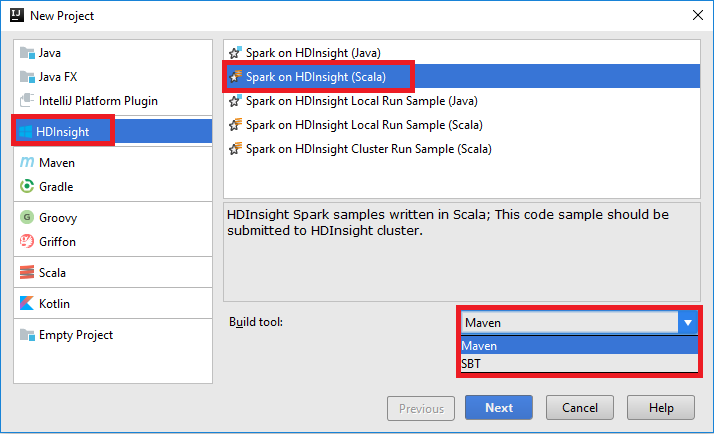
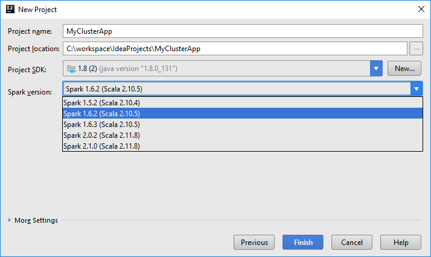

# Use HDInsight Tools for IntelliJ with Hortonworks Sandbox

Learn how to use HDInsight Tools for IntelliJ to develop Apache Scala applications and then test the applications on [Hortonworks Sandbox](http://hortonworks.com/products/sandbox/) running on your workstation. 

[IntelliJ IDEA](https://www.jetbrains.com/idea/) is a Java-integrated development environment (IDE) for developing computer software. After you have developed and tested your applications on Hortonworks Sandbox, you can move them to [Azure HDInsight](hdinsight-hadoop-introduction.md).

## Prerequisites

Before you begin this tutorial, you must have:

- Hortonworks Data Platform (HDP) 2.4 on Hortonworks Sandbox running on your local environment. To configure HDP, see [Get started in the Hadoop ecosystem with a Hadoop sandbox on a virtual machine](hdinsight-hadoop-emulator-get-started.md). 
    >[!NOTE]
    >HDInsight Tools for IntelliJ have been tested only with HDP 2.4. To get HDP 2.4, expand **Hortonworks Sandbox Archive** on the [Hortonworks Sandbox downloads site](http://hortonworks.com/downloads/#sandbox).

- [Java Developer Kit (JDK) version 1.8 or later](http://www.oracle.com/technetwork/java/javase/downloads/jdk8-downloads-2133151.html). JDK is required by the Azure Toolkit for IntelliJ.

- [IntelliJ IDEA community edition](https://www.jetbrains.com/idea/download) with the [Scala](https://plugins.jetbrains.com/idea/plugin/1347-scala) plug-in and the [Azure Toolkit for IntelliJ](../azure-toolkit-for-intellij.md) plug-in. HDInsight Tools for IntelliJ are available as a part of the Azure Toolkit for IntelliJ. 

  To install the plug-ins, do the following items:

  1. Open IntelliJ IDEA.
  2. On the **Welcome** screen, select **Configure**, and then select **Plugins**.
  3. Select **Install JetBrains plugin** in the lower-left corner.
  4. Use the search function to search for **Scala**, and then select **Install**.
  5. Select **Restart IntelliJ IDEA** to complete the installation.
  6. Repeat step 4 and 5 to install the **Azure Toolkit for IntelliJ**. For more information, see [Install the Azure Toolkit for IntelliJ](../azure-toolkit-for-intellij-installation.md).

## Create a Spark Scala application

In this section, you create a sample Scala project by using IntelliJ IDEA. In the next section, you link IntelliJ IDEA to the Hortonworks Sandbox (emulator) before you submit the project.

1. Open IntelliJ IDEA from your workstation. In the **New Project** dialog box, do the  steps:

   a. Select **HDInsight** > **Spark on HDInsight (Scala)**.

   b. In the **Build tool** list, select either of the following, according to your need:

    * **Maven**, for Scala project-creation wizard support
    * **SBT**, for managing the dependencies and building for the Scala project

   

2. Select **Next**.

3. In the next **New Project** dialog box, do the following steps:

    

    a. In the **Project name** box, enter a project name.

    b. In the **Project location** box, enter a project location.

    c. Next to the **Project SDK** drop-down list, select **New**, select **JDK**, and then specify the folder of Java JDK version 1.7 or later. Select **Java 1.8** for the Spark 2.x cluster, or select **Java 1.7** for the Spark 1.x cluster. The default location is C:\Program Files\Java\jdk1.8.x_xxx.

    d. In the **Spark version** drop-down list, Scala project creation wizard integrates the proper version for Spark SDK and Scala SDK. If the Spark cluster version is earlier than 2.0, select **Spark 1.x**. Otherwise, select **Spark2.x**. This example uses Spark 1.6.2 (Scala 2.10.5). Make sure that you are using the repository marked Scala 2.10.x. Do not use the repository marked Scala 2.11.x.

4. Select **Finish**.

5. If the **Project** view is not already open, press **Alt+1** to open it.

6. In **Project Explorer**, expand the project, and then select **src**.

7. Right-click **src**, point to **New**, and then select **Scala class**.

8. In the **Name** box, enter a name, in the **Kind** box, select **Object**, and then select **OK**.

    

9. In the .scala file, paste the following code:

        import java.util.Random
        import org.apache.spark.{SparkConf, SparkContext}
        import org.apache.spark.SparkContext._

        /**
        * Usage: GroupByTest [numMappers] [numKVPairs] [valSize] [numReducers]
        */
        object GroupByTest {
            def main(args: Array[String]) {
                val sparkConf = new SparkConf().setAppName("GroupBy Test")
                var numMappers = 3
                var numKVPairs = 10
                var valSize = 10
                var numReducers = 2

                val sc = new SparkContext(sparkConf)

                val pairs1 = sc.parallelize(0 until numMappers, numMappers).flatMap { p =>
                val ranGen = new Random
                var arr1 = new Array[(Int, Array[Byte])](numKVPairs)
                for (i <- 0 until numKVPairs) {
                    val byteArr = new Array[Byte](valSize)
                    ranGen.nextBytes(byteArr)
                    arr1(i) = (ranGen.nextInt(Int.MaxValue), byteArr)
                }
                arr1
                }.cache
                // Enforce that everything has been calculated and in cache
                pairs1.count

                println(pairs1.groupByKey(numReducers).count)
            }
        }

10. On the **Build** menu, select **Build project**. Make sure that the compilation has been completed successfully.

## Link to the Hortonworks Sandbox

Before you can link to a Hortonworks Sandbox (emulator), you must have an existing IntelliJ application.

To link to an emulator, do the following steps:

1. Open the project in IntelliJ.

2. On the **View** menu, select **Tools Windows**, and then select **Azure Explorer**.

3. Expand **Azure**, right-click **HDInsight**, and then select **Link an Emulator**.

4. In the **Link A New Emulator** window, enter the password that you've configured for the root account of the Hortonworks Sandbox, enter values similar to those in the following screenshot, and then select **OK**. 

   

5. To configure the emulator, select **Yes**.

When the emulator is connected successfully, the emulator (Hortonworks Sandbox) is listed in the HDInsight node.

## Submit the Spark Scala application to the Hortonworks Sandbox

After you have linked IntelliJ IDEA to the emulator, you can submit your project.

To submit a project to an emulator, do the following:

1. In **Project Explorer**, right-click the project, and then select **Submit Spark application to HDInsight**.

2. Do the following:

    a. In the **Spark cluster (Linux only)** drop-down list, select your local Hortonworks Sandbox.

    b. In the **Main class name** box, choose or enter the main class name. For this tutorial, the name is **GroupByTest**.

3. Select **Submit**. The job submission logs are shown in the Spark submission tool window.

## Next steps

- To learn how to create Spark applications for HDInsight by using HDInsight Tools for IntelliJ, go to [Use HDInsight Tools in Azure Toolkit for IntelliJ to create Spark applications for HDInsight Spark Linux cluster](hdinsight-apache-spark-intellij-tool-plugin.md).

- To watch a video of HDInsight Tools for IntelliJ, go to [Introduce HDInsight Tools for IntelliJ for Spark Development](https://www.youtube.com/watch?v=YTZzYVgut6c).

- To learn how to debug Spark applications by using the toolkit remotely on HDInsight through SSH, go to [Remotely debug Spark applications on an HDInsight cluster with Azure Toolkit for IntelliJ through SSH](hdinsight-apache-spark-intellij-tool-debug-remotely-through-ssh.md).

- To learn how to debug Spark applications by using the toolkit remotely on HDInsight through VPN, go to [Use HDInsight Tools in Azure Toolkit for IntelliJ to debug Spark applications remotely on HDInsight Spark Linux cluster](hdinsight-apache-spark-intellij-tool-plugin-debug-jobs-remotely.md).

- To learn how to use HDInsight Tools for Eclipse to create a Spark application, go to [Use HDInsight Tools in Azure Toolkit for Eclipse to create Spark applications](hdinsight-apache-spark-eclipse-tool-plugin.md).

- To watch a video of HDInsight Tools for Eclipse, go to [Use HDInsight Tool for Eclipse to create Spark applications](https://mix.office.com/watch/1rau2mopb6fha).
