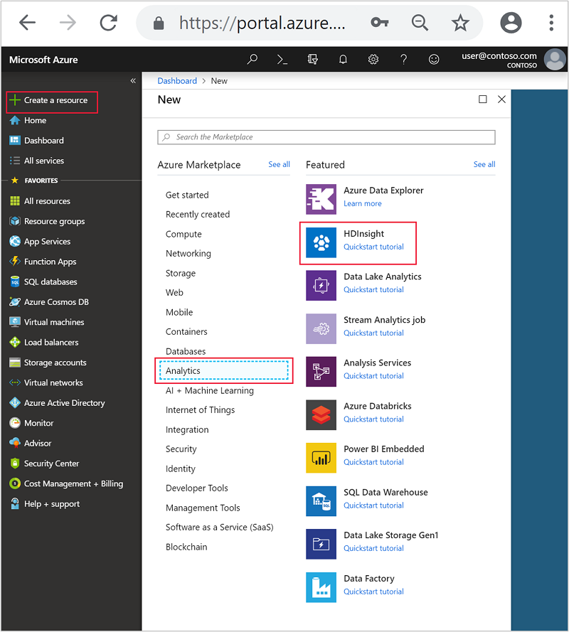
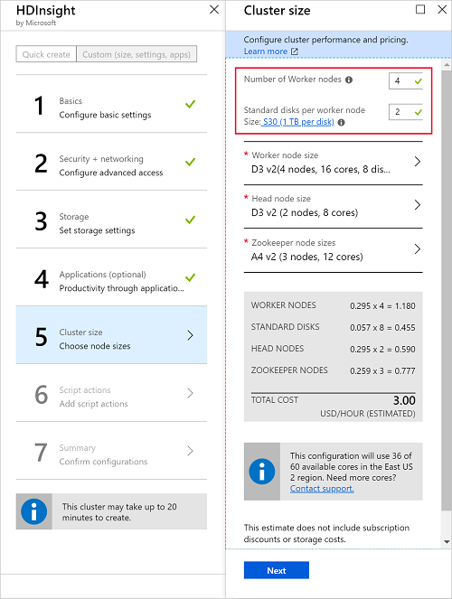

# Start with Apache Kafka on HDInsight

Learn how to create and use an [Apache Kafka](https://kafka.apache.org) cluster on Azure HDInsight. Kafka is an open-source, distributed streaming platform that is available with HDInsight. It is often used as a message broker, as it provides functionality similar to a publish-subscribe message queue. Kafka is often used with Apache Spark and Apache Storm for messaging, activity tracking, stream aggregation, or data transformation.

[!INCLUDE [delete-cluster-warning](../../../includes/hdinsight-delete-cluster-warning.md)]

## Create a Kafka cluster

To create a Kafka on HDInsight cluster, use the following steps:

1. From the [Azure portal](https://portal.azure.com), select **+ Create a resource**, **Data + Analytics**, and then select **HDInsight**.
   
    

2. From **Basics**, enter the following information:

    * **Cluster Name**: The name of the HDInsight cluster. This name must be unique.
    * **Subscription**: Select the subscription to use.
    * **Cluster login username** and **Cluster login password**: The login when accessing the cluster over HTTPS. You use these credentials to access services such as the Ambari Web UI or REST API.
    * **Secure Shell (SSH) username**: The login used when accessing the cluster over SSH. By default the password is the same as the cluster login password.
    * **Resource Group**: The resource group to create the cluster in.
    * **Location**: The Azure region to create the cluster in.

        > [!IMPORTANT]
        > For high availability of data, we recommend selecting a location (region) that contains __three fault domains__. For more information, see the [Data high availability](#data-high-availability) section.
   
 

3. Select **Cluster type**, and then set the following values from **Cluster configuration**:
   
    * **Cluster Type**: Kafka
    * **Version**: Kafka 0.10.0 (HDI 3.6)

    Finally, use the **Select** button to save settings.
     
 

4. After selecting the cluster type, use the __Select__ button to set the cluster type. Next, use the __Next__ button to finish basic configuration.

5. From **Storage**, select or create a Storage account. For the steps in this document, leave the other fields at the default values. Use the __Next__ button to save storage configuration.

    

6. From __Applications (optional)__, select __Next__ to continue. No applications are required for this example.

7. From __Cluster size__, select __Next__ to continue.

    > [!WARNING]
    > To guarantee availability of Kafka on HDInsight, your cluster must contain at least three worker nodes. For more information, see the [Data high availability](#data-high-availability) section.

    

    > [!IMPORTANT]
    > The **disks per worker node** entry configures the scalability of Kafka on HDInsight. Kafka on HDInsight uses the local disk of the virtual machines in the cluster. Kafka is I/O heavy, so [Azure Managed Disks](../../virtual-machines/windows/managed-disks-overview.md) are used to provide high throughput and provide more storage per node. The type of managed disk can be either __Standard__ (HDD) or __Premium__ (SSD). Premium disks are used with DS and GS series VMs. All other VM types use standard.

8. From __Advanced settings__, select __Next__ to continue.

9. From the **Summary**, review the configuration for the cluster. Use the __Edit__ links to change any settings that are incorrect. Finally, use the__Create__ button to create the cluster.
   
    
   
    > [!NOTE]
    > It can take up to 20 minutes to create the cluster.

## Connect to the cluster

> [!IMPORTANT]
> When performing the following steps, you must use an SSH client. For more information, see the [Use SSH with HDInsight](../hdinsight-hadoop-linux-use-ssh-unix.md) document.

To connect to the cluster using SSH, you must provide the SSH user account name and the name of your cluster. In the following example, replace `sshuser` and `clustername` with your account and cluster name:

```ssh sshuser@clustername-ssh.azurehdinsight.net```

When prompted, enter the password you used for the SSH account.

For information, see [Use SSH with HDInsight](../hdinsight-hadoop-linux-use-ssh-unix.md).

## <a id="getkafkainfo"></a>Get the Zookeeper and Broker host information

When working with Kafka, you must know the *Zookeeper* hosts and the *Broker* hosts. These hosts are used with the Kafka API and many of the utilities that ship with Kafka.

To create the environment variables that contain the host information, use the following steps:

1. From an SSH connection to the cluster, use the following command to install the `jq` utility. This utility is used to parse JSON documents, and is useful in retrieving the broker host information:
   
    ```bash
    sudo apt -y install jq
    ```

2. To set an environment variable to the cluster name, use the following command:

    ```bash
    read -p "Enter the HDInsight cluster name: " CLUSTERNAME
    ```

3. To set an environment variable with Zookeeper host information, use the following command:

    ```bash
    export KAFKAZKHOSTS=`curl -sS -u admin -G https://$CLUSTERNAME.azurehdinsight.net/api/v1/clusters/$CLUSTERNAME/services/ZOOKEEPER/components/ZOOKEEPER_SERVER | jq -r '["\(.host_components[].HostRoles.host_name):2181"] | join(",")' | cut -d',' -f1,2`
    ```

    When prompted, enter the password for the cluster login account (admin).

4. To verify that the environment variable is set correctly, use the following command:

    ```bash
     echo '$KAFKAZKHOSTS='$KAFKAZKHOSTS
    ```

    This command returns information similar to the following text:

    `zk0-kafka.eahjefxxp1netdbyklgqj5y1ud.ex.internal.cloudapp.net:2181,zk2-kafka.eahjefxxp1netdbyklgqj5y1ud.ex.internal.cloudapp.net:2181`

5. To set an environment variable with Kafka broker host information, use the following command:

    ```bash
    export KAFKABROKERS=`curl -sS -u admin -G https://$CLUSTERNAME.azurehdinsight.net/api/v1/clusters/$CLUSTERNAME/services/KAFKA/components/KAFKA_BROKER | jq -r '["\(.host_components[].HostRoles.host_name):9092"] | join(",")' | cut -d',' -f1,2`
    ```

    When prompted, enter the password for the cluster login account (admin).

6. To verify that the environment variable is set correctly, use the following command:

    ```bash   
    echo '$KAFKABROKERS='$KAFKABROKERS
    ```

    This command returns information similar to the following text:
   
    `wn1-kafka.eahjefxxp1netdbyklgqj5y1ud.cx.internal.cloudapp.net:9092,wn0-kafka.eahjefxxp1netdbyklgqj5y1ud.cx.internal.cloudapp.net:9092`
   
> [!WARNING]
> Do not rely on the information returned from this session to always be accurate. When you scale the cluster, new brokers are added or removed. If a failure occurs and a node is replaced, the host name for the node may change.
>
> You should retrieve the Zookeeper and broker hosts information shortly before you use it to make sure that you have valid information.

## Create a topic

Kafka stores streams of data in categories called *topics*. From An SSH connection to a cluster headnode, use a script provided with Kafka to create a topic:

```bash
/usr/hdp/current/kafka-broker/bin/kafka-topics.sh --create --replication-factor 3 --partitions 8 --topic test --zookeeper $KAFKAZKHOSTS
```

This command connects to Zookeeper using the host information stored in `$KAFKAZKHOSTS`. It then creates a Kafka topic named **test**. You can verify that the topic was created by using the following script to list topics:

```bash
/usr/hdp/current/kafka-broker/bin/kafka-topics.sh --list --zookeeper $KAFKAZKHOSTS
```

The output of this command lists Kafka topics on the cluster.

## Produce and consume records

Kafka stores *records* in topics. Records are produced by *producers*, and consumed by *consumers*. Producers produce records to Kafka *brokers*. Each worker node in your HDInsight cluster is a Kafka broker.

To store records into the test topic you created earlier, and then read them using a consumer, use the following steps:

1. From the SSH session, use a script provided with Kafka to write records to the topic:
   
    ```bash
    /usr/hdp/current/kafka-broker/bin/kafka-console-producer.sh --broker-list $KAFKABROKERS --topic test
    ```
   
    After this command, you arrive at an empty line.

2. Type a text message on the empty line and hit enter. Enter a few messages this way, and then use **Ctrl + C** to return to the normal prompt. Each line is sent as a separate record to the Kafka topic.

3. Use a script provided with Kafka to read records from the topic:
   
    ```bash
    /usr/hdp/current/kafka-broker/bin/kafka-console-consumer.sh --bootstrap-server $KAFKABROKERS --topic test --from-beginning
    ```
   
    This command retrieves the records from the topic and displays them. Using `--from-beginning` tells the consumer to start from the beginning of the stream, so all records are retrieved.

    > [!NOTE]
    > If you are using an older version of Kafka, replace `--bootstrap-server $KAFKABROKERS` with `--zookeeper $KAFKAZKHOSTS`.

4. Use __Ctrl + C__ to stop the consumer.

You can also programmatically create producers and consumers. For an example of using this API, see the [Kafka Producer and Consumer API with HDInsight](apache-kafka-producer-consumer-api.md) document.

## Data high availability

Each Azure region (location) provides _fault domains_. A fault domain is a logical grouping of underlying hardware in an Azure data center. Each fault domain shares a common power source and network switch. The virtual machines and managed disks that implement the nodes within an HDInsight cluster are distributed across these fault domains. This architecture limits the potential impact of physical hardware failures.

For information on the number of fault domains in a region, see the [Availability of Linux virtual machines](../../virtual-machines/windows/manage-availability.md#use-managed-disks-for-vms-in-an-availability-set) document.

> [!IMPORTANT]
> If possible, use an Azure region that contains three fault domains, and create topics with a replication factor of 3.

If you use a region that contains only two fault domains, use a replication factor of 4 to spread the replicas evenly across the two fault domains.

### Kafka and fault domains

Kafka is not aware of fault domains. When creating partition replicas for topics, it may not distribute replicas properly for high availability. To ensure high availability, use the [Kafka partition rebalance tool](https://github.com/hdinsight/hdinsight-kafka-tools). This tool must be ran from an SSH session to the head node of your Kafka cluster.

To ensure the highest availability of your Kafka data, you should rebalance the partition replicas for your topic when:

* You create a new topic or partition

* You scale up a cluster

## Delete the cluster

[!INCLUDE [delete-cluster-warning](../../../includes/hdinsight-delete-cluster-warning.md)]

## Troubleshoot

If you run into issues with creating HDInsight clusters, see [access control requirements](../hdinsight-administer-use-portal-linux.md#create-clusters).

## Next steps

In this document, you have learned the basics of working with Apache Kafka on HDInsight. Use the following to learn more about working with Kafka:

* [Analyze Kafka logs](apache-kafka-log-analytics-operations-management.md)
* [Replicate data between Kafka clusters](apache-kafka-mirroring.md)
* [Kafka Producer and Consumer API with HDInsight](apache-kafka-producer-consumer-api.md)
* [Kafka Streams API with HDInsight](apache-kafka-streams-api.md)
* [Use Apache Spark streaming (DStream) with Kafka on HDInsight](../hdinsight-apache-spark-with-kafka.md)
* [Use Apache Spark Structured Streaming with Kafka on HDInsight](../hdinsight-apache-kafka-spark-structured-streaming.md)
* [Use Apache Spark Structured Streaming to move data from Kafka on HDInsight to Cosmos DB](../apache-kafka-spark-structured-streaming-cosmosdb.md)
* [Use Apache Storm with Kafka on HDInsight](../hdinsight-apache-storm-with-kafka.md)
* [Connect to Kafka through an Azure Virtual Network](apache-kafka-connect-vpn-gateway.md)
* [Use Kafka with Azure Container Service](apache-kafka-azure-container-services.md)
* [Use Kafka with Azure Function Apps](apache-kafka-azure-functions.md)
