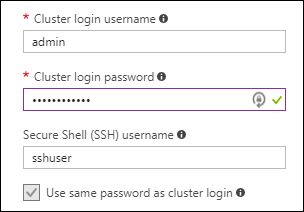
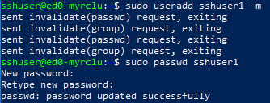

# Manage ML Services cluster on Azure HDInsight

In this article, you learn how to manage an existing ML Services cluster on Azure HDInsight to perform tasks like adding multiple concurrent users, connecting remotely to an ML Services cluster, changing compute context, etc.

## Prerequisites

* An ML Services cluster on HDInsight. See [Create Apache Hadoop clusters using the Azure portal](../hdinsight-hadoop-create-linux-clusters-portal.md) and select **ML Services** for **Cluster type**.

* A Secure Shell (SSH) client: An SSH client is used to remotely connect to the HDInsight cluster and run commands directly on the cluster. For more information, see [Use SSH with HDInsight.](../hdinsight-hadoop-linux-use-ssh-unix.md).

## Enable multiple concurrent users

You can enable multiple concurrent users for ML Services cluster on HDInsight by adding more users for the edge node on which the RStudio community version runs. When you create an HDInsight cluster, you must provide two users, an HTTP user and an SSH user:

- **Cluster login username**: an HTTP user for authentication through the HDInsight gateway that is used to protect the HDInsight clusters you created. This HTTP user is used to access the Apache Ambari UI, Apache Hadoop YARN UI, as well as other UI components.
- **Secure Shell (SSH) username**: an SSH user to access the cluster through secure shell. This user is a user in the Linux system for all the head nodes, worker nodes, and edge nodes. So you can use secure shell to access any of the nodes in a remote cluster.

The R Studio Server Community version used in the ML Services cluster on HDInsight accepts only Linux username and password as a sign in mechanism. It does not support passing tokens. So, when you try to access R Studio for the first time on an ML Services cluster, you need to sign in twice.

- First sign in using the HTTP user credentials through the HDInsight Gateway. 

- Then use the SSH user credentials to sign in to RStudio.
  
Currently, only one SSH user account can be created when provisioning an HDInsight cluster. So to enable multiple users to access ML Services cluster on HDInsight, you must create additional users in the Linux system.

Because RStudio runs on the cluster’s edge node, there are several steps here:

1. Use the existing SSH user to sign in to the edge node
2. Add more Linux users in edge node
3. Use RStudio Community version with the user created

### Step 1: Use the created SSH user to sign in to the edge node

Follow the instructions at [Connect to HDInsight (Apache Hadoop) using SSH](../hdinsight-hadoop-linux-use-ssh-unix.md) to access the edge node. The edge node address for ML Services cluster on HDInsight is `CLUSTERNAME-ed-ssh.azurehdinsight.net`.

### Step 2: Add more Linux users in edge node

To add a user to the edge node, execute the commands:

	# Add a user 
    sudo useradd <yournewusername> -m

    # Set password for the new user
	sudo passwd <yournewusername>

The following screenshot shows the outputs.

When prompted for "Current Kerberos password:", just press **Enter** to ignore it. The `-m` option in `useradd` command indicates that the system will create a home folder for the user, which is required for RStudio Community version.

### Step 3: Use RStudio Community version with the user created

Access RStudio from https://CLUSTERNAME.azurehdinsight.net/rstudio/. If you are logging in for the first time after creating the cluster, enter the cluster admin credentials followed by the SSH user credentials you created. If this is not your first login, only enter the credentials for the SSH user you created.

You can also sign in using the original credentials (by default, it is *sshuser*) concurrently from another browser window.

Note also that the newly added users do not have root privileges in Linux system, but they do have the same access to all the files in the remote HDFS and WASB storage.

## Connect remotely to Microsoft ML Services

You can set up access to the HDInsight Spark compute context from a remote instance of ML Client running on your desktop. To do so, you must specify the options (hdfsShareDir, shareDir, sshUsername, sshHostname, sshSwitches, and sshProfileScript) when defining the RxSpark compute context on your desktop: For example:

    myNameNode <- "default"
    myPort <- 0

    mySshHostname  <- '<clustername>-ed-ssh.azurehdinsight.net'  # HDI secure shell hostname
    mySshUsername  <- '<sshuser>'# HDI SSH username
    mySshSwitches  <- '-i /cygdrive/c/Data/R/davec'   # HDI SSH private key

    myhdfsShareDir <- paste("/user/RevoShare", mySshUsername, sep="/")
    myShareDir <- paste("/var/RevoShare" , mySshUsername, sep="/")

    mySparkCluster <- RxSpark(
      hdfsShareDir = myhdfsShareDir,
      shareDir     = myShareDir,
      sshUsername  = mySshUsername,
      sshHostname  = mySshHostname,
      sshSwitches  = mySshSwitches,
      sshProfileScript = '/etc/profile',
      nameNode     = myNameNode,
      port         = myPort,
      consoleOutput= TRUE
    )

For more information, see the "Using Microsoft Machine Learning Server as an Apache Hadoop Client" section in [How to use RevoScaleR in an Apache Spark compute context](https://docs.microsoft.com/machine-learning-server/r/how-to-revoscaler-spark#more-spark-scenarios)

## Use a compute context

A compute context allows you to control whether computation is performed locally on the edge node or distributed across the nodes in the HDInsight cluster.  For an example of setting a compute context with RStudio Server, see [Execute an R script on an ML Services cluster in Azure HDInsight using RStudio Server](machine-learning-services-quickstart-job-rstudio.md).

## Distribute R code to multiple nodes

With ML Services on HDInsight, you can take existing R code and run it across multiple nodes in the cluster by using `rxExec`. This function is useful when doing a parameter sweep or simulations. The following code is an example of how to use `rxExec`:

	rxExec( function() {Sys.info()["nodename"]}, timesToRun = 4 )

If you are still using the Spark context, this  command returns the nodename value for the worker nodes that the code `(Sys.info()["nodename"])` is run on. For example, on a four node cluster, you expect to receive output similar to the following snippet:

    $rxElem1
        nodename
    "wn3-mymlser"

    $rxElem2
        nodename
    "wn0-mymlser"

    $rxElem3
        nodename
    "wn3-mymlser"

    $rxElem4
        nodename
    "wn3-mymlser"

## Access data in Apache Hive and Parquet

HDInsight ML Services allows direct access to data in Hive and Parquet for use by ScaleR functions in the Spark compute context. These capabilities are available through new ScaleR data source functions called RxHiveData and RxParquetData that work through use of Spark SQL to load data directly into a Spark DataFrame for analysis by ScaleR.

The following code provides some sample code on use of the new functions:

    #Create a Spark compute context:
    myHadoopCluster <- rxSparkConnect(reset = TRUE)

    #Retrieve some sample data from Hive and run a model:
    hiveData <- RxHiveData("select * from hivesampletable",
                     colInfo = list(devicemake = list(type = "factor")))
    rxGetInfo(hiveData, getVarInfo = TRUE)

    rxLinMod(querydwelltime ~ devicemake, data=hiveData)

    #Retrieve some sample data from Parquet and run a model:
    rxHadoopMakeDir('/share')
    rxHadoopCopyFromLocal(file.path(rxGetOption('sampleDataDir'), 'claimsParquet/'), '/share/')
    pqData <- RxParquetData('/share/claimsParquet',
                     colInfo = list(
    		    age    = list(type = "factor"),
    		   car.age = list(type = "factor"),
    		      type = list(type = "factor")
    		 ) )
    rxGetInfo(pqData, getVarInfo = TRUE)

    rxNaiveBayes(type ~ age + cost, data = pqData)

    #Check on Spark data objects, cleanup, and close the Spark session:
    lsObj <- rxSparkListData() # two data objs are cached
    lsObj
    rxSparkRemoveData(lsObj)
    rxSparkListData() # it should show empty list
    rxSparkDisconnect(myHadoopCluster)

For additional info on use of these new functions see the online help in ML Services through use of the `?RxHivedata` and `?RxParquetData` commands.  

## Install additional R packages on the cluster

### To install R packages on the edge node

If you want to install additional R packages on the edge node, you can use `install.packages()` directly from within the R console, once connected to the edge node through SSH. 

### To install R packages on the worker node

To install R packages on the worker nodes of the cluster, you must use a Script Action. Script Actions are Bash scripts that are used to make configuration changes to the HDInsight cluster or to install additional software, such as additional R packages. 

> [!IMPORTANT]  
> Using Script Actions to install additional R packages can only be used after the cluster has been created. Do not use this procedure during cluster creation, as the script relies on ML Services being completely configured.

1. Follow the steps at [Customize clusters using Script Action](../hdinsight-hadoop-customize-cluster-linux.md).

3. For **Submit script action**, provide the following information:

   * For **Script type**, select **Custom**.

   * For **Name**, provide a name for the script action.

     * For **Bash script URI**, enter  `https://mrsactionscripts.blob.core.windows.net/rpackages-v01/InstallRPackages.sh`. This is the script that installs additional R packages on the worker node

   * Select the check box only for **Worker**.

   * **Parameters**: The R packages to be installed. For example, `bitops stringr arules`

   * Select the check box to **Persist this script action**.  

   > [!NOTE]
   > 1. By default, all R packages are installed from a snapshot of the Microsoft MRAN repository consistent with the version of ML Server that has been installed. If you want to install newer versions of packages, then there is some risk of incompatibility. However this kind of install is possible by specifying `useCRAN` as the first element of the package list, for example `useCRAN bitops, stringr, arules`.  
   > 2. Some R packages require additional Linux system libraries. For convenience, the HDInsight ML Services comes pre-installed with the dependencies needed by the top 100 most popular R packages. However, if the R package(s) you install require libraries beyond these then you must download the base script used here and add steps to install the system libraries. You must then upload the modified script to a public blob container in Azure storage and use the modified script to install the packages.
   >    For more information on developing Script Actions, see [Script Action development](../hdinsight-hadoop-script-actions-linux.md).  
   >
   >

   

4. Select **Create** to run the script. Once the script completes, the R packages are available on all worker nodes.

## Next steps

* [Operationalize ML Services cluster on HDInsight](r-server-operationalize.md)
* [Compute context options for ML Service cluster on HDInsight](r-server-compute-contexts.md)
* [Azure Storage options for ML Services cluster on HDInsight](r-server-storage.md)
