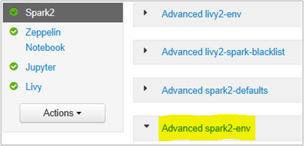

# Scenario: Java heap space error when trying to open Apache Spark history server in Azure HDInsight

This article describes troubleshooting steps and possible resolutions for issues when using Apache Spark components in Azure HDInsight clusters.

## Issue

You receive the following error when opening events in Spark History server:

```
scala.MatchError: java.lang.OutOfMemoryError: Java heap space (of class java.lang.OutOfMemoryError)
```

## Cause

This issue is often caused by a lack of resources when opening large spark-event files. The Spark heap size is set to 1 GB by default, but large Spark event files may require more than this.

If you would like to verify the size of the files that you are trying to load, you can perform the following commands:

```bash
hadoop fs -du -s -h wasb:///hdp/spark2-events/application_1503957839788_0274_1/
**576.5 M**  wasb:///hdp/spark2-events/application_1503957839788_0274_1

hadoop fs -du -s -h wasb:///hdp/spark2-events/application_1503957839788_0264_1/
**2.1 G**  wasb:///hdp/spark2-events/application_1503957839788_0264_1
```

## Resolution

You can increase the Spark History Server memory by editing the `SPARK_DAEMON_MEMORY` property in the Spark configuration and restarting all the services.

You can do this from within the Ambari browser UI by selecting the Spark2/Config/Advanced spark2-env section.



Add the following property to change the Spark History Server memory from 1g to 4g: `SPARK_DAEMON_MEMORY=4g`.


Make sure to restart all affected services from Ambari.

## Next steps

If you didn't see your problem or are unable to solve your issue, visit one of the following channels for more support:

* Get answers from Azure experts through [Azure Community Support](https://azure.microsoft.com/support/community/).

* Connect with [@AzureSupport](https://twitter.com/azuresupport) - the official Microsoft Azure account for improving customer experience by connecting the Azure community to the right resources: answers, support, and experts.

* If you need more help, you can submit a support request from the [Azure portal](https://portal.azure.com/?#blade/Microsoft_Azure_Support/HelpAndSupportBlade/). Select **Support** from the menu bar or open the **Help + support** hub. For more detailed information, please review [How to create an Azure support request](https://docs.microsoft.com/azure/azure-supportability/how-to-create-azure-support-request). Access to Subscription Management and billing support is included with your Microsoft Azure subscription, and Technical Support is provided through one of the [Azure Support Plans](https://azure.microsoft.com/support/plans/).
