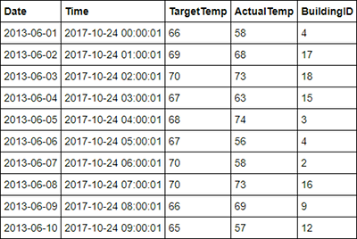
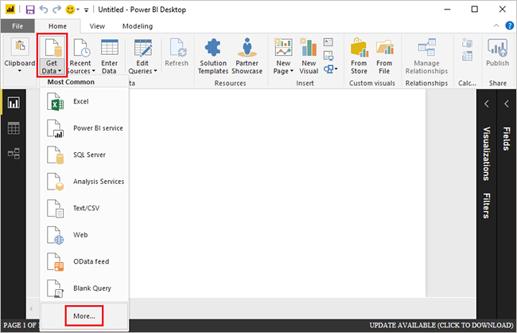
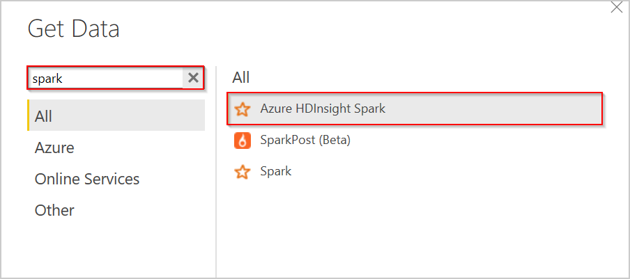
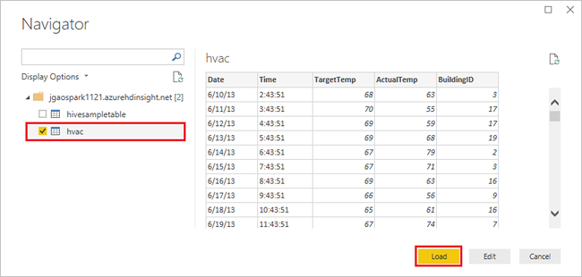
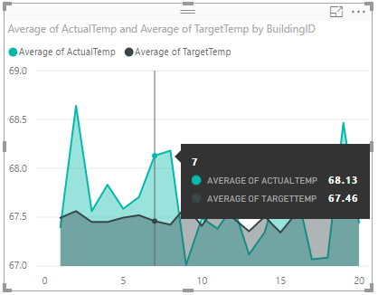
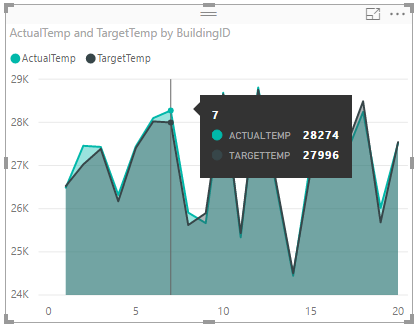
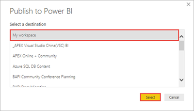
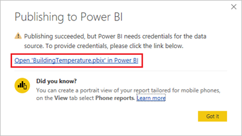

# Apache Spark BI using data visualization tools with Azure HDInsight

Learn how to use [Microsoft Power BI](http://powerbi.microsoft.com) to visualize data in Apache Spark cluster on Azure HDInsight.

## Prerequisites

* **Complete the article [Run interactive queries on Spark clusters in HDInsight](./apache-spark-load-data-run-query.md)**.
* **Power BI**: [Power BI Desktop](https://powerbi.microsoft.com/en-us/desktop/) and [Power BI trial subscription](https://app.powerbi.com/signupredirect?pbi_source=web) (optional).


## <a name="hivetable"></a>Verify the data

The Jupyter notebook that you created in the [previous tutorial](apache-spark-load-data-run-query.md) includes code to create an `hvac` table. This table is based on the CSV file available on all HDInsight Spark clusters at **\HdiSamples\HdiSamples\SensorSampleData\hvac\hvac.csv**. Use the following procedure to verify the data.

1. From the Jupyter notebook, paste the following code, and then press **SHIFT + ENTER**. The code verifies that the existence of the tables.

    ```PySpark
    %%sql
    SHOW TABLES
    ```

    The output looks like:

    

    If you closed the notebook before starting this tutorial, `hvactemptable` is cleaned up, so it's not included in the output.
    Only Hive tables that are stored in the metastore (indicated by **False** under the **isTemporary** column) can be accessed from the BI tools. In this tutorial, you connect to the **hvac** table that you created.

2. Paste the following code in an empty cell, and then press **SHIFT + ENTER**. The code verifies the data in the table.

    ```PySpark
    %%sql
    SELECT * FROM hvac LIMIT 10
    ```

    The output looks like:

    

3. From the **File** menu on the notebook, click **Close and Halt**. Shut down the notebook to release the resources. 


## <a name="powerbi"></a>Use Power BI

In this section, you use Power BI to create visualizations, reports, and dashboards from the Spark cluster data. 

### Create a report in Power BI Desktop
The first steps in working with Spark are to connect to the cluster in Power BI Desktop, load data from the cluster, and create a basic visualization based on that data.

> [!NOTE]
> The connector demonstrated in this article is currently in preview. Provide any feedback you have through the [Power BI Community](https://community.powerbi.com/) site or [Power BI Ideas](https://ideas.powerbi.com/forums/265200-power-bi-ideas).

1. Open [Power BI Desktop](https://powerbi.microsoft.com/en-us/desktop/).
1. From the **Home** tab, click **Get Data**, then **More**.

    


2. Enter `Spark` in the search box, select **Azure HDInsight Spark (Beta)**, and then click **Connect**.

    

3. Enter your cluster URL (in the form `mysparkcluster.azurehdinsight.net`), select **DirectQuery**, and then click **OK**.

    You can use either data connectivity mode with Spark. If you use DirectQuery, changes are reflected in reports without refreshing the entire dataset. If you import data, you must refresh the data set to see changes. For more information on how and when to use DirectQuery, see [Using DirectQuery in Power BI](https://powerbi.microsoft.com/documentation/powerbi-desktop-directquery-about/). 

4. Enter the HDInsight login account information, then click **Connect**. The default account name is *admin*.

5. Select the `hvac` table, wait to see a preview of the data, and then click **Load**.

    

    Power BI Desktop has the information it needs to connect to the Spark cluster and load data from the `hvac` table. The table and its columns are displayed in the **Fields** pane.  See the following screenshot:

6. Visualize the variance between target temperature and actual temperature for each building: 

    1. In the **VISUALIZATIONS** pane, select **Area Chart**. 
    2. Drag the **BuildingID** field to **Axis**, and drag the **ActualTemp** and **TargetTemp** fields to **Value**.

        

        The diagram looks like:

        

        By default the visualization shows the sum for **ActualTemp** and **TargetTemp**. Click the down arrow next to **ActualTemp** and **TragetTemp** in the Visualizations pane, you can see **Sum** is selected.

    3. Click the down arrows next to **ActualTemp** and **TragetTemp** in the Visualizations pane, select **Average** to get an average of actual and target temperatures for each building.

        

        Your data visualization shall be similar to the one in the screenshot. Move your cursor over the visualization to get tool tips with relevant data.

        

7. Click **File** then **Save**, and enter the name `BuildingTemperature.pbix` for the file. 

### Publish the report to the Power BI Service (optional)

The Power BI service allows you to share reports and dashboards across your organization. In this section, you first publish the dataset and the report. Then, you pin the report to a dashboard. Dashboards are typically used to focus on a subset of data in a report; you have only one visualization in your report, but it's still useful to go through the steps.

1. Open Power BI Desktop.
2. From the **Home** tab, click **Publish**.

    

2. Select a workspace to publish your dataset and report to, then click **Select**. In the following image, the default **My Workspace** is selected.

     

3. After the publishing is succeeded, click **Open 'BuildingTemperature.pbix' in Power BI**.

     

4. In the Power BI service, click **Enter credentials**.

    

5. Click **Edit credentials**.

    

6. Enter the HDInsight login account information, and then click **Sign in**. The default account name is *admin*.

    

7. In the left pane, go to **Workspaces** > **My Workspace** > **REPORTS**, then click **BuildingTemperature**.

    

    You should also see **BuildingTemperature** listed under **DATASETS** in the left pane.

    The visual you created in Power BI Desktop is now available in the Power BI service. 

8. Hover your cursor over the visualization, and then click the pin icon on the upper right corner.

    

9. Select "New dashboard", enter the name `Building temperature`, then click **Pin**.

    

10. In the report, click **Go to dashboard**. 

Your visual is pinned to the dashboard - you can add other visuals to the report and pin them to the same dashboard. For more information about reports and dashboards, see [Reports in Power BI](https://powerbi.microsoft.com/documentation/powerbi-service-reports/)and [Dashboards in Power BI](https://powerbi.microsoft.com/documentation/powerbi-service-dashboards/).

<!--
## <a name="tableau"></a>Use Tableau Desktop 

> [!NOTE]
> This section is applicable only for Spark 1.5.2 clusters created in Azure HDInsight.
>
>

1. Install [Tableau Desktop](http://www.tableau.com/products/desktop) on the computer where you are running this Apache Spark BI tutorial.

2. Make sure that computer also has Microsoft Spark ODBC driver installed. You can install the driver from [here](http://go.microsoft.com/fwlink/?LinkId=616229).

1. Launch Tableau Desktop. In the left pane, from the list of server to connect to, click **Spark SQL**. If Spark SQL is not listed by default in the left pane, you can find it by click **More Servers**.
2. In the Spark SQL connection dialog box, provide the values as shown in the screenshot, and then click **OK**.

    

    The authentication drop-down lists **Microsoft Azure HDInsight Service** as an option, only if you installed the [Microsoft Spark ODBC Driver](http://go.microsoft.com/fwlink/?LinkId=616229) on the computer.
3. On the next screen, from the **Schema** drop-down, click the **Find** icon, and then click **default**.

    
4. For the **Table** field, click the **Find** icon again to list all the Hive tables available in the cluster. You should see the **hvac** table you created earlier using the notebook.

    
5. Drag and drop the table to the top box on the right. Tableau imports the data and displays the schema as highlighted by the red box.

    
6. Click the **Sheet1** tab at the bottom left. Make a visualization that shows the average target and actual temperatures for all buildings for each date. Drag **Date** and **Building ID** to **Columns** and **Actual Temp**/**Target Temp** to **Rows**. Under **Marks**, select **Area** to use an area map for Spark data visualization.

     
7. By default, the temperature fields are shown as aggregate. If you want to show the average temperatures instead, you can do so from the drop-down, as shown in the following screenshot:

    

8. You can also super-impose one temperature map over the other to get a better feel of difference between target and actual temperatures. Move the mouse to the corner of the lower area map until you see the handle shape highlighted in a red circle. Drag the map to the other map on the top and release the mouse when you see the shape highlighted in red rectangle.

    

     Your data visualization should change as shown in the screenshot:

    
9. Click **Save** to save the worksheet. You can create dashboards and add one or more sheets to it.
-->

## Next steps

So far you learned how to create a cluster, create Spark data frames to query data, and then access that data from BI tools. You can now look at instructions on how to manage the cluster resources and debug jobs that are running in an HDInsight Spark cluster.

* [Manage resources for the Apache Spark cluster in Azure HDInsight](apache-spark-resource-manager.md)
* [Track and debug jobs running on an Apache Spark cluster in HDInsight](apache-spark-job-debugging.md)

