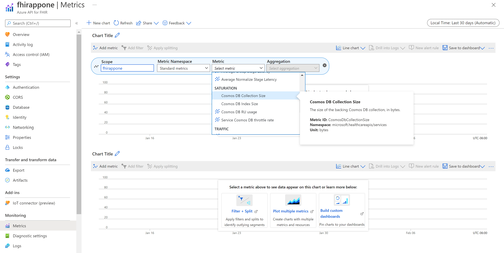

# Autoscale for Azure API for FHIR 

The Azure API for FHIR as a managed service allows customers to persist with FHIR compliant healthcare data and exchange it securely through the service API. To accommodate different transaction workloads, customers can use manual scale or autoscale.

## What is autoscale?

By default, the Azure API for FHIR is set to manual scale. This option works well when the transaction workloads are known and consistent. Customers can adjust the throughput `RU/s` through the portal up to 10,000 and submit a request to increase the limit. 

The autoscale feature is designed to scale computing resources including the database throughput `RU/s` up and down automatically according to the workloads, thus eliminating the manual steps of adjusting allocated computing resources. 

## What is the guidance on when to enable autoscale?

In general, customers should consider autoscale when their workloads vary signficantly and are unpredictable. 

## How to enable autoscale?

To enable the autoscale feature, you can create a one-time support ticket to request it. The Microsoft support team will enable the autoscale feature based on the support priority.

> [!NOTE]
> The autoscale feature isn't available from the Azure portal.

## How to migrate to manual scale?

A support ticket is required to change autoscale to manual scale and specify the throughput RU/s. The minimum value for manual scale you can set it to is: `MAX (400, highest max RU/s ever provisioned / 100, current storage in GB * 40)`, rounded to the nearest 1000 `RU/s`. The numbers used here are different from those used in autoscale.

Once the change is completed, the new billing rates will be based on manual scale.

## How to adjust the maximum throughput RU/s?

When autoscale is enabled, the system calculates and sets the initial `Tmax` value. The scalability is governed by the maximum throughput `RU/s` value, or `Tmax`, and scales between `0.1 *Tmax` (or 10% `Tmax`) and `Tmax RU/s`. The `Tmax` increases automatically as the total data size grows. To ensure maximum scalability, the `Tmax` value should be kept as-is. However, customers can request that the value be changed to something betweeen 10% and 100% of the `Tmax` value.

You can increase the max `RU/s` or `Tmax` value and go as high as the service supports. When the service is busy, the throughput `RU/s` are scaled up to the `Tmax` value. When the service is idle, the throughput `RU/s` are scaled down to 10% `Tmax` value.
 
You can also decrease the max `RU/s` or `Tmax` value. When you lower the max `RU/s`, the minimum value you can set it to is: `MAX (4000, highest max RU/s ever provisioned / 10, current storage in GB * 400)`, rounded to the nearest 1000 `RU/s`.

* **Example 1**: You have 1-GB data and the highest provisioned `RU/s` is 10,000. The minimum value is Max (**4000**, 10,000/10, 1x400) = 4000. The first number, **4000**, is used.
* **Example 2**: You have 20-GB data and the highest provisioned `RU/s` is 100,000. The minimum value is Max (4000, **100,000/10**, 20x400) = 10,000. The second number, **100,000/10 =10,000**, is used.
* **Example 3**: You have 80-GB data and the highest provisioned RU/s is 300,000. The minimum value is Max (4000, 300,000/10, **80x400**) = 32,000. The third number, **80x400=32,000**, is used.

You can adjust the max `RU/s` or `Tmax` value through the portal if it's a valid number and no greater than 10,000 `RU/s`. You can create a support ticket to request `Tmax` value larger than 10,000.

>[!Note] 
>As data storage grows, the system will automatically increase the max throughput to the next highest RU/s that can support that level of storage.

## How to estimate throughput RU/s required?

The data size is one of several factors used in calculating the total throughput RU/s required for manual scale and autoscale. You can find the data size using the Metrics menu option under **Monitoring**. Start a new chart and select "Cosmos DB Collection Size" in the Metric dropdown box and "Max" in the "Aggregation" box. 

You should be able to see the Max data collection size over the time period selected. Change the "Time Range" if necessary, for example from "Last 30 minutes" to "Last 48 Hours".

Use the formular to calculate required RU/s.

- Manual scale: storage in GB * 40
- Autoscale: storage in GB * 400

Keep in mind that this is only an estimate based on data size and that there are other factors that affect the required RU/s.

## What is the cost impact of autoscale?

The autoscale feature incurs costs because of managing the provisioned throughput units automatically. The actual costs depend on hourly usage, but keep in mind that there are minimum costs of 10% of `Tmax` for reserved throughput RU/s. However, this cost increase doesn't apply to storage and runtime costs. For information about pricing, see [Azure API for FHIR pricing](https://azure.microsoft.com/pricing/details/azure-api-for-fhir/).

>[!div class="nextstepaction"]
>[About Azure API for FHIR](overview.md)
