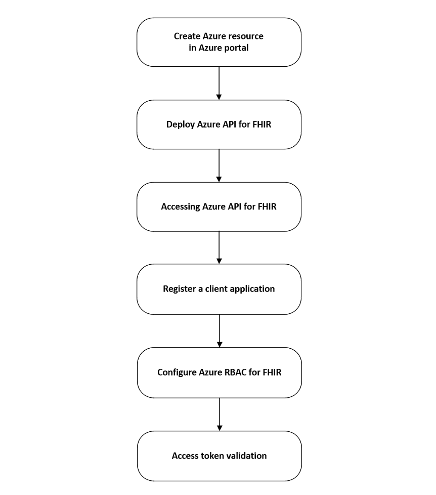
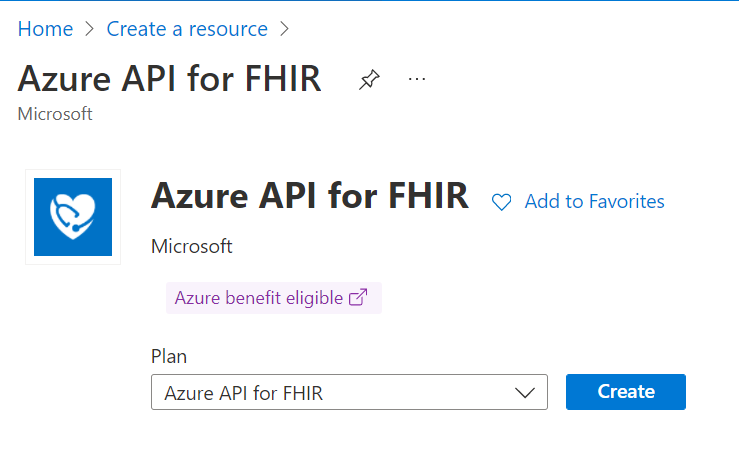

# Get started with Azure API for FHIR

[!INCLUDE [retirement banner](../includes/healthcare-apis-azure-api-fhir-retirement.md)]

This article outlines the basic steps to get started with Azure API for FHIR. Azure API for FHIR is a managed, standards-based, compliant API for clinical health data that enables solutions for actionable analytics and machine learning.

As a prerequisite, you'll need an Azure subscription and have been granted proper permissions to create Azure resource groups and deploy Azure resources. If you don't have an Azure subscription, create a [free account](https://azure.microsoft.com/free/?WT.mc_id=A261C142F) before you begin.

## Create Azure resource

To get started with Azure API for FHIR, you must [create a resource](https://portal.azure.com/#create/hub) in the Azure portal.  Enter *Azure API for FHIR* in the **Search services and marketplace** box.

 

After you’ve located the Azure API for FHIR resource, select **Create**.

## Deploy Azure API for FHIR

Refer to the steps in the [Quickstart guide](fhir-paas-portal-quickstart.md) for deploying an instance of Azure API for FHIR using the Azure portal. You can also deploy an instance of Azure API for FHIR using [PowerShell](fhir-paas-powershell-quickstart.md), [CLI](fhir-paas-cli-quickstart.md), and an [ARM template](azure-api-fhir-resource-manager-template.md).

## Accessing Azure API for FHIR

When you're working with healthcare data, it's important to ensure that the data is secure, and it can't be accessed by unauthorized users or applications. FHIR servers use [OAuth 2.0](https://oauth.net/2/) to ensure this data security. Azure API for FHIR is secured using [Azure Active Directory (Azure AD)](../../active-directory/index.yml), which is an example of an OAuth 2.0 identity provider. [Azure AD identity configuration for Azure API for FHIR](././../azure-api-for-fhir/azure-active-directory-identity-configuration.md) provides an overview of FHIR server authorization, and the steps needed to obtain a token to access a FHIR server. While these steps apply to any FHIR server and any identity provider, this article will walk you through Azure API for FHIR as the FHIR server and Azure AD as our identity provider. For more information about accessing Azure API for FHIR, see [Access control overview](././../azure-api-for-fhir/azure-active-directory-identity-configuration.md#access-control-overview).

### Access token validation

How Azure API for FHIR validates the access token will depend on implementation and configuration. The article [Azure API for FHIR access token validation](azure-api-fhir-access-token-validation.md) will guide you through the validation steps, which can be helpful when troubleshooting access issues.

### Register a client application

For an application to interact with Azure AD, it needs to be registered. In the context of the FHIR server, there are two kinds of application registrations:

-	Resource application registrations
-	Client application registrations

For more information about the two kinds of application registrations, see [Register the Azure Active Directory apps for Azure API for FHIR](fhir-app-registration.md).

## Configure Azure RBAC for FHIR

The article [Configure Azure RBAC for FHIR](configure-azure-rbac.md), describes how to use [Azure role-based access control (Azure RBAC)](../../role-based-access-control/index.yml) to assign access to the Azure API for FHIR data plane. Azure RBAC is the preferred method for assigning data plane access when data plane users are managed in the Azure AD tenant associated with your Azure subscription. If you're using an external Azure AD tenant, refer to the [local RBAC assignment reference](configure-local-rbac.md).

## Next steps

This article described the basic steps to get started using Azure API for FHIR. For more information about Azure API for FHIR, see

>[!div class="nextstepaction"]
>[What is Azure API for FHIR?](overview.md)

>[!div class="nextstepaction"]
>[Frequently asked questions about Azure API for FHIR](fhir-faq.yml)

FHIR&#174; is a registered trademark of [HL7](https://hl7.org/fhir/) and is used with the permission of HL7.
