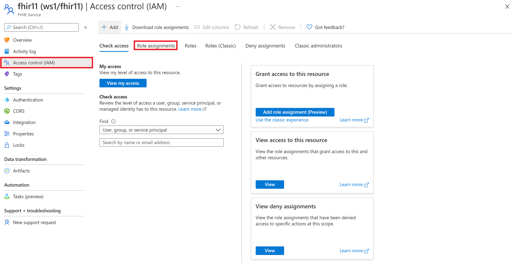
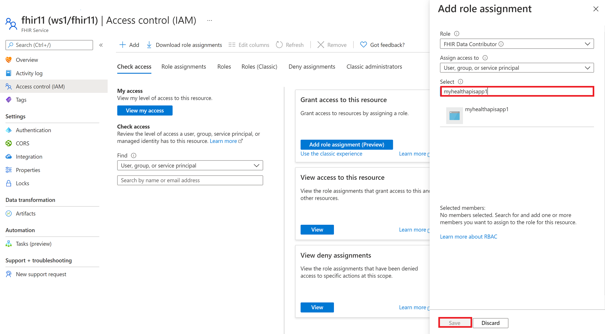
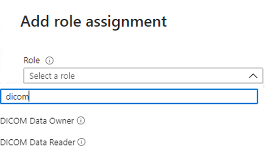

# Configure Azure RBAC role for Azure Health Data Services

In this article, you'll learn how to use [Azure role-based access control (Azure RBAC role)](../role-based-access-control/index.yml) to assign access to the Azure Health Data Services data plane. Azure RBAC role is the preferred methods for assigning data plane access when data plane users are managed in the Azure Active Directory tenant associated with your Azure subscription.

You can complete role assignments through the Azure portal. Note that the FHIR service and DICOM service have defined different application roles. Add or remove one or more roles to manage user access controls.

## Assign roles for the FHIR service

To grant users, service principals, or groups access to the FHIR data plane, select the FHIR service from the Azure portal. Select **Access control (IAM)**, and then select the **Role assignments** tab. Select **+Add**, and then select **Add role assignment**.
 
If the role assignment option is grayed out, ask your Azure subscription administrator to grant you with the permissions to the subscription or the resource group, for example, “User Access Administrator”. For more information about the Azure built-in roles, see [Azure built-in roles](../role-based-access-control/built-in-roles.md).

In the Role selection, search for one of the built-in roles for the FHIR data plane, for example, “FHIR Data Contributor”. You can choose other roles below.

* **FHIR Data Reader**: Can read (and search) FHIR data.
* **FHIR Data Writer**: Can read, write, and soft delete FHIR data.
* **FHIR Data Exporter**: Can read and export ($export operator) data.
* **FHIR Data Contributor**: Can perform all data plane operations.
* **FHIR Data Converter**: Can use the converter to perform data conversion.

In the **Select** section, type the client application registration name. If the name is found, the application name is listed. Select the application name, and then select **Save**. 

If the client application isn’t found, check your application registration. This is to ensure that the name is correct. Ensure that the client application is created in the same tenant where the FHIR service in Azure Health Data Services (hereby called the FHIR service) is deployed in.

You can verify the role assignment by selecting the **Role assignments** tab from the **Access control (IAM)** menu option.
 
## Assign roles for the DICOM service

To grant users, service principals, or groups access to the DICOM data plane, select the **Access control (IAM)** blade. Select the**Role assignments** tab, and select **+ Add**.

In the **Role** selection, search for one of the built-in roles for the DICOM data plane:

You can choose between:

* DICOM Data Owner:  Full access to DICOM data.
* DICOM Data Reader: Read and search DICOM data.

If these roles aren’t sufficient for your need, you can use PowerShell to create custom roles.  For information about creating custom roles, see [Create a custom role using Azure PowerShell](../role-based-access-control/custom-roles-powershell.md).

In the **Select** box, search for a user, service principal, or group that you want to assign the role to.

> [!NOTE]
> If you can't access the FHIR or DICOM service in your application or other tools, you might need to wait a few more minutes for the role assignment to finish propagating in the system.

## Next steps

In this article, you've learned how to assign Azure roles for the FHIR service and DICOM service. To learn how to access the Azure Health Data Services using Postman, see

- [Access using Postman](./fhir/use-postman.md)
- [Access using the REST Client](./fhir/using-rest-client.md)
- [Access using cURL](./fhir/using-curl.md)
