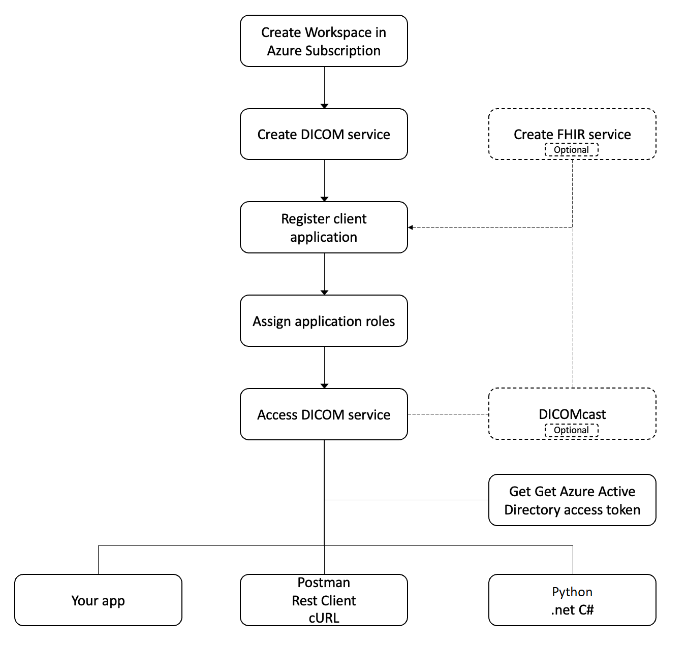

# Get started with the DICOM service

This article outlines the basic steps to get started with the DICOM service in [Azure Health Data Services](../healthcare-apis-overview.md). 

As a prerequisite, you'll need an Azure subscription and have been granted proper permissions to create Azure resource groups and to deploy Azure resources. You can follow all the steps, or skip some if you have an existing environment. Also, you can combine all the steps and complete them in PowerShell, Azure CLI, and REST API scripts. You'll need a workspace to provision a DICOM service. A FHIR service is optional and is needed only if you connect imaging data with electronic health records of the patient via DICOMcast.

## Create a workspace in your Azure Subscription

You can create a workspace from the [Azure portal](../healthcare-apis-quickstart.md) or using PowerShell, Azure CLI, and REST API. You can find scripts from the [Azure Health Data Services samples](https://github.com/microsoft/healthcare-apis-samples/tree/main/src/scripts).

> [!NOTE]
> There are limits to the number of workspaces and the number of DICOM service instances you can create in each Azure subscription.

## Create a DICOM service in the workspace

You can create a DICOM service instance from the [Azure portal](deploy-dicom-services-in-azure.md) or using PowerShell, Azure CLI, and REST API. You can find scripts from the [Azure Health Data Services samples](https://github.com/microsoft/healthcare-apis-samples/tree/main/src/scripts).

Optionally, you can create a [FHIR service](../fhir/fhir-portal-quickstart.md) and [MedTech service](../iot/deploy-iot-connector-in-azure.md) in the workspace.

## Access the DICOM service

The DICOM service is secured by Microsoft Entra ID that can't be disabled. To access the service API, you must create a client application that's also referred to as a service principal in Microsoft Entra ID and grant it with the right permissions.

### Register a client application

You can create or register a client application from the [Azure portal](dicom-register-application.md), or using PowerShell and Azure CLI scripts. This client application can be used for one or more DICOM service instances. It can also be used for other services in Azure Health Data Services.

If the client application is created with a certificate or client secret, ensure that you renew the certificate or client secret before expiration and replace the client credentials in your applications.

You can delete a client application. Before doing that, ensure that it's not used in production, dev, test, or quality assurance (QA) environments.

### Grant access permissions

You can grant access permissions or assign roles from the [Azure portal](../configure-azure-rbac.md), or using PowerShell and Azure CLI scripts.

### Perform create, read, update, and delete (CRUD) transactions

You can perform create, read (search), update and delete (CRUD) transactions against the DICOM service in your applications or by using tools such as Postman, REST Client, cURL, and Python. Because the DICOM service is secured by default, you must obtain an access token and include it in your transaction request.

#### Get an access token

You can obtain a Microsoft Entra access token using PowerShell, Azure CLI, REST CLI, or .NET SDK. For more information, see [Get access token](../get-access-token.md).

#### Access using existing tools

- [.NET C#](dicomweb-standard-apis-c-sharp.md)
- [cURL](dicomweb-standard-apis-curl.md)
- [Python](dicomweb-standard-apis-python.md)
- Postman
- REST Client

### DICOMweb standard APIs and change feed

You can find more details on DICOMweb standard APIs and change feed in the [DICOM service](dicom-services-overview.md) documentation.

#### DICOMcast

DICOMcast is currently available as an [open source](https://github.com/microsoft/dicom-server/blob/main/docs/concepts/dicom-cast.md) project.

## Next steps

This article described the basic steps to get started using the DICOM service. For information about deploying the DICOM service in the workspace, see

>[!div class="nextstepaction"]
>[Deploy DICOM service using the Azure portal](deploy-dicom-services-in-azure.md)

FHIR&#174; is a registered trademark of [HL7](https://hl7.org/fhir/) and is used with the permission of HL7.
