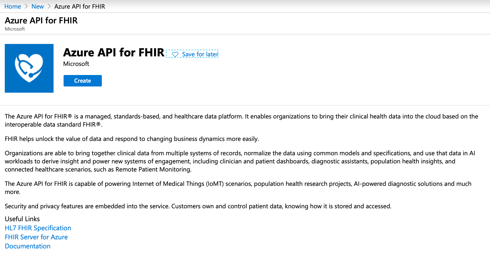
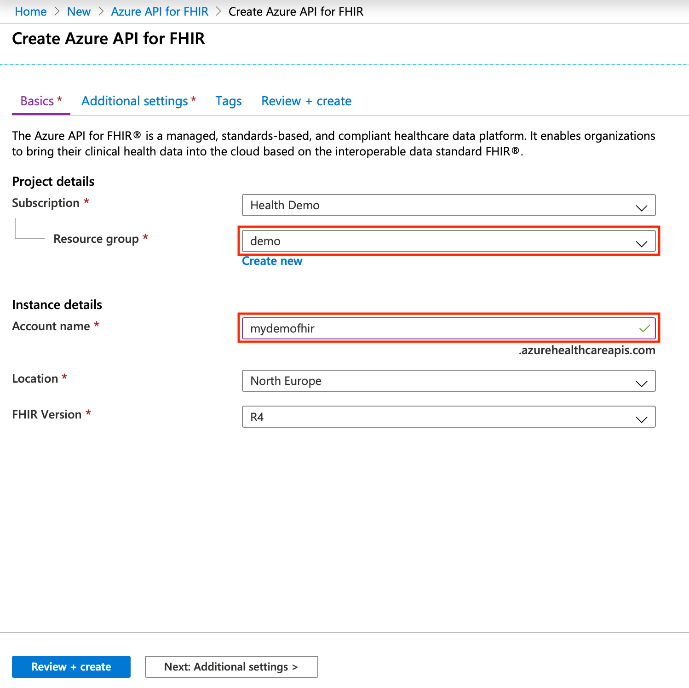
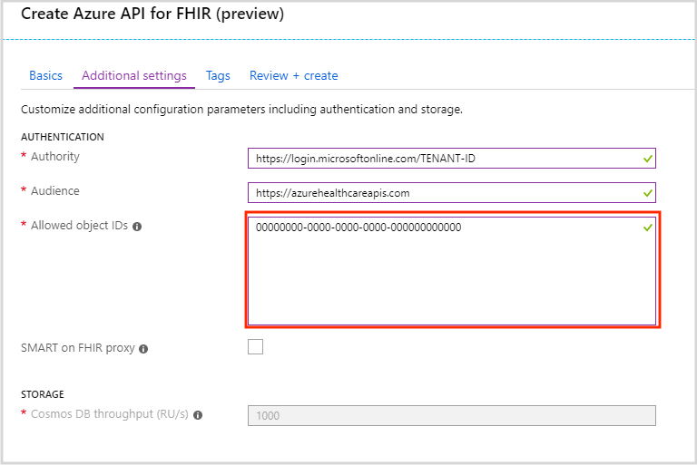

# Quickstart: Deploy Azure API for FHIR using Azure portal

In this quickstart, you'll learn how to deploy Azure API for FHIR using the Azure Portal.

If you don't have an Azure subscription, create a [free account](https://azure.microsoft.com/free/?WT.mc_id=A261C142F) before you begin.

## Create new resource

Open the [Azure preview portal](https://preview.portal.azure.com) and click **Create a resource**

## Search for Azure API for FHIR

You can find Azure API for FHIR by typing "FHIR" into the search box:

## Create Azure API for FHIR account

Select **Create** to create a new Azure API for FHIR account:

## Enter account details

Select an existing resource group or create a new one, choose a name for the account, and finally click **Review + create**:

Confirm creation and await FHIR API deployment.

## Additional settings

Click **Next: Additional settings** to configure the identity object IDs that should be allowed to access this Azure API for FHIR:

See [how to find identity object IDs](find-identity-object-ids.md) for details on how to locate identity object IDs for users and service principals.

## Fetch FHIR API capability statement

To validate that the new FHIR API account is provisioned, fetch a capability statement by pointing a browser to `https://<ACCOUNT-NAME>.azurehealthcareapis.com/metadata`.

## Clean up resources

When no longer needed, you can delete the resource group, Azure API for FHIR, and all related resources. To do so, select the resource group containing the Azure API for FHIR account, select **Delete resource group**, then confirm the name of the resource group to delete.

## Next steps

In this tutorial, you've deployed the Azure API for FHIR into your subscription. To learn how to access the FHIR API using Postman, proceed to the Postman tutorial.

>[!div class="nextstepaction"]
>[Access FHIR API using Postman](access-fhir-postman-tutorial.md)