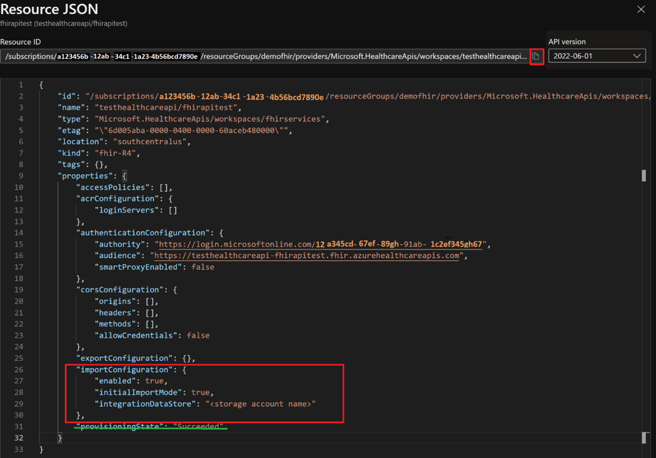
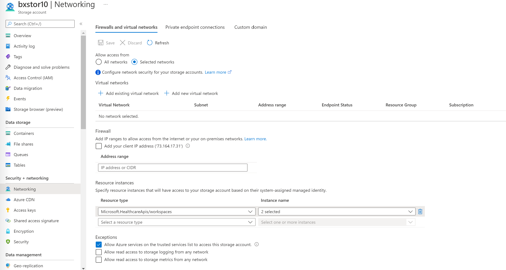

# Configure bulk-import settings

The FHIR service supports $import operation that allows you to import data into FHIR service account from a storage account.

The three steps below are used in configuring import settings in the FHIR service:

* Step 1: Enable managed identity for the FHIR service.
* Step 2: Create an Azure storage account or use an existing storage account, and then grant permissions to the FHIR service to access it.
* Step 3: Set the import configuration in the FHIR service.

## Step 1: Enable managed identity on the FHIR service

The first step in configuring the FHIR service for import is to enable system wide managed identity on the service, which will be used to grant the service to access the storage account. For more information about managed identities in Azure, see [About managed identities for Azure resources](../../active-directory/managed-identities-azure-resources/overview.md).

In this step, browse to your FHIR service in the Azure portal, and select the **Identity** blade. Select the **Status** option to **On** , and then select **Save**. The **Yes** and **No** buttons will display. Select **Yes** to enable the managed identity for FHIR service. After the system identity has been enabled, you'll see a system assigned GUID value. 

[](media/export-data/fhir-mi-enabled.png#lightbox)


## Step 2: Assign permissions to the FHIR service to access the storage account

Browse to the **Access Control (IAM)** in the storage account, and then select **Add role assignment**. If the add role assignment option is grayed out, you'll need to ask your Azure Administrator to assign you permission to perform this task.

For more information about assigning roles in the Azure portal, see [Azure built-in roles](../../role-based-access-control/role-assignments-portal.md).

Add the role [Storage Blob Data Contributor](../../role-based-access-control/built-in-roles.md#storage-blob-data-contributor) to the FHIR service, and then select **Save**.

[](media/bulk-import/add-role-assignment-page.png#lightbox)

Now you're ready to select the storage account in the FHIR service as a default storage account for import.

## Step 3: Set import configuration of the FHIR service

The final step is to set the import configuration of the FHIR service, which contains specify storage account, enable import and enable initial import mode.

> [!NOTE]
> If you haven't assigned storage access permissions to the FHIR service, the import operations ($import) will fail.

To specify the Azure Storage account, you need to use [REST API](/rest/api/healthcareapis/services/create-or-update) to update the FHIR service.

To get the request URL and body, browse to the Azure portal of your FHIR service. Select **Overview**, and then **JSON View**.

[](media/bulk-import/fhir-json-view.png#lightbox)

Select the API version to **2022-06-01** or later version. 

Copy the URL as request URL and do following changes of the JSON as body:
- Set enabled in importConfiguration to **true**
- add or change the integrationDataStore with target storage account name 
- Set initialImportMode in importConfiguration to **true**
- Drop off provisioningState.

[](media/bulk-import/import-url-and-body.png#lightbox)

After you've completed this final step, you're ready to import data using $import.

You can also use the **Deploy to Azure** button below to open custom Resource Manager template that updates the configuration for $import.

 [](https://portal.azure.com/#create/Microsoft.Template/uri/https%3A%2F%2Fraw.githubusercontent.com%2FAzure%2Fazure-quickstart-templates%2Fmaster%2Fquickstarts%2Fmicrosoft.healthcareapis%2Ffhir-import%2Fazuredeploy.json)

## Securing the FHIR service $import operation
For securely importing FHIR data into the FHIR service from an ADLS Gen2 account, there are two options:

* Option 1: Enabling FHIR service as a Microsoft Trusted Service.

* Option 2: Allowing specific IP addresses associated with the FHIR service to access the storage account. 
This option permits two different configurations depending on whether or not the storage account is in the same Azure region as the FHIR service.

### Option 1: Enabling FHIR service as a Microsoft Trusted Service.

Go to your ADLS Gen2 account in the Azure portal and select the **Networking** blade. Select **Enabled from selected virtual networks and IP addresses** under the **Firewalls and virtual networks** tab.

[](media/export-data/storage-networking-1.png#lightbox)
  
Select **Microsoft.HealthcareApis/workspaces** from the **Resource type** dropdown list and then select your workspace from the **Instance name** dropdown list.

Under the **Exceptions** section, select the box **Allow Azure services on the trusted services list to access this storage account**. Make sure to click **Save** to retain the settings. 

[](media/export-data/exceptions.png#lightbox)
  
Next, run the following PowerShell command to install the `Az.Storage` PowerShell module in your local environment. This will allow you to configure your Azure storage account(s) using PowerShell.

```PowerShell
Install-Module Az.Storage -Repository PsGallery -AllowClobber -Force 
``` 

Now, use the PowerShell command below to set the selected FHIR service instance as a trusted resource for the storage account. Make sure that all listed parameters are defined in your PowerShell environment. 

Note that you'll need to run the `Add-AzStorageAccountNetworkRule` command as an administrator in your local environment. For more information, see [Configure Azure Storage firewalls and virtual networks](../../storage/common/storage-network-security.md).

```PowerShell
$subscription="xxx"
$tenantId = "xxx"
$resourceGroupName = "xxx"
$storageaccountName = "xxx"
$workspacename="xxx"
$fhirname="xxx"
$resourceId = "/subscriptions/$subscription/resourceGroups/$resourceGroupName/providers/Microsoft.HealthcareApis/workspaces/$workspacename/fhirservices/$fhirname"

Add-AzStorageAccountNetworkRule -ResourceGroupName $resourceGroupName -Name $storageaccountName -TenantId $tenantId -ResourceId $resourceId
```

After running this command, in the **Firewall** section under **Resource instances** you will see **2 selected** in the **Instance name** dropdown list. These are the names of the workspace instance and FHIR service instance that you just registered as Microsoft Trusted Resources.

[](media/export-data/storage-networking-2.png#lightbox)
  
You're now ready to securely import FHIR data from the storage account. Note that the storage account is on selected networks and isn't publicly accessible. To securely access the files, you can enable [private endpoints](../../storage/common/storage-private-endpoints.md) for the storage account.

### Option 2: Allowing specific IP addresses to access the Azure storage account
#### Option 2.1 : Access storage account provisioned in different Azure region than FHIR service

In the Azure portal, go to the ADLS Gen2 account and select the **Networking** blade. 
   
Select **Enabled from selected virtual networks and IP addresses**. Under the Firewall section, specify the IP address in the **Address range** box. Add IP ranges to allow access from the internet or your on-premises networks. You can find the IP address in the table below for the Azure region where the FHIR service is provisioned.

|**Azure Region**         |**Public IP Address** |
|:----------------------|:-------------------|
| Australia East       | 20.53.44.80       |
| Canada Central       | 20.48.192.84      |
| Central US           | 52.182.208.31     |
| East US              | 20.62.128.148     |
| East US 2            | 20.49.102.228     |
| East US 2 EUAP       | 20.39.26.254      |
| Germany North        | 51.116.51.33      |
| Germany West Central | 51.116.146.216    |
| Japan East           | 20.191.160.26     |
| Korea Central        | 20.41.69.51       |
| North Central US     | 20.49.114.188     |
| North Europe         | 52.146.131.52     |
| South Africa North   | 102.133.220.197   |
| South Central US     | 13.73.254.220     |
| Southeast Asia       | 23.98.108.42      |
| Switzerland North    | 51.107.60.95      |
| UK South             | 51.104.30.170     |
| UK West              | 51.137.164.94     |
| West Central US      | 52.150.156.44     |
| West Europe          | 20.61.98.66       |
| West US 2            | 40.64.135.77      |

> [!NOTE]
> The above steps are similar to the configuration steps described in the document **Converting your data to FHIR**. For more information, see [Configure the ACR firewall](./convert-data.md#step-6-optional-configure-the-azure-container-registry-firewall-for-secure-access).

#### Option 2.2 : Access storage account provisioned in same Azure region as FHIR service

The configuration process for IP addresses in the same region is just like above except a specific IP address range in Classless Inter-Domain Routing (CIDR) format is used instead (i.e., 100.64.0.0/10). The reason why the IP address range (100.64.0.0 – 100.127.255.255) must be specified is because an IP address for the FHIR service will be allocated each time an `$import` request is made.

> [!Note] 
> It is possible that a private IP address within the range of 10.0.2.0/24 may be used, but there is no guarantee that the `$import` operation will succeed in such a case. You can retry if the `$import` request fails, but until an IP address within the range of 100.64.0.0/10 is used, the request will not succeed. This network behavior for IP address ranges is by design. The alternative is to configure the storage account in a different region.


## Next steps

In this article, you've learned the FHIR service supports $import operation and learned on the steps used in configuring import settings. For more information on using $import in the FHIR service, see

>[!div class="nextstepaction"]
>[Use $import](import-data.md)


FHIR&#174; is a registered trademark of [HL7](https://hl7.org/fhir/) and is used with the permission of HL7.
