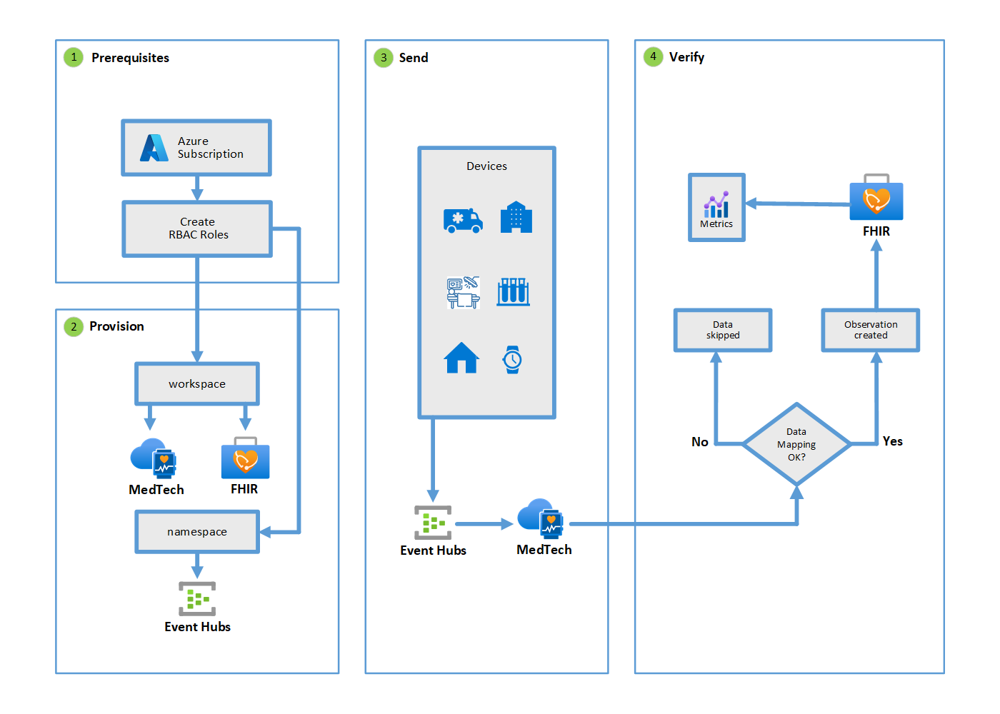

# Get started with MedTech service in Azure Health Data Services

This article outlines the basic steps to get started with Azure MedTech service in [Azure Health Data Services](../healthcare-apis-overview.md). MedTech service ingests health data from a medical device using Azure Event Hubs service. It then persists the data to the Azure Fast Healthcare Interoperability Resources (FHIR&#174;) service as Observation resources. This data processing procedure makes it possible to link FHIR service Observations to patient and device resources.

The following diagram shows the four-step data flow that enables MedTech service to receive data from a device and send it to FHIR service.

- Step 1 introduces the subscription and permissions prerequisites needed.

- Step 2 shows how Azure services are provisioned for MedTech services.

- Step 3 represents the flow of data sent from devices to the event hub and MedTech service.

- Step 4 demonstrates the path needed to verify data sent to FHIR service.  

Follow these four steps and you'll be able to deploy MedTech service effectively:

## Step 1: Prerequisites for using Azure Health Data Services

Before you can begin sending data from a device, you need to determine if you have the appropriate Azure subscription and Azure RBAC (Role-Based Access Control) roles. If you already have the appropriate subscription and roles, you can skip this step.

- If you don't have an Azure subscription, see [Subscription decision guide](https://docs.microsoft.com/azure/cloud-adoption-framework/decision-guides/subscriptions/)

- You must have the appropriate RBAC roles for the subscription resources you want to use. The roles required for a user to complete the provisioning would be Contributor AND User Access Administrator OR Owner. The Contributor role allows the user to provision resources, and the User Access Administrator role allows the user to grant access so resources can send data between them. The Owner role can perform both. For more information, see [Azure role-based access control](https://docs.microsoft.com/azure/cloud-adoption-framework/ready/considerations/roles).

## Step 2: Provision services and obtain permissions

After obtaining the required prerequisites, you must create a workspace and provision instances of Event Hubs service, FHIR service, and MedTech service. You must also give Event Hubs permission to read data from your device and give MedTech service permission to read and write to FHIR service.

### Create a resource group and workspace

You must first create a resource group to contain the deployed instances of workspace, Event Hubs service, FHIR service, and MedTech service. A [workspace](../workspace-overview.md) is required as a container for Azure Health Data Services. After you create a workspace from the [Azure portal](../healthcare-apis-quickstart.md), a FHIR service and MedTech service can be deployed to the workspace.

> [!NOTE]
> There are limits to the number of workspaces and the number of MedTech service instances you can create in each Azure subscription. For more information, see [IoT Connector FAQs](iot-connector-faqs.md).

### Provision an Event Hubs instance to a namespace

In order to provision an Event Hubs service, an Event Hubs namespace must first be provisioned, because Event Hubs namespaces are logical containers for event hubs. Namespace must be associated with a resource. The event hub and namespace need to be provisioned in the same Azure subscription. For more information, see [Event Hubs](../../event-hubs/event-hubs-create.md).

Once an event hub is provisioned, you must give permission to the event hub to read data from the device. Then, MedTech service can retrieve data from the event hub using a [system-assigned managed identity](../../active-directory/managed-identities-azure-resources/overview.md). This managed identity is assigned an Azure Event Hubs data receiver role. For more information on how to assign the managed-identity role to MedTech service from an Event Hubs service instance, see [Granting MedTech service access](../../healthcare-apis/iot/deploy-iot-connector-in-azure.md#granting-the-medtech-service-access).

### Provision a FHIR service instance to the same workspace

You must provision a [FHIR service](../fhir/fhir-portal-quickstart.md) instance in your workspace. MedTech service persists the data to FHIR service store using the system-managed identity. See details on how to assign the role to MedTech service from [FHIR service](../../healthcare-apis/iot/deploy-iot-connector-in-azure.md#accessing-the-medtech-service-from-the-fhir-service).

Once FHIR service is provisioned, you must give MedTech service permission to read and write to FHIR service. This permission enables the data to be persisted in the FHIR service store using system-assigned managed identity. See details on how to assign the role to MedTech service from [FHIR service](../../healthcare-apis/iot/deploy-iot-connector-in-azure.md#accessing-the-medtech-service-from-the-fhir-service).

### Provision a MedTech service instance in the workspace

You must provision a MedTech service instance from the [Azure portal](deploy-iot-connector-in-azure.md) in your workspace. You can make the provisioning process easier and more efficient by automating everything with Azure PowerShell, Azure CLI, or Azure REST API. You can find automation scripts at the [Azure Health Data Services samples](https://github.com/microsoft/healthcare-apis-samples/tree/main/src/scripts) website.

## Step 3: Send the data

When the relevant services are provisioned, you can send event data from the device to MedTech service using an event hub. The event data is routed in the following manner:

- Data is sent from your device to the event hub.

- After the data is received by the event hub, MedTech service reads it. Then it transforms the data into a FHIR service [Observation](http://hl7.org/fhir/observation.html) resource using the data mapping you supplied.

## Step 4: Verify the data

If the data isn't mapped or if the mapping isn't authored properly, the data is skipped. If there are no problems with the [device mapping](./how-to-use-device-mappings.md) or the [FHIR destination mapping](./how-to-use-fhir-mappings.md), the data is persisted in the FHIR service.

### Metrics

You can verify that the data is correctly persisted into FHIR service by using [MedTech service metrics](./how-to-display-metrics.md) in the Azure portal.

FHIR&#174; is a registered trademark of Health Level Seven International, registered in the U.S. Trademark Office and used with their permission.

## Next steps

This article only described the basic steps needed to get started using MedTech service. For information about deploying MedTech service in the workspace, see

>[!div class="nextstepaction"]
>[Deploy MedTech service in the Azure portal](deploy-iot-connector-in-azure.md)
