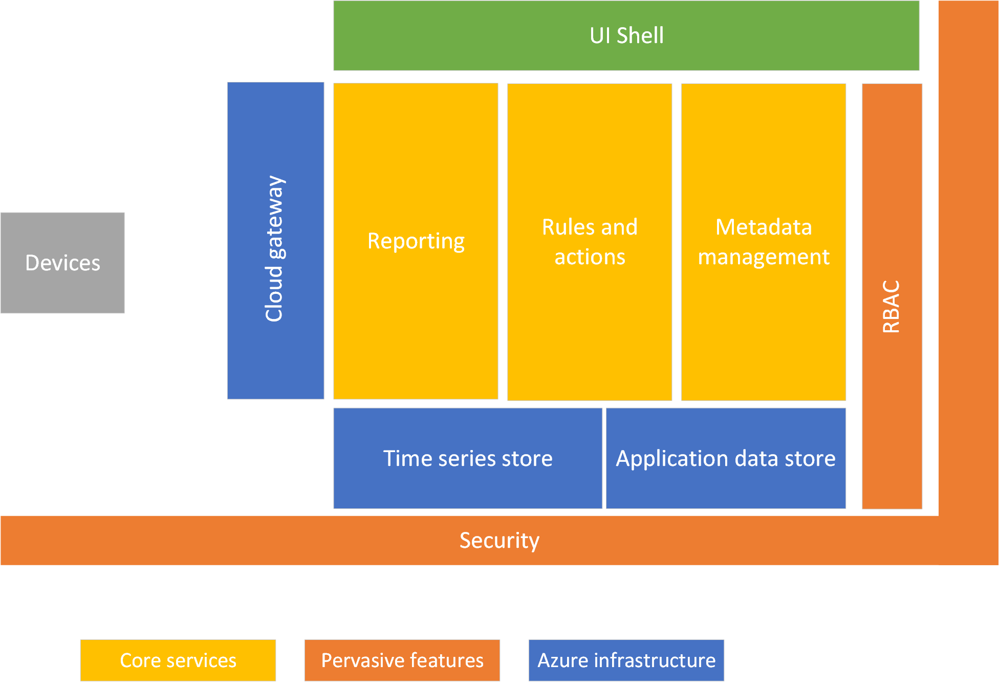
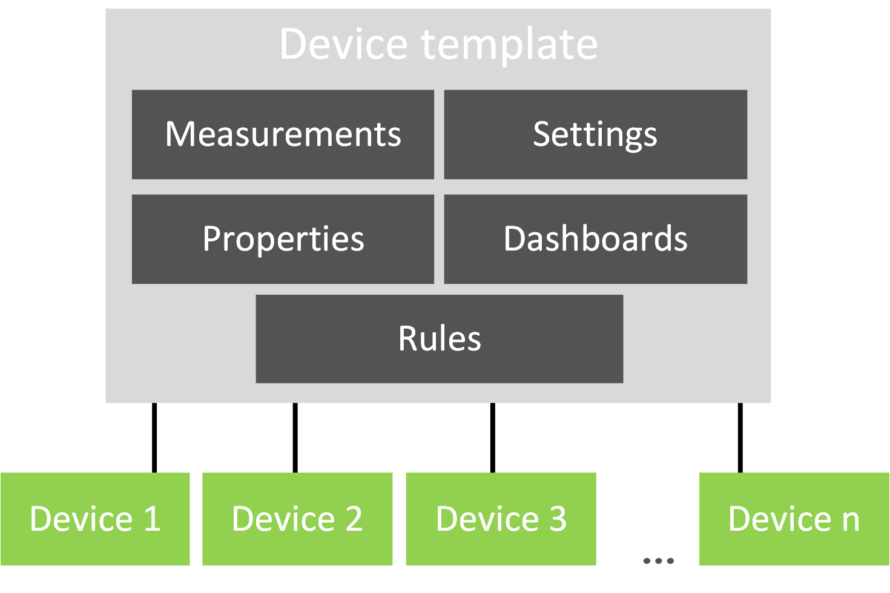

# Azure IoT Central architecture

This article provides an overview of the Microsoft Azure IoT Central architecture.

## Devices

Devices exchange data with your Azure IoT Central application. A device can:

- Send measurements such as telemetry.
- Synchronize settings with your application.

In Azure IoT Central, the data that a device can exchange with your application is specified in a device template. For more information about device templates, see [Metadata management](#metadata-management).

To learn more about how devices connect to your Azure IoT Central application, see [Device connectivity](concepts-connectivity.md).

## Cloud gateway

Azure IoT Central uses Azure IoT Hub as a cloud gateway that enables device connectivity. IoT Hub enables:

- Data ingestion at scale in the cloud.
- Device management.
- Secure device connectivity.

To learn more about IoT Hub, see [Azure IoT Hub](https://docs.microsoft.com/azure/iot-hub/).

To learn more about device connectivity in Azure IoT Central, see [Device connectivity](concepts-connectivity.md).

## Data stores

Azure IoT Central stores application data in the cloud. Application data stored includes:

- Device templates.
- Device identities.
- Device metadata.
- User and role data.

Azure IoT Central uses a time series store for the measurement data sent from your devices. Time series data from devices used by the analytics service.

## Analytics

The analytics service is responsible for generating the custom reporting data that the application displays. An operator can [customize the analytics](howto-create-analytics.md) displayed in the application. The analytics service is built on top of [Azure Time Series Insights](https://azure.microsoft.com/services/time-series-insights/) and processes the measurement data sent from your devices.

## Rules and actions

[Rules and actions](howto-create-telemetry-rules.md) work closely together to automate tasks within the application. A builder can define rules based on device telemetry such as the temperature exceeding a defined threshold. Azure IoT Central uses a stream processor to determine when the rule conditions are met. When a rule condition is met, it triggers an action defined by the builder. For example, an action can send an email to notify an engineer that the temperature in a device is too high.

## Metadata management

In an Azure IoT Central application, device templates define the behavior and capability of types of device. For example, a refrigerator device template specifies the telemetry a refrigerator sends to your application.

In a device template:

- **Measurements** specify the telemetry the device sends to the application.
- **Settings** specify the configurations that an operator can set.
- **Properties** specify metadata that an operator can set.
- **Rules** automate behavior in the application based on data sent from a device.
- **Dashboards** are customizable views of a device in the application.

An application can have one or more simulated and real devices based on each device template.

## Data export

In an Azure IoT Central application, you can [continuously export your data](howto-export-data-event-hubs-service-bus.md) to your own Azure Event Hubs, and Azure Service Bus instances. You can also periodically export your data to your Azure Blob storage account. You can export measurements, devices, and device templates

## Batch device updates

In an Azure IoT Central application, you can [create and run jobs](howto-run-a-job.md) to manage connected devices. These jobs let you to do bulk updates to device properties or settings, or run commands. For example, you can create a job to increase the fan speed for multiple refrigerated vending machines.

## Role-based access control (RBAC)

An [administrator can define access rules](howto-administer.md) for an Azure IoT Central application using the predefined roles. An administrator can assign users to roles that determine what areas of the application the user has access to.

## Security

Security features within Azure IoT Central include:

- Data is encrypted in transit and at rest.
- Authentication is provided either by Azure Active Directory or Microsoft Account. Two-factor authentication is supported.
- Full tenant isolation.
- Device level security.

## UI shell

The UI shell is a modern, responsive, HTML5 browser-based application.
An administrator can customize the UI of the application by applying custom themes and modifying the help links to point to your own custom help resources. To learn more about UI customization, see [Customize the Azure IoT Central UI](howto-customize-ui.md) article.

A operator can create personalized application dashboards. You can have several dashboards that display different data and switch between them.

## Next steps

Now that you have learned about the architecture of Azure IoT Central, the suggested next step is to learn about [device connectivity](concepts-connectivity.md) in Azure IoT Central.