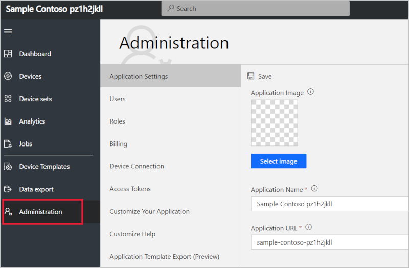
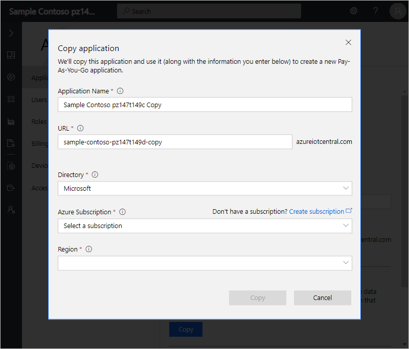
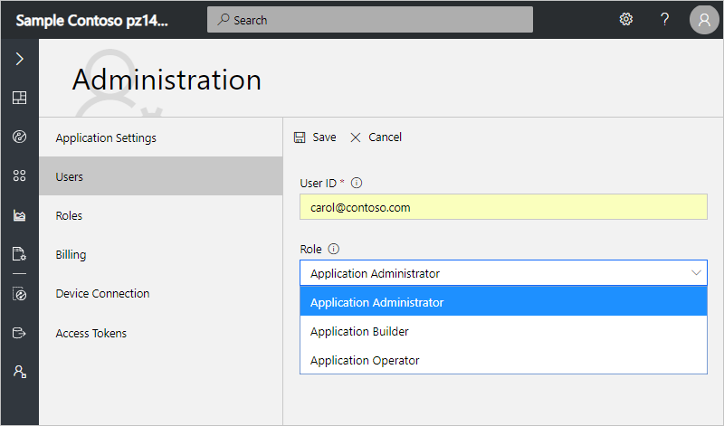
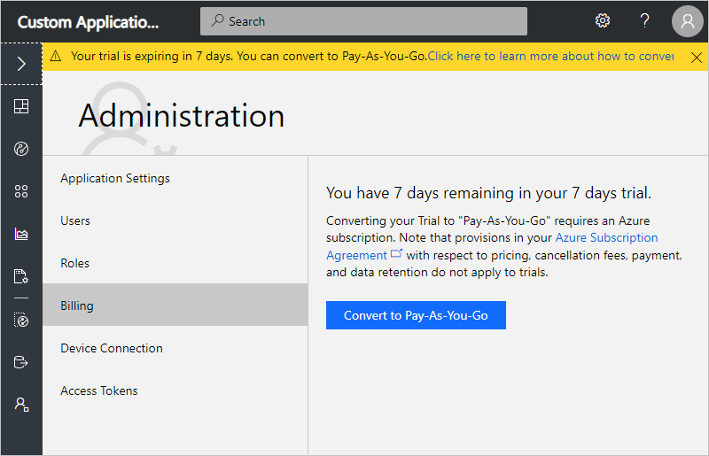
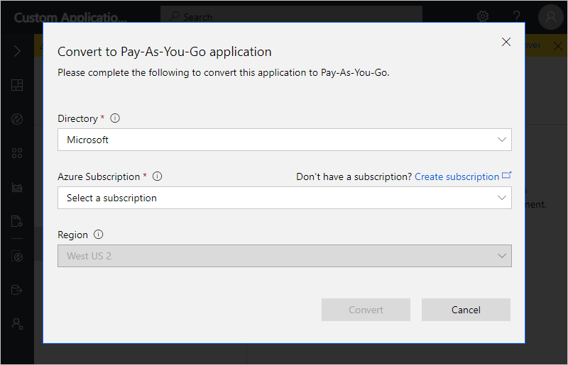

# Administer your IoT Central application

After you create an IoT Central application, you can go to the **Administration** section to:

- Manage application settings
- Manage users
- Manage roles
- View your bill
- Convert your Trial to Pay-As-You-Go
- Export data
- Manage device connection
- Use access tokens for developer tools
- Customize the UI of your application
- Customize help links in the application
- Manage IoT Central programmatically

To access and use the **Administration** section, you must be in the **Administrator** role for an Azure IoT Central application. If you create an Azure IoT Central application, you're automatically assigned to the **Administrator** role for that application. The [Manage Users](#manage-users) section in this article explains more about how to assign the **Administrator** role to other users.

## Manage application settings

### Change application name and URL
In the **Application Settings** page, you can change the name and URL of your application, then select **Save**.

If your administrator creates a custom theme for your application, this page includes an option to hide the **Application Name** in the UI. This is useful if the application logo in the custom theme includes the application name. For more information, see [Customize the Azure IoT Central UI](./howto-customize-ui.md).

> [!Note]
> If you change your URL, your old URL can be taken by another Azure IoT Central customer. If that happens, it is no longer available for you to use. When you change your URL, the old URL no longer works, and you need to notify your users about the new URL to use.

### Prepare and upload image
To change the application image, see [Prepare and upload images to your Azure IoT Central application](howto-prepare-images.md).

### Copy an application
You can create a copy of any application, minus any device instances, device data history, and user data. The copy is a Pay-As-You-Go application that you'll be charged for. You can't create a Trial application in this way.

Select **Copy**. In the dialog box, enter the details for the new Pay-As-You-Go application. Then select **Copy** to confirm that you want to continue. Learn more about the fields in this form in [Create an application](quick-deploy-iot-central.md) quickstart.

After the app copy operation succeeds, you can navigate to the new application using the link.

> [!Note]
> Copying an application also copies the definition of rules and actions. But because users who have access to your original app aren't copied to the copied app, you have to manually add users to actions such as email for which users are a prerequisite. In general it is a good idea to check the rules and actions to make sure they are up to date in the new app.

### Delete an application

> [!Note]
> To delete an application, you must also have permissions to delete resources in the Azure subscription you chose when you created the application. To learn more, see [Use role-based access control to manage access to your Azure subscription resources](https://docs.microsoft.com/azure/active-directory/role-based-access-control-configure).

Use the **Delete** button to permanently delete your IoT Central application. This action permanently deletes all data that's associated with the application.

## Manage users

### Add users

Every user must have a user account before they can sign in and access an Azure IoT Central application. Microsoft Accounts (MSAs) and Azure Active Directory (Azure AD) accounts are supported in Azure IoT Central. Azure Active Directory groups aren't currently supported in Azure IoT Central.

For more information, see [Microsoft account help](https://support.microsoft.com/products/microsoft-account?category=manage-account) and  [Quickstart: Add new users to Azure Active Directory](https://docs.microsoft.com/azure/active-directory/add-users-azure-active-directory).

1. To add a user to an IoT Central application, go to the **Users** page in the **Administration** section.

    

1. To add a user, on the **Users** page, choose **+ Add user**.

1. Choose a role for the user from the **Role** drop-down menu. Learn more about roles in the [Manage roles](#manage-roles) section of this article.

    

    > [!NOTE]
    >  To add users in bulk, enter the user IDs of all the users you'd like to add separated by semi-colons. Choose a role from the **Role** drop-down menu. Then select **Save**.

### Edit the roles that are assigned to users

Roles can't be changed after they are assigned. To change the role that's assigned to a user, delete the user, and then add the user again with a different role.

### Delete users

To delete users, select one or more check boxes on the **Users** page. Then select **Delete**.

## Manage roles

Roles enable you to control who within your organization can perform various tasks in IoT Central. There are three roles you can assign to users of your application.

### Administrator

Users in the **Administrator** role have access to all functionality in an application.

The user who creates an application is automatically assigned to the **Administrator** role. There must always be at least one user in the **Administrator** role.

### Application Builder

Users in the **Application Builder** role can do everything in an application except administer the application. Builders can create, edit, and delete device templates and devices, manage device sets, and run analytics and jobs. Builders won't have access to the **Administration** section of the application.

### Application Operator

Users in the **Application Operator** role can't make changes to device templates and can't administer the application. Operators can add and delete devices, manage device sets, and run analytics and jobs. Operators won't have access to the **Application Builder** and **Administration** pages.

## View your bill

To view your bill, go to the **Billing** page in the **Administration** section. The Azure billing page opens in a new tab, where you can see the bill for each of your Azure IoT Central applications.

### Convert your Trial to Pay-As-You-Go

You can convert your Trial application to a Pay-As-You-Go application. Here are the differences between these types of applications.

- **Trial** applications are free for seven days before they expire. They can be converted to Pay-As-You-Go at any time before they expire.
- **Pay-As-You-Go** applications are charged per device, with the first five devices free.

Learn more about pricing on the [Azure IoT Central pricing page](https://azure.microsoft.com/pricing/details/iot-central/).

To complete this self-service process, follow these steps:

1. Go to the **Billing** page in the **Administration** section.

    

1. Select **Convert to Pay-As-You-Go**.

    

1. Select the appropriate Azure Active Directory, and then the Azure subscription to use for your Pay-As-You-Go application.

1. After you select **Convert**, your application is now a Pay-As-You-Go application and you start getting billed.

## Export data

You can enable **Continuous data export** to export measurements, devices, and device templates data to your Azure Blob storage account. Learn more about how to [export your data](howto-export-data.md).

## Manage device connection

Connect devices at scale in your application using the keys and certificates here. Learn more about [connecting devices](concepts-connectivity.md).

## Use access tokens

Generate access tokens to use them in developer tools. Currently the only developer tool available is the IoT Central explorer for monitoring device messages and changes in properties and settings. Learn more about the [IoT Central explorer](howto-use-iotc-explorer.md).

## Customize your application

For more information about changing the colors and icons in your application, see [Customize the Azure IoT Central UI](./howto-customize-ui.md).

## Customize help

For more information about adding custom help links in your application, see [Customize the Azure IoT Central UI](./howto-customize-ui.md).

## Manage programatically

IoT Central Azure Resource Manager SDK packages are available for Node, Python, C#, Ruby, Java, and Go. You can use these packages to create, list, update, or delete IoT Central applications. The packages include helpers to manage authentication and error handling.

You can find examples of how to use the Azure Resource Manager SDKs at [https://github.com/emgarten/iotcentral-arm-sdk-examples](https://github.com/emgarten/iotcentral-arm-sdk-examples).

To learn more, see the following GitHub repositories and packages:

| Language | Repository | Package |
| ---------| ---------- | ------- |
| Node | [https://github.com/Azure/azure-sdk-for-node](https://github.com/Azure/azure-sdk-for-node) | [https://www.npmjs.com/package/azure-arm-iotcentral](https://www.npmjs.com/package/azure-arm-iotcentral)
| Python |[https://github.com/Azure/azure-sdk-for-python](https://github.com/Azure/azure-sdk-for-python) | [https://pypi.org/project/azure-mgmt-iotcentral](https://pypi.org/project/azure-mgmt-iotcentral)
| C# | [https://github.com/Azure/azure-sdk-for-net](https://github.com/Azure/azure-sdk-for-net) | [https://www.nuget.org/packages/Microsoft.Azure.Management.IotCentral](https://www.nuget.org/packages/Microsoft.Azure.Management.IotCentral)
| Ruby | [https://github.com/Azure/azure-sdk-for-ruby](https://github.com/Azure/azure-sdk-for-ruby) | [https://rubygems.org/gems/azure_mgmt_iot_central](https://rubygems.org/gems/azure_mgmt_iot_central)
| Java | [https://github.com/Azure/azure-sdk-for-java](https://github.com/Azure/azure-sdk-for-java) | [https://search.maven.org/search?q=a:azure-mgmt-iotcentral](https://search.maven.org/search?q=a:azure-mgmt-iotcentral)
| Go | [https://github.com/Azure/azure-sdk-for-go](https://github.com/Azure/azure-sdk-for-go) | [https://github.com/Azure/azure-sdk-for-go](https://github.com/Azure/azure-sdk-for-go)

## Next steps

Now that you've learned how to administer your Azure IoT Central application, here is the suggested next step:

> [!div class="nextstepaction"]
> [Set up the device template](howto-set-up-template.md)
