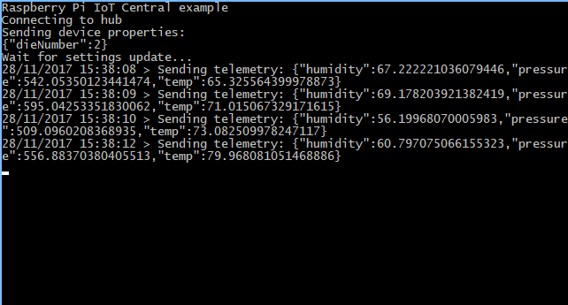
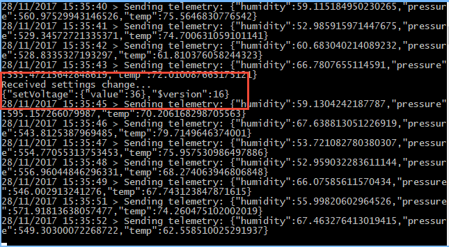

# Connect a Raspberry Pi to your Azure IoT Central application (C#)

[!INCLUDE [howto-raspberrypi-selector](../../includes/iot-central-howto-raspberrypi-selector.md)]

[!INCLUDE [iot-central-original-pnp](../../includes/iot-central-original-pnp-note.md)]

This article describes how, as a device developer, to connect a Raspberry Pi to your Microsoft Azure IoT Central application using the C# programming language.

## Before you begin

To complete the steps in this article, you need the following components:

* An Azure IoT Central application created from the **Sample Devkits** application template. For more information, see the [create an application quickstart](quick-deploy-iot-central.md).
* A Raspberry Pi device running the Raspbian operating system. The Raspberry Pi must be able to connect to the internet. For more information, see [Setting up your Raspberry Pi](https://projects.raspberrypi.org/en/projects/raspberry-pi-setting-up/3).

## **Sample Devkits** application

An application created from the **Sample Devkits** application template includes a **Raspberry Pi** device template with the following characteristics:

- Telemetry, which includes the following measurements the device will collect:
  - Humidity
  - Temperature
  - Pressure
  - Magnetometer (X, Y, Z)
  - Accelerometer (X, Y, Z)
  - Gyroscope (X, Y, Z)
- Settings
  - Voltage
  - Current
  - Fan Speed
  - IR toggle.
- Properties
  - Die number device property
  - Location cloud property

For the full details of the configuration of the device template, see the [Raspberry Pi Device template details](#raspberry-pi-device-template-details).

## Add a real device

In your Azure IoT Central application, add a real device from the **Raspberry Pi** device template. Make a note of the device connection details (**Scope ID**, **Device ID**, and **Primary key**). For more information, see [Add a real device to your Azure IoT Central application](tutorial-add-device.md).

### Create your .NET application

You create and test the device application on your desktop machine.

To complete the following steps, you can use Visual Studio Code. For more information, see [Working with C#](https://code.visualstudio.com/docs/languages/csharp).

> [!NOTE]
> If you prefer, you can complete the following steps using a different code editor.

1. To initialize your .NET project and add the required NuGet packages, run the following commands:

   ```cmd/sh
   mkdir pisample
   cd pisample
   dotnet new console
   dotnet add package Microsoft.Azure.Devices.Client
   dotnet restore
   ```

1. Open the `pisample` folder in Visual Studio Code. Then open the **pisample.csproj** project file. Add the `<RuntimeIdentifiers>` tag shown in the following snippet:

    ```xml
    <Project Sdk="Microsoft.NET.Sdk">
      <PropertyGroup>
        <OutputType>Exe</OutputType>
        <TargetFramework>netcoreapp2.0</TargetFramework>
        <RuntimeIdentifiers>win-arm;linux-arm</RuntimeIdentifiers>
      </PropertyGroup>
      <ItemGroup>
        <PackageReference Include="Microsoft.Azure.Devices.Client" Version="1.19.0" />
      </ItemGroup>
    </Project>
    ```

    > [!NOTE]
    > Your **Microsoft.Azure.Devices.Client** package version number may be higher than the one shown.

1. Save **pisample.csproj**. If Visual Studio Code prompts you to execute the restore command, choose **Restore**.

1. Open **Program.cs** and replace the contents with the following code:

    ```csharp
    using System;
    using System.Text;
    using System.Threading;
    using System.Threading.Tasks;

    using Microsoft.Azure.Devices.Client;
    using Microsoft.Azure.Devices.Shared;
    using Newtonsoft.Json;

    namespace pisample
    {
      class Program
      {
        static string DeviceConnectionString = "{your device connection string}";
        static DeviceClient Client = null;
        static TwinCollection reportedProperties = new TwinCollection();
        static CancellationTokenSource cts;
        static double baseTemperature = 60;
        static double basePressure = 500;
        static double baseHumidity = 50;
        static void Main(string[] args)
        {
          Console.WriteLine("Raspberry Pi Azure IoT Central example");

          try
          {
            InitClient();
            SendDeviceProperties();

            cts = new CancellationTokenSource();
            SendTelemetryAsync(cts.Token);

            Console.WriteLine("Wait for settings update...");
            Client.SetDesiredPropertyUpdateCallbackAsync(HandleSettingChanged, null).Wait();
            Console.ReadKey();
            cts.Cancel();
          }
          catch (Exception ex)
          {
            Console.WriteLine();
            Console.WriteLine("Error in sample: {0}", ex.Message);
          }
        }

        public static void InitClient()
        {
          try
          {
            Console.WriteLine("Connecting to hub");
            Client = DeviceClient.CreateFromConnectionString(DeviceConnectionString, TransportType.Mqtt);
          }
          catch (Exception ex)
          {
            Console.WriteLine();
            Console.WriteLine("Error in sample: {0}", ex.Message);
          }
        }

        public static async void SendDeviceProperties()
        {
          try
          {
            Console.WriteLine("Sending device properties:");
            Random random = new Random();
            TwinCollection telemetryConfig = new TwinCollection();
            reportedProperties["dieNumber"] = random.Next(1, 6);
            Console.WriteLine(JsonConvert.SerializeObject(reportedProperties));

            await Client.UpdateReportedPropertiesAsync(reportedProperties);
          }
          catch (Exception ex)
          {
            Console.WriteLine();
            Console.WriteLine("Error in sample: {0}", ex.Message);
          }
        }

        private static async void SendTelemetryAsync(CancellationToken token)
        {
          try
          {
            Random rand = new Random();

            while (true)
            {
              double currentTemperature = baseTemperature + rand.NextDouble() * 20;
              double currentPressure = basePressure + rand.NextDouble() * 100;
              double currentHumidity = baseHumidity + rand.NextDouble() * 20;

              var telemetryDataPoint = new
              {
                humidity = currentHumidity,
                pressure = currentPressure,
                temp = currentTemperature
              };
              var messageString = JsonConvert.SerializeObject(telemetryDataPoint);
              var message = new Message(Encoding.ASCII.GetBytes(messageString));

              token.ThrowIfCancellationRequested();
              await Client.SendEventAsync(message);

              Console.WriteLine("{0} > Sending telemetry: {1}", DateTime.Now, messageString);

              await Task.Delay(1000);
            }
          }
          catch (Exception ex)
          {
            Console.WriteLine();
            Console.WriteLine("Intentional shutdown: {0}", ex.Message);
          }
        }

        private static async Task HandleSettingChanged(TwinCollection desiredProperties, object userContext)
        {
          try
          {
            Console.WriteLine("Received settings change...");
            Console.WriteLine(JsonConvert.SerializeObject(desiredProperties));

            string setting = "fanSpeed";
            if (desiredProperties.Contains(setting))
            {
              // Act on setting change, then
              AcknowledgeSettingChange(desiredProperties, setting);
            }
            setting = "setVoltage";
            if (desiredProperties.Contains(setting))
            {
              // Act on setting change, then
              AcknowledgeSettingChange(desiredProperties, setting);
            }
            setting = "setCurrent";
            if (desiredProperties.Contains(setting))
            {
              // Act on setting change, then
              AcknowledgeSettingChange(desiredProperties, setting);
            }
            setting = "activateIR";
            if (desiredProperties.Contains(setting))
            {
              // Act on setting change, then
              AcknowledgeSettingChange(desiredProperties, setting);
            }
            await Client.UpdateReportedPropertiesAsync(reportedProperties);
          }

          catch (Exception ex)
          {
            Console.WriteLine();
            Console.WriteLine("Error in sample: {0}", ex.Message);
          }
        }

        private static void AcknowledgeSettingChange(TwinCollection desiredProperties, string setting)
        {
          reportedProperties[setting] = new
          {
            value = desiredProperties[setting]["value"],
            status = "completed",
            desiredVersion = desiredProperties["$version"],
            message = "Processed"
          };
        }
      }
    }
    ```

    > [!NOTE]
    > You update the placeholder `{your device connection string}` in the next step.

## Run your .NET application

Add your device-specific connection string to the code for the device to authenticate with Azure IoT Central. Follow these instructions to [generate the device connection string](howto-generate-connection-string.md) using the **Scope ID**, **Device ID**, and **Primary key** you made a note of previously.

1. Replace `{your device connection string}` in the **Program.cs** file with the connection string you generated.

1. Run the following command in your command-line environment:

   ```cmd/sh
   dotnet restore
   dotnet publish -r linux-arm
   ```

1. Copy the `pisample\bin\Debug\netcoreapp2.1\linux-arm\publish` folder to your Raspberry Pi device. You can use the **scp** command to copy the files, for example:

    ```cmd/sh
    scp -r publish pi@192.168.0.40:publish
    ```

    For more information, see [Raspberry Pi remote access](https://www.raspberrypi.org/documentation/remote-access/).

1. Sign in to your Raspberry Pi device and run the following commands in a shell:

    ```cmd/sh
    sudo apt-get update
    sudo apt-get install libc6 libcurl3 libgcc1 libgssapi-krb5-2 liblttng-ust0 libstdc++6 libunwind8 libuuid1 zlib1g
    ```

1. On your Raspberry Pi, run the following commands:

    ```cmd/sh
    cd publish
    chmod 777 pisample
    ./pisample
    ```

    

1. In your Azure IoT Central application, you can see how the code running on the Raspberry Pi interacts with the application:

   * On the **Measurements** page for your real device, you can see the telemetry.
   * On the **Properties** page, you can see the value of the reported **Die Number** property.
   * On the **Settings** page, you can change various settings on the Raspberry Pi such as voltage and fan speed.

     The following screenshot shows the Raspberry Pi receiving the setting change:

     

## Raspberry Pi Device template details

An application created from the **Sample Devkits** application template includes a **Raspberry Pi** device template with the following characteristics:

### Telemetry measurements

| Field name     | Units  | Minimum | Maximum | Decimal places |
| -------------- | ------ | ------- | ------- | -------------- |
| humidity       | %      | 0       | 100     | 0              |
| temp           | °C     | -40     | 120     | 0              |
| pressure       | hPa    | 260     | 1260    | 0              |
| magnetometerX  | mgauss | -1000   | 1000    | 0              |
| magnetometerY  | mgauss | -1000   | 1000    | 0              |
| magnetometerZ  | mgauss | -1000   | 1000    | 0              |
| accelerometerX | mg     | -2000   | 2000    | 0              |
| accelerometerY | mg     | -2000   | 2000    | 0              |
| accelerometerZ | mg     | -2000   | 2000    | 0              |
| gyroscopeX     | mdps   | -2000   | 2000    | 0              |
| gyroscopeY     | mdps   | -2000   | 2000    | 0              |
| gyroscopeZ     | mdps   | -2000   | 2000    | 0              |

### Settings

Numeric settings

| Display name | Field name | Units | Decimal places | Minimum | Maximum | Initial |
| ------------ | ---------- | ----- | -------------- | ------- | ------- | ------- |
| Voltage      | setVoltage | Volts | 0              | 0       | 240     | 0       |
| Current      | setCurrent | Amps  | 0              | 0       | 100     | 0       |
| Fan Speed    | fanSpeed   | RPM   | 0              | 0       | 1000    | 0       |

Toggle settings

| Display name | Field name | On text | Off text | Initial |
| ------------ | ---------- | ------- | -------- | ------- |
| IR           | activateIR | ON      | OFF      | Off     |

### Properties

| Type            | Display name | Field name | Data type |
| --------------- | ------------ | ---------- | --------- |
| Device property | Die number   | dieNumber  | number    |
| Text            | Location     | location   | N/A       |

## Next steps

Now that you've learned how to connect a Raspberry Pi to your Azure IoT Central application, the suggested next step is to learn how to [set up a custom device template](howto-set-up-template.md) for your own IoT device.
