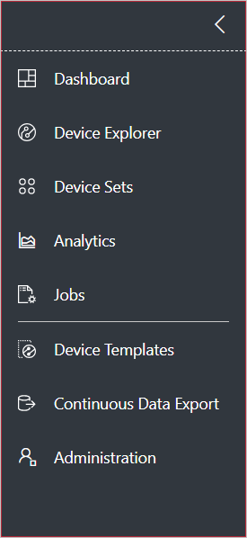
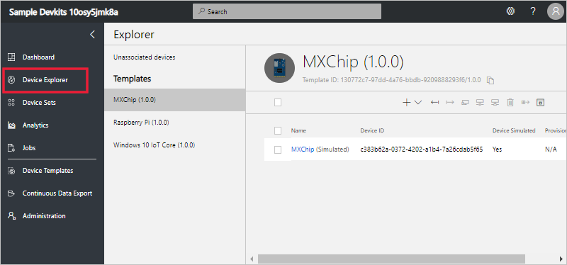
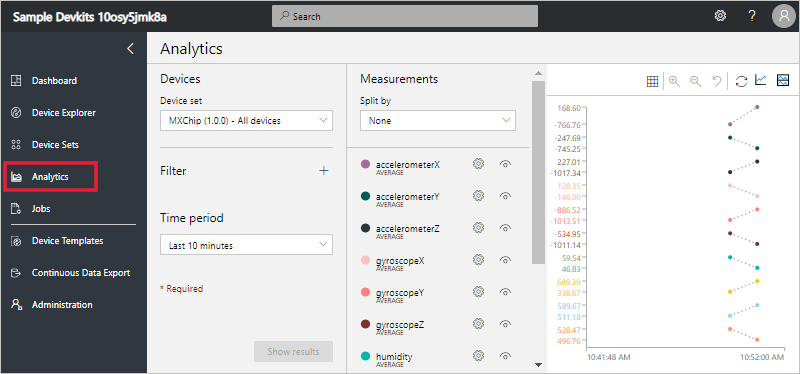
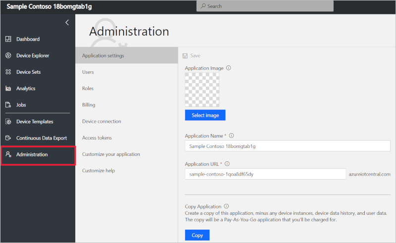

---
# Mandatory fields. See more on aka.ms/skyeye/meta.
title: Take a tour of the Azure IoT Central UI | Microsoft Docs
description: As a builder, become familiar with the key areas of the Azure IoT Central UI that you use to create an IoT solution.
services: iot-central
author: tanmaybhagwat
ms.author: tanmayb
ms.date: 4/13/2018
ms.topic: overview
# Use only one of the following. Use ms.service for services, ms.prod for on-prem. Remove the # before the relevant field.
ms.prod: microsoft-iot-central
# product-name-from-white-list

# Optional fields. Don't forget to remove # if you need a field.
# ms.custom: can-be-multiple-comma-separated
# ms.devlang:devlang-from-white-list
# ms.suite: 
# ms.tgt_pltfrm:
# ms.reviewer:
manager: timlt
---

# Take a tour of the Azure IoT Central UI

This article introduces you to the Microsoft Azure IoT Central UI. You can use the UI to create, manage, and use an Azure IoT Central solution and its connected devices.

As a _builder_, you use the Azure IoT Central UI to define your Azure IoT Central solution. You can use the UI to:

- Define the types of device that connect to your solution.
- Configure the rules and actions for your devices.
- Customize the UI for an _operator_ who uses your solution.

As an _operator_, you use the Azure IoT Central UI to manage your Azure IoT Central solution. You can use the UI to:

- Monitor your devices.
- Configure your devices.
- Troubleshoot and remediate issues with your devices.
- Provision new devices.

## Use the left navigation menu

Use the left navigation menu to access the different areas of the application:

| Menu | Description |
| ---- | ----------- |
|  | <ul><li>The **Home** button displays the home page of your application. As a builder, you can customize this home page for your operators.</li><li>The **Device Explorer** button lists both the device templates defined in your application, and the simulated and real devices associated with each device template. As an operator, you use the **Device Explorer** to manage your connected devices.</li><li>The **Device Sets** button enables you to view and create device sets. As an operator, you can create device sets as a logical collection of devices specified by a query.</li><li>The **Analytics** button shows analytics derived from device telemetry for devices and device sets. As an operator, you can create custom views on top of device data to derive insights from your application.</li><li>The **Application Builder** button shows the tools a builder uses, such as the **Create Device Template** tool.</li><li>The **Administration** button shows the application administration pages where an administrator can manage application settings, users, and roles.</li></ul> |

## Search, help, and support

The top menu appears on every page:

- To search for device templates and devices, choose the **Search** icon.
- To get help and support, choose the **Help** drop-down for a list of resources.
- To control the tutorials, change the UI theme, or sign out of the application, choose the **Account** icon.

You can choose between a light theme or a dark theme for the UI:

## Home page

The home page is the first page you see when you sign in to your Azure IoT Central application. As a builder, you can customize the home page for other users of the application by adding tiles. To learn more, see the [Customize the Azure IoT Central operator's view](tutorial-customize-operator.md) tutorial.

## Device explorer

The explorer page shows the _device templates_ and _devices_ in your Azure IoT Central application.

* A device template defines a type of device that can connect to your application. To learn more, see the [Define a new device type in your Azure IoT Central application](tutorial-define-device-type.md).
* A device represents either a real or simulated device in your application. To learn more, see the [Add a new device to your Azure IoT Central application](tutorial-add-device.md).

## Device sets

The _device sets_ page shows device sets created by the builder. A device set is a collection of related devices. A builder defines a query to identify the devices that are included in a device set. You use device sets when you customize the analytics in your application. To learn more, see the [Use device sets in your Azure IoT Central application](howto-use-device-sets.md) article.

## Analytics

The analytics page shows charts that help you understand how the devices connected to your application are behaving. An operator uses this page to monitor and investigate issues with connected devices. The builder can define the charts shown on this page. To learn more, see the [Create custom analytics for your Azure IoT Central application](howto-create-analytics.md) article.

## Application Builder

The application builder page contains links to the tools a builder uses to create an Azure IoT Central application, such as creating device templates and configuring the home page. To learn more, see the [Define a new device type in your Azure IoT Central application](tutorial-define-device-type.md) tutorial.

## Administration

The administration page contains links to the tools an administrator uses such as defining users and roles in the application. To learn more, see the [Administer your Azure IoT Central application](howto-administer.md) article.

## Next steps

Now that you have an overview of Azure IoT Central and are familiar with the layout of the UI, the suggested next step is to complete the [Create an Azure IoT Central application](quick-deploy-iot-central.md) quickstart.