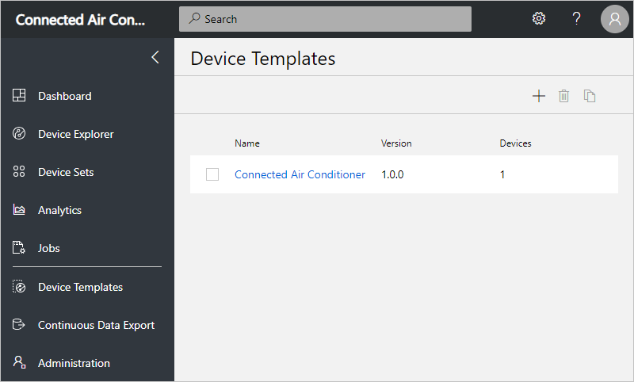
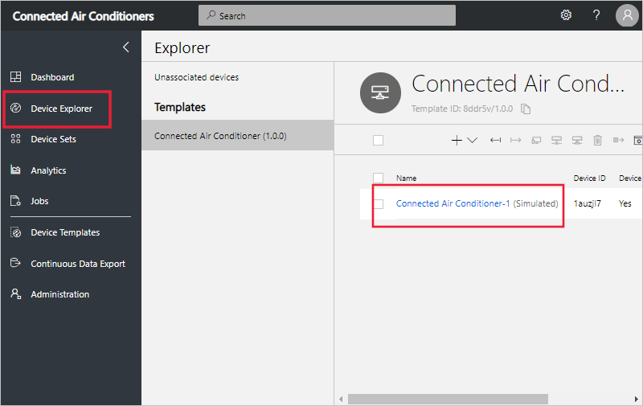

# Tutorial: Customize the Azure IoT Central operator's view (New UI design)

This tutorial shows you, as a builder, how to customize the operator's view of your application. When you make a change to the application as a builder, you can preview the operator's view in the Microsoft Azure IoT Central application.

In this tutorial, you customize the application to display relevant information about the connected air conditioner device to an operator. Your customizations enable the operator to manage the air conditioner devices connected to the application.

In this tutorial, you learn how to:

> [!div class="checklist"]
> * Configure your device dashboard
> * Configure your device settings layout
> * Configure your device properties layout
> * Preview the device as an operator
> * Configure your default home page
> * Preview the default home page as an operator

[!INCLUDE [iot-central-experimental-note](../../includes/iot-central-experimental-note.md)]

## Prerequisites

Before you begin, you should complete the two previous tutorials:

* [Define a new device type in your Azure IoT Central application](tutorial-define-device-type-experimental.md?toc=/azure/iot-central-experimental/toc.json&bc=/azure/iot-central-experimental/breadcrumb/toc.json).
* [Configure rules and actions for your device](tutorial-configure-rules-experimental.md?toc=/azure/iot-central-experimental/toc.json&bc=/azure/iot-central-experimental/breadcrumb/toc.json).

## Configure your device dashboard

As a builder, you can define what information displays on a device dashboard. In the [Define a new device type in your application](tutorial-define-device-type-experimental.md?toc=/azure/iot-central-experimental/toc.json&bc=/azure/iot-central-experimental/breadcrumb/toc.json) tutorial, you added a line-chart and other information to the **Connected Air Conditioner** dashboard.

1. To edit the **Connected Air Conditioner** device template, choose **Device Templates** on the left navigation menu:

    

2. To customize your device dashboard, click the **Connected Air Conditioner (1.0.0)** device template device you created in the [Define a new device type in your application](tutorial-define-device-type-experimental.md?toc=/azure/iot-central-experimental/toc.json&bc=/azure/iot-central-experimental/breadcrumb/toc.json) tutorial.

3. To edit the dashboard, select the **Dashboard** tab.

4. To add a Key Performance Indicator (KPI) tile to the dashboard, choose **KPI**:

    To define the KPI, use the information in the following table:

    | Setting     | Value |
    | ----------- | ----- |
    | Name        | Maximum temperature |
    | Time range  | Past 1 week |
    | Measurement Type | Telemetry |
    | Measurement | temperature |
    | Aggregation | Maximum |
    | Visibility  | Enabled |

    

5. Click **Save**. You can now see the KPI tile on the dashboard:

    

6. To move or resize a tile on the dashboard, move the mouse pointer over the tile. You can drag the tile to a new location or resize it.

## Configure your settings layout

As a builder, you can also configure the operator's view of the device settings. An operator uses the device settings tab to configure a device. For example, an operator uses the settings tab to set the target temperature for the connected air conditioner.

1. To edit the settings layout for your connected air conditioner, choose the **Settings** tab.

2. You can move and resize the settings tiles:

    

## Configure your properties layout

In addition to the dashboard and settings, you can also configure the operator's view of the device properties. An operator uses the device properties tab to manage device metadata. For example, an operator uses the properties tab to view a device serial number or update contact details for the manufacturer.

1. To edit the properties layout for your connected air conditioner, choose the **Properties** tab.

2. You can move and resize the properties fields:

    

## Preview the connected air conditioner device as an operator

You use the **Device Templates** page to customize the dashboard, settings, and properties tabs for an operator. You use the **Device Explorer** page to view and use the device template.

1. To view and use the connected air conditioner template as an operator, navigate to the **Device Explorer** page and choose the simulated device that IoT Central generated from your template:

    

2. To update the Location of this device, choose **Properties** and edit the value in the Location tile. Then click **Save**:

    

3. To send a setting to your connected air conditioner, choose **Settings**, change a setting value in a tile, and choose **Update**:

    

    When the device acknowledges the new setting value, the setting shows as **synced** on the tile.

4. As an operator, you can view the device dashboard as configured by the builder:

    

## Configure the default home page

When a builder or operator signs in to an Azure IoT Central application, they see a home page. As a builder, you can configure the content of this home page to include the most useful and relevant content for an operator.

1. To customize the default home page, navigate to the **Home** page and edit **Edit** at the top right of the page. A panel slides out from the left with a list of objects you can add to the **Home** page:

    

2. To customize the **Home** page, add tiles from the **Library**. Choose **Link**, and add details of your organization's web site. Then click **Save**:

    

    > [!NOTE]
    > You can also add links to pages within your Azure IoT Central application. For example, you could add a link to a device dashboard or settings page.

3. Optionally, choose **Image** and upload an image to display on your home page. An image can have a URL to which you navigate when you click on it:

    

    To learn more, see [How to prepare and upload images to your Azure IoT Central application](howto-prepare-images-experimental.md?toc=/azure/iot-central-experimental/toc.json&bc=/azure/iot-central-experimental/breadcrumb/toc.json).

## Preview the default home page as an operator

To preview the home page as an operator, click **Done** at the top right of the page:

You can click on the link and image tiles to navigate to the URLs you set as a builder.

## Next steps

In this tutorial, you learned how to customize the operator's view of the application.

<!-- Repeat task list from intro -->
> [!div class="nextstepaction"]
> * Configure your device dashboard
> * Configure your device settings layout
> * Configure your device properties layout
> * Preview the device as an operator
> * Configure your default home page
> * Preview the default home page as an operator

Now that you have learned how to customize the operator's view of the application, the suggested next steps are:

* [Monitor your devices (as an operator)](tutorial-monitor-devices-experimental.md?toc=/azure/iot-central-experimental/toc.json&bc=/azure/iot-central-experimental/breadcrumb/toc.json)
* [Add a new device to your application (as an operator and device developer)](tutorial-add-device-experimental.md?toc=/azure/iot-central-experimental/toc.json&bc=/azure/iot-central-experimental/breadcrumb/toc.json)
