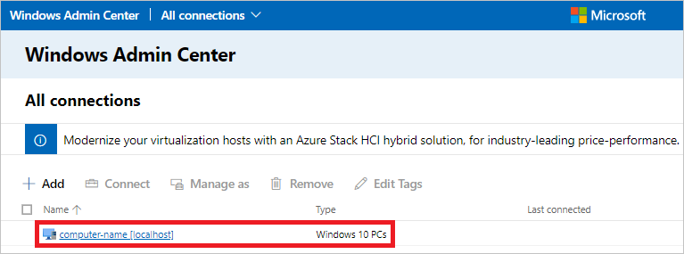
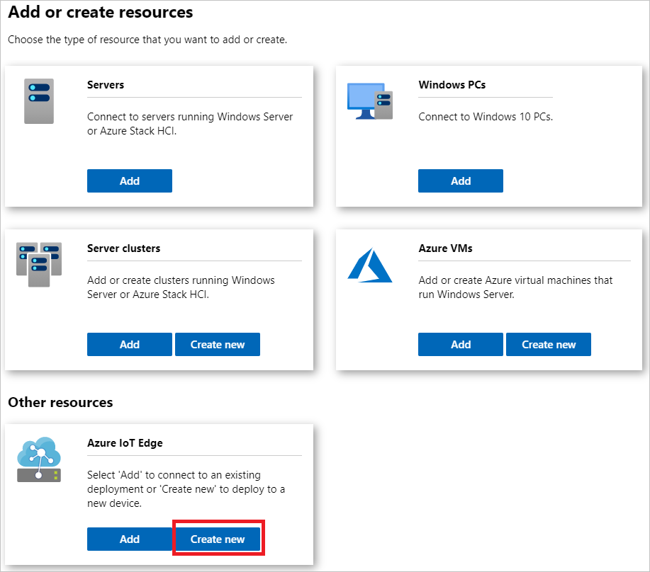
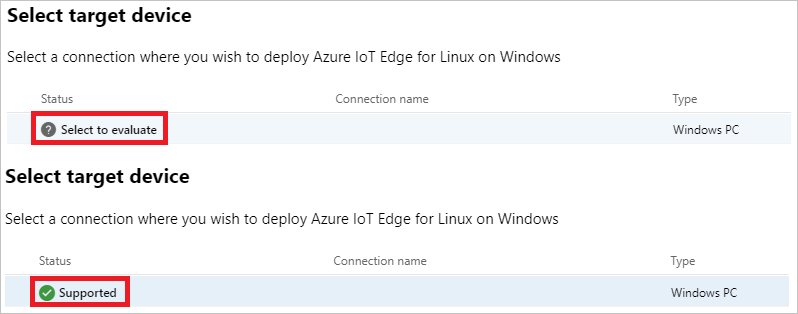
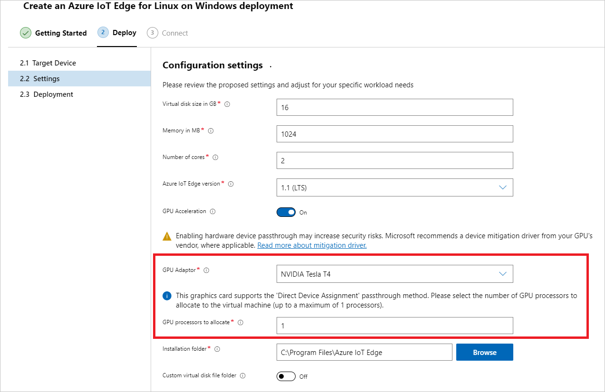
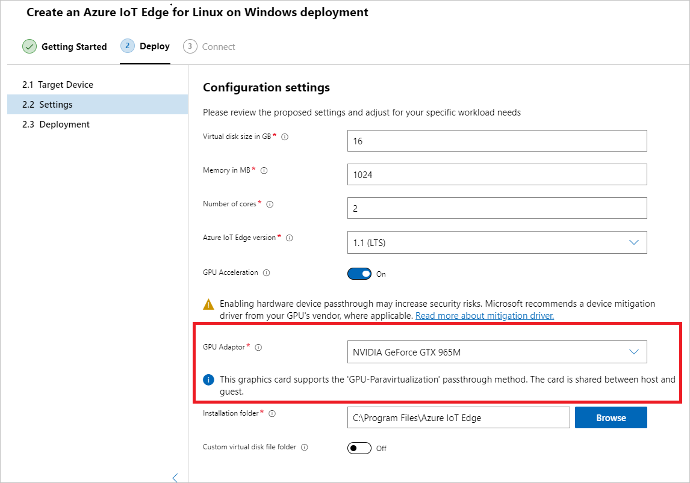
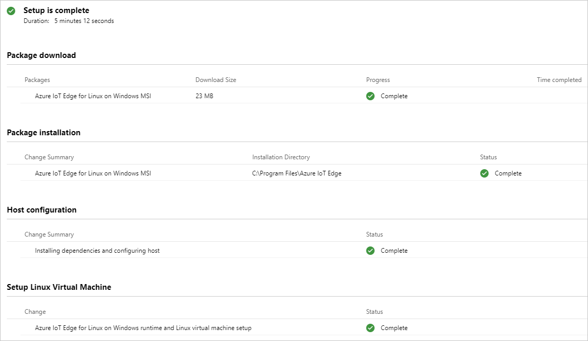
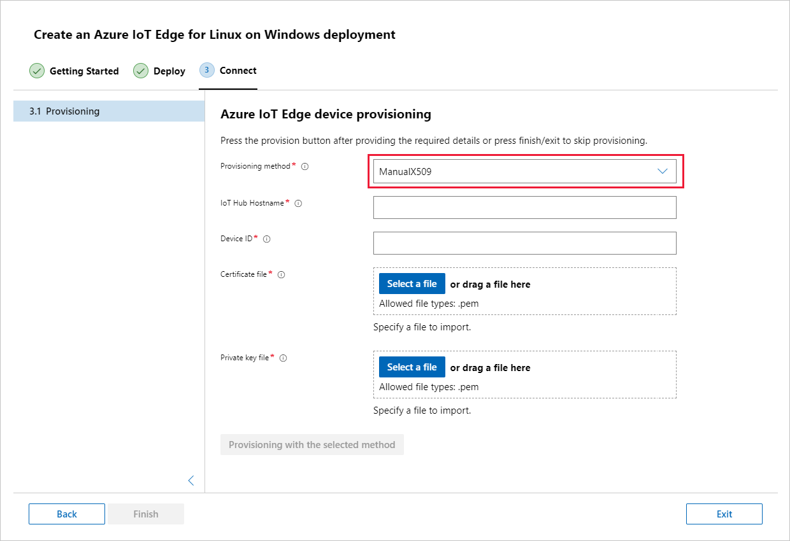

# Install and provision Azure IoT Edge for Linux on a Windows device

[!INCLUDE [iot-edge-version-201806](../../includes/iot-edge-version-201806.md)]

The Azure IoT Edge runtime is what turns a device into an IoT Edge device. The runtime can be deployed on devices from PC class to industrial servers. Once a device is configured with the IoT Edge runtime, you can start deploying business logic to it from the cloud. To learn more, see [Understand the Azure IoT Edge runtime and its architecture](iot-edge-runtime.md).

Azure IoT Edge for Linux on Windows allows you to install IoT Edge on Linux virtual machines that run on Windows devices. The Linux version of Azure IoT Edge and any Linux modules deployed with it run on the virtual machine. From there, Windows applications and code and the IoT Edge runtime and modules can freely interact with each other.

This article lists the steps to set up IoT Edge on a Windows device. These steps deploy a Linux virtual machine that contains the IoT Edge runtime to run on your Windows device, then provision the device with its IoT Hub device identity.

>[!NOTE]
>IoT Edge for Linux on Windows is the recommended experience for using Azure IoT Edge in a Windows environment. However, Windows containers are still available. If you prefer to use Windows containers, see [Install and manage Azure IoT Edge with Windows containers](how-to-install-iot-edge-windows-on-windows.md).

## Prerequisites

* An Azure account with a valid subscription. If you don't have an [Azure subscription](../guides/developer/azure-developer-guide.md#understanding-accounts-subscriptions-and-billing), create a [free account](https://azure.microsoft.com/free/) before you begin.

* A free or standard tier [IoT Hub](../iot-hub/iot-hub-create-through-portal.md) in Azure.

* A Windows device with the following minimum system requirements:

  * Windows 10 Version 1809 or later; build 17763 or later
  * Professional, Enterprise, or Server editions
  * Minimum Free Memory: 1 GB
  * Minimum Free Disk Space: 10 GB
  * Virtualization support
    * On Windows 10, enable Hyper-V. For more information, see [Install Hyper-V on Windows 10](/virtualization/hyper-v-on-windows/quick-start/enable-hyper-v).
    * On Windows Server, install the Hyper-V role and create a default network switch. For more information, see [Nested virtualization for Azure IoT Edge for Linux on Windows](nested-virtualization.md).
    * On a virtual machine, configure nested virtualization. For more information, see [nested virtualization](nested-virtualization.md).
  * Networking support
      * Windows Server does not come with a default switch. Before you can deploy EFLOW to a Windows Server device, you need to create a virtual switch.  For more information, see [Create virtual switch for Linux on Windows](how-to-create-virtual-switch.md).
      * Windows Desktop versions come with a default switch that can be used for EFLOW installation. If needed, you can create your own custom virtual switch.     

* If you want to install and manage IoT Edge device using Windows Admin Center, make sure you have access to Windows Admin Center and have the Azure IoT Edge extension installed:

   1. Download and run the [Windows Admin Center installer](https://aka.ms/wacdownload). Follow the install wizard prompts to install Windows Admin Center.

   1. Once installed, use a supported browser to open Windows Admin Center. Supported browsers include Microsoft Edge (Windows 10, version 1709 or later), Google Chrome, and Microsoft Edge Insider.

   1. On the first use of Windows Admin Center, you will be prompted to select a certificate to use. Select **Windows Admin Center Client** as your certificate.

   1. Install the Azure IoT Edge extension. Select the gear icon in the top right of the Windows Admin Center dashboard.

      

   1. On the **Settings** menu, under **Gateway**, select **Extensions**.

   1. On the **Available extensions** tab, find **Azure IoT Edge** in the list of extensions. Choose it, and select the **Install** prompt above the list of extensions.

   1. After the installation completes, you should see Azure IoT Edge in the list of installed extensions on the **Installed extensions** tab.

* If you want to use **GPU-accelerated Linux modules** in your Azure IoT Edge for Linux on Windows deployment, there are several configuration options to consider. You will need to install the correct drivers depending on your GPU architecture, and you may need access to a Windows Insider Program build. To determine your configuration needs and satisfy these prerequisites, see [GPU acceleration for Azure IoT Edge for Linux on Windows](gpu-acceleration.md).

## Choose your provisioning method

Azure IoT Edge for Linux on Windows supports the following provisioning methods:

* **Manual provisioning** for a single device.

  * To prepare for manual provisioning, follow the steps in [Register an IoT Edge device in IoT Hub](how-to-register-device.md). Choose either symmetric key authentication or X.509 certificate authentication, then return to this article to install and provision IoT Edge.

* **Automatic provisioning** using the IoT Hub Device Provisioning Service (DPS) for one or many devices.

  * Choose the authentication method you want to use, and then follow the steps in the appropriate article to set up an instance of DPS and create an enrollment to provision your device or devices. For more information about the enrollment types, visit the [Azure IoT Hub Device Provisioning Service concepts](../iot-dps/concepts-service.md#enrollment).

    * [Provision an IoT Edge device with DPS and symmetric keys.](how-to-auto-provision-symmetric-keys.md)
    * [Provision an IoT Edge device with DPS and X.509 certificates.](how-to-auto-provision-x509-certs.md)
    * [Provision an IoT Edge device with DPS and TPM attestation.](how-to-auto-provision-tpm-linux-on-windows.md)

## Create a new deployment

Deploy Azure IoT Edge for Linux on Windows on your target device.

# [PowerShell](#tab/powershell)

Install IoT Edge for Linux on Windows onto your target device if you have not already.

> [!NOTE]
> The following PowerShell process outlines how to deploy IoT Edge for Linux on Windows onto the local device. To deploy to a remote target device using PowerShell, you can use [Remote PowerShell](/powershell/module/microsoft.powershell.core/about/about_remote) to establish a connection to a remote device and run these commands remotely on that device.

1. In an elevated PowerShell session, run each of the following commands to download IoT Edge for Linux on Windows.

   ```powershell
   $msiPath = $([io.Path]::Combine($env:TEMP, 'AzureIoTEdge.msi'))
   $ProgressPreference = 'SilentlyContinue'
   Invoke-WebRequest "https://aka.ms/AzEflowMSI" -OutFile $msiPath
   ```

1. Install IoT Edge for Linux on Windows on your device.

   ```powershell
   Start-Process -Wait msiexec -ArgumentList "/i","$([io.Path]::Combine($env:TEMP, 'AzureIoTEdge.msi'))","/qn"
   ```

   You can specify custom IoT Edge for Linux on Windows installation and VHDX directories by adding `INSTALLDIR="<FULLY_QUALIFIED_PATH>"` and `VHDXDIR="<FULLY_QUALIFIED_PATH>"` parameters to the install command.

1. Set the execution policy on the target device to `AllSigned` if it is not already. You can check the current execution policy in an elevated PowerShell prompt using:

   ```powershell
   Get-ExecutionPolicy -List
   ```

   If the execution policy of `local machine` is not `AllSigned`, you can set the execution policy using:

   ```powershell
   Set-ExecutionPolicy -ExecutionPolicy AllSigned -Force
   ```

1. Create the IoT Edge for Linux on Windows deployment.

   ```powershell
   Deploy-Eflow
   ```

   The `Deploy-Eflow` command takes optional parameters that help you customize your deployment.

   You can assign a GPU to your deployment to enable GPU-accelerated Linux modules. To gain access to these features, you will need to install the prerequisites detailed in [GPU acceleration for Azure IoT Edge for Linux on Windows](gpu-acceleration.md).

   To use a GPU passthrough, you will need add the **gpuName**, **gpuPassthroughType**, and **gpuCount** parameters to your `Deploy-Eflow` command. For information about all the optional parameters available, see [PowerShell functions for IoT Edge for Linux on Windows](reference-iot-edge-for-linux-on-windows-functions.md#deploy-eflow).

   >[!WARNING]
   >Enabling hardware device passthrough may increase security risks. Microsoft recommends a device mitigation driver from your GPU's vendor, when applicable. For more information, see [Deploy graphics devices using discrete device assignment](/windows-server/virtualization/hyper-v/deploy/deploying-graphics-devices-using-dda).


1. Enter 'Y' to accept the license terms.

1. Enter 'O' or 'R' to toggle **Optional diagnostic data** on or off, depending on your preference.

1. Once the deployment is complete, the PowerShell window reports **Deployment successful**.

   

Once your deployment is complete, you are ready to provision your device.

# [Windows Admin Center](#tab/windowsadmincenter)

>[!NOTE]
>The Azure IoT Edge extension for Windows Admin Center is currently in [public preview](https://azure.microsoft.com/support/legal/preview-supplemental-terms/). Installation and management processes may be different than for generally available features.

On the Windows Admin Center start page, under the list of connections, you will see a local host connection representing the PC where you are running Windows Admin Center. Any additional servers, PCs, or clusters that you manage will also show up here.

You can use Windows Admin Center to install and manage Azure IoT Edge for Linux on Windows on either your local device or remote managed devices. In this guide, the local host connection will serve as the target device for the deployment of Azure IoT Edge for Linux on Windows.

If you want to deploy to a remote target device instead of your local device and you do not see your desired target device in the list, follow the [instructions to add your device.](/windows-server/manage/windows-admin-center/use/get-started#connecting-to-managed-nodes-and-clusters).

   

1. Select **Add**.

1. On the **Add or create resources** pane, locate the **Azure IoT Edge** tile. Select **Create new** to install a new instance of Azure IoT Edge for Linux on Windows on a device.

   If you already have IoT Edge for Linux on Windows running on a device, you could select **Add** to connect to that existing IoT Edge device and manage it with Windows Admin Center.

   

1. The **Create an Azure IoT Edge for Linux on Windows deployment** pane will open. On the **1. Getting Started** tab, review the minimum requirements and select **Next**.

1. Review the license terms, check **I Accept**, and select **Next**.

1. You can toggle **Optional diagnostic data** on or off, depending on your preference.

1. Select **Next: Deploy**.

   

1. On the **2. Deploy** tab, under **Select a target device**, click on your listed device to validate it meets the minimum requirements. Once its status is confirmed as supported, select **Next**.

   

1. On the **2.2 Settings** tab, review the configuration settings of your deployment.

   >[!NOTE]
   >IoT Edge for Linux on Windows uses a default switch, which assigns the Linux virtual machine an internal IP address. This internal IP address cannot be reached from outside the Windows machine. You can connect to the virtual machine locally while logged onto the Windows machine.
   >
   >If you are using Windows Server, set up a default switch before deploying IoT Edge for Linux on Windows.

   You can assign a GPU to your deployment to enable GPU-accelerated Linux modules. To gain access to these features, you will need to install the prerequisites detailed in [GPU acceleration for Azure IoT Edge for Linux on Windows](gpu-acceleration.md). If you are only installing these prerequisites at this point in the deployment process, you will need to start again from the beginning.

   There are two options for GPU passthrough available: **Direct Device Assignment (DDA)** and **GPU Paravirtualization (GPU-PV)**, depending on the GPU adaptor you assign to your deployment. Examples of each method are shown below.

   For the direct device assignment method, select the number of GPU processors to allocate to your Linux virtual machine.

   

   For the paravirtualization method, no additional settings are needed.

   

   >[!WARNING]
   >Enabling hardware device passthrough may increase security risks. Microsoft recommends a device mitigation driver from your GPU's vendor, when applicable. For more information, see [Deploy graphics devices using discrete device assignment](/windows-server/virtualization/hyper-v/deploy/deploying-graphics-devices-using-dda).

   Once you are satisfied with the settings, select **Next**.

1. On the **2.3 Deployment** tab, you can watch the progress of the deployment. The full process includes downloading the Azure IoT Edge for Linux on Windows package, installing the package, configuring the host device, and setting up the Linux virtual machine. This process may take several minutes to complete. A successful deployment is pictured below.

   

Once your deployment is complete, you are ready to provision your device. Select **Next: Connect** to proceed to the **3. Connect** tab, which handles Azure IoT Edge device provisioning.

---

## Provision your device

Choose a method for provisioning your device and follow the instructions in the appropriate section. This article provides the steps for manually provisioning your device with either symmetric keys or X.509 certificates. If you are using automatic provisioning with DPS, follow the appropriate links to complete provisioning.

You can use the Windows Admin Center or an elevated PowerShell session to provision your devices.

* Manual provisioning:

  * [Manual provisioning using your IoT Edge device's connection string](#manual-provisioning-using-the-connection-string)
  * [Manual provisioning using X.509 certificates](#manual-provisioning-using-x509-certificates)

* Automatic provisioning:

  * [Automatic provisioning using Device Provisioning Service (DPS) and symmetric keys](how-to-auto-provision-symmetric-keys.md?tabs=eflow#configure-the-device-with-provisioning-information)
  * [Automatic provisioning using DPS and X.509 certificates](how-to-auto-provision-x509-certs.md?tabs=eflow#configure-the-device-with-provisioning-information)
  * [Automatic provisioning using DPS and TPM attestation](how-to-auto-provision-tpm-linux-on-windows.md#configure-the-device-with-provisioning-information)

### Manual provisioning using the connection string

This section covers provisioning your device manually using your IoT Edge device's connection string.

If you haven't already, follow the steps in [Register an IoT Edge device in IoT Hub](how-to-register-device.md) to register your device and retrieve its connection string.

# [PowerShell](#tab/powershell)

Run the following command in an elevated PowerShell session on your target device. Replace the placeholder text with your own values.

```powershell
Provision-EflowVm -provisioningType ManualConnectionString -devConnString "<CONNECTION_STRING_HERE>"​
```

For more information about the `Provision-EflowVM` command, see [PowerShell functions for IoT Edge for Linux on Windows](reference-iot-edge-for-linux-on-windows-functions.md#provision-eflowvm).

# [Windows Admin Center](#tab/windowsadmincenter)

1. On the **Azure IoT Edge device provisioning** pane, select **Connection String (Manual)** from the provisioning method dropdown.

1. In the [Azure portal](https://ms.portal.azure.com/), navigate to the **IoT Edge** tab of your IoT Hub.

1. Click on the device ID of your device. Copy the **Primary Connection String** field.

1. Provide the **Device connection string** that you retrieved from IoT Hub after registering the device.

1. Select **Provisioning with the selected method**.

   

1. Once the provisioning is complete, select **Finish**. You will be taken back to the main dashboard. Now, you should see a new device listed with the type `IoT Edge Devices`. You can select the IoT Edge device to connect to it. Once on its **Overview** page, you can view the **IoT Edge Module List** and **IoT Edge Status** of your device.

---

### Manual provisioning using X.509 certificates

This section covers provisioning your device manually using X.509 certificates on your IoT Edge device.

If you haven't already, follow the steps in [Register an IoT Edge device in IoT Hub](how-to-register-device.md) to prepare the necessary certificates and register your device. 

# [PowerShell](#tab/powershell)

Have the device identity certificate and its matching private key ready on your target device. Know the absolute path to both files.

Run the following command in an elevated PowerShell session on your target device. Replace the placeholder text with your own values.

```powershell
Provision-EflowVm -provisioningType ManualX509 -iotHubHostname "<HUB HOSTNAME>" -deviceId "<DEVICE ID>" -identityCertPath "<ABSOLUTE PATH TO IDENTITY CERT>" -identityPrivKeyPath "<ABSOLUTE PATH TO PRIVATE KEY>"
```

For more information about the `Provision-EflowVM` command, see [PowerShell functions for IoT Edge for Linux on Windows](reference-iot-edge-for-linux-on-windows-functions.md#provision-eflowvm).

# [Windows Admin Center](#tab/windowsadmincenter)

1. On the **Azure IoT Edge device provisioning** pane, select **ManualX509** from the provisioning method dropdown.

   

1. Provide the required parameters:

   * **IoT Hub Hostname**: The name of the IoT hub that this device is registered to.
   * **Device ID**: The name that this device is registered with.
   * **Certificate file**: Upload the device identity certificate, which will be moved to the virtual machine and used to provision the device.
   * **Private key file**: Upload the matching private key file, which will be moved to the virtual machine and used to provision the device.

1. Select **Provisioning with the selected method**.

1. Once the provisioning is complete, select **Finish**. You will be taken back to the main dashboard. Now, you should see a new device listed with the type `IoT Edge Devices`. You can select the IoT Edge device to connect to it. Once on its **Overview** page, you can view the **IoT Edge Module List** and **IoT Edge Status** of your device.

---

## Verify successful configuration

Verify that IoT Edge for Linux on Windows was successfully installed and configured on your IoT Edge device.

# [PowerShell](#tab/powershell)

1. Log in to your IoT Edge for Linux on Windows virtual machine using the following command in your PowerShell session:

   ```powershell
   Connect-EflowVm
   ```

   >[!NOTE]
   >The only account allowed to SSH to the virtual machine is the user that created it.

1. Once you are logged in, you can check the list of running IoT Edge modules using the following Linux command:

   ```bash
   sudo iotedge list
   ```

1. If you need to troubleshoot the IoT Edge service, use the following Linux commands.

    1. If you need to troubleshoot the service, retrieve the service logs.

       ```bash
       sudo journalctl -u iotedge
       ```

    2. Use the `check` tool to verify configuration and connection status of the device.

       ```bash
       sudo iotedge check
       ```

# [Windows Admin Center](#tab/windowsadmincenter)

> [!NOTE]
> If you're using IoT Edge for Linux on Windows PowerShell public functions, be sure to set the execution policy on the target device to `AllSigned`. Ensure that all prerequisites for [PowerShell functions for IoT Edge for Linux on Windows](reference-iot-edge-for-linux-on-windows-functions.md) are met.

1. Select your IoT Edge device from the list of connected devices in Windows Admin Center to connect to it.

1. The device overview page displays some information about the device:

   * The **IoT Edge Module List** section shows running modules on the device. When the IoT Edge service starts for the first time, you should only see the **edgeAgent** module running. The edgeAgent module runs by default and helps to install and start any additional modules that you deploy to your device.

   * The **IoT Edge Status** section shows the service status, and should be reporting **active (running)**.

---

When you create a new IoT Edge device, it will display the status code `417 -- The device's deployment configuration is not set` in the Azure portal. This status is normal, and means that the device is ready to receive a module deployment.

## Next steps

* Continue to [deploy IoT Edge modules](how-to-deploy-modules-portal.md) to learn how to deploy modules onto your device.
* Learn how to [manage certificates on your IoT Edge for Linux on Windows virtual machine](how-to-manage-device-certificates.md) and transfer files from the host OS to your Linux virtual machine.
* Learn how to [configure your IoT Edge devices to communicate through a proxy server](how-to-configure-proxy-support.md).
