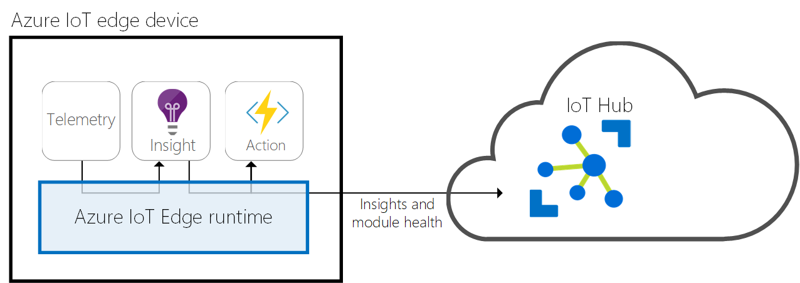
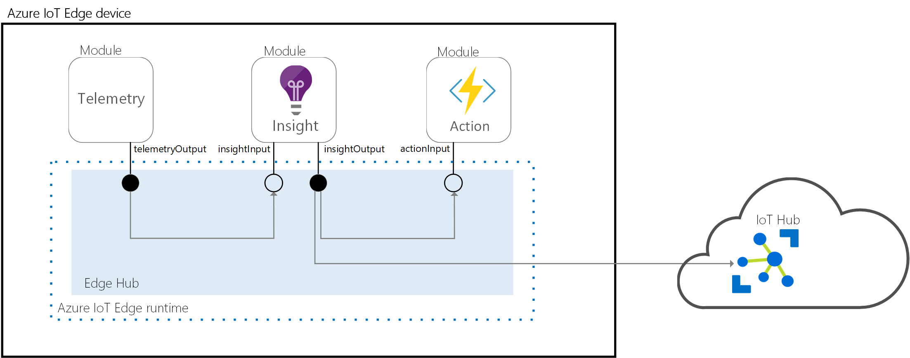
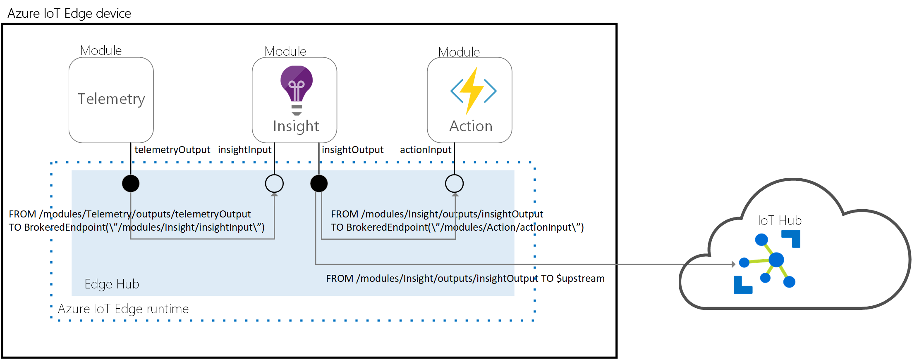

# Understand the Azure IoT Edge runtime and its architecture

The IoT Edge runtime is a collection of programs that need to be installed on a device for it to be considered an IoT Edge device. Collectively, the components of the IoT Edge runtime enable IoT Edge devices to receive code to run at the edge, and communicate the results. 

The IoT Edge runtime performs the following functions on IoT Edge devices:

* Installs and updates workloads on the device.
* Maintains Azure IoT Edge security standards on the device.
* Ensures that [IoT Edge modules](iot-edge-modules.md) are always running.
* Reports module health to the cloud for remote monitoring.
* Facilitates communication between downstream leaf devices and IoT Edge devices.
* Facilitates communication between modules on the IoT Edge device.
* Facilitates communication between the IoT Edge device and the cloud.



The responsibilities of the IoT Edge runtime fall into two categories: communication and module management. These two roles are performed by two components that make up the IoT Edge runtime. The IoT Edge hub is responsible for communication, while the IoT Edge agent manages deploying and monitoring the modules. 

Both the Edge hub and the Edge agent are modules, just like any other module running on an IoT Edge device. 

## IoT Edge hub

The Edge hub is one of two modules that make up the Azure IoT Edge runtime. It acts as a local proxy for IoT Hub by exposing the same protocol endpoints as IoT Hub. This consistency means that clients (whether devices or modules) can connect to the IoT Edge runtime just as they would to IoT Hub. 

>[!NOTE]
>Edge Hub supports clients that connect using MQTT or AMQP. It does not support clients that use HTTP. 

The Edge hub is not a full version of IoT Hub running locally. There are some things that the Edge hub silently delegates to IoT Hub. For example, Edge hub forwards authentication requests to IoT Hub when a device first tries to connect. After the first connection is established, security information is cached locally by Edge hub. Subsequent connections from that device are allowed without having to authenticate to the cloud. 

>[!NOTE]
>The runtime must be connected every time it tries to authenticate a device.

To reduce the bandwidth your IoT Edge solution uses, the Edge hub optimizes how many actual connections are made to the cloud. Edge hub takes logical connections from clients like modules or leaf devices and combines them for a single physical connection to the cloud. The details of this process are transparent to the rest of the solution. Clients think they have their own connection to the cloud even though they are all being sent over the same connection. 


Edge hub can determine whether it's connected to IoT Hub. If the connection is lost, Edge hub saves messages or twin updates locally. Once a connection is reestablished, it syncs all the data. The location used for this temporary cache is determined by a property of the Edge hub’s module twin. The size of the cache is not capped and will grow as long as the device has storage capacity. 

### Module communication

Edge Hub facilitates module to module communication. Using Edge Hub as a message broker keeps modules independent from each other. Modules only need to specify the inputs on which they accept messages and the outputs to which they write messages. A solution developer then stitches these inputs and outputs together so that the modules process data in the order specific to that solution. 



To send data to the Edge hub, a module calls the SendEventAsync method. The first argument specifies on which output to send the message. The following pseudocode sends a message on output1:

   ```csharp
   ModuleClient client = new ModuleClient.CreateFromEnvironmentAsync(transportSettings); 
   await client.OpenAsync(); 
   await client.SendEventAsync(“output1”, message); 
   ```

To receive a message, register a callback that processes messages coming in on a specific input. The following pseudocode registers the function messageProcessor to be used for processing all messages received on input1:

   ```csharp
   await client.SetInputMessageHandlerAsync(“input1”, messageProcessor, userContext);
   ```

For more information about the ModuleClient class and its communication methods, see the API reference for your preferred SDK language: [C#](https://docs.microsoft.com/dotnet/api/microsoft.azure.devices.client.moduleclient?view=azure-dotnet), [C and Python](https://docs.microsoft.com/azure/iot-hub/iot-c-sdk-ref/iothub-module-client-h), [Java](https://docs.microsoft.com/java/api/com.microsoft.azure.sdk.iot.device._module_client?view=azure-java-stable), or [Node.js](https://docs.microsoft.com/javascript/api/azure-iot-device/moduleclient?view=azure-node-latest).

The solution developer is responsible for specifying the rules that determine how Edge hub passes messages between modules. Routing rules are defined in the cloud and pushed down to Edge hub in its device twin. The same syntax for IoT Hub routes is used to define routes between modules in Azure IoT Edge. 

<!--- For more info on how to declare routes between modules, see []. --->   



## IoT Edge agent

The IoT Edge agent is the other module that makes up the Azure IoT Edge runtime. It is responsible for instantiating modules, ensuring that they continue to run, and reporting the status of the modules back to IoT Hub. Just like any other module, the Edge agent uses its module twin to store this configuration data. 

The [IoT Edge security daemon](iot-edge-security-manager.md) starts the Edge agent on device startup. The agent retrieves its module twin from IoT Hub and inspects the deployment manifest. The deployment manifest is a JSON file that declares the modules that need to be started. 

Each item in the deployment manifest contains specific information about a module and is used by the Edge agent for controlling the module’s lifecycle. Some of the more interesting properties are: 

* **settings.image** – The container image that the Edge agent uses to start the module. The Edge agent must be configured with credentials for the container registry if the image is protected by a password. Credentials for the container registry can be configured remotely using the deployment manifest, or on the Edge device itself by updating the `config.yaml` file in the IoT Edge program folder.
* **settings.createOptions** – A string that is passed directly to the Docker daemon when starting a module’s container. Adding Docker options in this property allows for advanced options like port forwarding or mounting volumes into a module’s container.  
* **status** – The state in which the Edge agent places the module. This value is usually set to *running* as most people want the Edge agent to immediately start all modules on the device. However, you could specify the initial state of a module to be stopped and wait for a future time to tell the Edge agent to start a module. The Edge agent reports the status of each module back to the cloud in the reported properties. A difference between the desired property and the reported property is an indicator of a misbehaving device. The supported statuses are:
   * Downloading
   * Running
   * Unhealthy
   * Failed
   * Stopped
* **restartPolicy** – How the Edge agent restarts a module. Possible values include:
   * Never – The Edge agent never restarts the module.
   * onFailure - If the module crashes, the Edge agent restarts it. If the module shuts down cleanly, the Edge agent does not restart it.
   * Unhealthy - If the module crashes or is deemed unhealthy, the Edge agent restarts it.
   * Always - If the module crashes, is deemed unhealthy, or shuts down in any way, the Edge agent restarts it. 

The IoT Edge agent sends runtime response to IoT Hub. Here is a list of possible responses:
  * 200	- OK
  * 400	- The deployment configuration is malformed or invalid.
  * 417	- The device does not have a deployment configuration set.
  * 412	- The schema version in the deployment configuration is invalid.
  * 406	- The edge device is offline or not sending status reports.
  * 500	- An error occurred in the edge runtime.

### Security

The IoT Edge agent plays a critical role in the security of an IoT Edge device. For example, it performs actions like verifying a module’s image before starting it. 

For more information about the Azure IoT Edge security framework, read about the [IoT Edge security manager](iot-edge-security-manager.md)

## Next steps

[Understand Azure IoT Edge Certificates](iot-edge-certs.md)
